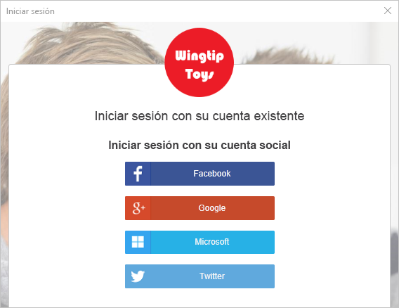
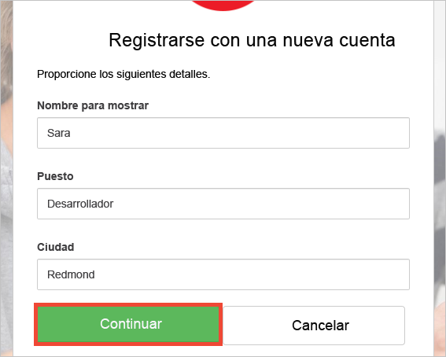

# Versión de prueba de una aplicación de escritorio configurada con Azure AD B2C

Azure Active Directory B2C proporciona administración de identidades en la nube para mantener la protección de su aplicación, empresa y clientes.  Esta guía de inicio usa una aplicación de escritorio de Windows Presentation Foundation (WPF) para mostrar lo siguiente:

* Mediante la directiva de **registro o inicio de sesión** para crear o iniciar sesión con un proveedor de identidades sociales o una cuenta local con una dirección de correo electrónico. 
* **Llamando a una API** para recuperar el nombre para mostrar de un recurso asegurado de Azure AD B2C.

## Requisitos previos

* Instalar [Visual Studio 2017](https://www.visualstudio.com/downloads/) con las cargas de trabajo siguientes:
    - **Desarrollo de escritorio .NET**

* Una cuenta de redes sociales de Facebook, Google, Microsoft o Twitter. Si no dispone de una cuenta de redes sociales, se requiere una dirección de correo electrónico válida.

[!INCLUDE [quickstarts-free-trial-note](../../includes/quickstarts-free-trial-note.md)]

## Descarga del ejemplo

[Descargue o clone la aplicación de ejemplo](https://github.com/Azure-Samples/active-directory-b2c-dotnet-desktop) desde GitHub.

## Ejecución de una aplicación en Visual Studio

En la carpeta de proyecto de la aplicación de ejemplo, abra la solución `active-directory-b2c-wpf.sln` en Visual Studio. 

Seleccione **Depurar > Iniciar depuración** para compilar y ejecutar la aplicación. 

## Crear una cuenta

Haga clic en **Iniciar sesión** para iniciar el flujo de trabajo **Registrarse o iniciar sesión**. Al crear una cuenta, puede usar una cuenta de proveedor de identidades de redes sociales existente o una cuenta de correo electrónico.

### Registro con un proveedor de identidades de redes sociales

Para registrarse con un proveedor de identidades de redes sociales, haga clic en el botón del proveedor de identidades que desee usar. Si prefiere usar una dirección de correo electrónico, vaya a la sección [Registro con una dirección de correo electrónico](#sign-up-using-an-email-address).

Debe autenticarse (iniciar sesión) con sus credenciales de cuenta de redes sociales y autorizar a la aplicación a leer información de su cuenta de redes sociales. Al conceder acceso, la aplicación puede recuperar la información del perfil de la cuenta de redes sociales como el nombre y la ciudad. 

Los detalles del perfil de la cuenta nueva se rellenan automáticamente con la información de su cuenta de redes sociales. Modifique los detalles si lo desea y haga clic en **Continuar**.

Ha creado correctamente una nueva cuenta de usuario de Azure AD B2C que usa un proveedor de identidades. Después del inicio de sesión, el token de acceso se muestra en el cuadro de texto *Información del token*. El token de acceso se usa al acceder al recurso de la API.

Siguiente paso: sección [Salto para la edición del perfil](#edit-your-profile).

### Registro con una dirección de correo electrónico

Si decide no utilizar una cuenta de redes sociales para proporcionar la autenticación, puede crear una cuenta de usuario de Azure AD B2C mediante una dirección de correo electrónico válida. Una cuenta de usuario local de Azure AD B2C usa Azure Active Directory como proveedor de identidades. Para usar su dirección de correo electrónico, haga clic en el vínculo **¿No tiene una cuenta? Regístrese ahora**.

Especifique una dirección de correo electrónico válida y haga clic en **Enviar código de verificación**. Se requiere una dirección de correo electrónico válida para recibir el código de verificación de Azure AD B2C.

Especifique el código de verificación que reciba en el correo electrónico y haga clic en **Comprobar código**.

Agregue la información del perfil y haga clic en **Crear**.

Ha creado correctamente una nueva cuenta de usuario local de Azure AD B2C. Después del inicio de sesión, el token de acceso se muestra en el cuadro de texto *Información del token*. El token de acceso se usa al acceder al recurso de la API.

## Edición del perfil

Azure Active Directory B2C proporciona funcionalidad para permitir a los usuarios actualizar sus perfiles. Haga clic en **Editar perfil** para editar el perfil que ha creado.

Elija el proveedor de identidades asociado con la cuenta que ha creado. Por ejemplo, si ha usado Twitter como proveedor de identidades cuando creó su cuenta, elija Twitter para modificar los detalles del perfil asociado.

Cambie el **nombre para mostrar** o la **ciudad**. 

Se muestra un nuevo token de acceso en el cuadro de texto *Información de token*. Si desea comprobar los cambios en el perfil, copie y pegue el token de acceso en el descodificador de token https://jwt.ms.

## Acceso a un recurso

Haga clic en **Llamar a la API** para realizar una solicitud al recurso seguro de Azure AD B2C https://fabrikamb2chello.azurewebsites.net/hello. 

La aplicación incluye el token de acceso mostrado en el cuadro de texto de *Información del token* en la solicitud. La API envío el nombre para mostrar contenido en el token de acceso.

## Pasos siguientes

El siguiente paso es crear su propio inquilino de Azure AD B2C y configurar el ejemplo para la ejecución utilizando el inquilino. 

> [!div class="nextstepaction"]
> [Creación de un inquilino de Azure Active Directory B2C en Azure Portal](active-directory-b2c-get-started.md)
