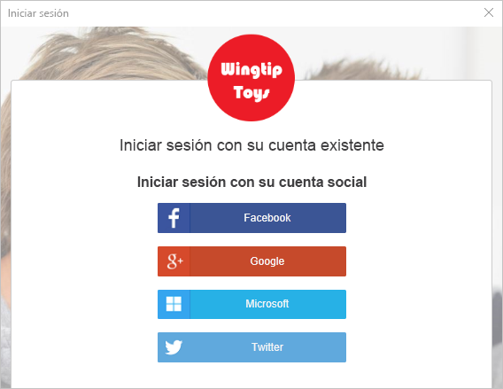
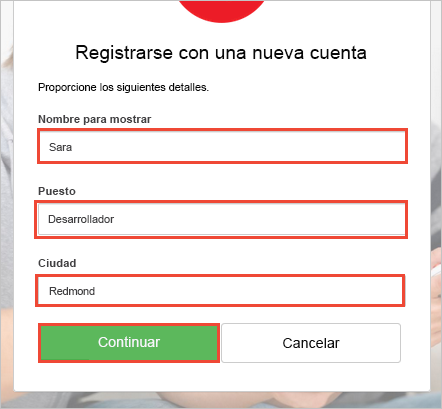
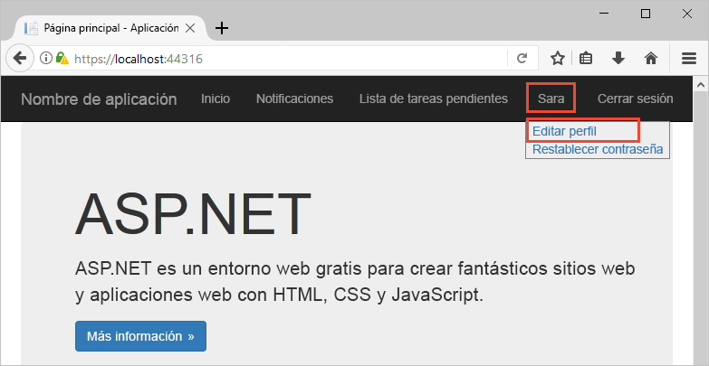

# Versión de prueba de una aplicación web habilitada para Azure AD B2C

Azure Active Directory B2C proporciona administración de identidades en la nube para mantener la protección de su aplicación, empresa y clientes. Esta guía de inicio rápido usa una aplicación de lista de tareas pendientes de ejemplo para mostrar lo siguiente:

> [!div class="checklist"]
> * Iniciar sesión con una página de inicio de sesión personalizada.
> * Iniciar sesión con un proveedor de identidades de redes sociales.
> * Crear y administrar su perfil de usuario y su cuenta de Azure AD B2C.
> * Llamar a una API web protegida por Azure AD B2C.

## Requisitos previos

* [Visual Studio 2017](https://www.visualstudio.com/downloads/) con la carga de trabajo de **ASP.NET y desarrollo web**. 
* Una cuenta de redes sociales de Facebook, Google, Microsoft o Twitter.

[!INCLUDE [quickstarts-free-trial-note](../../includes/quickstarts-free-trial-note.md)]

## Descarga del ejemplo

[Descargue o clone la aplicación de ejemplo](https://github.com/Azure-Samples/active-directory-b2c-dotnet-webapp-and-webapi) desde GitHub.

## Ejecución de una aplicación en Visual Studio

En la carpeta de proyecto de la aplicación de ejemplo, abra la solución `B2C-WebAPI-DotNet.sln` en Visual Studio. 

La solución es una aplicación de lista de tareas pendientes de ejemplo que consta de dos proyectos:

* **TaskWebApp**: una aplicación web de ASP.NET MVC donde un usuario puede administrar sus elementos de la lista de tareas pendientes.  
* **TaskService**: back-end de una API web de ASP.NET que administra las operaciones realizadas en elementos de la lista de tareas pendientes de un usuario. La aplicación web llama a esta API web y muestra los resultados.

Para esta guía de inicio rápido, debe ejecutar los proyectos `TaskWebApp` y `TaskService` al mismo tiempo. 

1. En el menú de Visual Studio, seleccione **Proyectos > Establecer proyectos de inicio...** . 
2. Seleccione el botón de radio **Proyectos de inicio múltiples**.
3. Cambie la **Acción** de ambos proyectos a **Iniciar**. Haga clic en **Aceptar**.

Seleccione **Depurar > Iniciar depuración** para compilar y ejecutar ambas aplicaciones. Cada aplicación se abre en su propia pestaña del explorador:

`https://localhost:44316/`: esta página es la aplicación web ASP.NET. Interactúe directamente con esta aplicación en la guía de inicio rápido.
`https://localhost:44332/`: esta página es la API web a la que llama la aplicación web ASP.NET.

## Crear una cuenta

Haga clic en el vínculo de **registro/inicio de sesión** en la aplicación web ASP.NET para iniciar el flujo de trabajo de **registro/inicio de sesión**. Al crear una cuenta, puede usar una cuenta de proveedor de identidades de redes sociales existente o una cuenta de correo electrónico. Para este tutorial rápido, use una cuenta de proveedor de identidades sociales de Facebook, Google, Microsoft o Twitter.

### Registrarse con un proveedor de identidades de redes sociales

Para registrarse con un proveedor de identidades de redes sociales, haga clic en el botón del proveedor de identidades que desee usar. 

Debe autenticarse (iniciar sesión) con sus credenciales de cuenta de redes sociales y autorizar a la aplicación a leer información de su cuenta de redes sociales. Al conceder acceso, la aplicación puede recuperar la información del perfil de la cuenta de redes sociales como el nombre y la ciudad. 

Finalice el proceso de inicio de sesión para el proveedor de identidades. Por ejemplo, si elige Twitter, escriba sus credenciales de Twitter y haga clic en **Iniciar sesión**.

Los detalles del perfil de su nueva cuenta de Azure AD B2C se rellenan automáticamente con la información de su cuenta de redes sociales.

Actualice los campos de nombre para mostrar, puesto que ocupa y ciudad y haga clic en **Continuar**.  Los valores que especifique se usan para el perfil de cuenta de usuario de Azure AD B2C.

Ha realizado correctamente las acciones siguientes:

> [!div class="checklist"]
> * Se ha autenticado utilizando un proveedor de identidades.
> * Ha creado una cuenta de usuario de Azure AD B2C. 

## Edición del perfil

Azure Active Directory B2C proporciona funcionalidad para permitir a los usuarios actualizar sus perfiles. En la barra de menú de la aplicación web, haga clic en el nombre de perfil y seleccione **Editar perfil** para editar el perfil que ha creado.

Cambie el **nombre para mostrar** y la **ciudad**.  Haga clic en **Continuar** para actualizar su perfil.

Verá que en el nombre para mostrar situado en la parte superior derecha de la página se muestra el nombre modificado. 

## Obtener acceso a un recurso de API web protegida

Haga clic en la **lista de tareas pendientes** para escribir y modificar los elementos de la lista de tareas pendientes. La aplicación web ASP.NET incluye un token de acceso en la solicitud de permiso de solicitud de recurso de la API web para realizar operaciones en los elementos de la lista de tareas pendientes del usuario. 

Especifique el texto en el cuadro de texto **Nuevo elemento**. Haga clic en **Agregar** para llamar a la API web protegida de Azure AD B2C que agrega un elemento de la lista de tareas pendientes.

Ha utilizado correctamente su cuenta de usuario de Azure AD B2C para realizar una llamada autorizada a una API web de Azure AD B2C protegida.

## Pasos siguientes

El ejemplo utilizado en este tutorial rápido se puede usar para probar otros escenarios de Azure AD B2C, por ejemplo:

* Crear una nueva cuenta local con una dirección de correo electrónico.
* Restablecer la contraseña de la cuenta local.

Si está listo para profundizar en la creación de su propio inquilino de Azure AD B2C y en la configuración del ejemplo para que se ejecute mediante su propio inquilino, pruebe el tutorial siguiente.

> [!div class="nextstepaction"]
> [Creación de una aplicación web de ASP.NET con procesos de registro e inicio de sesión, edición de perfil y restablecimiento de contraseña de Azure Active Directory B2C](active-directory-b2c-devquickstarts-web-dotnet-susi.md)