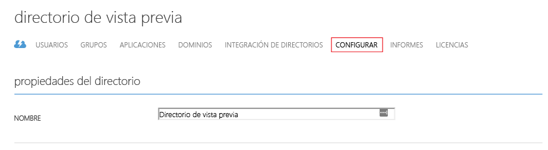

# Configuración de LDAP seguro (LDAPS) para un dominio administrado con Azure AD Domain Services

## Antes de empezar
Asegúrese de que ha completado la [Tarea 2: Exportación del certificado LDAP seguro a un archivo .PFX](active-directory-ds-admin-guide-configure-secure-ldap-export-pfx.md).

Elija si usar la experiencia de Azure Portal (versión preliminar) o el portal de Azure clásico para completar esta tarea.
> [!div class="op_single_selector"]
> * **Azure Portal (versión preliminar)**: [habilite LDAP seguro con Azure Portal](active-directory-ds-admin-guide-configure-secure-ldap-enable-ldaps.md)
> * **Portal de Azure clásico**: [habilitación de LDAP seguro con el portal de Azure clásico](active-directory-ds-admin-guide-configure-secure-ldap-enable-ldaps-classic.md)
>
>

## Tarea 3: Habilitación de LDAP seguro para el dominio administrado mediante Azure Portal
Realice los siguientes pasos de configuración para habilitar LDAP seguro:

1. Vaya al **[Portal de Azure clásico](https://manage.windowsazure.com)**.
2. En el panel izquierdo, seleccione **Active Directory** .
3. Seleccione el directorio de Azure AD (también denominado "inquilino"), para el que se ha habilitado Servicios de dominio de Azure AD.

    
4. Haga clic en la pestaña **Configure** .

    
5. Desplácese hacia abajo hasta la sección **Servicios de dominio**. Verá una opción denominada **LDAP seguro (LDAPS)** como se muestra en la captura de pantalla siguiente:

    
6. Haga clic en el botón **Configurar certificado** para abrir el cuadro de diálogo **Configurar certificado para LDAP seguro**.

    
7. Haga clic en el siguiente icono de carpeta que encontrará bajo **ARCHIVO PFX CON CERTIFICADO** para especificar el archivo PFX, que contiene el certificado que desea usar para el acceso LDAP seguro al dominio administrado. Escriba también la contraseña especificada al exportar el certificado al archivo PFX. A continuación, haga clic en el botón Listo de la parte inferior.

    
8. La sección **Servicios de dominio** de la pestaña **Configurar** debería aparecer en gris y con el estado **Pendiente...** unos minutos. Durante este período, se verifica la precisión del certificado LDAPS y se configura LDAP seguro para el dominio administrado.

    

   > [!NOTE]
   > Se tardará entre unos 10 y 15 minutos en habilitar LDAP seguro para el dominio administrado. Si el certificado LDAP seguro proporcionado no coincide con los criterios necesarios, no se habilitará LDAP seguro para el directorio y aparecerá un mensaje de error. Por ejemplo, se indicará que el nombre de dominio es incorrecto, que el certificado ha expirado o que lo hará pronto.
   >
   >

9. Cuando LDAP seguro se haya habilitado correctamente para su dominio administrado, el mensaje **Pendiente** debería desaparecer. Debería ver la huella digital del certificado.

    

 

## Tarea 4: Habilitación del acceso LDAP seguro a través de Internet
**Tarea opcional** : omita esta tarea de configuración si no piensa acceder al dominio administrado con LDAPS a través de Internet.

Antes de comenzar esta tarea, asegúrese de haber completado los pasos que se describen en la [tarea 3](#task-3---enable-secure-ldap-for-the-managed-domain-using-the-classic-azure-portal).

1. Debería ver la opción **HABILITAR EL ACCESO LDAP SEGURO A TRAVÉS DE INTERNET** en la sección **Servicios de dominio** de la página **Configurar**. Dicha opción tendrá el valor **NO** de forma predeterminada, ya que el acceso por Internet al dominio administrado a través de LDAP seguro está deshabilitado de forma predeterminada.

    
2. Cambie **HABILITAR EL ACCESO LDAP SEGURO A TRAVÉS DE INTERNET** a **SÍ**. Haga clic en el botón **GUARDAR** del panel inferior.
    
3. La sección **Servicios de dominio** de la pestaña **Configurar** debería aparecer en gris y con el estado **Pendiente...** unos minutos. Pasado unos instantes, se habilitará el acceso por Internet al dominio administrado mediante LDAP seguro.

    

   > [!NOTE]
   > Habilitar el acceso por Internet mediante LDAP seguro para el dominio administrado llevará unos 10 minutos.
   >
   >
4. Si el acceso mediante LDAP seguro a su dominio administrado a través de Internet se habilita correctamente, el mensaje **Pendiente** debería desaparecer. Debería ver la dirección IP externa que puede utilizarse para acceder a su directorio mediante LDAPS en el campo **DIRECCIÓN IP EXTERNA PARA EL ACCESO LDAPS**.

    

 

## Tarea 5: Configuración de DNS para acceder al dominio administrado desde Internet
**Tarea opcional** : omita esta tarea de configuración si no piensa acceder al dominio administrado con LDAPS a través de Internet.

Antes de comenzar esta tarea, asegúrese de haber completado los pasos que se describen en la [tarea 4](#task-4---enable-secure-ldap-access-over-the-internet).

Una vez habilitado el acceso LDAP seguro a través de Internet para el dominio administrado, debe actualizar el DNS para que los equipos cliente puedan encontrar este dominio administrado. Al final de la tarea 4, aparece una dirección IP externa en la pestaña **Configurar**, en **DIRECCIÓN IP EXTERNA PARA EL ACCESO LDAPS**.

Configure el proveedor de DNS externo para que el nombre DNS del dominio administrado (p. ej., ldaps.contoso100.com) señale a esta dirección IP externa. En este ejemplo, es necesario crear la entrada DNS siguiente:

    ldaps.contoso100.com  -> 52.165.38.113

Eso es todo: ya está listo para conectarse al dominio administrado mediante LDAP seguro a través de Internet.

> [!WARNING]
> Recuerde que los equipos cliente deben confiar en el emisor del certificado LDAPS para poder conectarse correctamente al dominio administrado mediante LDAPS. Si usa una entidad de certificación empresarial o una entidad de certificación de confianza pública, no tendrá que realizar ninguna acción, ya que los equipos cliente confiarán en los emisores de certificados. Si utiliza un certificado autofirmado, tendrá que instalar la parte pública del certificado autofirmado en el almacén de certificados de confianza del equipo cliente.
>
>

## Bloqueo del acceso LDAPS en el dominio administrado a través de Internet
> [!NOTE]
> **Tarea opcional**: si no ha habilitado el acceso LDAPS en el dominio administrado a través de Internet, omita esta tarea de configuración.
>
>

Antes de comenzar esta tarea, asegúrese de haber completado los pasos que se describen en la [tarea 4](#task-4---enable-secure-ldap-access-over-the-internet).

La exposición del dominio administrado para el acceso LDAPS a través de Internet representa una amenaza de seguridad. Se puede alcanzar el dominio administrado desde Internet en el puerto usado para LDAP seguro (es decir, el puerto 636). Por lo tanto, puede elegir restringir el acceso al dominio administrado a direcciones IP conocidas específicas. Para mejorar la seguridad, cree un grupo de seguridad de red (NSG) y asócielo a la subred en la que habilitó Azure AD Domain Services.

En la siguiente tabla se muestra un NSG de ejemplo que puede configurar para bloquear el acceso LDAP seguro a través de Internet. NSG contiene un conjunto de reglas que permiten el acceso LDAPS de entrada a través del puerto TCP 636 solo desde un conjunto especificado de direcciones IP. La regla predeterminada “DenyAll” se aplica a todo el tráfico de entrada de Internet. La regla NSG para permitir el acceso LDAPS a través de Internet desde direcciones IP especificadas tiene una prioridad mayor que la regla NSG DenyAll.

**Más información** - [Grupos de seguridad de red](../virtual-network/virtual-networks-nsg.md).

 

## Contenido relacionado
* [Introducción a Azure AD Domain Services](active-directory-ds-getting-started.md)
* [Administer an Azure AD Domain Services managed domain (Administración de un dominio administrado con Servicios de dominio de Azure AD)](active-directory-ds-admin-guide-administer-domain.md)
* [Administración de directiva de grupo en un dominio administrado de Azure AD Domain Services](active-directory-ds-admin-guide-administer-group-policy.md)
* [Grupos de seguridad de red](../virtual-network/virtual-networks-nsg.md)
* [Creación de un grupo de seguridad de red](../virtual-network/virtual-networks-create-nsg-arm-pportal.md)

