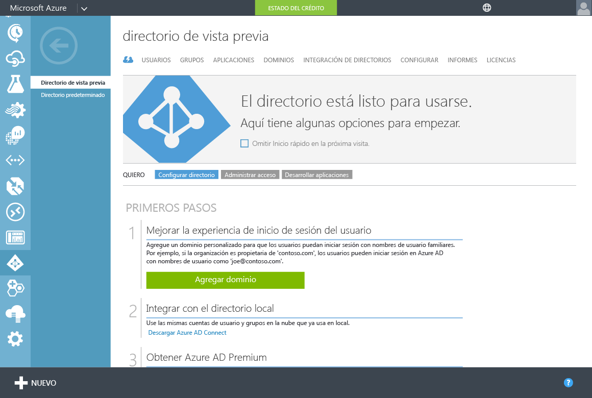

# Habilitación de Azure Active Directory Domain Services mediante el Portal de Azure clásico
Este artículo describe y le guía por las tareas de configuración que son necesarias para habilitar Azure Active Directory Domain Services (Azure AD DS) para su inquilino de Azure Active Directory (Azure AD).

> [!NOTE]
> [**Pruebe la nueva experiencia de Azure Portal (versión preliminar) en su lugar**](active-directory-ds-getting-started.md). 
>

## Tarea 1: Creación del grupo de administradores de controlador de dominio de Azure AD
Esta primera tarea consiste en crear un grupo administrativo en el inquilino de Azure AD. Este grupo administrativo especial se llama *Administradores de DC de AAD*. A los miembros de este grupo se les concederán permisos administrativos en los equipos unidos al domino administrado en Azure Active Directory Domain Services. En equipos unidos a un dominio, este grupo se agrega al grupo de administradores. Además, los miembros de este grupo también podrá usar Escritorio remoto para conectarse de forma remota a las máquinas unidas a un dominio.  

> [!NOTE]
> No tiene permisos de administrador de dominio o administrador de organización en el dominio administrado creado mediante Azure Active Directory Domain Services. En los dominios administrados, estos permisos están reservados por el servicio y no están disponibles para los usuarios del inquilino. Sin embargo, puede usar el grupo administrativo especial creado en esta tarea de configuración para realizar algunas operaciones con privilegios. Estas operaciones incluyen unir equipos al dominio, formar parte del grupo de administradores en los equipos unidos a un dominio y configurar una directiva de grupo.
>

En esta tarea de configuración, creará el grupo administrativo y agregará uno o varios usuarios del directorio al grupo. Para crear el grupo administrativo para Azure Active Directory Domain Services, haga lo siguiente:

1. Vaya al [Portal de Azure clásico](https://manage.windowsazure.com).
2. En el panel izquierdo, seleccione el botón **Active Directory**.
3. Seleccione el inquilino (directorio) de Azure AD para el que quiere habilitar Azure Active Directory Domain Services. Puede crear un único dominio para cada directorio de Azure AD.

    
4. En la página del **directorio de vista previa**, haga clic en la pestaña **Grupos**.
5. Para agregar un grupo a su inquilino de Azure AD, en el panel de tareas en la parte inferior de la ventana, haga clic en **Agregar grupo**.

    
6. En el cuadro de diálogo **Agregar grupo**, cree un grupo denominado **Administradores de controlador de dominio de AAD** y, a continuación, establezca **Tipo de grupo** en **Seguridad**.

   > [!WARNING]
   > Para permitir el acceso dentro de su dominio administrado de Azure Active Directory Domain Services, cree un grupo con este nombre exacto.
   >
   >

    
7. En el cuadro **Descripción**, escriba una descripción que permita que otras personas entiendan que este grupo concede permisos administrativos en Azure Active Directory Domain Services.
8. Después de crear el grupo, haga clic en el nombre del grupo para ver sus propiedades.
9. Para agregar usuarios como miembros del grupo, en la parte inferior de la ventana, haga clic en el botón **Agregar miembros**.

    
10. En el cuadro de diálogo **Agregar miembros**, seleccione los usuarios que deben ser miembros de este grupo y, a continuación, haga clic la marca de verificación en la esquina inferior derecha.

    

## Paso siguiente
Tarea 2: [Creación o selección de una red virtual de Azure](active-directory-ds-getting-started-vnet.md)

