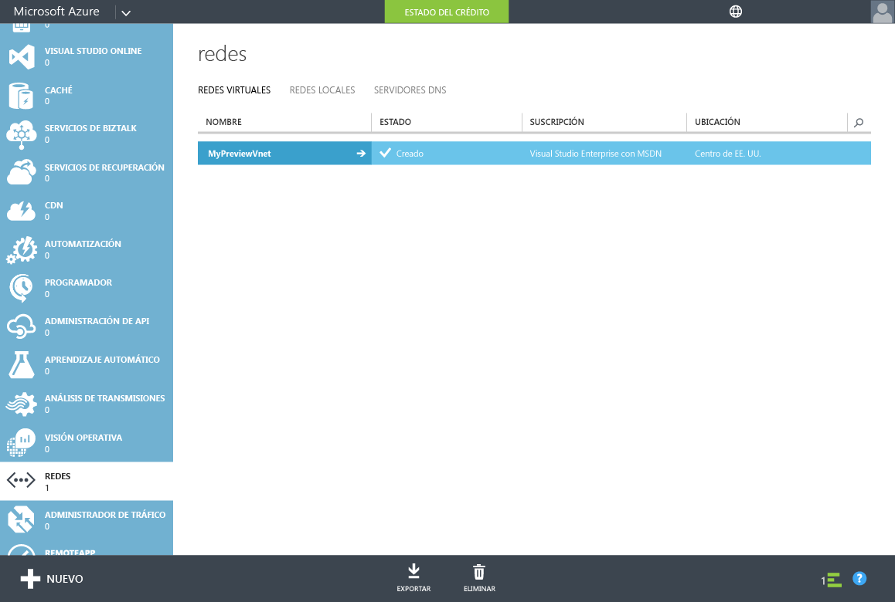
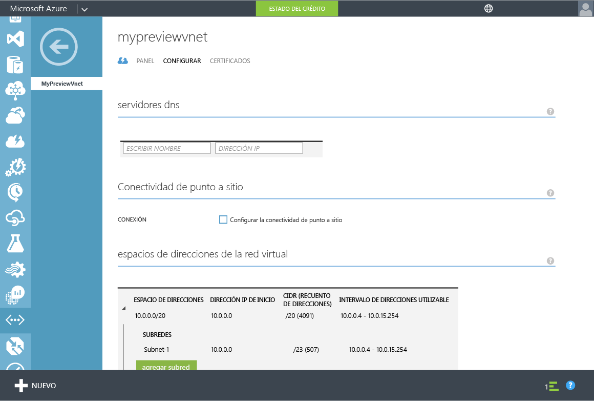
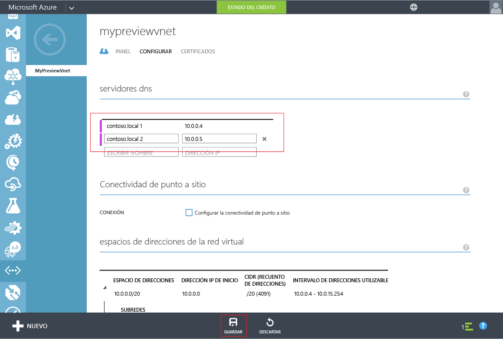

# Azure AD Domain Services: actualización de la configuración DNS para la red virtual de Azure
## Tarea 4: Actualización de la configuración DNS para la red virtual de Azure
En las tareas de configuración anteriores, ha habilitado correctamente Azure AD Domain Services para su directorio. La tarea siguiente consiste en asegurarse de que los equipos dentro de la red virtual pueden conectarse y consumir estos servicios. Actualice la configuración del servidor DNS de la red virtual para que apunte a las direcciones IP en las que Azure AD Domain Services estará disponible en la red virtual.

> [!NOTE]
> Después de habilitar los Servicios de dominio de Azure AD para el directorio, anote las direcciones IP de los Servicios de dominio de Azure AD mostrados en la pestaña **Configurar** del directorio.
> 
> 

Realice los siguientes pasos de configuración para actualizar la configuración del servidor DNS en la red virtual en la que ha habilitado Azure AD Domain Services.

1. Navegue hasta el **Portal de Azure clásico** ([https://manage.windowsazure.com](https://manage.windowsazure.com)).
2. Seleccione el nodo **Redes** en el panel izquierdo.
   
    
3. En la pestaña **Redes virtuales** , seleccione la red virtual en la que habilitó los Servicios de dominio de Azure AD para ver sus propiedades.
4. Haga clic en la pestaña **Configure** .
   
    
5. En la sección **Servidores DNS** , escriba las direcciones IP de los Servicios de dominio de Azure AD.
6. Asegúrese de especificar las dos direcciones IP que se mostraron en la sección **Servicios de dominio** en la pestaña **Configurar** del directorio.
7. Para guardar la configuración del servidor DNS para esta red virtual, haga clic en **Guardar** en el panel de tareas de la parte inferior de la página.
   
   

> [!NOTE]
> Después de actualizar la configuración del servidor DNS para la red virtual, las máquinas virtuales de la red pueden tardar un rato en recibir la configuración DNS actualizada. Si una máquina virtual no puede conectarse al dominio, puede vaciar la caché DNS (p. ej. 'ipconfig /flushdns') en la máquina virtual. Este comando fuerza una actualización de la configuración DNS en la máquina virtual.
> 
> 

## Tarea 5: Habilitación de la sincronización de contraseñas con los Servicios de dominio de Azure AD
La tarea de configuración siguiente consiste en [habilitar la sincronización de contraseñas con Azure AD Domain Services](active-directory-ds-getting-started-password-sync.md).

<!--HONumber=Nov16_HO2-->

