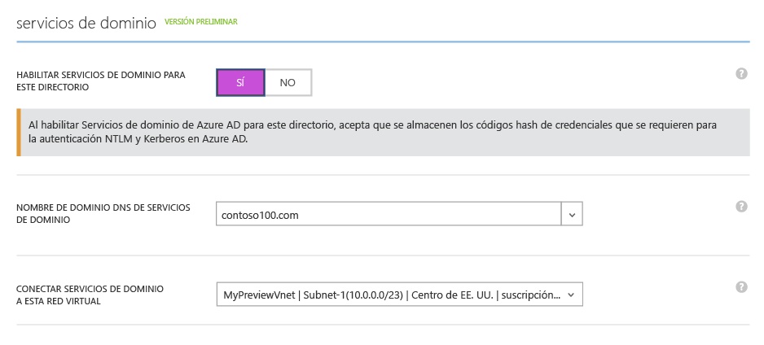
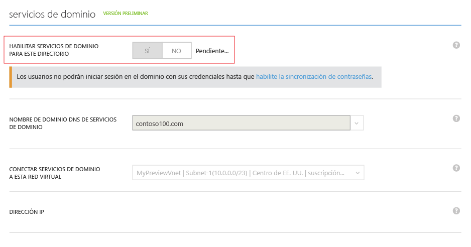
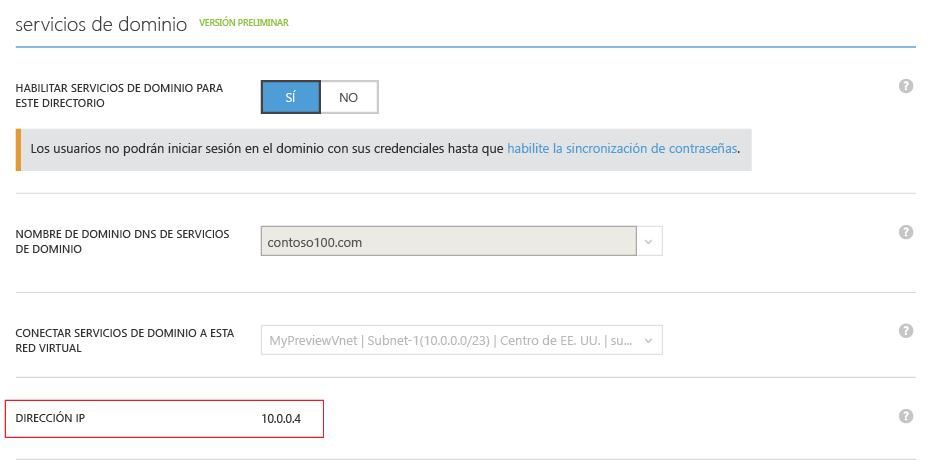
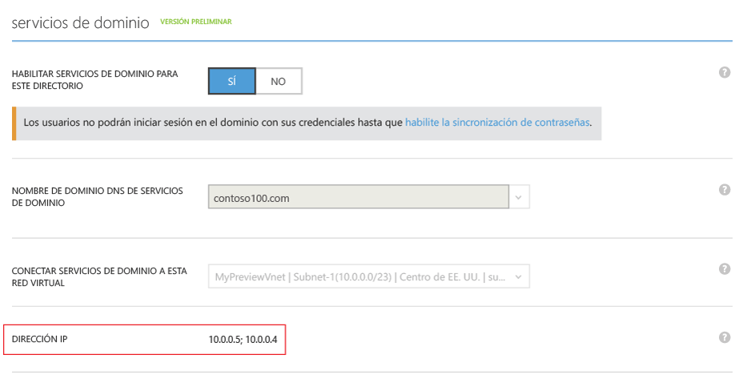

# Habilitación de Azure Active Directory Domain Services mediante el Portal de Azure clásico

> [!IMPORTANT]
> La experiencia del Portal de Azure clásico para habilitar Azure Active Directory Domain Services que se muestra en este artículo se retirará pronto. Para las nuevas implementaciones, [**utilice en su lugar la nueva experiencia de Azure Portal (versión preliminar)**](active-directory-ds-getting-started.md).
>

## Tarea 3: Habilitación de Azure Active Directory Domain Services
En esta tarea, habilitará Azure Active Directory Domain Services (Azure AD DS) para su directorio mediante los pasos siguientes:

1. Vaya al [Portal de Azure clásico](https://manage.windowsazure.com).
2. En el panel izquierdo, seleccione el botón **Active Directory**.
3. Seleccione el inquilino (directorio) de Azure Active Directory para el que quiere habilitar Azure AD DS.

    
4. En la página de **directorio de vista previa**, haga clic en la pestaña **Configurar**.

    
5. En **servicios de dominio**, cambie la opción **Habilitar Servicios de dominio para este directorio** a **Sí**.  
    Aparecerán en la página opciones de configuración adicionales de Azure Active Directory Domain Services.

    

   > [!NOTE]
   > Al habilitar Azure Active Directory Domain Services para el inquilino, Azure AD genera y almacena los valores de hash de credenciales de Kerberos y NTLM que son necesarios para autenticar a los usuarios.
   >
   >
6. Especifique el **Nombre de dominio DNS de Servicios de dominio**.

   * De forma predeterminada, se selecciona el nombre de dominio predeterminado del directorio (con el sufijo **.onmicrosoft.com**).

   * La lista contiene todos los dominios que se han configurado para el directorio de Azure AD, incluidos también los dominios comprobados y sin comprobar que configura en la pestaña **Dominios**.

   * También puede escribir un nombre de dominio personalizado. En este ejemplo, el nombre de dominio personalizado es *contoso100.com*.

     > [!WARNING]
     > El prefijo del nombre de dominio especificado (por ejemplo, *contoso100* en el nombre de dominio *contoso100.com*) debe contener 15 caracteres o menos. No se puede crear un dominio de Azure Active Directory Domain Services con un prefijo que contenga más de 15 caracteres.
     >
     >
7. Asegúrese de que el nombre de dominio DNS que ha elegido para el dominio administrado no existe ya en la red virtual. En concreto, compruebe si:

   * Ya tiene un dominio con el mismo nombre de dominio DNS en la red virtual.

   * Si la red virtual que ha seleccionado tiene una conexión VPN con la red local y tiene un dominio con el mismo nombre de dominio DNS en la red local.

   * Si ya dispone de un servicio en la nube con ese nombre en la red virtual.
8. Seleccione una red virtual en la que desee que Azure Active Directory Domain Services esté disponible. Seleccione la red virtual y la subred dedicada que ha creado en la lista desplegable **Conectar Servicios de dominio a esta red virtual**. Tenga en cuenta lo siguiente:

   * Asegúrese de que la red virtual que ha especificado pertenece a una región de Azure compatible con Azure Active Directory Domain Services. Consulte la página [Servicios de Azure por región](https://azure.microsoft.com/regions/#services/) para saber en qué regiones de Azure está disponible Azure Active Directory Domain Services.

   * Las redes virtuales que pertenecen a una región donde no se admite Azure Active Directory Domain Services no aparecerán en la lista desplegable.

   * Utilice una subred dedicada en la red virtual para Azure Active Directory Domain Services. *No* seleccione la subred de puerta de enlace. Consulte las [consideraciones sobre redes](active-directory-ds-networking.md).

   * De igual forma, las redes virtuales que se crearon mediante Azure Resource Manager no aparecerán en la lista desplegable. Esto es porque las redes virtuales basadas en Resource Manager no son compatibles de momento con Azure Active Directory Domain Services.
9. Para habilitar Azure Active Directory Domain Services, haga clic en **Guardar** en el panel de tareas de la parte inferior de la página.
    * Durante el proceso de habilitación de Azure Active Directory Domain Services para el directorio, la página muestra un estado de *Pendiente*.

        

        > [!NOTE]
        > Azure Active Directory Domain Services proporciona una alta disponibilidad para el dominio administrado. Después de habilitar Azure Active Directory Domain Services, las direcciones IP en las que están disponibles los servicios de dominio en la red virtual se muestran de una en una. La segunda dirección IP se muestra poco después de la primera, en cuanto el servicio habilita la alta disponibilidad para el dominio. Cuando se configura la alta disponibilidad y está activa para su dominio, debe ver dos direcciones IP en la sección **Servicios de dominio**de la pestaña **Configurar**.
        >
        >
    * Al cabo de unos 20 o 30 minutos, verá la primera dirección IP en la que Domain Services está disponible en la red virtual, en el campo **Dirección IP** de la página **Configurar**.

        
    * Cuando la alta disponibilidad está operativa para el dominio, aparecen dos direcciones IP en la página. El dominio administrado está disponible en la red virtual seleccionada en estas dos direcciones IP.

10. Anote las dos direcciones IP para que pueda actualizar la configuración de DNS de la red virtual. Con ello permite a las máquinas virtuales de la red virtual conectarse al dominio de cara para realizar operaciones como unirse a un dominio.

    

> [!NOTE]
> En función del tamaño del inquilino de Azure AD (número de usuarios, grupos, etc.), la sincronización con el dominio administrado llevará tiempo. Este proceso de sincronización se produce en segundo plano. En el caso de inquilinos grandes con decenas de miles de objetos, se puede tardar uno o dos días en sincronizar todos los usuarios, pertenencias a grupos y credenciales.
>
>

## Paso siguiente
[Tarea 4: Actualización de la configuración DNS en Azure Virtual Network](active-directory-ds-getting-started-update-dns.md)

