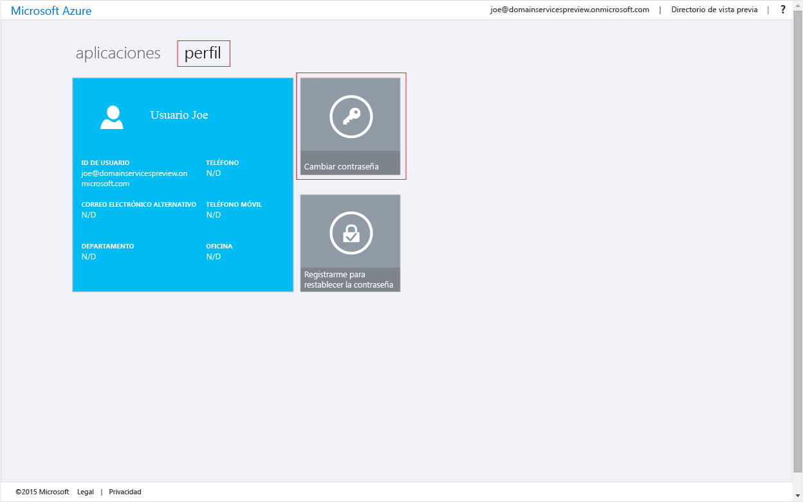
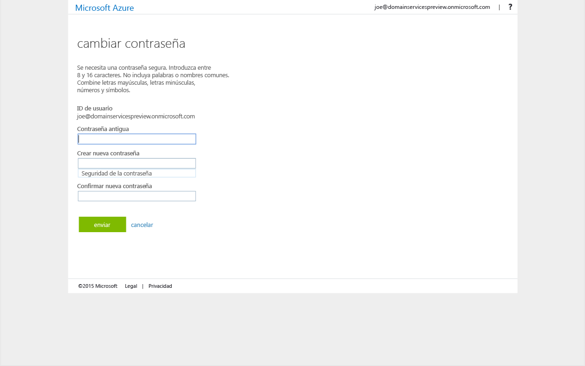

# Habilitación de la sincronización de contraseñas con Azure Active Directory Domain Services
En las tareas anteriores, habilitó Azure Active Directory Domain Services (AD DS) para su inquilino de Azure Active Directory (Azure AD). La siguiente tarea consiste en habilitar los hashes de credenciales necesarios para que la autenticación de NT LAN Manager (NTLM) y Kerberos se sincronice con Azure Active Directory Domain Services. Una vez configurada la sincronización de credenciales, los usuarios pueden iniciar sesión en el dominio administrado mediante sus credenciales corporativas.

Los procedimientos pueden variar en función de si su organización tiene un inquilino de Azure AD solo de nube o está configurado para sincronizarse con su directorio local mediante Azure AD Connect.

> [!div class="op_single_selector"]
> * [Inquilino de Azure AD solo de nube](active-directory-ds-getting-started-password-sync.md)
> * [Inquilino de Azure AD sincronizado](active-directory-ds-getting-started-password-sync-synced-tenant.md)
>
>

## Tarea 5: Habilitación de la sincronización de contraseñas con Azure Active Directory Domain Services para un inquilino de Azure AD solo de nube
Azure Active Directory Domain Services necesita hashes de credenciales en un formato adecuado para la autenticación de NTLM y Kerberos para poder autenticar a los usuarios en el dominio administrado. A menos que habilite Azure Active Directory Domain Services para el inquilino, Azure AD no genera ni almacena hashes de credenciales en el formato necesario para la autenticación NTLM o Kerberos. Por motivos de seguridad obvios, Azure AD tampoco almacena las credenciales en forma de texto sin cifrar. Por lo tanto, Azure AD no tiene forma de generar estos hashes de credenciales de NTLM o Kerberos basados en las credenciales de los usuarios existentes.

> [!NOTE]
> Si su organización tiene un inquilino de Azure AD solo de nube, los usuarios que tengan que usar Azure Active Directory Domain Services deberán cambiar sus contraseñas.
>
>

Este proceso de cambio de contraseña hace que los valores de hash de credenciales que necesita Azure Active Directory Domain Services para la autenticación Kerberos y NTLM se generen en Azure AD. Puede caducar las contraseñas de todos los usuarios en el inquilino que tiene que usar Azure Active Directory Domain Services o indicar a estos usuarios que cambien sus contraseñas.

### Habilitación de la generación de hash de credenciales de NTLM y Kerberos en el inquilino de Azure AD solo de nube
Estas son las instrucciones que tiene que proporcionar a los usuarios finales para que puedan cambiar sus contraseñas:

1. Vaya a la página [Panel de acceso de Azure AD](http://myapps.microsoft.com) para su organización.
2. En la ventana Panel de acceso, seleccione la pestaña de **perfil**.
3. Haga clic en el icono **Cambiar contraseña**.

    

   > [!NOTE]
   > Si no aparece la opción **Cambiar contraseña** en la ventana Panel de acceso, asegúrese de que su organización ha configurado la [administración de contraseñas en Azure AD](../active-directory/active-directory-passwords-getting-started.md).
   >
   >
4. En la página **cambiar contraseña**, escriba la contraseña existente (anterior) y luego escriba una nueva contraseña y confírmela.

    

5. Haga clic en **Enviar**.

Unos minutos después de haber cambiado su contraseña, la nueva contraseña se podrá usar en Azure Active Directory Domain Services. Después de unos minutos (por lo general, unos 20 minutos), los usuarios pueden iniciar sesión en equipos unidos al dominio administrado con su contraseña recién cambiada.

## Pasos siguientes
* [Actualización de la propia contraseña](../active-directory/active-directory-passwords-update-your-own-password.md#reset-my-password)
* [Introducción a la administración de contraseñas en Azure AD](../active-directory/active-directory-passwords-getting-started.md)
* [Habilitación de la sincronización de contraseñas con Azure Active Directory Domain Services para un inquilino de Azure AD sincronizado](active-directory-ds-getting-started-password-sync-synced-tenant.md)
* [Administración de un dominio administrado con Azure Active Directory Domain Services](active-directory-ds-admin-guide-administer-domain.md)
* [Join a Windows virtual machine to an Azure AD Domain Services managed domain (Unión de una máquina virtual Windows a un dominio administrado de Azure Active Directory Domain Services)](active-directory-ds-admin-guide-join-windows-vm.md)
* [Join a Red Hat Enterprise Linux virtual machine to an Azure AD Domain Services managed domain (Unión de una máquina virtual con Red Hat Enterprise Linux a un dominio administrado de Azure Active Directory Domain Services)](active-directory-ds-admin-guide-join-rhel-linux-vm.md)

