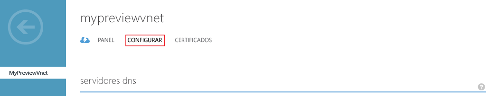
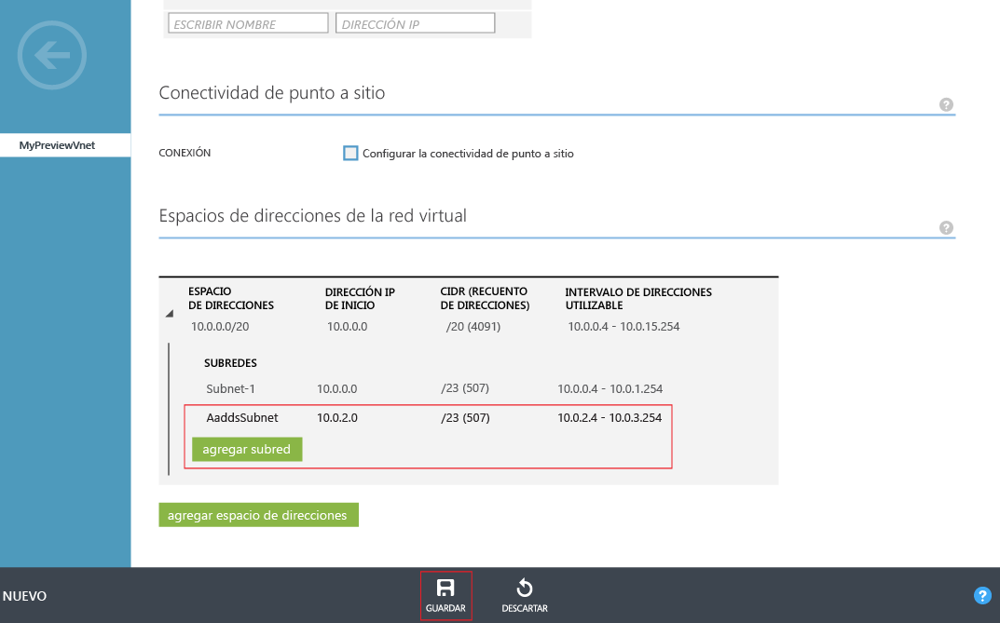

# Creación o selección de una red virtual para Azure Active Directory Domain Services
## Directrices para seleccionar una red virtual de Azure
> [!NOTE]
> **Antes de comenzar**: consulte [Networking considerations for Azure AD Domain Services](active-directory-ds-networking.md)(Consideraciones de redes para Azure Active Directory Domain Services).
>
>

## Tarea 2: Creación de una red virtual de Azure
La siguiente tarea de configuración es crear una red virtual de Azure y una subred dentro de ella. Puede habilitar Azure AD Domain Services en esta subred dentro de la red virtual. Si ya tiene una red virtual que quiere usar, puede omitir este paso.

> [!NOTE]
> Asegúrese de que la red virtual de Azure que cree o elija usar con los Servicios de dominio de Azure AD pertenezca a una región de Azure que sea compatible con dichos servicios. Consulte la página de [servicios de Azure por región](https://azure.microsoft.com/regions/#services/) para saber en qué regiones de Azure está disponible Azure Active Directory Domain Services.
>
>

Anote el nombre de la red virtual para seleccionar la red virtual adecuada al habilitar Azure Active Directory Domain Services en un paso posterior de la configuración.

Realice los siguientes pasos de la configuración para crear una red virtual de Azure en la que desee habilitar Azure Active Directory Domain Services.

1. Navegue hasta el **Portal de Azure clásico** ([https://manage.windowsazure.com](https://manage.windowsazure.com)).
2. Seleccione el nodo **Redes** en el panel izquierdo.

    
3. En la parte inferior de la página, haga clic en **NUEVO** en el panel de tareas.

    
4. En el nodo **Network Services**, seleccione **Virtual Network**.
5. Haga clic en **Creación rápida** para crear una red virtual.

    
6. Escriba un **Nombre** para la red virtual. También puede elegir configurar el **Espacio de direcciones** o el **Número máximo de VM** para esta red. Por ahora, puede dejar la configuración del **servidor DNS** establecida en 'Ninguna'. Puede actualizar el servidor DNS después de habilitar Azure AD Domain Services.
7. Asegúrese de seleccionar una región de Azure compatible en la lista desplegable **Ubicación** . Consulte la página de [servicios de Azure por región](https://azure.microsoft.com/regions/#services/) para saber en qué regiones de Azure está disponible Azure Active Directory Domain Services.
8. Para crear la red virtual, haga clic en el botón **Crear una red virtual** .

    
9. Después de crear la red virtual, selecciónela y haga clic en la pestaña **CONFIGURAR**.

    
10. Navegue hasta la sección **Espacios de direcciones de la red virtual**. Haga clic en **agregar subred** y especifique una subred con el nombre de **AaddsSubnet**. Haga clic en **Guardar** para crear la subred.

    

 

## Tarea 3: Habilitación de los Servicios de dominio de Azure AD
La siguiente tarea de configuración consiste en [habilitar Azure Active Directory Domain Services](active-directory-ds-getting-started-enableaadds.md).

