<properties
   pageTitle="Azure AD Connect: Actualización desde DirSync | Microsoft Azure"
   description="Aprenda a actualizar desde DirSync a Azure AD Connect. En este artículo, se describen los pasos para actualizar desde DirSync a Azure AD Connect."
   services="active-directory"
   documentationCenter=""
   authors="andkjell"
   manager="stevenpo"
   editor=""/>

<tags
   ms.service="active-directory"
   ms.workload="identity"
   ms.tgt_pltfrm="na"
   ms.devlang="na"
   ms.topic="get-started-article"
   ms.date="06/27/2016"
   ms.author="andkjell;shoatman;billmath"/>

# Azure AD Connect: Actualización desde DirSync
Azure AD Connect es el sucesor de DirSync. En este tema, se explican formas de actualizar desde DirSync. Estos pasos no funcionan para la actualización desde otra versión de Azure AD Connect ni desde Sincronización de Azure AD.

Antes de empezar a instalarlo, debe [descargar Azure AD Connect](http://go.microsoft.com/fwlink/?LinkId=615771) y completar los pasos de los requisitos previos en [Requisitos previos de Azure AD Connect](active-directory-aadconnect-prerequisites.md).

Si no va a actualizar desde DirSync, consulte la [documentación relacionada](#related-documentation) sobre otros escenarios.

## Actualización desde DirSync
Dependiendo de su implementación actual de DirSync, existen diferentes opciones para la actualización. Si el tiempo de actualización esperado es inferior a 3 horas, se recomienda realizar una actualización local. Si es superior a 3 horas, se recomienda realizar una implementación paralela en otro servidor. Se calcula que si tiene más de 50.000 objetos, tardará más de 3 horas en realizar la actualización.

Escenario |  
---- | ----
[Actualización local](#in-place-upgrade) | Es la opción preferida si se espera que la actualización tarde menos de 3 horas.
[Implementación paralela](#parallel-deployment) | Es la opción preferida si se espera que la actualización tarde más de 3 horas.

>[AZURE.NOTE] Cuando planee la actualización de DirSync a Azure AD Connect, no desinstale DirSync antes de la actualización. Azure AD Connect leerá y migrará la configuración de DirSync y lo desinstalará después de inspeccionar el servidor.

**Actualización local** El asistente muestra el tiempo previsto para completar la actualización. Este cálculo se basa en la suposición de que se tardará 3 horas en completar una actualización de una base de datos con 50 000 objetos (usuarios, contactos y grupos). Azure AD Connect analiza la configuración actual de DirSync y recomienda una actualización local si el número de objetos de la base de datos es inferior a 50 000. Si decide continuar, la configuración actual se aplicará automáticamente durante la actualización y el servidor reanudará automáticamente la sincronización activa.

Si desea realizar una migración de la configuración y realizar una implementación paralela, puede invalidar la recomendación de actualización local. Por ejemplo, podría aprovechar para actualizar el hardware y el sistema operativo. Consulte la sección [Implementación paralela](#parallel-deployment) para obtener más información.

**Implementación paralela** Se recomienda usar una implementación paralela si tiene más de 50 000 objetos. Esto evitará que los usuarios experimenten retrasos operativos. La instalación de Azure AD Connect intenta calcular el tiempo de inactividad previsto para la actualización pero, si ya ha actualizado antes DirSync, probablemente su propia experiencia sea la mejor referencia.

### Configuraciones de DirSync que se pueden actualizar
DirSync admite los siguientes cambios de configuración y esta se actualizará:

- Filtrado por dominio y unidad organizativa
- Identificador alternativo (UPN)
- Sincronización de contraseñas y configuración híbrida de Exchange
- Configuración de bosque/dominio y Azure AD
- Filtrado basado en atributos de usuario

El siguiente cambio no se puede actualizar. Si ha realizado este cambio, la actualización se bloquea:

- Cambios de DirSync no admitidos, por ejemplo, eliminación de y uso de un archivo DLL de extensión personalizado

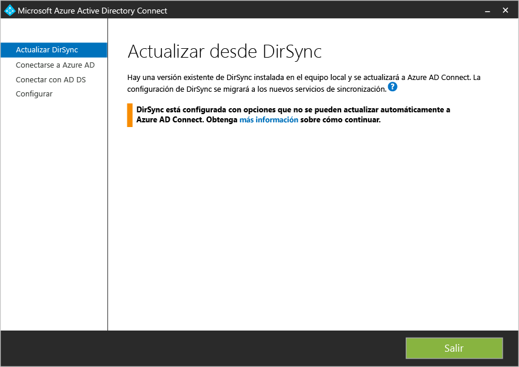

En esos casos, la recomendación es instalar un nuevo servidor de Azure AD Connect en [modo provisional](active-directory-aadconnectsync-operations.md#staging-mode) y comprobar la configuración antigua de DirSync y la nueva de Azure AD Connect. Vuelva a aplicar los cambios usando la configuración personalizada, como se describe en [Azure AD Connect Sync: configuración personalizada de sincronización](active-directory-aadconnectsync-whatis.md).

Las contraseñas usadas por DirSync para las cuentas de servicio no se pueden recuperar y no se migrarán. Estas contraseñas se restablecen durante la actualización.

### Pasos generales de la actualización de DirSync a Connect de Azure AD

1. Bienvenida a Azure AD Connect
2. Análisis de la configuración actual de DirSync
3. Recopilación de la contraseña de administrador global de Azure AD
4. Recopilación de credenciales para una cuenta de administrador de empresa (solo se usa durante la instalación de Azure AD Connect)
5. Instalación de Azure AD Connect
    * Desinstalar DirSync
	* Instalación de Azure AD Connect
	* Opcionalmente, iniciar la sincronización

Se requieren pasos adicionales cuando:

* Actualmente usa una instalación completa de SQL Server (local o remota)
* Tiene más de 50.000 objetos en el ámbito para sincronización

## Actualización local

1. Inicie el instalador de Azure AD Connect (MSI).
2. Revise y acepte los términos de licencia y el aviso de privacidad. 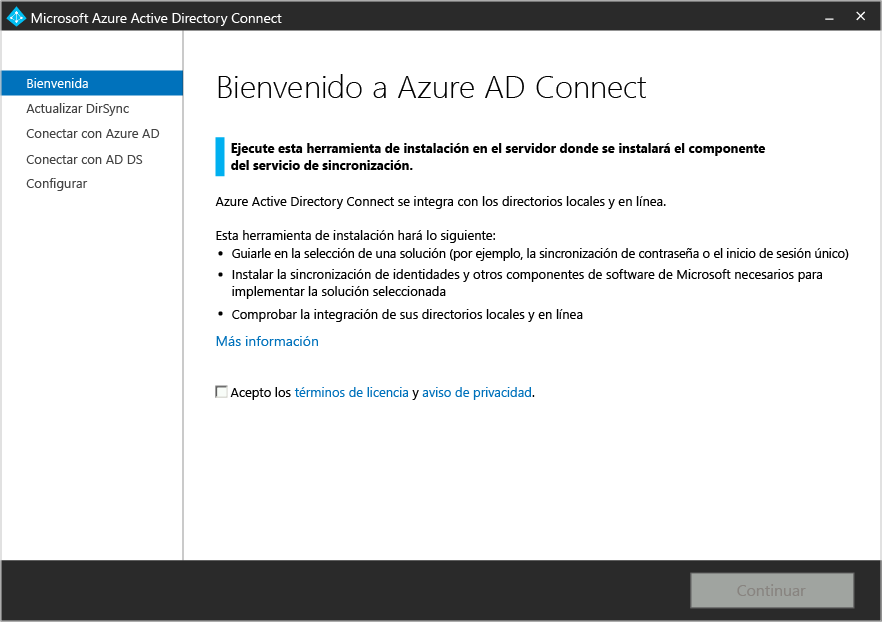
3. Haga clic en Siguiente para realizar el análisis de la instalación existente de DirSync. 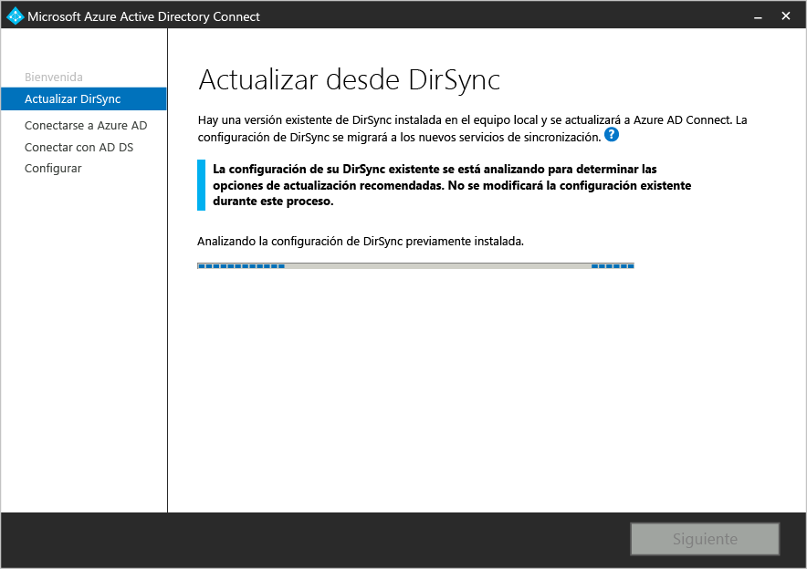
4. Cuando el análisis se complete, verá recomendaciones de cómo proceder.
    - Si usa SQL Server Express y tiene menos de 50.000 objetos, se muestra la siguiente pantalla: 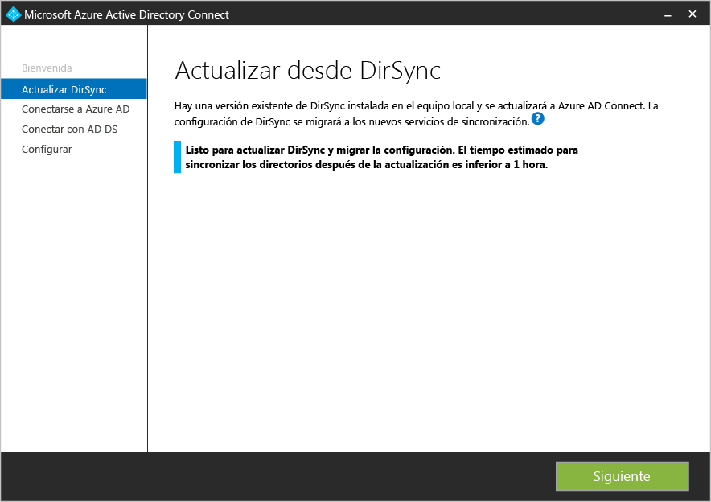
    - Si usa una instalación completa de SQL Server para DirSync, verá esta página en su lugar: 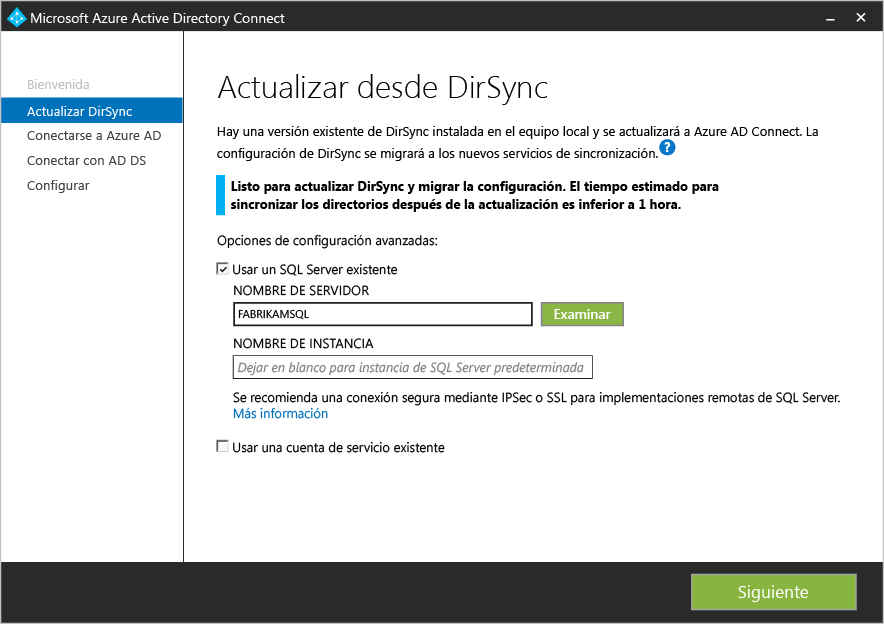 Se muestra la información del servidor de base de datos de SQL Server existente que DirSync está usando. Si es necesario, realice los ajustes adecuados. Haga clic en **Siguiente** para continuar con la instalación.
    - Si tiene más de 50 000 objetos, verá esta pantalla en su lugar: 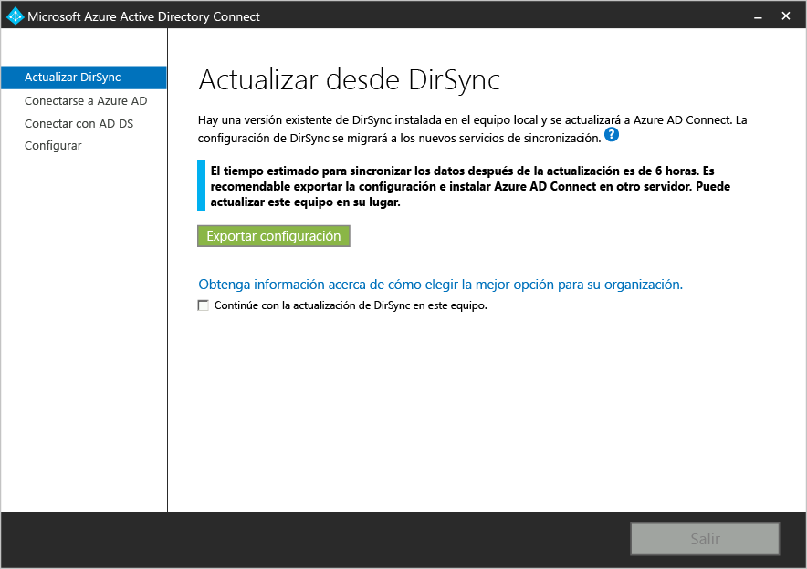 Para continuar con una actualización local, haga clic en la casilla situada junto al mensaje: **Continuar actualizando DirSync en este equipo.** Para realizar una [implementación paralela](#parallel-deployment), exportará las opciones de configuración de DirSync y las moverá al nuevo servidor.
5. Proporcione la contraseña para la cuenta que utiliza actualmente para conectarse a Azure AD. Debe ser la cuenta que DirSync está usando actualmente. 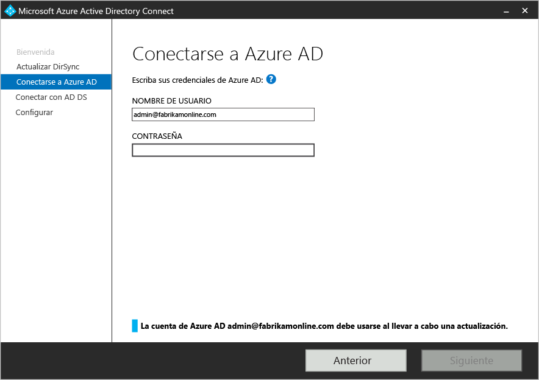 Si recibe un error y tiene problemas de conectividad, consulte [Solución de problemas de conectividad con Azure AD Connect](active-directory-aadconnect-troubleshoot-connectivity.md).
6. Proporcione una cuenta de administrador de empresa para Active Directory. 
7. Ahora está preparado para realizar la configuración. Cuando haga clic en **Actualizar**, DirSync se desinstalará y Azure AD Connect se configurará y se iniciará la sincronización. 
8. Una vez completada la instalación, cierre la sesión e iníciela de nuevo en Windows antes de usar Synchronization Service Manager o el Editor de reglas de sincronización. También puede tratar de realizar cualquier otro cambio en la configuración.

## Implementación paralela

### Exportación de la configuración de DirSync
**Implementación paralela con más de 50.000 objetos**

Si tiene más de 50 000 objetos, la instalación de Azure AD Connect recomienda una implementación paralela.

Se muestra una pantalla similar a la siguiente:

Si desea continuar con la implementación paralela, debe realizar los pasos siguientes:

- Haga clic en el botón **Exportar configuración**. Al instalar Azure AD Connect en un servidor independiente, esta configuración se importará para migrar cualquier configuración desde su DirSync actual a la nueva instalación de Azure AD Connect.

Una vez exportada la configuración correctamente, puede salir del asistente de Azure AD Connect en el servidor DirSync. Continúe con el paso siguiente para [instalar Azure AD Connect en un servidor independiente](#installation-of-azure-ad-connect-on-separate-server).

**Implementación paralela con menos de 50.000 objetos**

Si tiene menos de 50.000 objetos pero aún así desea realizar una implementación paralela, haga lo siguiente:

1. Ejecute el instalador de Azure AD Connect (MSI).
2. Cuando aparezca la pantalla **Bienvenido a Azure AD Connect**, salga del asistente para instalación haciendo clic en la "X", en la esquina superior derecha de la ventana.
3. Abra el símbolo del sistema.
4. En la ubicación de instalación de Azure AD Connect (predeterminada: C:\\Archivos de programa\\Microsoft Azure Active Directory Connect), ejecute el siguiente comando: `AzureADConnect.exe /ForceExport`.
5. Haga clic en el botón **Exportar configuración**. Al instalar Azure AD Connect en un servidor independiente, esta configuración se importará para migrar cualquier configuración desde su DirSync actual a la nueva instalación de Azure AD Connect.

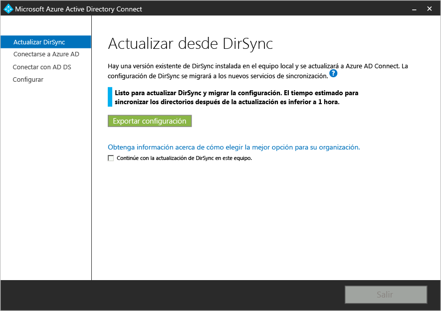

Una vez exportada la configuración correctamente, puede salir del asistente de Azure AD Connect en el servidor DirSync. Continúe con el paso siguiente para [instalar Azure AD Connect en un servidor independiente](#installation-of-azure-ad-connect-on-separate-server).

### Instalación de Azure AD Connect en un servidor independiente

Al instalar Azure AD Connect en un nuevo servidor, se presupone que desea realizar una instalación limpia de Azure AD Connect. Puesto que va a usar la configuración de DirSync, hay que realizar algunos pasos adicionales:

1. Ejecute el instalador de Azure AD Connect (MSI).
2. Cuando aparezca la pantalla **Bienvenido a Azure AD Connect**, salga del asistente para instalación haciendo clic en la "X", en la esquina superior derecha de la ventana.
3. Abra el símbolo del sistema.
4. En la ubicación de instalación de Azure AD Connect (predeterminada: C:\\Archivos de programa\\Microsoft Azure Active Directory Connect), ejecute el siguiente comando: `AzureADConnect.exe /migrate`. Se inicia el Asistente para instalación de Azure AD Connect y muestra la siguiente pantalla: 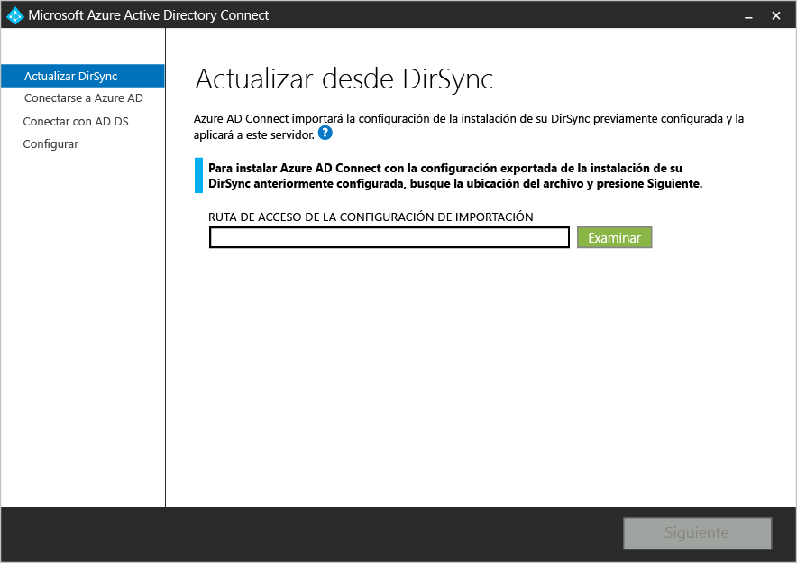
5. Seleccione el archivo de configuración exportado desde la instalación de DirSync.
6. Configure las opciones avanzadas, que se incluyen:
    - Una ubicación de instalación personalizada para Azure AD Connect.
	- Una instancia existente de SQL Server (de forma predeterminada, Azure AD Connect instala SQL Server 2012 Express) No use la misma instancia de base de datos como servidor de DirSync.
	- Una cuenta de servicio usada para conectarse a SQL Server (si la base de datos de SQL Server es remota, esta cuenta debe ser una cuenta de servicio de dominio). Estas opciones se pueden ver en esta pantalla: 
7. Haga clic en **Siguiente**.
8. En la página **Listo para configurar**, deje seleccionada la opción **Inicie el proceso de sincronización en cuanto se complete la configuración**. El servidor estará en [modo provisional](active-directory-aadconnectsync-operations.md#staging-mode), por lo que los cambios no se exportarán a Azure AD en este momento.
9. Haga clic en **Instalar**.
10. Una vez completada la instalación, cierre la sesión e iníciela de nuevo en Windows antes de usar Synchronization Service Manager o el Editor de reglas de sincronización. También puede tratar de realizar cualquier otro cambio en la configuración.

>[AZURE.NOTE] Se iniciará la sincronización entre Windows Server Active Directory y Azure Active Directory, pero no se exportará ningún cambio a Azure AD. Solo una herramienta de sincronización puede a exportar activamente los cambios de una vez. Esto se denomina [modo provisional](active-directory-aadconnectsync-operations.md#staging-mode).

### Comprobación de que Azure AD Connect está listo para comenzar la sincronización

Para determinar si Azure AD Connect está listo para asumir el control de DirSync, necesitará abrir el **Administrador del servicio de sincronización**, en el grupo **Azure AD Connect**, desde el menú Inicio.

Dentro de la aplicación, deberá ver la pestaña **Operaciones**. En esta pestaña desea confirmar que se han completado las siguientes operaciones:

- Importación en AD Connector
- Importación en Azure AD Connector
- Sincronización completa en AD Connector
- Sincronización completa en Azure AD Connector

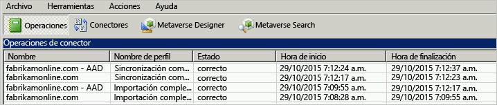

Revise el resultado de estas operaciones y asegúrese de que no hay errores.

Si desea ver e inspeccionar los cambios que se van a exportar a Azure AD, lea cómo comprobar la configuración en el [modo provisional](active-directory-aadconnectsync-operations.md#staging-mode). Realice los cambios de configuración necesarios hasta que no vea nada inesperado.

Cuando se completen estas 4 operaciones, no haya errores y esté satisfecho con los cambios que se van a exportar, está listo para desinstalar DirSync y habilitar la sincronización de Azure AD Connect. Complete los dos pasos siguientes para finalizar la migración.

### Desinstalación de DirSync (servidor antiguo)

- En **Programas y características**, busque **Herramienta de sincronización de Microsoft Azure Active Directory**.
- Desinstale la **Herramienta de sincronización de Microsoft Azure Active Directory**.
- Tenga en cuenta que la desinstalación podría tardar hasta 15 minutos en completarse.

Con DirSync desinstalado, no hay ningún servidor activo que esté exportando a Azure AD. El siguiente paso se debe completar antes de sincronizar los cambios de su instalación local de Active Directory con Azure AD.

### Apertura de Azure AD Connect (nuevo servidor)
Después de la instalación, al volver a abrir Azure AD Connect le permitirá realizar cambios adicionales en la configuración. Inicie **Azure AD Connect** desde el menú Inicio o desde el acceso directo del escritorio. Asegúrese de no intentar ejecutar de nuevo el MSI de instalación.

Verá lo siguiente:

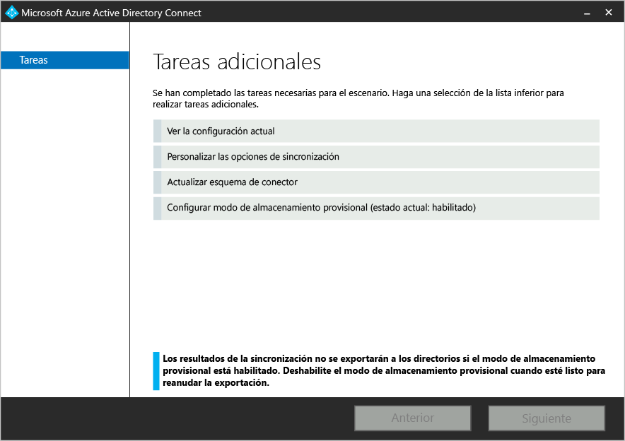

- Seleccione **Configurar modo de almacenamiento provisional**.
- Desactive la casilla **Modo provisional habilitado** para deshabilitar el modo provisional.

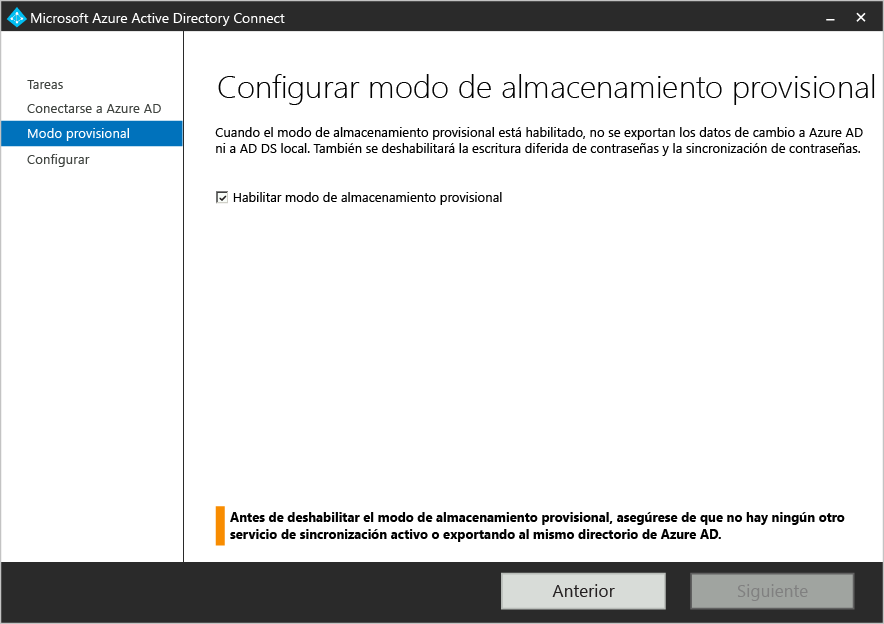

- Haga clic en el botón **Siguiente**.
- En la página de confirmación, haga clic en **instalar**.

Azure AD Connect es ahora el servidor activo.

## Pasos siguientes
Ahora que ha instalado Azure AD Connect, puede [comprobar la instalación y asignar licencias](active-directory-aadconnect-whats-next.md).

Aprenda más sobre estas características nuevas, que se habilitaron con la instalación: la [actualización automática](active-directory-aadconnect-feature-automatic-upgrade.md), la característica para [evitar eliminaciones accidentales](active-directory-aadconnectsync-feature-prevent-accidental-deletes.md) y [Azure AD Connect Health](active-directory-aadconnect-health-sync.md).

Para más información acerca de estos temas habituales, consulte [Sincronización de Azure AD Connect: Programador](active-directory-aadconnectsync-feature-scheduler.md).

Obtenga más información sobre la [Integración de las identidades locales con Azure Active Directory](active-directory-aadconnect.md).

## Documentación relacionada

Tema. |  
--------- | ---------
Información general de Azure AD Connect | [Integración de las identidades locales con Azure Active Directory](active-directory-aadconnect.md)
Actualización desde una versión anterior de Connect | [Azure AD Connect: actualización de una versión anterior a la versión más reciente](active-directory-aadconnect-upgrade-previous-version.md)
Instalación mediante configuración rápida | [Instalación rápida de Azure AD Connect](active-directory-aadconnect-get-started-express.md)
Instalación mediante configuración personalizada | [Instalación personalizada de Azure AD Connect](active-directory-aadconnect-get-started-custom.md)
Cuentas usadas para la instalación | [Más información sobre permisos y cuentas de Azure AD Connect](active-directory-aadconnect-accounts-permissions.md)

<!---HONumber=AcomDC_0629_2016-->