<properties
	pageTitle="Azure AD Connect: instalación personalizada | Microsoft Azure"
	description="En este documento se explica las opciones de instalación personalizada de Azure AD Connect. Siga estas instrucciones para instalar Active Directory mediante Azure AD Connect."
	services="active-directory"
    keywords="qué es Azure AD Connect, instalar Active Directory, componentes necesarios para Azure AD"
	documentationCenter=""
	authors="andkjell"
	manager="stevenpo"
	editor="curtand"/>

<tags
	ms.service="active-directory"  
	ms.workload="identity"
	ms.tgt_pltfrm="na"
	ms.devlang="na"
	ms.topic="get-started-article"
	ms.date="05/31/2016"
	ms.author="billmath;andkjell"/>

# Instalación personalizada de Azure AD Connect
Se utiliza **Configuración personalizada** de Azure AD Connect cuando se desea contar con más opciones para la instalación. Se utiliza si tiene varios bosques o si desea configurar características opcionales que no se incluyen en la instalación rápida. Se usa en todos aquellos casos en que la opción [**Instalación rápida**](active-directory-aadconnect-get-started-express.md) no vale para su implementación o topología.

Antes de empezar a instalarlo, debe [descargar Azure AD Connect](http://go.microsoft.com/fwlink/?LinkId=615771) y completar los pasos de los requisitos previos en [Requisitos previos de Azure AD Connect](active-directory-aadconnect-prerequisites.md). Asegúrese también de que posee las cuentas necesarias que se describen en [Azure AD Connect: cuentas y permisos](active-directory-aadconnect-accounts-permissions.md).

Si la configuración personalizada no coincide con la topología, por ejemplo, para actualizar DirSync, consulte la [documentación relacionada](#related-documentation) sobre otros escenarios.

## Instalación de Azure AD Connect con Configuración personalizada

### Configuración rápida
En esta página, haga clic en **Personalizar** para iniciar la instalación con Configuración personalizada.

### Instalación de los componentes necesarios
Al instalar los servicios de sincronización, puede dejar desactivada la sección de configuración opcional y Azure AD Connect configurará todo automáticamente. Configura una instancia de SQL Server 2012 Express LocalDB, crea los grupos apropiados y asigna permisos. Si desea cambiar los valores predeterminados, puede utilizar la tabla siguiente para conocer las opciones de configuración opcionales disponibles.

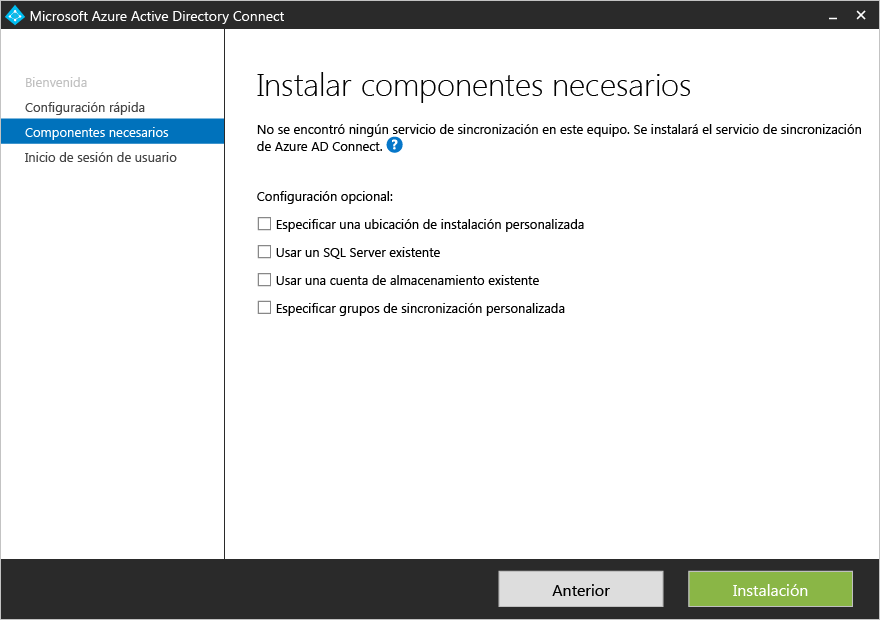

Configuración opcional | Descripción
------------- | -------------
Usar un SQL Server existente | Permite especificar el nombre de SQL Server y el nombre de la instancia. Elija esta opción si ya dispone de un servidor de base de datos que le gustaría utilizar. Si SQL Server no tiene la exploración habilitada, escriba el nombre de la instancia seguido de una coma y un número de puerto en el cuadro **Nombre de instancia**.
Usar una cuenta de servicio existente | De forma predeterminada, Azure AD Connect crea una cuenta de servicio local para que la usen los servicios de sincronización. la contraseña se genera automáticamente y es desconocida para la persona que instala Azure AD Connect. Si usa un servidor SQL Server remoto o un proxy que requiere autenticación, necesitará una cuenta de servicio en el dominio y conocer la contraseña. En esos casos, especifique la cuenta de servicio para usar. Asegúrese de que el usuario que ejecuta la instalación es una SA en SQL, por lo que se puede crear un inicio de sesión para la cuenta de servicio. Consulte [Permisos y cuentas de Azure AD Connect](active-directory-aadconnect-accounts-permissions.md#custom-settings-installation)
Especificar grupos de sincronización personalizada | De forma predeterminada, Azure AD Connect crea cuatro grupos locales en el servidor cuando se instalan los servicios de sincronización. Estos grupos son: grupo Administradores, grupo Operadores, grupo Examinar y grupo Restablecimiento de contraseña. Puede especificar sus grupos aquí. Los grupos deben ser locales en el servidor y no se pueden encontrar en el dominio.

### Inicio de sesión de usuario
Después de instalar los componentes necesarios, se le pide que seleccione el método de inicio de sesión único de usuario. En la tabla siguiente se proporciona una breve descripción de las opciones disponibles. Para obtener una descripción completa de los métodos de inicio de sesión, consulte [Inicio de sesión de usuario](active-directory-aadconnect-user-signin.md).

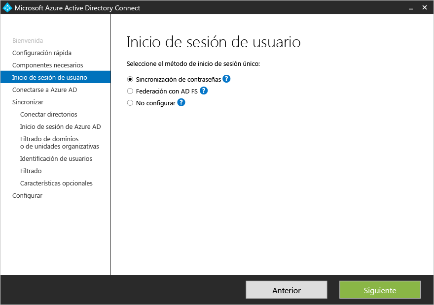

Inicio de sesión único | Descripción
------------- | -------------
Sincronización de contraseñas | Los usuarios pueden iniciar sesión en los servicios en la nube de Microsoft, como Office 365, con la misma contraseña que usan en su red local. Las contraseñas de usuario se sincronizan en Azure AD en forma de hash de contraseña y la autenticación tiene lugar en la nube. Consulte [Sincronización de contraseñas](active-directory-aadconnectsync-implement-password-synchronization.md) para obtener más información.
Federación con AD FS | Los usuarios pueden iniciar sesión en los servicios en la nube de Microsoft, como Office 365, con la misma contraseña que usan en su red local. Los usuarios se redirigen a su instancia local de AD FS para iniciar sesión y la autenticación se realiza de forma local.
No configurar | No se instala ni configura ninguna característica. Elija esta opción si ya tiene un servidor de federación de terceros u otra solución existente ya instalada.

### Conectarse a Azure AD
En la pantalla Conectarse a Azure AD, especifique una cuenta de administrador global y una contraseña. Si seleccionó **Federación con AD FS** en la página anterior, no inicie sesión con una cuenta en un dominio en el que planee habilitar la federación. Se recomienda utilizar una cuenta en el dominio predeterminado **onmicrosoft.com**, que se incluye con su directorio de Azure AD.

Esta cuenta solo se usa para crear una cuenta de servicio en Azure AD y no se utiliza una vez completado el asistente. 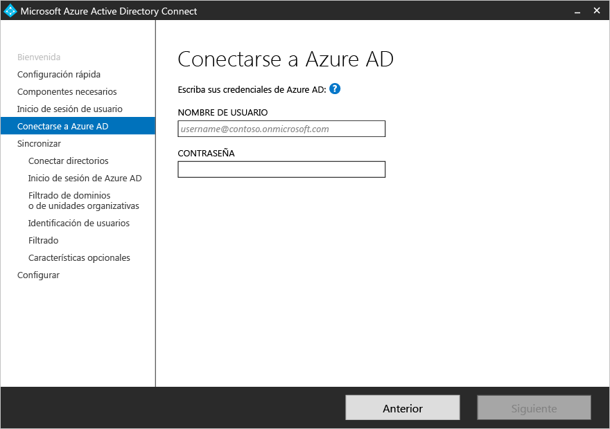

Si la cuenta de administrador global tiene MFA habilitado, será preciso que vuelva a especificar la contraseña en el elemento emergente de inicio de sesión y a completar el desafío MFA. Dicho desafío puede ser especificar un código de comprobación o una llamada telefónica. 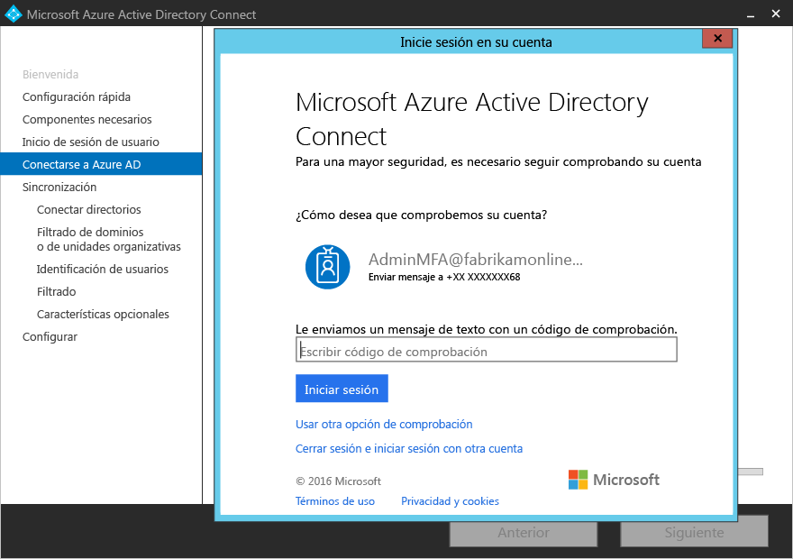

La cuenta de administrador global también puede tener habilitado [Privileged Identity Management](active-directory-privileged-identity-management-getting-started.md).

Si recibe un error y tiene problemas de conectividad, consulte [Solución de problemas de conectividad con Azure AD Connect](active-directory-aadconnect-troubleshoot-connectivity.md).

## Páginas bajo la sección Sincronización

### Conectar sus directorios
Para conectarse al Servicio de dominio de Active Directory, Azure AD Connect necesita las credenciales de una cuenta con permisos suficientes. Puede escribir la parte del dominio con el formato NetBios o FQDN, es decir, FABRIKAM\\syncuser o fabrikam.com\\syncuser. Esta cuenta puede ser una cuenta de usuario normal porque solo tiene los permisos de lectura predeterminados. Sin embargo, en función del escenario, puede que necesite permisos adicionales. Para más información, consulte [Azure AD Connect: cuentas y permisos](active-directory-aadconnect-accounts-permissions.md#create-the-ad-ds-account).

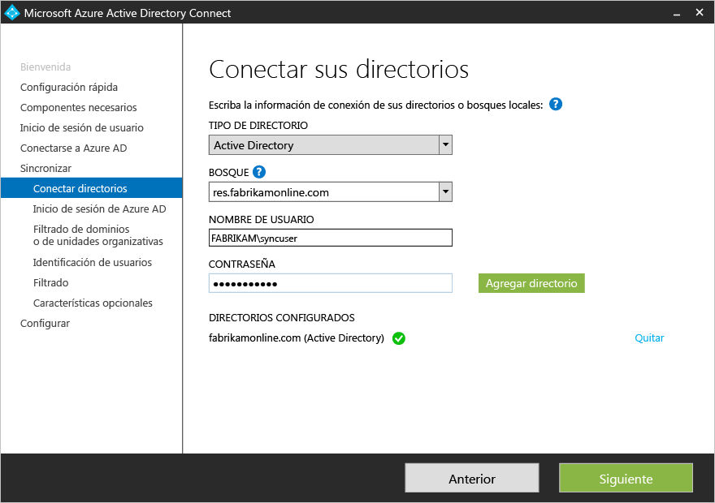

### Configuración de inicio de sesión de Azure AD
Esta página le permitirá revisar los dominios UPN presentes en el entorno local de AD DS y que se han comprobado en Azure AD. Esta página también le permitirá configurar el atributo que se usará para userPrincipalName.

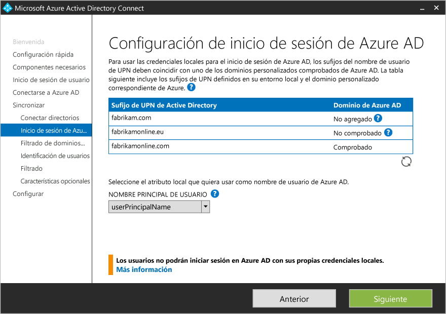 Revise los dominios marcados como **Not Added** (Sin agregar) y **Not Verified** (Sin comprobar). Asegúrese de que los que usa se han comprobado en Azure AD. Cuando haya comprobado los dominios, haga clic en el símbolo de actualización. Para más información, consulte las secciones correspondientes a [agregar y comprobar el dominio](active-directory-add-domain.md).

**UserPrincipalName**: userPrincipalName es el atributo que los usuarios usan al iniciar sesión en Azure AD y Office 365. Los dominios utilizados, también conocidos como sufijo UPN, deben comprobarse en Azure AD antes de que se sincronicen los usuarios. Microsoft recomienda mantener el atributo userPrincipalName predeterminado. Si este atributo no es enrutable y no se puede comprobar, se puede seleccionar otro. Por ejemplo, se puede seleccionar email como atributo que contiene el identificador de inicio de sesión. El uso de cualquier atributo distinto de userPrincipalName se conoce como **identificador alternativo**. El valor del atributo Alternate ID debe seguir el estándar RFC822. Un id. alternativo puede usarse con la sincronización de contraseñas y con la federación.

>[AZURE.WARNING]
El uso de un identificador alternativo no es compatible con todas las cargas de trabajo de Office 365. Para obtener más información, vea [Configuración del identificador de inicio de sesión alternativo](https://technet.microsoft.com/library/dn659436.aspx).

### Filtrado por dominio y unidad organizativa
De forma predeterminada, todos los dominios y las unidades organizativas se sincronizan. Si hay algunos dominios o unidades organizativas que no desee sincronizar con Azure AD, puede anular la selección de estos. 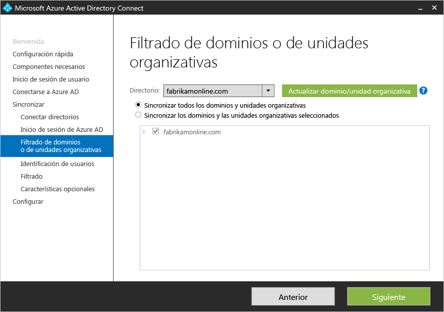 En esta página del asistente se configura el filtrado basado en dominio. Para más información, consulte [Filtrado basado en dominios](active-directory-aadconnectsync-configure-filtering.md#domain-based-filtering).

También es posible que algunos dominios no sean accesibles debido a restricciones del firewall. De forma predeterminada estos dominios no estarán seleccionados y tendrán una indicación de advertencia. 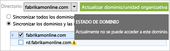 Si la ve, asegúrese de que efectivamente no se pueda acceder a estos dominios y, por lo tanto, esta advertencia sea esperada.

### Identificación de forma exclusiva de usuarios
La característica Correspondencia entre bosques permite definir cómo se representan los usuarios de los bosques de AD DS en Azure AD. Un usuario puede estar representado solo una vez en todos los bosques o tener una combinación de cuentas habilitadas y deshabilitadas. En algunos bosques, el usuario también puede aparecer representado como un contacto.

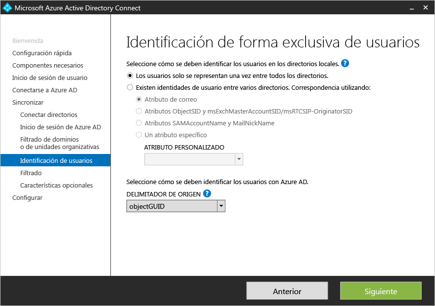

Configuración | Descripción
------------- | -------------
[Los usuarios solo se representan una vez en todos los bosques](active-directory-aadconnect-topologies.md#multiple-forests-separate-topologies) | Todos los usuarios se crean como objetos individuales en Azure AD. Los objetos no se combinan en el metaverso.
[Atributo Mail](active-directory-aadconnect-topologies.md#multiple-forests-full-mesh-with-optional-galsync) | Esta opción une a los usuarios y contactos si el atributo Mail tiene el mismo valor en bosques diferentes. Esta opción se utiliza cuando los contactos se han creado mediante GALSync.
[ObjectSID y msExchangeMasterAccountSID/ msRTCSIP-OriginatorSid](active-directory-aadconnect-topologies.md#multiple-forests-account-resource-forest) | Esta opción une un usuario habilitado en un bosque de cuentas con un usuario deshabilitado en un bosque de recursos. En Exchange, esta configuración se conoce como buzón vinculado. Esta opción también se puede usar si solo usa Lync y Exchange no está presente en el bosque de recursos.
sAMAccountName y MailNickName | Esta opción combina atributos donde se espera que pueda encontrarse el identificador de inicio de sesión para el usuario.
Un atributo específico | Esta opción le permite seleccionar su propio atributo. **Limitación:** asegúrese de seleccionar un atributo que pueda encontrarse en el metaverso. Si selecciona un atributo personalizado (que no está en el metaverso), el asistente no podrá completarse.

**Delimitador de origen**: sourceAnchor es un atributo inmutable durante la vigencia de un objeto de usuario. Es la clave principal que vincula el usuario local con el usuario de Azure AD. Puesto que no se puede cambiar el atributo, debe pensar en un atributo que sea adecuado usar. Un buen candidato es objectGUID. Este atributo no cambiará, salvo que la cuenta de usuario se mueva entre bosques o dominios. En un entorno de varios bosque donde se muevan cuentas entre bosques, debe utilizarse otro atributo, como un atributo con el identificador de empleado. Evite los atributos que puedan cambiar si una persona se casa o se cambian las asignaciones. No se pueden utilizar los atributos con un signo @, por lo que no se puede utilizar el correo electrónico y userPrincipalName. El atributo también distingue mayúsculas de minúsculas, por lo que si mueve un objeto entre bosques, asegúrese de conservar las mayúsculas y minúsculas. Los atributos binarios tienen codificación base64, pero otros tipos de atributo permanecerán en su estado sin codificar. En escenarios de federación y en algunas interfaces de Azure AD, este atributo se conoce también como immutableID. En los [conceptos de diseño](active-directory-aadconnect-design-concepts.md#sourceAnchor) encontrará más información sobre el delimitador de origen.

### Filtrado de sincronización basado en grupos
El filtrado por grupos permite sincronizar solo un pequeño subconjunto de objetos para una prueba piloto. Para utilizar esta característica, cree un grupo específicamente para este propósito en su entorno de Active Directory local. Luego, agregue los usuarios y grupos que se deben sincronizar con Azure AD como miembros directos. Posteriormente puede agregar y quitar usuarios a este grupo para mantener la lista de objetos que deban estar presentes en Azure AD. Todos los objetos que quiere sincronizar deben ser un miembro directo del grupo. Los usuarios, grupos, contactos y equipos o dispositivos deben ser miembros directos. No se resuelve la pertenencia a grupos anidados. Cuando se agrega un grupo como miembro, solo se agrega el grupo en sí, no sus miembros.

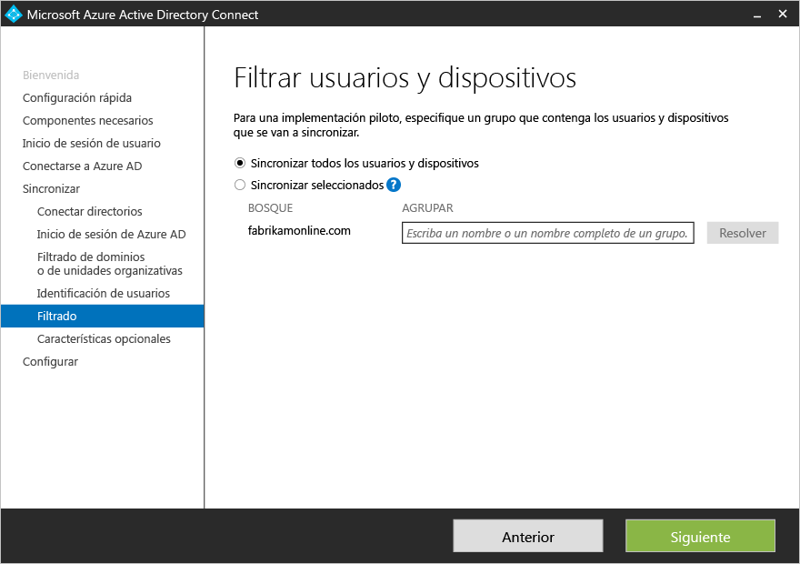

>[AZURE.WARNING]
Esta característica solo está destinada a admitir una implementación piloto. No se debe usar en una implementación de producción completa.

En una implementación de producción completa va a ser difícil mantener un grupo único con todos los objetos que se sincronizan. En su lugar, se debe usar uno de los métodos de [Azure AD Connect Sync: configuración del filtrado](active-directory-aadconnectsync-configure-filtering.md).

### Características opcionales
Esta pantalla le permite seleccionar las características opcionales para situaciones específicas.

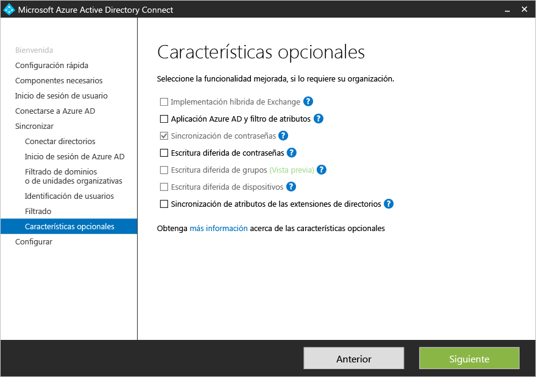

>[AZURE.WARNING]
Si actualmente tiene activo DirSync o Azure AD Synx, no active ninguna de las características de escritura diferida en Azure AD Connect.

Características opcionales | Descripción
------------------- | -------------
Implementación híbrida de Exchange | La característica de implementación híbrida de Exchange permite la coexistencia de buzones de Exchange en un entorno local y en Office 365. Azure AD Connect sincroniza un conjunto específico de [atributos](active-directory-aadconnectsync-attributes-synchronized.md#exchange-hybrid-writeback) de Azure AD en su directorio local.
Aplicación Azure AD y filtro de atributos | Al habilitar la aplicación Azure AD y el filtro de atributos, se puede adaptar el conjunto de atributos sincronizados. Esta opción agrega dos páginas más de configuración al asistente. Para más información, consulte [Aplicación Azure AD y filtro de atributos](#azure-ad-app-and-attribute-filtering).
Sincronización de contraseñas | Si seleccionó la federación como solución de inicio de sesión. puede habilitar esta solución. A continuación, la sincronización de contraseñas se puede usar como opción de copia de seguridad. Para más información, consulte [Implementación de la sincronización de contraseña mediante la sincronización de Azure AD Connect](active-directory-aadconnectsync-implement-password-synchronization.md).
Escritura diferida de contraseñas | Al habilitar la escritura diferida de contraseñas, los cambios de contraseña que se originan en Azure AD se escriben en su directorio local. Para más información, consulte [Introducción a la administración de contraseñas](active-directory-passwords-getting-started.md).
Escritura diferida de grupos | Si utiliza la característica **Grupos de Office 365**, estos grupos pueden estar representados en su instancia de Active Directory local. Esta opción solo está disponible si dispone de Exchange en su Active Directory local. Para más información, consulte [Escritura diferida de grupos](active-directory-aadconnect-feature-preview.md#group-writeback).
Escritura diferida de dispositivos | Permite realizar una escritura diferida de objetos de dispositivo en Azure AD para su Active Directory local para escenarios de acceso condicional. Para más información, consulte [Azure AD Connect: habilitación de la escritura diferida de dispositivos](active-directory-aadconnect-feature-device-writeback.md).
Sincronización de atributos de las extensiones de directorios | Al habilitar la sincronización de atributos de las extensiones de directorios, los atributos especificados se sincronizan con Azure AD. Para más información, consulte [Sincronización de Azure AD Connect: Extensiones de directorio](active-directory-aadconnectsync-feature-directory-extensions.md).

### Aplicación Azure AD y filtro de atributos
Si desea limitar los atributos que se sincronizan con Azure AD, empiece por seleccionar los servicios que utiliza. Si realiza cambios en la configuración en esta página, será preciso seleccionar explícitamente un servicio nuevo, para lo que debe volver a ejecutarse el Asistente para la instalación.

En función de los servicios seleccionados en el paso anterior, esta página mostrará todos los atributos sincronizados. Esta lista es una combinación de todos los tipos de objeto que se están sincronizando. Si hay algunos atributos concretos que no necesita sincronizar, puede anular la selección de los mismos.

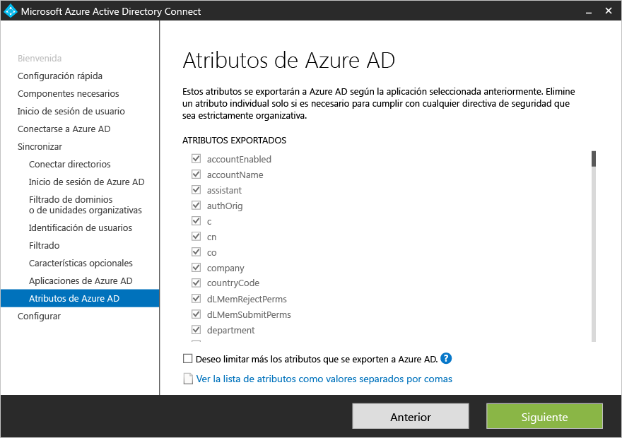

>[AZURE.WARNING]
Quitar atributos puede afectar a la funcionalidad. Para conocer los procedimientos recomendados, consulte [Azure AD Connect Sync: atributos sincronizados con Azure Active Directory](active-directory-aadconnectsync-attributes-synchronized.md#attributes-to-synchronize).

### Sincronización de atributos de las extensiones de directorios
En Azure AD, el esquema se puede extender con los atributos personalizados agregados por la organización o con otros atributos de Active Directory. Para utilizar esta característica, seleccione **Sincronización de atributos de las extensiones de directorios** en la página **Características opcionales**. En esta página puede seleccionar más atributos para la sincronización.

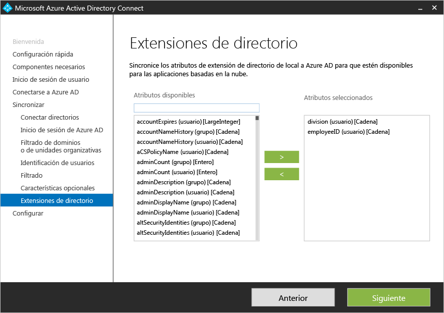

Para más información, consulte [Sincronización de Azure AD Connect: Extensiones de directorio](active-directory-aadconnectsync-feature-directory-extensions.md).

## Configuración de federación con AD FS
La configuración de AD FS con Azure AD Connect es muy sencilla y solo se necesitan unos cuantos clics. Antes de la configuración se requiere lo siguiente.

- Un servidor Windows Server 2012 R2 para el servidor de federación con la administración remota habilitada.
- Un servidor Windows Server 2012 R2 para el servidor Proxy de aplicación web con la administración remota habilitada.
- Un certificado SSL para el nombre del servicio de federación que desea usar (por ejemplo, sts.contoso.com)

### Requisitos previos de la configuración de AD FS
Para configurar la granja de AD FS mediante Azure AD Connect, asegúrese de que WinRM está habilitado en los servidores remotos. Además, revise los requisitos de puertos enumerados en la [Tabla 3: Azure AD Connect y servidores de federación/WAP](active-directory-aadconnect-ports.md#table-3---azure-ad-connect-and-federation-serverswap).

### Creación de una nueva granja de AD FS o utilización de una granja de AD FS existente
Puede utilizar una granja de AD FS existente o crear una nueva granja de AD FS. Si decide crearla, debe proporcionar el certificado SSL. Si el certificado SSL está protegido mediante contraseña, se le solicitará dicha contraseña.

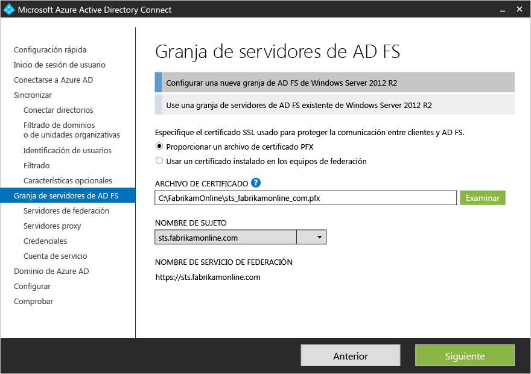

Si elige usar una granja de AD FS existente, vaya directamente a la pantalla de configuración de la relación de confianza entre AD FS y Azure AD.

### Especificación de los servidores de AD FS
Especifique los servidores específicos en que desea instalar AD FS. Puede agregar uno o más servidores según su necesidades de planeación de capacidad. Una todos los servidores a Active Directory antes de realizar esta configuración. Microsoft recomienda instalar un único servidor de AD FS para las implementaciones piloto y de prueba. Después, agregue e implemente más servidores para satisfacer sus necesidades de escalado, para lo que debe ejecutar Azure AD Connect después de la configuración inicial.

>[AZURE.NOTE]
Antes de realizar esta configuración asegúrese de que todos los servidores se han unidos a algún dominio de AD.

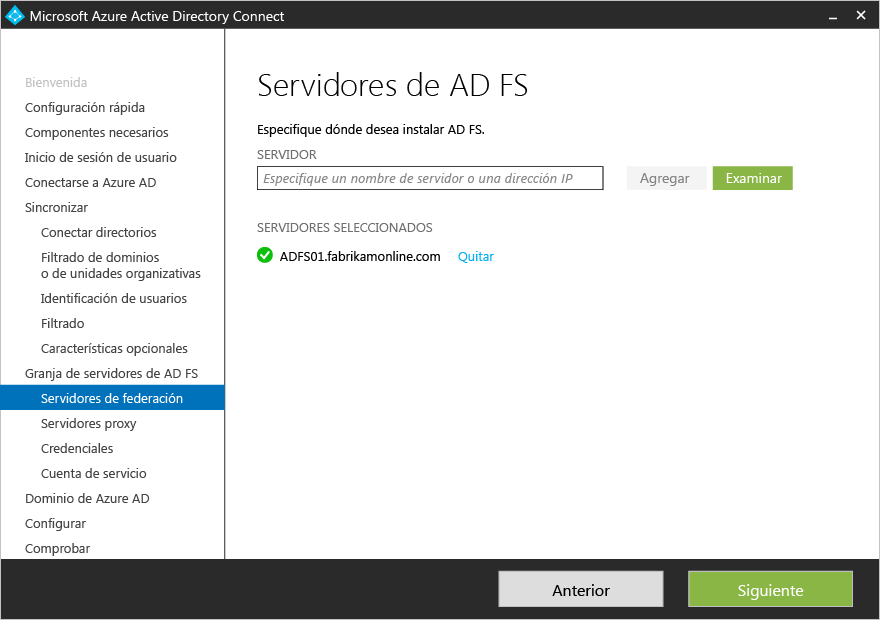

### Especificación de los servidores Proxy de aplicación web
Especifique cuáles desea que sean los servidores Proxy de aplicación web. El servidor Proxy de aplicación web se implementa en la red perimetral (a través de extranet) y admite solicitudes de autenticación desde la extranet. Puede agregar uno o más servidores según su necesidades de planeación de capacidad. Microsoft recomienda instalar un único servidor Proxy de aplicación web para las implementaciones piloto y de prueba. Después, agregue e implemente más servidores para satisfacer sus necesidades de escalado, para lo que debe ejecutar Azure AD Connect después de la configuración inicial. Se recomienda tener un número equivalente de servidores proxy para realizar la autenticación desde la intranet.

>[AZURE.NOTE]
<li> Si la cuenta que usa no es un administrador local en los servidores de AD FS, se le solicitarán las credenciales de administrador.</li>
<li> Antes de ejecutar este paso asegúrese de que hay conectividad HTTP/HTTPS entre el servidor de Azure AD Connect y el servidor Proxy de aplicación web.</li>
<li> Asegúrese también de que hay conectividad HTTP/HTTPS entre el Servidor de aplicaciones web y el servidor de AD FS para permitir que fluyan las solicitudes de autenticación.</li>

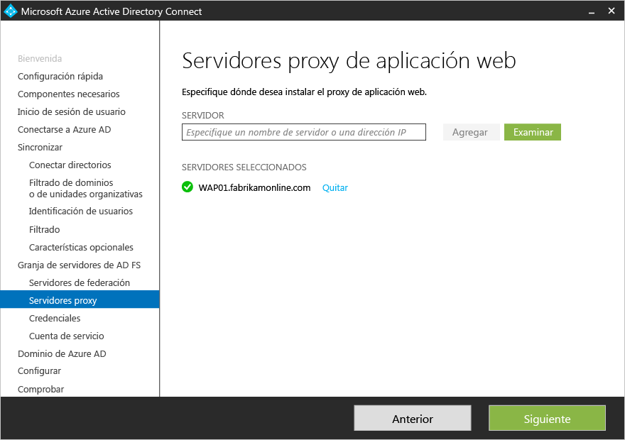

Se le solicita que escriba las credenciales, con el fin de que el Servidor de aplicaciones web pueda establecer una conexión segura con el servidor de AD FS. Estas credenciales deben ser un administrador local en el servidor de AD FS.

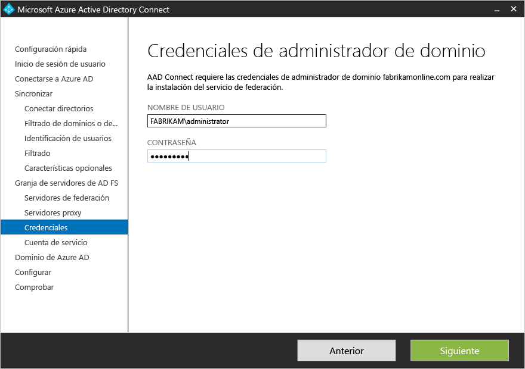

### Especificación de la cuenta de servicio para el servicio AD FS
El servicio de AD FS requiere una cuenta de servicio de dominio para autenticar usuarios y la información de usuario de búsqueda en Active Directory. Puede admitir dos tipos de cuentas de servicio:

- **Cuenta de servicio administrada de grupo**: se introdujo en Servicios de dominio de Active Directory con Windows Server 2012. Este tipo de cuenta proporciona servicios, como AD FS, que utilizan una única cuenta sin necesidad de actualizar la contraseña de la misma de forma periódica. Utilice esta opción si tiene controladores de dominio de Windows Server 2012 en el dominio al que pertenecen los servidores de AD FS.
- **Cuenta de usuario de dominio**: para este tipo de cuenta debe especificar una contraseña y actualizarla de forma periódica cuando cambie o expire. Utilice esta opción solo si no tiene controladores de dominio de Windows Server 2012 en el dominio al que pertenecen los servidores de AD FS.

Si ha seleccionado Cuenta de servicio administrada de grupo y esta característica no se ha usado nunca en Active Directory, se le pedirán las credenciales de administrador de organización. Estas se usarán para iniciar el almacén de claves y habilitar la característica en Active Directory.

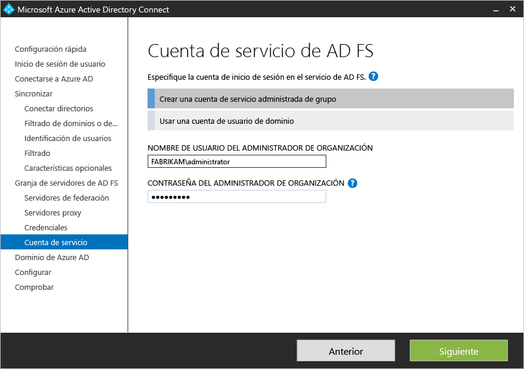

### Selección del dominio de Azure AD que desee federar
Esta configuración se utiliza para configurar la relación de federación entre AD FS y Azure AD. Configura a AD FS para que emitir tokens de seguridad en Azure AD y configura Azure AD para confiar en los tokens de esta instancia de AD FS específica. Esta página solo permite configurar un único dominio en la instalación inicial. Si vuelve a ejecutar Azure AD Connect después podrá configurar más dominios.

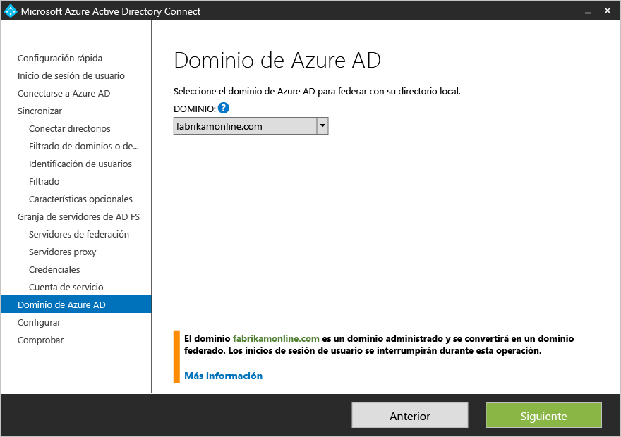

### Comprobación del dominio de Azure AD seleccionado para la federación
Cuando se selecciona el dominio que se va a federar, Azure AD Connect proporciona la información necesaria para comprobar un dominio no comprobado. Para saber cómo usar esta información, consulte [Incorporación de su nombre de dominio personalizado a Azure Active Directory](active-directory-add-domain.md).

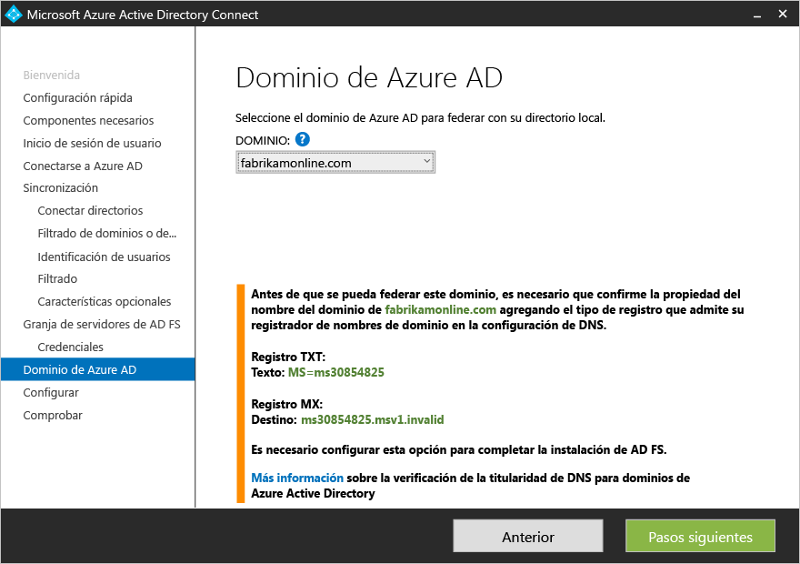

>[AZURE.NOTE]
AD Connect intenta comprobar el dominio durante la fase de configuración. Si continúa la configuración sin agregar los registros de DNS necesarios, el asistente no podrá completar la configuración.

## Configurar y comprobar páginas
La configuración se realiza en esta página.

>[AZURE.NOTE]
Si configuró la federación, antes de seguir con la instalación, asegúrese de que ha configurado [Resolución de nombres para los servidores de federación](active-directory-aadconnect-prerequisites.md#name-resolution-for-federation-servers).

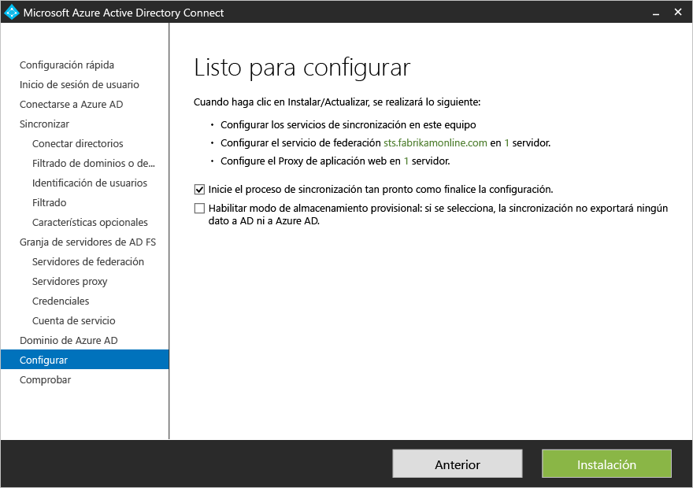

### Modo provisional
Con el modo provisional es posible configurar un nuevo servidor de sincronización en paralelo. Solo se permite que un servidor de sincronización se exporte a un directorio en la nube. Pero si quiere moverse desde otro servidor, por ejemplo, uno que ejecuta DirSync, puede habilitar Azure AD Connect en modo provisional. Cuando se habilita, el motor de sincronización importa y sincroniza los datos como es habitual, pero no exporta nada a Azure AD ni a AD. Las características de sincronización de contraseñas y la escritura diferida de contraseñas se deshabilitan mientras esté en modo provisional.

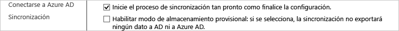

En modo provisional, es posible realizar los cambios necesarios en el motor de sincronización y revisar lo que se va a exportar. Cuando la configuración esté correcta, vuelva a ejecutar al Asistente para la instalación y deshabilite el modo provisional. Ahora los datos se exportan a Azure AD desde este servidor. Asegúrese de deshabilitar al otro servidor al mismo tiempo para que solo un servidor esté exportando activamente.

Para más información, consulte [Modo provisional](active-directory-aadconnectsync-operations.md#staging-mode).

### Comprobación de la configuración de la federación
Azure AD Connect comprueba la configuración de DNS cuando se hacer clic en el botón Comprobar.

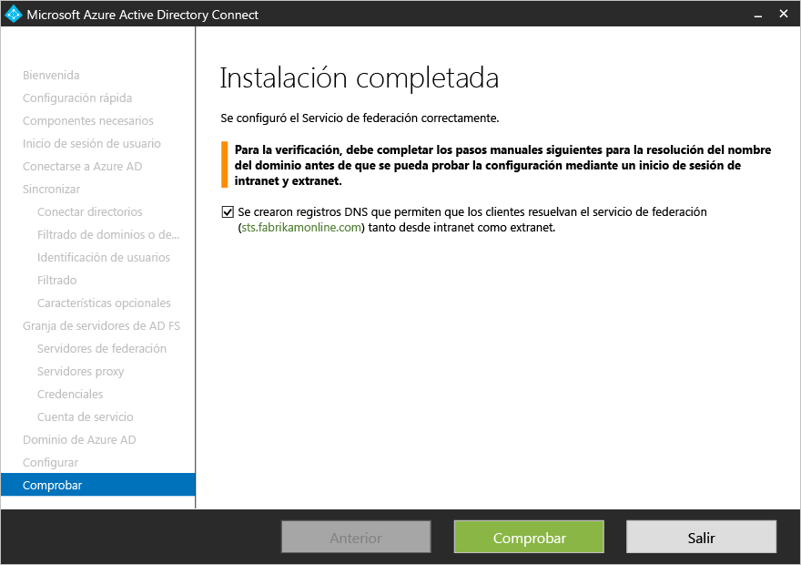

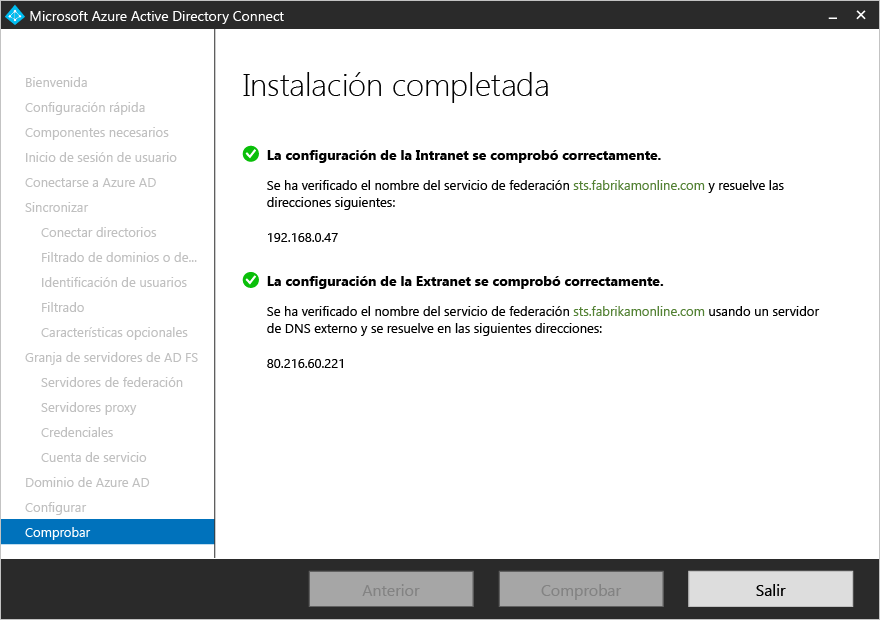

Además, realice los pasos de comprobación siguientes:

- Valide que puede iniciar sesión desde un explorador de una máquina unida a un dominio en la intranet: conéctese a https://myapps.microsoft.com y compruebe la conexión con la cuenta con la que ha iniciado sesión. La cuenta de administrador de AD DS integrada no está sincronizada y no se puede usar para la verificación.
- Valide que puede iniciar sesión desde un dispositivo desde la extranet. Conéctese a https://myapps.microsoft.com y especifique sus credenciales desde un equipo doméstico o un dispositivo móvil.
- Valide el inicio de sesión de un cliente mejorado. Conéctese a https://testconnectivity.microsoft.com, elija la pestaña **Office 365** y **Prueba de inicio de sesión único de Office 365**.

## Pasos siguientes
Una vez completada la instalación, cierre la sesión e inicie de sesión de nuevo en Windows antes de usar el Administrador del servicio de sincronización o el Editor de reglas de sincronización.

Ahora que ha instalado Azure AD Connect, puede [comprobar la instalación y asignar licencias](active-directory-aadconnect-whats-next.md).

Aprenda más sobre estas características, que se habilitaron con la instalación: la característica para [evitar eliminaciones accidentales](active-directory-aadconnectsync-feature-prevent-accidental-deletes.md) y [Azure AD Connect Health](active-directory-aadconnect-health-sync.md).

Para más información acerca de estos temas habituales, consulte [Sincronización de Azure AD Connect: Programador](active-directory-aadconnectsync-feature-scheduler.md).

Obtenga más información sobre la [Integración de las identidades locales con Azure Active Directory](active-directory-aadconnect.md).

## Documentación relacionada

Tema. |  
--------- | ---------
Información general de Azure AD Connect | [Integración de las identidades locales con Azure Active Directory](active-directory-aadconnect.md)
Instalación mediante configuración rápida | [Instalación rápida de Azure AD Connect](active-directory-aadconnect-get-started-express.md)
Actualización desde DirSync | [Actualización desde la herramienta Sincronización de Azure AD (DirSync)](active-directory-aadconnect-dirsync-upgrade-get-started.md)
Cuentas usadas para la instalación | [Más información sobre permisos y cuentas de Azure AD Connect](active-directory-aadconnect-accounts-permissions.md)

<!---HONumber=AcomDC_0601_2016-->