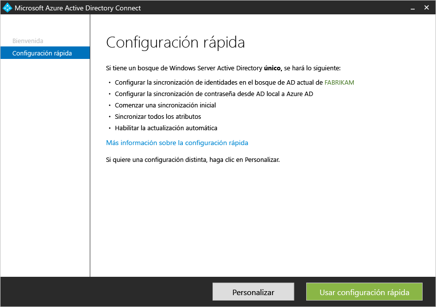
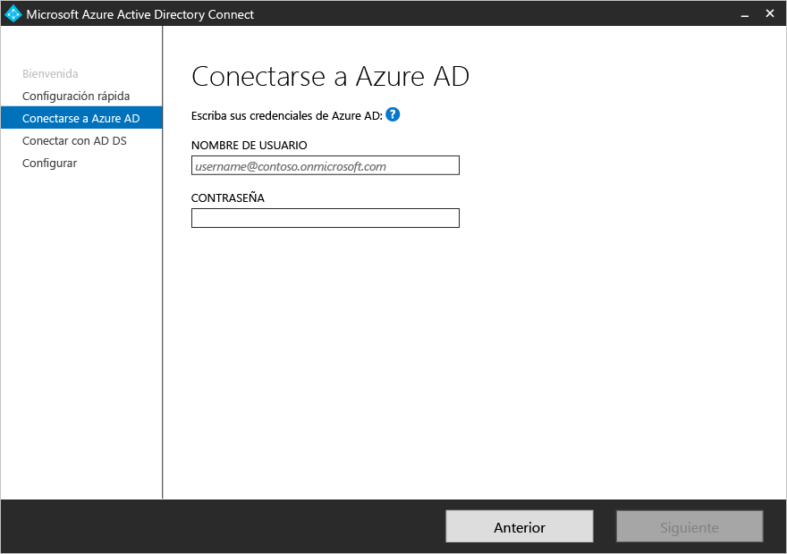
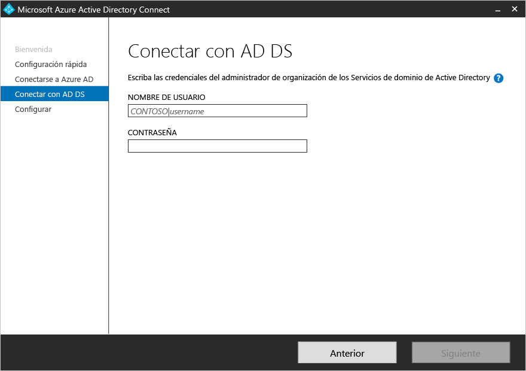
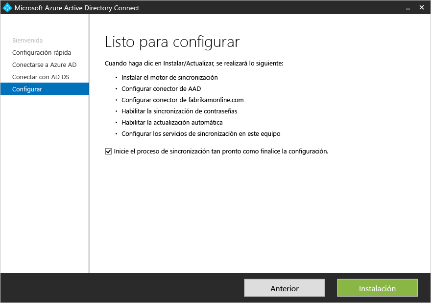

<properties
	pageTitle="Introducción a la configuración rápida de Azure AD Connect | Microsoft Azure"
	description="Obtenga información acerca de cómo descargar, instalar y ejecutar el asistente para instalación de Azure AD Connect."
	services="active-directory"
	documentationCenter=""
	authors="billmath"
	manager="stevenpo"
	editor="curtand"/>

<tags
	ms.service="active-directory"
	ms.workload="identity"
	ms.tgt_pltfrm="na"
	ms.devlang="na"
	ms.topic="get-started-article"
	ms.date="05/10/2016"
	ms.author="billmath;andkjell"/>

# Introducción a Azure AD Connect mediante la configuración rápida
Este tema le ayudará a empezar a trabajar con Azure Active Directory Connect. Esta documentación describe la instalación rápida de Azure AD Connect. La configuración rápida se utiliza en una topología de bosque único con sincronización de contraseñas. Ya solo le faltan uno cuantos clics para extender su directorio local a la nube.

## Documentación relacionada
Si no leyó la documentación que se encuentra en [Integración de las identidades locales con Azure Active Directory](active-directory-aadconnect.md), en la tabla siguiente se proporcionan vínculos a temas relacionados. Los dos primeros temas en negrita son necesarios antes de iniciar la instalación.

| Tema. | |
| --------- | --------- |
| **Descarga de Azure AD Connect** | [Descarga de Azure AD Connect](http://go.microsoft.com/fwlink/?LinkId=615771) |
| **Hardware y requisitos previos** | [Azure AD Connect: Hardware y requisitos previos](active-directory-aadconnect-prerequisites.md) |
| Instalación mediante configuración personalizada | [Instalación personalizada de Azure AD Connect](active-directory-aadconnect-get-started-custom.md) |
| Actualización desde DirSync | [Actualización desde la herramienta Sincronización de Azure AD (DirSync)](active-directory-aadconnect-dirsync-upgrade-get-started.md) |
| Después de la instalación | [Comprobación de la instalación y asignación de licencias ](active-directory-aadconnect-whats-next.md) |
| Cuentas usadas para la instalación | [Más información sobre permisos y cuentas de Azure AD Connect](active-directory-aadconnect-accounts-permissions.md) |

## Instalación rápida de Azure AD Connect
**Configuración rápida** es la opción predeterminada y se utiliza en los escenarios de implementación más comunes. Cuando se utiliza esta opción, Azure AD Connect implementa la sincronización para una topología de bosque único. Se habilita la [sincronización de contraseñas](active-directory-aadconnectsync-implement-password-synchronization.md), que permite a los usuarios utilizar su contraseña local para iniciar sesión en la nube. Asimismo, se habilita la [actualización automática](active-directory-aadconnect-feature-automatic-upgrade.md), por lo que se simplifican sus tareas de mantenimiento. Cuando se usa la configuración rápida se inicia una sincronización cuando finaliza la instalación (aunque puede decidir no realizar este paso).

### Para instalar Azure AD Connect mediante la configuración rápida

1. Inicie sesión como administrador local en el servidor en el que quiere instalar Azure AD Connect. Debe ser el servidor que quiere que sea el servidor de sincronización.
2. Vaya a **AzureADConnect.msi** y haga doble clic.
3. En la pantalla de bienvenida, active la casilla que acepta los términos de licencia y haga clic en **Continuar**. 
4. En la pantalla Configuración rápida, haga clic en **Usar configuración rápida**. 
5. En la pantalla Conectar a Azure AD, escriba el nombre de usuario y la contraseña de un administrador global de Azure AD. Haga clic en **Siguiente**.  Si recibe un error y tiene problemas de conectividad, consulte [Solución de problemas de conectividad con Azure AD Connect](active-directory-aadconnect-troubleshoot-connectivity.md).
6. En la pantalla Conectar a AD DS, escriba el nombre de usuario y la contraseña de una cuenta de administrador de empresa. Puede escribir la parte del dominio con el formato NetBios o FQDN, es decir, FABRIKAM\\administrator o fabrikam.com\\administrator. Haga clic en **Siguiente**. 
7. Esta página aparece si tiene dominios UPN registrados en su Active Directory local que no estén presentes o comprobados. Si todos los dominios UPN de su AD DS local se han comprobado, esta página no aparece.  Si ve esta página, revise los dominios marcados como **Not Added** (Sin agregar) y **Not Verified** (Sin comprobar). Asegúrese de que los que usa se han comprobado en Azure AD. Cuando haya comprobado los dominios, haga clic en el símbolo de actualización. Para más información, consulte las secciones correspondientes a [agregar y comprobar el dominio](active-directory-add-domain.md).
8. En la pantalla Listo para configurar, haga clic en **Instalar**.
	- En la página Listo para configurar también puede desactivar la casilla **Start the synchronization process as soon as configuration completes** (Iniciar el proceso de sincronización en cuanto finalice la configuración). Si quiere realizar alguna configuración adicional, por ejemplo, el [filtrado](active-directory-aadconnectsync-configure-filtering.md), desactive esta casilla. Si desactiva esta opción, el asistente configura la sincronización, pero deja el programador deshabilitado, y no se ejecutará hasta que lo habilite manualmente volviendo a ejecutar el Asistente para la instalación.
	- Como alternativa, también puede configurar los servicios de sincronización para la **implementación híbrida de Exchange** al activar la casilla correspondiente. Habilite esta opción si planea tener buzones de Exchange tanto en la nube como locales de manera simultánea. 
9. Una vez completada la instalación, haga clic en **Salir**.
10. Una vez completada la instalación, cierre la sesión e inicie de sesión de nuevo antes de utilizar Synchronization Service Manager o el Editor de reglas de sincronización.

Para ver un vídeo sobre el uso de la instalación rápida, consulte:

>[AZURE.VIDEO azure-active-directory-connect-express-settings]

## Pasos siguientes
Ahora que tiene instalado Azure AD Connect, puede [comprobar la instalación y asignar licencias](active-directory-aadconnect-whats-next.md).

Obtenga más información sobre la [Integración de las identidades locales con Azure Active Directory](active-directory-aadconnect.md).

<!---HONumber=AcomDC_0518_2016-->