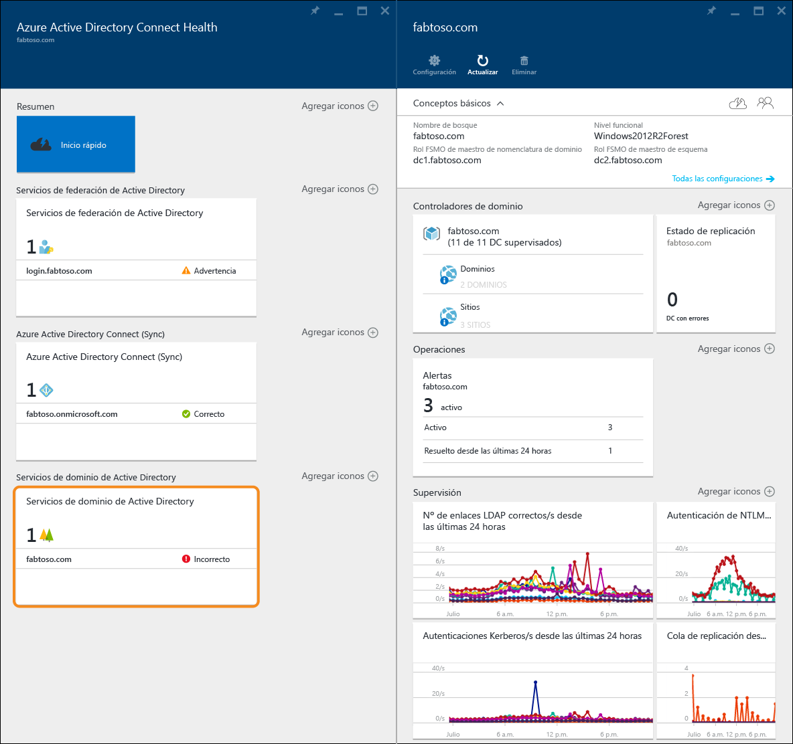
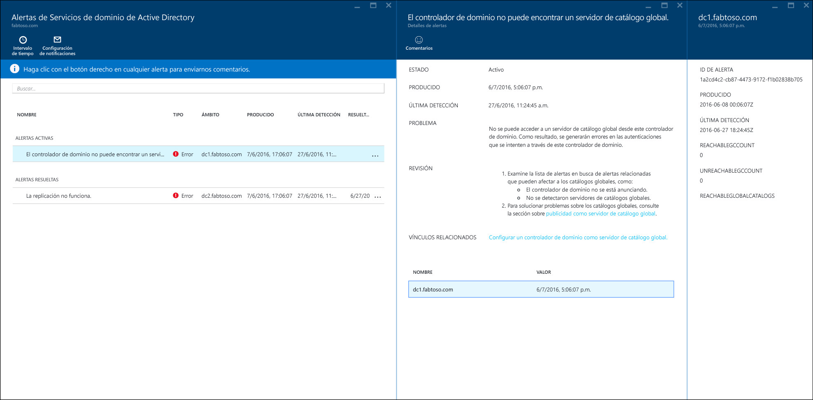
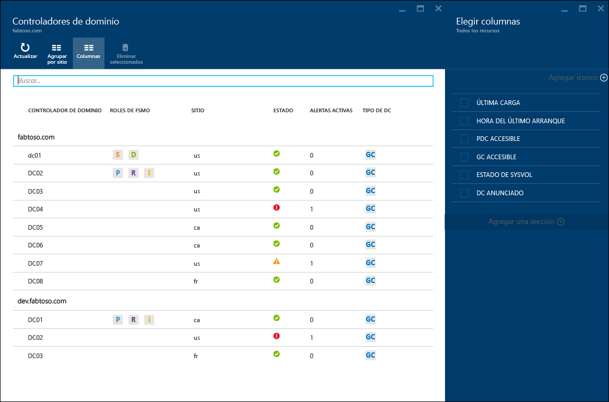
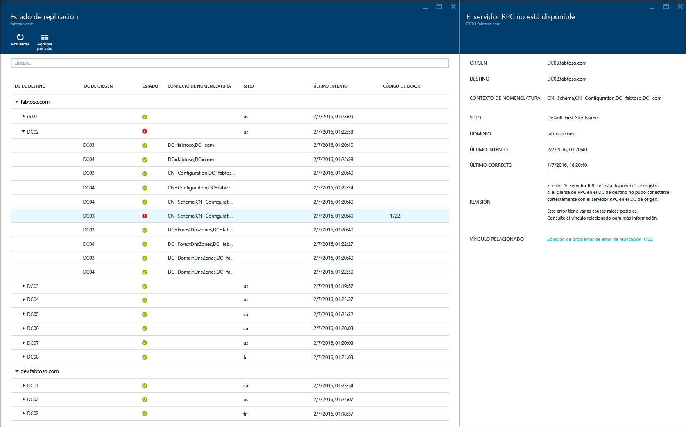
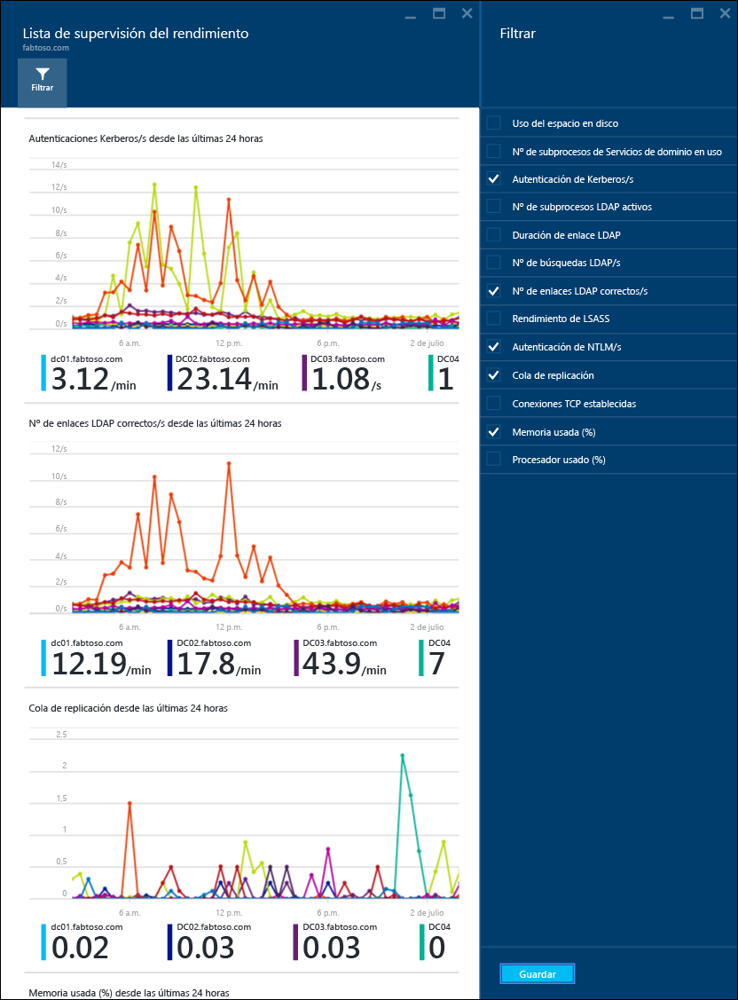

<properties
	pageTitle="Uso de Azure AD Connect Health con AD DS | Microsoft Azure"
	description="Esta es la página de Azure AD Connect Health donde se describe cómo supervisar la sincronización de AD DS."
	services="active-directory"
	documentationCenter=""
	authors="arluca"
	manager="samueld"
	editor="curtand"/>

<tags
	ms.service="active-directory"
	ms.workload="identity"
	ms.tgt_pltfrm="na"
	ms.devlang="na"
	ms.topic="get-started-article"
	ms.date="07/14/2016"
	ms.author="arluca"/>

# Uso de Azure AD Connect Health con AD DS
La siguiente documentación es específica de la supervisión de los Servicios de dominio de Active Directory con Azure AD Connect Health. Esto incluye instalar AD DS en Windows Server 2008 R2, Windows Server 2012 y Windows Server 2012 R2.

Para obtener información sobre la supervisión de AD FS con Azure AD Connect Health, consulte [Uso de Azure AD Connect Health con AD FS](active-directory-aadconnect-health-adfs.md). Para obtener información adicional sobre la supervisión de Azure AD Connect (Sync) con Azure AD Connect Health, consulte [Uso de Azure AD Connect Health para sincronización](active-directory-aadconnect-health-sync.md).

## Alertas de Azure AD Connect Health para AD DS
La sección Alertas de Azure AD Connect Health para AD DS, le proporciona una lista de alertas activas y resueltas relacionadas con los controladores de dominio. Si selecciona una alerta activa o resuelta se abrirá una nueva hoja con información adicional, junto con los pasos para su resolución y vínculos a documentación de soporte. Cada tipo de alerta puede tener una o más instancias que se corresponden con cada uno de los controladores de dominio afectados por esa alerta en concreto. En la parte inferior de la hoja de la alerta, puede seleccionar los controladores de dominio afectados y se abrirá una nueva hoja con detalles adicionales sobre esa instancia específica de alerta.

La opción para habilitar las notificaciones por correo electrónico para las alertas está disponible en esta hoja, así como la de cambiar el intervalo de tiempo en la vista. Si aumenta el intervalo de tiempo se le permitirá ver alertas resueltas anteriores.

## Controladores de dominio
Este panel proporciona una vista topológica del entorno, junto con métricas clave de funcionamiento y el estado de mantenimiento de cada uno de los controladores de dominio supervisados. Las métricas presentadas ayudan a identificar rápidamente los controladores de dominio que podrían requerir una mayor investigación. De forma predeterminada, se muestra solo un subconjunto de columnas. Sin embargo, si hace clic en el comando de columnas encontrará todo el conjunto de columnas disponibles. Poder seleccionar las columnas que más le interesan, convierte a este panel en un lugar único y sencillo para ver el estado del entorno de AD DS.

Los controladores de dominio se pueden agrupar según su respectivo dominio o sitio, lo cual resulta útil para entender la topología del entorno. Por último, si hace doble clic en el encabezado de la hoja, se maximizará el panel para utilizar el estado real disponible de la pantalla. Esto puede ser especialmente útil cuando se muestran varias columnas.

## Estado de replicación
Este panel proporciona una vista del estado y topología de la replicación de los controladores de dominio supervisados. Se muestra el estado del intento de replicación más reciente, junto con documentación útil para cualquier error encontrado. Si selecciona un controlador de dominio con un error se abrirá una nueva hoja con información adicional, junto con los pasos para su resolución y vínculos a documentación de solución de problemas.

## Supervisión
Esta característica proporciona tendencias gráficas de diferentes contadores de rendimiento que se recopilan continuamente desde cada uno de los controladores de dominio supervisados. El rendimiento de un controlador de dominio se puede comparar fácilmente en relación con todos los demás controladores de dominio supervisados del bosque. Además, puede ver varios contadores de rendimiento en paralelo, lo cual resulta útil al solucionar problemas en su entorno.

De forma predeterminada, hemos preseleccionado cuatro contadores de rendimiento. Sin embargo, puede incluir otros haciendo clic en el comando de filtros y seleccionando o anulando la selección de cualquier contador de rendimiento que desee. Además, si hace clic en un gráfico determinado del contador de rendimiento se abrirá una nueva hoja que incluye los puntos de datos correspondientes para cada uno de los controladores de dominio supervisados.

## Vínculos relacionados

* [Azure AD Connect Health](active-directory-aadconnect-health.md)
* [Instalación del agente de Azure AD Connect Health](active-directory-aadconnect-health-agent-install.md)
* [Operaciones de Azure AD Connect Health](active-directory-aadconnect-health-operations.md)
* [Uso de Azure AD Connect Health con AD FS](active-directory-aadconnect-health-adfs.md)
* [Uso de Azure AD Connect Health para sincronización](active-directory-aadconnect-health-sync.md)
* [Preguntas más frecuentes de Azure AD Connect Health](active-directory-aadconnect-health-faq.md)
* [Historial de versiones de Azure AD Connect Health](active-directory-aadconnect-health-version-history.md)

<!---HONumber=AcomDC_0720_2016-->