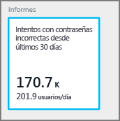
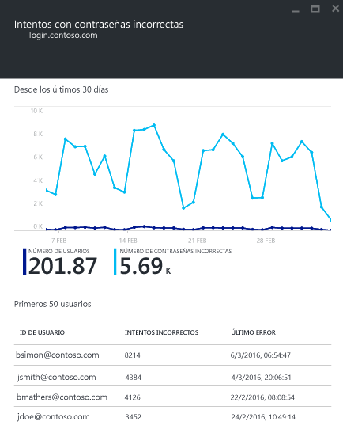

<properties
	pageTitle="Uso de Azure AD Connect Health con AD FS | Microsoft Azure"
	description="Esta es la página de Azure AD Connect Health sobre cómo supervisar la infraestructura de AD FS local."
	services="active-directory"
	documentationCenter=""
	authors="karavar"
	manager="femila"
	editor="karavar"/>

<tags
	ms.service="active-directory"
	ms.workload="identity"
	ms.tgt_pltfrm="na"
	ms.devlang="na"
	ms.topic="get-started-article"
	ms.date="07/14/2016"
	ms.author="vakarand"/>

# Uso de Azure AD Connect Health con AD FS
La siguiente documentación es específica de la supervisión de la infraestructura de AD FS con Azure AD Connect Health. Para más información sobre la supervisión de Azure AD Connect (Sync) con Azure AD Connect Health, consulte [Uso de Azure AD Connect Health para sincronización](active-directory-aadconnect-health-sync.md). Para obtener información adicional sobre la supervisión de los Servicios de dominio de Active Directory con Azure AD Connect Health, consulte [Using Azure AD Connect Health with AD DS](active-directory-aadconnect-health-adds.md) (Uso de Azure AD Connect Health con AD DS).

## Alertas de AD FS
La sección Alertas de Azure AD Connect Health proporciona la lista de alertas activas. Cada alerta incluye información pertinente, pasos de resolución y vínculos a documentación relacionada. Al seleccionar una alerta activa o una alerta resulta, verá una hoja nueva con información adicional, así como los pasos que puede seguir para resolver la alerta y vínculos a documentación adicional. También puede ver datos históricos sobre las alertas resueltas en el pasado.

Al seleccionar una alerta, recibirá información adicional, así como los pasos que puede seguir para resolver la alerta y vínculos a documentación adicional.

## Análisis de uso de AD FS
Análisis de uso de Azure AD Connect Health analiza el tráfico de autenticación de los servidores de federación. Al activar la casilla de análisis de uso se abrirá la hoja de análisis de uso, que le mostrará las métricas y las agrupaciones.

>[AZURE.NOTE] Para poder utilizar el análisis de uso con AD FS, debe asegurarse de que esté habilitada la auditoría de AD FS. Para obtener más información, consulte [Habilitación de la auditoría para AD FS](active-directory-aadconnect-health-agent-install.md#enable-auditing-for-ad-fs).

Para seleccionar otras métricas, especifique un intervalo de tiempo. Para cambiar la agrupación, simplemente haga clic con el botón derecho en el gráfico de análisis de uso y seleccione Editar gráfico. A continuación, puede especificar el intervalo de tiempo, cambiar o seleccionar métricas y cambiar la agrupación. Puede ver la distribución del tráfico de autenticación según diferentes "métricas" y agrupar cada métrica con los correspondientes parámetros "Agrupar por" que se describen a continuación

| Métrica | Agrupar por | ¿Qué significa la agrupación y por qué es útil? |
| ------ | -------- | -------------------------------------------- |
| Total de solicitudes: número total de solicitudes procesadas por el servicio de federación | Todo | Esta opción mostrará el recuento total de solicitudes sin agrupación. |
| | Application | Esta opción agrupará el número total de solicitudes en función del usuario de confianza de destino. Esta agrupación es útil para comprender qué aplicación está recibiendo tráfico y qué porcentaje del tráfico total recibe. |
| | Server | Esta opción agrupará el número total de solicitudes en el servidor que procesó la solicitud. Esta agrupación es útil para comprender la distribución de la carga de tráfico total. |
| | Unión al área de trabajo | Esta opción agrupará el número total de solicitudes en función de si las solicitudes proceden o no de dispositivos que están unidos al área de trabajo (conocidos). Esta agrupación es útil para comprender si el acceso a sus recursos se realiza con dispositivos que son desconocidos para la infraestructura de identidades. |
| | Método de autenticación | Esta opción agrupará el número total de solicitudes en función del método de autenticación utilizado para la autenticación. Esta agrupación es útil para comprender el método de autenticación común que se utiliza para la autenticación. A continuación, se indican los métodos de autenticación posibles <ol> <li>Autenticación integrada en Windows (Windows)</li> <li>Autenticación basada en formularios (formularios)</li> <li>SSO (inicio de sesión único)</li> <li>Autenticación de certificados X509 (certificado)</li>  Tenga en cuenta que una solicitud se considera como SSO (inicio de sesión único) si los servidores de federación reciben la solicitud con una cookie de SSO. En estos casos, si la cookie es válida, no se pide al usuario que proporcione credenciales y obtiene acceso a la aplicación sin problemas. Esto es habitual si tiene varios usuarios de confianza protegidos por los servidores de federación. |
| | Ubicación de red | Esta opción agrupará el número total de solicitudes en función de la ubicación de red del usuario. Puede ser intranet o extranet. Esta agrupación es útil para saber qué porcentaje del tráfico es de intranet y cuál de extranet. |
| Total de solicitudes con error: número total de solicitudes procesadas por el servicio de federación   (Esta métrica solo está disponible en AD FS para Windows Server 2012 R2)| Tipo de error | Se mostrará el número de errores en función de los tipos de error predefinidos. La agrupación es útil para comprender cuáles son los tipos de errores comunes. <ul><li>Nombre de usuario o contraseña incorrectos: errores por nombre de usuario o contraseña incorrectos.</li> <li>"Bloqueo de extranet": errores producidos cuando se reciben solicitudes de un usuario cuyo acceso a la extranet está bloqueado.</li><li> "Contraseña caducada": errores producidos cuando un usuario inicia sesión con una contraseña caducada.</li><li>"Cuenta deshabilitada": errores producidos cuando un usuario inicia sesión con una cuenta deshabilitada.</li><li>"Autenticación de dispositivos": errores producidos cuando un usuario no se puede autenticar mediante la Autenticación de dispositivos.</li><li>"Autenticación de certificado de usuario": errores producidos cuando un usuario no se puede autenticar porque el certificado no es válido.</li><li>"MFA": errores producidos cuando un usuario no se puede autenticar mediante Multi-Factor Authentication.</li><li>"Otra credencial": "Autorización de emisión": problemas producidos por errores de autorización.</li><li>"Delegación de emisión": problemas producidos por errores de delegación de emisión.</li><li>"Aceptación de tokens": errores producidos cuando ADFS rechaza el token de un proveedor de identidades de terceros.</li><li>"Protocolo": error producido por errores de protocolo.</li><li>"Desconocido": detectar todas. Otros errores que no encajan en las categorías definidas.</li> |
| | Server | Esta opción agrupará los errores en función del servidor. Esto es útil para comprender la distribución de errores entre servidores. Una distribución desigual podría indicar que un servidor presenta un estado defectuoso. |
| | Ubicación de red | Esta función agrupará los errores en función de la ubicación de red de las solicitudes (intranet frente a extranet). Esto es útil para comprender qué tipo de solicitud está fallando. |
| | Application | Esta opción agrupará los errores en función de la aplicación de destino (usuario de confianza). Esto es útil para comprender qué aplicación de destino está experimentado una mayor cantidad de errores. |
| Número de usuarios: número medio de usuarios únicos activos en el sistema | Todo | Esta opción proporciona un recuento del número medio de usuarios mediante el servicio de federación en el intervalo de tiempo seleccionado. Los usuarios no están agrupados.  El promedio dependerá del intervalo de tiempo seleccionado. |
| | Application | Esta opción agrupará el número medio de usuarios en función de la aplicación de destino (usuario de confianza). Esto es útil para comprender cuántos usuarios utilizan una aplicación y determinar qué aplicación. |

## Supervisión del rendimiento de AD FS
Supervisión de rendimiento de Azure AD Connect Health proporciona información de supervisión sobre métricas. Al activar la casilla Supervisión, se abrirá una hoja con información detallada sobre las métricas.

Al seleccionar la opción Filtro en la parte superior de la hoja, puede filtrar por servidor para ver las métricas de un servidor individual. Para cambiar las métricas, simplemente haga clic con el botón derecho en el diagrama de supervisión bajo la hoja de supervisión y seleccione Editar gráfico. A continuación, desde la nueva hoja que se abre, puede seleccionar métricas adicionales en la lista desplegable y especificar un intervalo de tiempo para la visualización de los datos de rendimiento.

## Informes de AD FS
Azure AD Connect Health proporciona informes sobre la actividad y el rendimiento de AD FS. Estos informes ayudan a los administradores a comprender mejor las actividades en sus servidores de AD FS.

### Primeros 50 usuarios con errores de inicio de sesión por nombre de usuario y contraseña no válidos

Una de las causas comunes de los errores de solicitud de autenticación en un servidor de AD FS es una solicitud con credenciales no válidas, es decir, un nombre de usuario o una contraseña incorrectos. Normalmente esto se produce por errores tipográficos, contraseñas olvidadas o contraseñas complejas.

Pero hay otros motivos que pueden provocar que los servidores de AD FS tengan que procesar una cantidad inesperada de estas solicitudes. Entre ellos, una aplicación que almacena en caché las credenciales de usuario y las credenciales expiran, o un usuario malintencionado que intenta iniciar sesión en una cuenta de usuario con una serie de contraseñas conocidas.

Azure AD Connect Health para ADFS proporciona un informe con los primeros 50 usuarios con errores de intento de inicio de sesión por nombre de usuario o una contraseña no válidos. Para ello, se procesan los eventos de auditoría generados por todos los servidores de AD FS en las granjas de servidores.

En este informe, tiene un acceso sencillo a los elementos de información siguientes:

- Nº total de solicitudes con error por nombre de usuario o contraseña incorrectos en los últimos 30 días
- Número promedio diario de usuarios con error de inicio de sesión por nombre de usuario o contraseña incorrectos.

Al hacer clic en esta parte, se abre la hoja del informe principal que proporciona información adicional, que incluye un gráfico que proporciona información sobre tendencias para establecer una línea base de las solicitudes con nombre de usuario o contraseña incorrectos, y la lista de los primeros 50 usuarios con el número de intentos con error.

El gráfico ofrece la siguiente información:

- El número total diario de inicios de sesión erróneos debido a un nombre de usuario o una contraseña incorrectos.
- El número total diario de usuarios únicos con errores de inicio de sesión.

El informe proporciona la siguiente información:

| Elemento de informe | Description
| ------ | -------- |
|Id. de usuario| Muestra el identificador de usuario que se usó. Tenga en cuenta que el valor es lo que el usuario escribió y, en algunos casos, también verá el identificador de usuario incorrecto que se va a usar.|
|Intentos con error|Muestra el número total de intentos con error para ese identificador de usuario específico. La tabla está ordenada por el mayor número de intentos con error en orden descendente.|
|Último error|Muestra la marca de tiempo del momento en que se produjo el último error.

>[AZURE.NOTE] Este informe se actualiza automáticamente cada 2 horas con la información recopilada durante este período. Como resultado, puede que el informe no incluya los intentos de inicio de sesión de las últimas dos horas.

## Vínculos relacionados

* [Azure AD Connect Health](active-directory-aadconnect-health.md)
* [Instalación del agente de Azure AD Connect Health](active-directory-aadconnect-health-agent-install.md)
* [Operaciones de Azure AD Connect Health](active-directory-aadconnect-health-operations.md)
* [Uso de Azure AD Connect Health para sincronización](active-directory-aadconnect-health-sync.md)
* [Uso de Azure AD Connect Health con AD DS](active-directory-aadconnect-health-adds.md)
* [Preguntas más frecuentes de Azure AD Connect Health](active-directory-aadconnect-health-faq.md)
* [Historial de versiones de Azure AD Connect Health](active-directory-aadconnect-health-version-history.md)

<!---HONumber=AcomDC_0928_2016-->