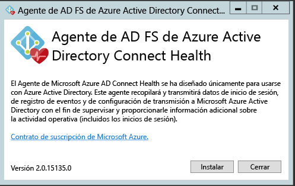
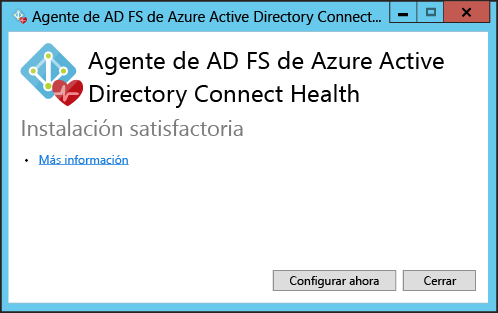
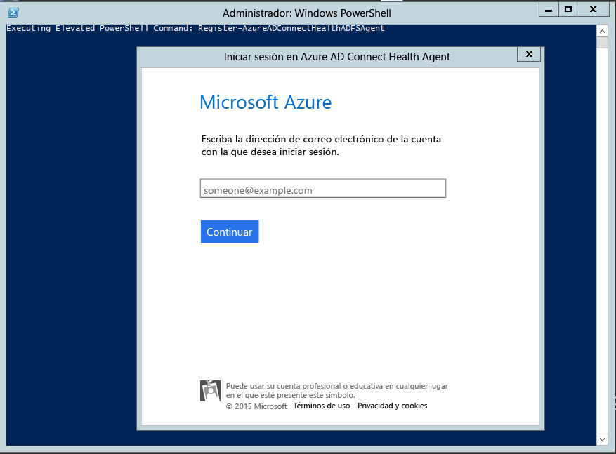

<properties 
	pageTitle="Instalación del agente de Azure AD Connect Health para AD FS | Microsoft Azure"
	description="Esta es la página de Azure AD Connect Health que describe la instalación del agente de Servicios de federación de Active Directory (AD FS)."
	services="active-directory"
	documentationCenter=""
	authors="billmath"
	manager="stevenpo"
	editor="curtand"/>

<tags 
	ms.service="active-directory"
	ms.workload="identity"
	ms.tgt_pltfrm="na"
	ms.devlang="na"
	ms.topic="article"
	ms.date="08/14/2015"
	ms.author="billmath"/>

# Instalación del agente de Azure AD Connect Health para AD FS

Este documento le guiará en la instalación y configuración del agente de Azure AD Connect Health para AD FS en los servidores.

>[AZURE.NOTE]Recuerde que para ver los datos de la instancia de Azure AD Connect Health, deberá instalar el agente de Azure AD Connect Health en los servidores de destino. Asegúrese de completar los requisitos que se describen [aquí](active-directory-aadconnect-health.md#requirements) antes de instalar el agente. Puede descargar el agente [aquí](http://go.microsoft.com/fwlink/?LinkID=518973).

## Instalación del agente
Para iniciar la instalación del agente, haga doble clic en el archivo .exe que descargó. En la primera pantalla, haga clic en Instalar.

Una vez que finalice la instalación, haga clic en Configurar ahora.

Con esto se iniciará un símbolo del sistema seguido de una instancia de PowerShell que ejecutará Register-AzureADConnectHealthADFSAgent. Se le pedirá que inicie sesión en Azure. Continúe e inicie sesión.

Después de iniciar sesión, PowerShell continuará. Una vez que termine, puede cerrar PowerShell y la configuración estará completa.

En este punto, los servicios se iniciarán automáticamente y el agente supervisará y recopilará datos. Tenga en cuenta que si no ha cumplido todos los requisitos previos descritos en las secciones anteriores, verá advertencias en la ventana de PowerShell. Asegúrese de completar los requisitos que se describen [aquí](active-directory-aadconnect-health.md#requirements) antes de instalar el agente. La captura de pantalla siguiente es un ejemplo de estos errores.

Para comprobar que se instaló el agente, abra los servicios y busque lo siguiente. Si completó la configuración, estos servicios deben aparecer en ejecución. De lo contrario, no se iniciarán hasta que se complete la configuración.

- Servicio de diagnóstico de AD FS de Azure AD Connect Health
- Servicio de análisis de AD FS de Azure AD Connect Health
- Servicio de supervisión de AD FS de Azure AD Connect Health
 

## Instalación del agente en servidores de Windows Server 2008 R2

En el caso de los servidores de Windows Server 2008 R2, haga lo siguiente:

1. Asegúrese de que se esté ejecutando el Service Pack 1 o posterior del servidor.
1. Desactive ESC de Internet Explorer para la instalación del agente:
1. Instale Windows PowerShell 4.0 en cada uno de los servidores antes de instalar el agente de AD Health. Para instalar Windows PowerShell 4.0:
 - Instale [Microsoft .NET Framework 4.5](https://www.microsoft.com/download/details.aspx?id=40779) mediante el vínculo siguiente para descargar el instalador sin conexión.
 - Instale PowerShell ISE (desde Características de Windows)
 - Instale [Windows Management Framework 4.0.](https://www.microsoft.com/download/details.aspx?id=40855)
 - Instale Internet Explorer versión 10 o posterior en el servidor. Esto es necesario para que el servicio de mantenimiento autentique su identidad con las credenciales de administrador de Azure.
1. Para obtener información adicional acerca de cómo instalar Windows PowerShell 4.0 en Windows Server 2008 R2, consulte el artículo wiki [aquí](http://social.technet.microsoft.com/wiki/contents/articles/20623.step-by-step-upgrading-the-powershell-version-4-on-2008-r2.aspx).

## Vínculos relacionados

* [Azure AD Connect Health](active-directory-aadconnect-health.md)
* [Operaciones de Azure AD Connect Health](active-directory-aadconnect-health-operations.md)
* [Uso de Azure AD Connect Health con AD FS](active-directory-aadconnect-health-adfs.md)
* [Preguntas más frecuentes de Azure AD Connect Health](active-directory-aadconnect-health-faq.md)

<!---HONumber=August15_HO9-->