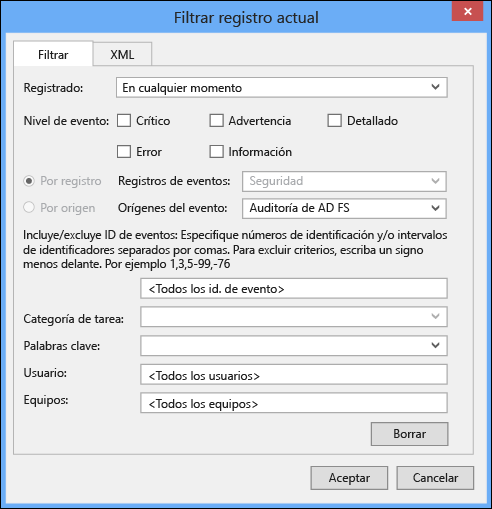
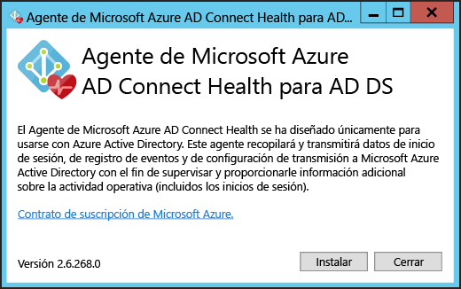
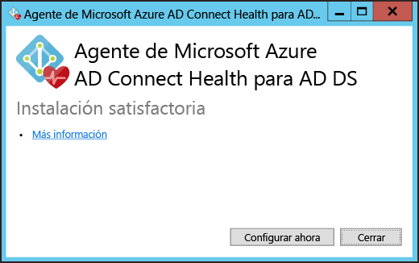
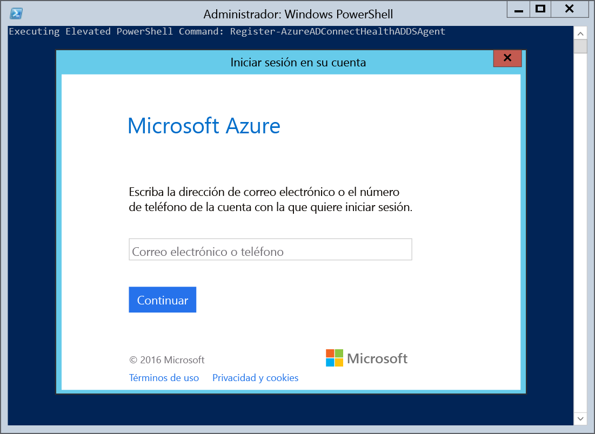
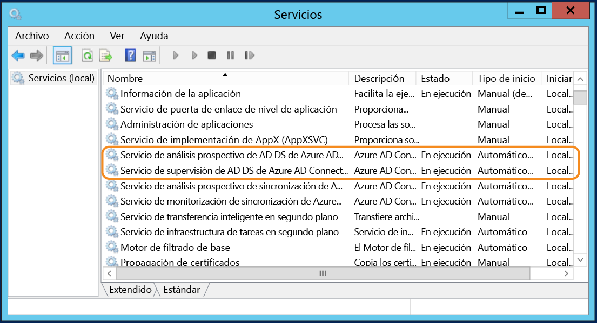

<properties
	pageTitle="Instalación del agente de Azure AD Connect Health | Microsoft Azure"
	description="Página de Azure AD Connect Health que describe la instalación del agente para AD FS y sincronización."
	services="active-directory"
	documentationCenter=""
	authors="karavar"
	manager="stevenpo"
	editor="karavar"/>

<tags
	ms.service="active-directory"
	ms.workload="identity"
	ms.tgt_pltfrm="na"
	ms.devlang="na"
	ms.topic="get-started-article"
	ms.date="07/14/2016"
	ms.author="vakarand"/>

# Instalación del agente de Azure AD Connect Health

Este documento le guiará en la instalación y configuración de los agentes de Azure AD Connect Health. Puede descargar los agentes [aquí](active-directory-aadconnect-health.md#download-and-install-azure-ad-connect-health-agent).

## 	Requisitos
En la tabla siguiente hay una lista de requisitos para utilizar Azure AD Connect Health.

| Requisito | Descripción|
| ----------- | ---------- |
|Azure AD Premium| Azure AD Connect Health es una característica de Azure AD Premium y, por tanto, requiere Azure AD Premium.   Para más información, consulte [Introducción a Azure Active Directory Premium](active-directory-get-started-premium.md). Para iniciar una evaluación gratuita de 30 días, consulte [Iniciar una evaluación](https://azure.microsoft.com/trial/get-started-active-directory/).|
|Debe ser un administrador global de su entorno de Azure AD para empezar a trabajar con Azure AD Connect Health|De forma predeterminada, solo los administradores globales pueden instalar y configurar los agentes de mantenimiento para empezar, acceder al portal y realizar operaciones en Azure AD Connect Health. Para obtener información adicional, consulte [Administración de su directorio de Azure AD](active-directory-administer.md).    El uso de control de acceso basado en rol puede permitir que otros usuarios de la organización accedan a Azure AD Connect Health. Para más información, consulte [Control de acceso basado en rol para Azure AD Connect Health](active-directory-aadconnect-health-operations.md#manage-access-with-role-based-access-control).   **Importante:** la cuenta que utilice al instalar los agentes debe ser una cuenta profesional o educativa y no puede ser una cuenta de Microsoft. Para obtener más información, consulte [Inicio de sesión en Azure como una organización](sign-up-organization.md).
|El agente de Azure AD Connect Health está instalado en cada servidor de destino| Azure AD Connect Health requiere que haya un agente instalado en los servidores de destino para proporcionar los datos que se ven en el portal.   Por ejemplo, para obtener datos sobre su infraestructura local de AD FS, el agente se debe instalar en los servidores de AD FS, en los servidores proxy de AD FS y en los servidores proxy de aplicación web. De igual manera, para obtener datos sobre su infraestructura local de AD DS, el agente se debe instalar en los controladores de dominio.   **Importante:** la cuenta que utilice al instalar los agentes debe ser una cuenta profesional o educativa y no puede ser una cuenta de Microsoft. Para obtener más información, consulte [Inicio de sesión en Azure como una organización](sign-up-organization.md).|
|Conectividad saliente a los extremos del servicio de Azure|Durante la instalación y el tiempo de ejecución, el agente requiere conectividad a los extremos del servicio de Azure AD Connect Health que se enumeran a continuación. Si bloquea la conectividad saliente, asegúrese de agregar lo siguiente a la lista de elementos permitidos:   <li>&#42;.blob.core.windows.net </li><li>&#42;.queue.core.windows.net</li><li>adhsprodwus.servicebus.windows.net - Port: 5671 </li><li>https://management.azure.com </li><li>https://s1.adhybridhealth.azure.com/</li><li>https://policykeyservice.dc.ad.msft.net/</li><li>https://login.windows.net</li><li>https://login.microsoftonline.com</li><li>https://secure.aadcdn.microsoftonline-p.com</li> |
|Puertos de Firewall en el servidor que ejecuta al agente.| El agente requiere que los siguientes puertos de firewall estén abiertos para poder comunicarse con los puntos de conexión de Azure AD Health.  <li>Puerto 443 de TCP/UDP</li><li>Puerto 5671 de TCP/UDP</li>
|Permitir los siguientes sitios web si la seguridad mejorada de IE está habilitada|Los siguientes sitios web se deben permitir si está habilitada la seguridad mejorada de Internet Explorer en el servidor en el que estará instalado el agente.  <li>https://login.microsoftonline.com</li><li>https://secure.aadcdn.microsoftonline-p.com</li><li>https://login.windows.net</li><li>El servidor de federación de su organización en el que confía Azure Active Directory. Por ejemplo: https://sts.contoso.com</li>

## Instalación del agente de Azure AD Connect Health para AD FS
Para iniciar la instalación del agente, haga doble clic en el archivo .exe que descargó. En la primera pantalla, haga clic en Instalar.

Una vez que finalice la instalación, haga clic en Configurar ahora.

Con esto se iniciará un símbolo del sistema seguido de una instancia de PowerShell que ejecutará Register-AzureADConnectHealthADFSAgent. Se le pedirá que inicie sesión en Azure. Continúe e inicie sesión.

Después de iniciar sesión, PowerShell continuará. Una vez que termine, puede cerrar PowerShell y la configuración estará completa.

En este punto, los servicios se iniciarán automáticamente y el agente supervisará y recopilará datos. Tenga en cuenta que si no ha cumplido todos los requisitos previos descritos en las secciones anteriores, verá advertencias en la ventana de PowerShell. Asegúrese de completar los requisitos que se describen [aquí](active-directory-aadconnect-health-agent-install.md#requirements) antes de instalar el agente. La captura de pantalla siguiente es un ejemplo de estos errores.

Para comprobar que se instaló el agente, abra los servicios y busque lo siguiente. Si completó la configuración, estos servicios deben aparecer en ejecución. De lo contrario, no se iniciarán hasta que se complete la configuración.

- Servicio de diagnóstico de AD FS de Azure AD Connect Health
- Servicio de análisis de AD FS de Azure AD Connect Health
- Servicio de supervisión de AD FS de Azure AD Connect Health

### Instalación del agente en servidores de Windows Server 2008 R2

En el caso de los servidores de Windows Server 2008 R2, haga lo siguiente:

1. Asegúrese de que se esté ejecutando el Service Pack 1 o posterior del servidor.
1. Desactive ESC de Internet Explorer para la instalación del agente:
1. Instale Windows PowerShell 4.0 en cada uno de los servidores antes de instalar el agente de AD Health. Para instalar Windows PowerShell 4.0:
 - Instale [Microsoft .NET Framework 4.5](https://www.microsoft.com/download/details.aspx?id=40779) mediante el vínculo siguiente para descargar el instalador sin conexión.
 - Instale PowerShell ISE (desde Características de Windows)
 - Instale [Windows Management Framework 4.0.](https://www.microsoft.com/download/details.aspx?id=40855)
 - Instale Internet Explorer versión 10 o posterior en el servidor. Esto es necesario para que el servicio de mantenimiento autentique su identidad con las credenciales de administrador de Azure.
1. Para obtener información adicional acerca de cómo instalar Windows PowerShell 4.0 en Windows Server 2008 R2, consulte el artículo wiki [aquí](http://social.technet.microsoft.com/wiki/contents/articles/20623.step-by-step-upgrading-the-powershell-version-4-on-2008-r2.aspx).

### Habilitación de la auditoría de AD FS

Para que la característica Análisis de uso pueda recopilar y analizar datos, el agente de Azure AD Connect Health necesita la información de los registros de auditoría de AD FS. que no están habilitados de forma predeterminada. Esto solo se aplica a los servidores de federación de AD FS. No es necesario habilitar la auditoría en los servidores proxy de AD FS o de aplicación web. Use los procedimientos siguientes para habilitar la auditoría de AD FS y localizar los registros de auditoría de AD FS obtenidos.

#### Para habilitar la auditoría de AD FS 2.0

1. Haga clic en **Inicio**, seleccione **Programas**, **Herramientas administrativas** y luego haga clic en **Directiva de seguridad local**.
2. Navegue hasta la carpeta **Configuración de seguridad\\Directivas locales\\Administración de derechos de usuario** y haga doble clic en Generar auditorías de seguridad.
3. En la pestaña **Configuración de seguridad local**, compruebe que aparezca la cuenta de servicio de AD FS 2.0. Si no aparece, haga clic en **Agregar usuario o grupo**, agréguela a la lista y luego haga clic en **Aceptar**.
4. Abra un símbolo del sistema con privilegios elevados y ejecute el siguiente comando para habilitar la auditoría.<code>auditpol.exe /set /subcategory:"Application Generated" /failure:enable /success:enable</code>
5. Cierre Directiva de seguridad local y luego abra el complemento de administración. Para abrir el complemento de administración, haga clic en **Inicio**, seleccione **Programas**, **Herramientas administrativas** y luego haga clic en Administración de AD FS 2.0.
6. En el panel Acciones, haga clic en Editar propiedades del servicio de federación.
7. En el cuadro de diálogo **Propiedades del servicio de federación**, haga clic en la pestaña **Eventos**.
8. Active las casillas **Auditorías de aciertos** y **Auditorías de errores**.
9. Haga clic en **Aceptar**.

#### Para habilitar la auditoría de AD FS en Windows Server 2012 R2

1. Abra **Directiva de seguridad local**; para ello, abra **Administrador del servidor** en la pantalla Inicio o Administrador del servicio en la barra de tareas del escritorio y luego haga clic en **Herramientas/Directiva de seguridad local**.
2. Navegue hasta la carpeta **Configuración de seguridad\\Directivas locales\\Asignación de derechos de usuario** y haga doble clic en **Generar auditorías de seguridad**.
3. En la pestaña **Configuración de seguridad local**, compruebe que aparezca la cuenta de servicio de AD FS. Si no aparece, haga clic en **Agregar usuario o grupo**, agréguela a la lista y luego haga clic en **Aceptar**.
4. Abra un símbolo del sistema con privilegios elevados y ejecute el siguiente comando para habilitar la auditoría:<code>auditpol.exe /set /subcategory:"Application Generated" /failure:enable /success:enable.</code>
5. Cierre **Directiva de seguridad local** y luego abra el complemento **Administración de AD FS** (en Administrador del servidor, haga clic en Herramientas y luego seleccione Administración de AD FS).
6. En el panel Acciones, haga clic en **Editar propiedades del servicio de federación**.
7. En el cuadro de diálogo Propiedades del servicio de federación, haga clic en la pestaña **Eventos**.
8. Active las casillas **Auditorías de aciertos y Auditorías de errores** y luego haga clic en **Aceptar**.

#### Para buscar los registros de auditoría de AD FS

1. Abra **Visor de eventos**.
2. Vaya a Registros de Windows y seleccione **Seguridad**.
3. A la derecha, haga clic en **Filtrar registros actuales**.
4. En Origen de evento, seleccione **Auditoría de AD FS**.

> [AZURE.WARNING] Si tiene una directiva de grupo que deshabilita la auditoría de AD FS, el agente de Azure AD Connect Health no podrá recopilar información. Asegúrese de no tener ninguna directiva de grupo de este tipo.

[//]: # "Inicio de la sección de configuración del proxy del agente"

## Instalación del agente de Azure AD Connect Health para sincronización
El agente de Azure AD Connect Health para sincronización se instala automáticamente en la última compilación de Azure AD Connect. Para usar Azure AD Connect para sincronización, tendrá que descargar la versión más reciente de Azure AD Connect e instalarla. Puede descargar la versión más reciente [aquí](http://www.microsoft.com/download/details.aspx?id=47594).

Para comprobar que se instaló el agente, abra los servicios y busque lo siguiente. Si completó la configuración, estos servicios deben aparecer en ejecución. De lo contrario, no se iniciarán hasta que se complete la configuración.

- Servicio de análisis de sincronización de Azure AD Connect Health
- Servicio de supervisión de sincronización de Azure AD Connect Health

> [AZURE.NOTE] Recuerde que el uso de Azure AD Connect Health requiere Azure AD Premium. Si no tiene Azure AD Premium no podrá completar la configuración en el portal de Azure. Para obtener más información, consulte los requisitos [aquí](active-directory-aadconnect-health-agent-install.md#requirements).

## Registro manual de Azure AD Connect Health para sincronización
Si se produce un error del agente de registro de Azure AD Connect Health para sincronización después de instalar correctamente Azure AD Connect, puede usar el siguiente comando de PowerShell para registrar el agente manualmente.

>[AZURE.IMPORTANT] El uso de este comando de PowerShell solo es necesario si se produce un error en el registro del agente después de instalar Azure AD Connect.

El siguiente comando de PowerShell solo es necesario cuando se produce un error en el registro del agente de mantenimiento incluso después de una correcta instalación y configuración de Azure AD Connect. En tales casos, los servicios de Azure AD Connect Health no se iniciarán hasta que el agente se registre correctamente.

Puede registrar manualmente el agente de Azure AD Connect Health para sincronización con el siguiente comando de PowerShell:

`Register-AzureADConnectHealthSyncAgent -AttributeFiltering $false -StagingMode $false`

El comando toma los siguientes parámetros:

- AttributeFiltering: $true (predeterminado) si Azure AD Connect no está sincronizando el conjunto de atributos predeterminado y se ha personalizado para usar un conjunto de atributos filtrados. $false en caso contrario.
- StagingMode: $false (predeterminado) si el servidor de Azure AD Connect no está en modo de almacenamiento provisional; $true si el servidor está configurado en modo de almacenamiento provisional.

Cuando se le solicite autenticación, debe usar la misma cuenta de administrador global (como admin@domain.onmicrosoft.com) que se usó para configurar Azure AD Connect.

## Instalación del agente de Azure AD Connect Health para AD DS
Para iniciar la instalación del agente, haga doble clic en el archivo .exe que descargó. En la primera pantalla, haga clic en Instalar.

Una vez que finalice la instalación, haga clic en Configurar ahora.

Con esto se iniciará un símbolo del sistema seguido de una instancia de PowerShell que ejecutará Register-AzureADConnectHealthADDSAgent. Se le pedirá que inicie sesión en Azure. Continúe e inicie sesión.

Después de iniciar sesión, PowerShell continuará. Una vez que termine, puede cerrar PowerShell y la configuración estará completa.

En este punto, los servicios se iniciarán automáticamente y el agente supervisará y recopilará datos. La captura de pantalla siguiente es un ejemplo del resultado. Tenga en cuenta que si no ha cumplido todos los requisitos previos descritos en las secciones anteriores, verá advertencias en la ventana de PowerShell. Asegúrese de completar los requisitos que se describen [aquí](active-directory-aadconnect-health-agent-install.md#requirements) antes de instalar el agente.

Para comprobar que se instaló el agente, abra los servicios y busque lo siguiente:

- Servicio de análisis de AD DS de Azure AD Connect Health
- Servicio de supervisión de AD DS de Azure AD Connect Health

Estos dos servicios no se iniciarán hasta que se complete la configuración.

## Configuración de agentes de Azure AD Connect Health para usar el proxy HTTP
Puede configurar agentes de Azure AD Connect Health para trabajar con un proxy HTTP

>[AZURE.NOTE]
- El uso de “Netsh WinHttp set ProxyServerAddress” no funcionará, ya que el agente utiliza System.Net para realizar solicitudes web en lugar de los servicios HTTP de Microsoft Windows.
- Se utilizará la dirección del proxy HTTP configurada para transmitir mensajes HTTPS cifrados.
- No se admiten los servidores proxy autenticados (mediante HTTPBasic).

### Cambio de configuración del proxy del agente de estado
Tiene las siguientes opciones para configurar el agente de Azure AD Connect Health para utilizar a un proxy HTTP.

>[AZURE.NOTE] Debe reiniciar todos los servicios del agente de Azure AD Connect Health para la configuración de proxy. Ejecute el siguiente comando:  Restart-Service AdHealth*

#### Importación de configuración de proxy existente

##### Importación desde Internet Explorer.
Puede importar la configuración del proxy HTTP de Internet Explorer y usarla para agentes de Azure AD Connect Health ejecutando el siguiente comando de PowerShell en cada servidor en el que se ejecute el agente de estado.

	Set-AzureAdConnectHealthProxySettings -ImportFromInternetSettings

##### Importación desde WinHTTP
Puede importar la configuración del proxy WinHTTP ejecutando el siguiente comando de PowerShell en cada servidor en el que se ejecute el agente de estado.

	Set-AzureAdConnectHealthProxySettings -ImportFromWinHttp

#### Especificación manual de direcciones de proxy
Puede especificar un servidor proxy manualmente ejecutando el siguiente comando de PowerShell en cada servidor en el que se ejecute el agente de estado.

	Set-AzureAdConnectHealthProxySettings -HttpsProxyAddress address:port

Ejemplo: *Set-AzureAdConnectHealthProxySettings -HttpsProxyAddress myservidorproxy:443*

- "address" puede ser un nombre de servidor resoluble DNS o una dirección IPv4
- "port" se puede omitir. Si se omite, se elige 443 como puerto predeterminado.

#### Borrado de la configuración de proxy existente
Puede borrar la configuración de proxy existente ejecutando el comando siguiente.

	Set-AzureAdConnectHealthProxySettings -NoProxy

### Lectura de la configuración de proxy actual
Puede utilizar el comando siguiente para leer la configuración de proxy definida actualmente.

	Get-AzureAdConnectHealthProxySettings

## Prueba de la conectividad al servicio Azure AD Connect Health
Pueden surgir problemas que hagan que el agente de Azure AD Connect Health pierda la conectividad con el servicio Azure AD Connect Health, por ejemplo, problemas de red, problemas de permisos o de otro tipo.

Si el agente no puede enviar datos al servicio Azure AD Connect Health durante más de dos horas, verá una alerta que indica "Los datos del servicio de mantenimiento no están actualizados". Si esto sucede, ahora puede comprobar si los agentes de Azure AD Connect Health pueden o no cargar datos en el servicio Azure AD Connect Health mediante la ejecución del siguiente comando de PowerShell desde la máquina cuyo agente experimenta el problema.

    Test-AzureADConnectHealthConnectivity -Role Adfs

El parámetro de rol tiene actualmente los siguientes valores:

- ADFS
- Sync
- ADDS

Puede utilizar la marca - ShowResults en el comando para ver los registros detallados. Utilice el ejemplo siguiente:

    Test-AzureADConnectHealthConnectivity -Role Sync -ShowResult

>[AZURE.NOTE]Para poder utilizar la herramienta de conectividad, primero debe completar el registro del agente. Si no puede completar el registro del agente, asegúrese de que cumple todos los [requisitos](active-directory-aadconnect-health-agent-install.md#requirements) para Azure AD Connect Health. Esta prueba de conectividad se realiza de forma predeterminada durante el registro del agente.

## Vínculos relacionados

* [Azure AD Connect Health](active-directory-aadconnect-health.md)
* [Operaciones de Azure AD Connect Health](active-directory-aadconnect-health-operations.md)
* [Uso de Azure AD Connect Health con AD FS](active-directory-aadconnect-health-adfs.md)
* [Uso de Azure AD Connect Health para sincronización](active-directory-aadconnect-health-sync.md)
* [Uso de Azure AD Connect Health con AD DS](active-directory-aadconnect-health-adds.md)
* [Preguntas más frecuentes de Azure AD Connect Health](active-directory-aadconnect-health-faq.md)
* [Historial de versiones de Azure AD Connect Health](active-directory-aadconnect-health-version-history.md)

<!---HONumber=AcomDC_0720_2016-->