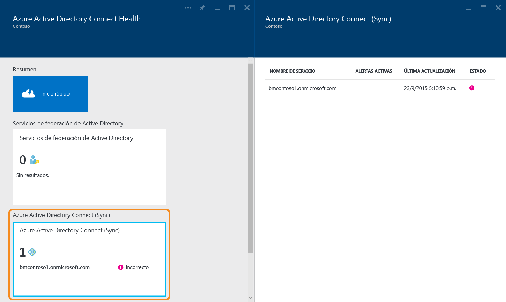

<properties 
	pageTitle="Uso de Azure AD Connect Health con sincronización | Microsoft Azure" 
	description="Esta es la página de Azure AD Connect Health donde se describe cómo supervisar la sincronización de Azure AD Connect." 
	services="active-directory" 
	documentationCenter="" 
	authors="billmath" 
	manager="stevenpo" 
	editor="curtand"/>

<tags 
	ms.service="active-directory" 
	ms.workload="identity" 
	ms.tgt_pltfrm="na" 
	ms.devlang="na" 
	ms.topic="get-started-article" 
	ms.date="09/25/2015" 
	ms.author="billmath"/>

# Uso de Azure AD Connect Health para sincronización
La siguiente documentación es específica de la supervisión de sincronización de Azure AD Connect con Azure AD Connect Health. Para obtener información sobre la supervisión de AD FS con Azure AD Connect Health, consulte [Uso de Azure AD Connect Health con AD FS](active-directory-aadconnect-health-adfs.md).

## Alertas de Azure AD Connect Health para sincronización
La sección Alertas de Azure AD Connect Health para sincronización proporciona la lista de alertas activas. Cada alerta incluye información pertinente, pasos de resolución y vínculos a documentación relacionada. Al seleccionar una alerta activa o una alerta resulta, verá una hoja nueva con información adicional, así como los pasos que puede seguir para resolver la alerta y vínculos a documentación adicional. También puede ver datos históricos sobre las alertas resueltas en el pasado.

Al seleccionar una alerta, recibirá información adicional, así como los pasos que puede seguir para resolver la alerta y vínculos a documentación adicional.

## Vínculos relacionados

* [Azure AD Connect Health](active-directory-aadconnect-health.md)
* [Instalación del agente de Azure AD Connect Health](active-directory-aadconnect-health-install.md)
* [Operaciones de Azure AD Connect Health](active-directory-aadconnect-health-operations.md)
* [Uso de Azure AD Connect Health con AD FS](active-directory-aadconnect-health-adfs.md)
* [Preguntas más frecuentes de Azure AD Connect Health](active-directory-aadconnect-health-faq.md)

<!---HONumber=Nov15_HO2-->