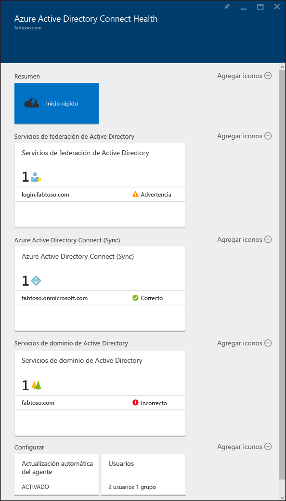

# Supervisión de la infraestructura de identidad local y los servicios de sincronización en la nube
Azure AD Connect Health le ayuda a supervisar y a comprender mejor su infraestructura de identidad local y los servicios de sincronización.  Permite mantener una conexión confiable a Office 365 y Microsoft Online Services al proporcionar funcionalidades de supervisión para los componentes de identidad clave, como servidores de AD FS, servidores de Azure AD Connect (también conocido como motor de sincronización) y controladores de Dominio de Active Directory. También permite un fácil acceso a los puntos de datos clave acerca de estos componentes, lo que facilita la obtención de datos de uso y otra información importante para tomar decisiones bien fundamentadas.

Esta información se presenta en el [portal de Azure AD Connect Health](https://aka.ms/aadconnecthealth). Mediante el portal de Azure AD Connect Health puede ver alertas, supervisión del rendimiento, análisis de uso y mucho más. Azure AD Connect Health habilita la lente de mantenimiento única para los componentes de identidad clave, todo en un lugar único.

Las actualizaciones futuras de Azure AD Connect Health incluirán la supervisión adicional y la información sobre otros componentes de identidad. Por tanto, se proporciona un único panel mediante el modo de identidad, al permitir un entorno más sólido, mantenido e integrado que los usuarios pueden aprovechar para aumentar su capacidad de hacer su trabajo.

## Por qué usar Azure AD Connect Health
La integración de directorios locales con Azure AD hace que los usuarios sean más productivos al proporcionar una identidad común para acceder tanto a los recursos en la nube como a los locales. Sin embargo, esta integración conlleva el desafío de garantizar que este entorno esté bien mantenido para que los usuarios puedan acceder de manera confiable a los recursos tanto a nivel local como en la nube desde cualquier dispositivo. Azure AD Connect Health proporciona un sencillo enfoque basado en la nube para supervisar y obtener información sobre la infraestructura de identidad local, que se utiliza para acceder a Office 365 o a otras aplicaciones de Azure AD. Es tan sencillo como instalar un agente en cada uno de los servidores de identidad locales.

## [Azure AD Connect Health para AD FS](active-directory-aadconnect-health-adfs.md)
Azure AD Connect Health para AD FS es compatible con AD FS 2.0 en Windows Server 2008 R2, AD FS en Windows Server 2012 y Windows Server 2012R2. También permite supervisar los servidores Proxy de AD FS o Proxy de Aplicación web que proporcionan compatibilidad de autenticación para el acceso a la extranet. Con una instalación sencilla y de bajo costo del agente de mantenimiento, Azure AD Connect Health para AD FS proporciona el siguiente conjunto de funcionalidades clave:

* Supervisión con alertas para saber cuándo los servidores de AD FS y Proxy de AD FS no funcionan correctamente
* Notificaciones de correo electrónico para alertas críticas
* Visualización de tendencias de los datos de rendimiento, útil para planear la capacidad de AD FS
* Análisis de uso de los inicios de sesión de AD FS con diferentes elementos dinámicos (aplicaciones, usuarios, ubicación de red, etc.), útil para comprender cómo se utiliza AD FS
* Informes para AD FS, como los primeros 50 usuarios con intentos incorrectos de nombre de usuario o contraseña con la última dirección IP

El vídeo siguiente proporciona información general de Azure AD Connect Health para AD FS

> [!VIDEO https://channel9.msdn.com/Series/Azure-Active-Directory-Videos-Demos/Azure-AD-Connect-Health--Monitor-you-identity-bridge/player]
>
>

## [Azure AD Connect Health para sincronización](active-directory-aadconnect-health-sync.md)
Azure AD Connect Health para sincronización supervisa y proporciona información sobre las sincronizaciones que tienen lugar entre Active Directory local y Azure Active Directory. Azure AD Connect Health para sincronización ofrece el siguiente conjunto de funiciones clave:

* Supervisión con alertas para saber cuándo los servidores de Azure AD Connect (también conocidos como el motor de sincronización) no funcionan correctamente
* Notificaciones de correo electrónico para alertas críticas
* Sincronización de la visión operativa, incluidos gráficos de latencia para operaciones de sincronización y tendencias de distintas operaciones, como incorporaciones, actualizaciones y eliminaciones
* Vista rápida de la información sobre las propiedades de sincronización y la última exportación correcta a Azure AD
* Informes sobre errores de sincronización de nivel de objeto \(no requiere Azure AD Premium\)

El vídeo siguiente proporciona información general de Azure AD Connect Health para sincronización

> [!VIDEO https://channel9.msdn.com/Series/Azure-Active-Directory-Videos-Demos/Azure-Active-Directory-Connect-Health-Monitoring-the-sync-engine/player]
>
>

## [Azure AD Connect Health para AD DS (versión preliminar)](active-directory-aadconnect-health-adds.md)
Azure AD Connect Health para AD DS proporciona supervisión para los controladores de dominio instalados en Windows Server 2008 R2, Windows Server 2012 y Windows Server 2012 R2. La instalación de un agente de mantenimiento fácil y de bajo costo le permite supervisar el entorno de AD DS local directamente desde la nube. Azure AD Connect Health para AD DS proporciona el siguiente conjunto de funcionalidades clave:

* Alertas de supervisión para detectar cuándo el estado de los controladores de dominio es incorrecto y notificaciones de correo electrónico para alertas críticas.
* Panel de controladores de dominio que proporciona una vista rápida del estado de mantenimiento y el estado operativo de los controladores de dominio.
* Panel de estado de replicación con la información más reciente de la replicación, con vínculos a guías de solución de problemas cuando se detectan errores.
* Acceso rápido en cualquier lugar a los gráficos de datos de los contadores de rendimiento habituales, necesarios para la solución de problemas y la supervisión.

El vídeo siguiente proporciona información general de Azure AD Connect Health para AD DS

> [!VIDEO https://channel9.msdn.com/Series/Azure-Active-Directory-Videos-Demos/Azure-AD-Connect-Health-monitors-on-premises-AD-Domain-Services/player]
>
>

## Introducción a Azure AD Connect Health
Es muy fácil empezar a trabajar con Azure AD Connect Health. Siga estos pasos:

1. [Obtenga Azure AD Premium](active-directory-get-started-premium.md) o [inicie una prueba](https://azure.microsoft.com/trial/get-started-active-directory/)
2. [Descargue e instale los agentes de Azure AD Connect Health](#download-and-install-azure-ad-connect-health-agent) en los servidores de identidad.
3. Consulte el panel de Azure AD Connect Health en [https://aka.ms/aadconnecthealth](https://aka.ms/aadconnecthealth)

> [!NOTE]
> Recuerde que para ver los datos de panel de Azure AD Connect Health, deberá instalar el agente de Azure AD Connect Health en los servidores de destino.
>
>

## Descarga e instalación de un agente de Azure AD Connect Health
* Asegúrese de que se cumplen los requisitos de Azure AD Connect Health.
* Para empezar a usar Azure AD Connect Health para AD FS, puede descargar la versión más reciente del agente aquí: [Descargar agente de Azure AD Connect Health para AD FS.](http://go.microsoft.com/fwlink/?LinkID=518973)
  
* Para comenzar a usar Azure AD Connect Health para la sincronización, descargue e instale la [versión más reciente de Azure AD Connect](http://go.microsoft.com/fwlink/?linkid=615771).  El agente de mantenimiento se instalará como parte de la instalación de Azure AD Connect (versión 1.0.9125.0 o superior).  Azure AD Connect admite una actualización local desde versiones anteriores.
* Para empezar a usar Azure AD Connect Health para AD DS, puede descargar la versión más reciente del agente aquí: [Descargar agente de Azure AD Connect Health para AD DS.](http://go.microsoft.com/fwlink/?LinkID=820540)
  

## portal de Azure AD Connect Health
El portal de Azure AD Connect Health permite ver alertas, información de supervisión del rendimiento y análisis de uso. https://AKA.ms/aadconnecthealth le lleva a la hoja principal de Azure AD Connect Health.  Puede considerar una hoja como una ventana. En la hoja principal, verá Inicio rápido, los servicios en Azure AD Connect Health y otras opciones de configuración. Debajo de la captura de pantalla aparece una breve explicación de cada una de ellas.  Después de implementar los agentes, el servicio de mantenimiento identifica automáticamente los servicios que Azure AD Connect Health supervisa.

* **Inicio rápido** : al seleccionar esta opción, se abrirá la hoja Inicio rápido. Aquí podrá descargar el agente de Azure AD Connect Health; para ello, elija Obtener herramientas, obtenga acceso a la documentación y proporcione comentarios.
* **Servicios de federación de Active Directory** : representa todos los servicios de AD FS que actualmente supervisa Azure AD Connect Health. Si selecciona una de las instancias, se abre una hoja con información sobre esa instancia de servicios.  Esta información incluye una descripción general, propiedades, alertas, supervisión y análisis de uso. Lea más acerca de las funcionalidades [aquí](active-directory-aadconnect-health-adfs.md)
* **Azure Active Directory Connect (Sync)** : representa los servidores de Azure AD Connect que actualmente supervisa Azure AD Connect Health. Al seleccionar la entrada, se abrirá una hoja con información acerca de los servidores de Azure AD Connect. Lea más acerca de las funcionalidades [aquí](active-directory-aadconnect-health-sync.md)
* **Servicios de dominio de Active Directory** : representa todos los bosques de AD DS que actualmente supervisa Azure AD Connect Health. Si selecciona uno de los bosques, se abrirá una hoja con información sobre ese bosque.  Esta información incluye una visión general de los datos esenciales, del panel de controladores de dominio, del de estado de replicación y de las alertas y la información de supervisión. Lea más acerca de las funcionalidades [aquí](active-directory-aadconnect-health-adds.md)
* **Configurar** : esta opción le permite activar o desactivar lo siguiente:

  1. La actualización automática, para actualizar automáticamente el agente de Azure AD Connect Health a la versión más reciente. Esto significa que actualizará automáticamente a la versión más reciente del agente de Azure AD Connect Health cuando esté disponible. Esta opción está habilitada de manera predeterminada.
  2. Permitir el acceso de Microsoft a los datos de mantenimiento del directorio de Azure AD solo con fines de solución de problemas: esto significa que, si esta opción está habilitada, Microsoft podrá ver los mismos datos que usted está viendo. Esto puede ayudar a solucionar problemas. Esta opción está deshabilitada de manera predeterminada.

## Vínculos relacionados
* [Instalación del agente de Azure AD Connect Health](active-directory-aadconnect-health-agent-install.md)
* [Operaciones de Azure AD Connect Health](active-directory-aadconnect-health-operations.md)
* [Uso de Azure AD Connect Health con AD FS](active-directory-aadconnect-health-adfs.md)
* [Uso de Azure AD Connect Health para sincronización](active-directory-aadconnect-health-sync.md)
* [Uso de Azure AD Connect Health con AD DS](active-directory-aadconnect-health-adds.md)
* [Preguntas más frecuentes de Azure AD Connect Health](active-directory-aadconnect-health-faq.md)
* [Historial de versiones de Azure AD Connect Health](active-directory-aadconnect-health-version-history.md)

<!--HONumber=Nov16_HO2-->

