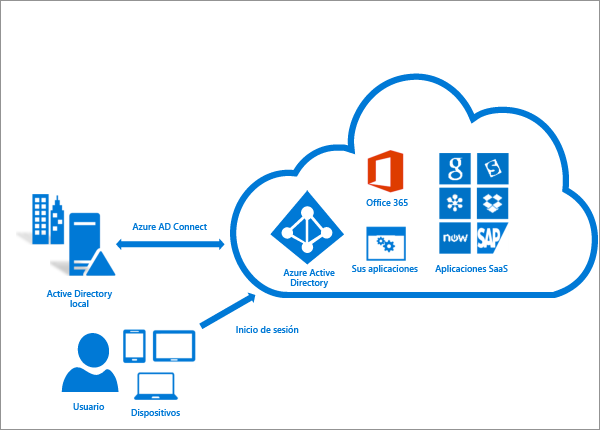
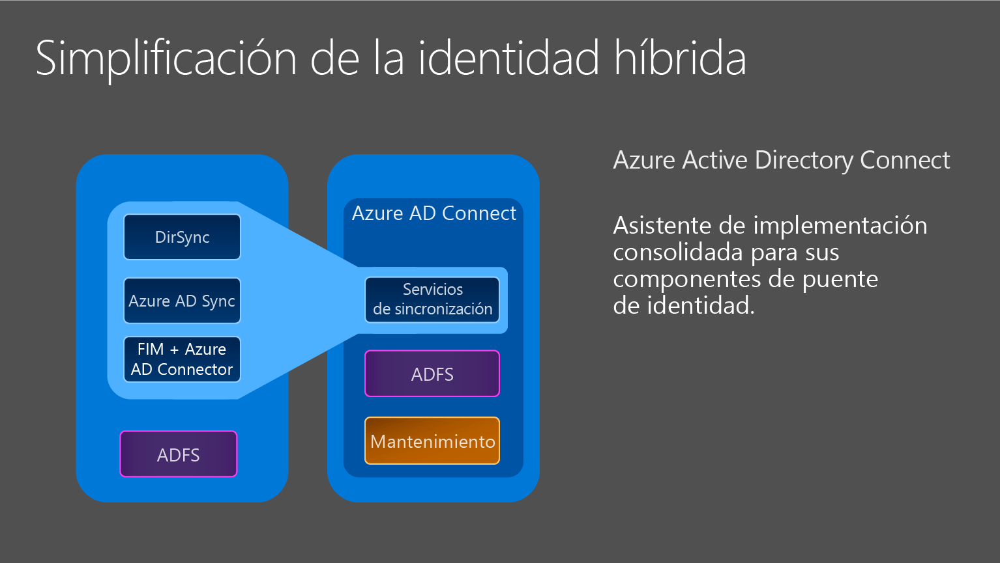

<properties 
	pageTitle="Integración de las identidades locales con Azure Active Directory." 
	description="Aquí se describe qué es Azure AD Connect y por qué debería usarlo." 
	services="active-directory" 
	documentationCenter="" 
	authors="billmath" 
	manager="swadhwa" 
	editor="curtand"/>

<tags 
	ms.service="active-directory" 
	ms.workload="identity" 
	ms.tgt_pltfrm="na" 
	ms.devlang="na" 
	ms.topic="get-started-article" 
	ms.date="07/13/2015" 
	ms.author="billmath"/>

# Integración de las identidades locales con Azure Active Directory

Hoy en día, los usuarios desean tener acceso a las aplicaciones tanto a nivel local como en la nube. Desean poder hacerlo desde cualquier dispositivo, ya sea un equipo portátil, un teléfono inteligente o una tableta. Para que esto ocurra, usted y su organización deben poder proporcionar una forma para que los usuarios tengan acceso a estas aplicaciones; sin embargo pasar completamente a la nube no es siempre una opción.

Con la introducción de Azure Active Directory Connect, proporcionar acceso a estas aplicaciones y pasar a la nube nunca ha sido tan fácil. Azure AD Connect ofrece las siguientes ventajas:

- Los usuarios pueden iniciar sesión con una identidad común en la nube y localmente. No es necesario recordar varias contraseñas o cuentas y los administradores no tienen que preocuparse por la sobrecarga adicional que pueden suponer varias cuentas.
- Una única herramienta y experiencia guiada para la conexión de sus directorios locales con Azure Active Directory. Una vez instalado, el asistente implementa y configura todos los componentes necesarios para preparar la integración y ejecución de directorios, incluidos los servicios de sincronización, la sincronización de contraseñas o AD FS y los requisitos previos, como el módulo de Azure AD PowerShell.

## ¿Por qué usar Azure AD Connect? 

la integración de directorios locales con Azure AD hace que los usuarios sean más productivos proporcionando una identidad común para tener acceso a recursos de nube y locales. Con esta integración, los usuarios y las organizaciones pueden aprovechar lo siguiente:
	
* Las organizaciones pueden proporcionar a los usuarios una identidad híbrida común entre servicios en la nube o locales al aprovechar Windows Server Active Directory y, a continuación, conectarse a Active Directory de Azure. 
* Los administradores pueden proporcionar acceso condicional basado en el recurso de la aplicación, dispositivo e identidad de usuario, ubicación de red y autenticación multifactor.
* Los usuarios pueden aprovechar su identidad común mediante cuentas de Azure AD a Office 365, Intune, aplicaciones SaaS y aplicaciones de otros fabricantes.  
* Los desarrolladores pueden crear aplicaciones que aprovechan el modelo de identidad común, la integración de aplicaciones en Active Directory local o en Azure para aplicaciones basadas en la nube

Azure AD Connect facilita esta integración y simplifica la administración de su infraestructura de identidad en la nube y local.

----------------------------------------------------------------------------------------------------------
## Descarga de Azure AD Connect

Para empezar a utilizar Azure AD Connect puede descargar la versión más reciente mediante [Descarga de Azure AD Connect](http://go.microsoft.com/fwlink/?LinkId=615771).

----------------------------------------------------------------------------------------------------------

## Cómo funciona Azure AD Connect

Azure Active Directory Connect se compone de tres partes principales. Se trata de los servicios de sincronización, la parte opcional de Servicios de federación de Active Directory y la parte de supervisión que se lleva a cabo mediante [Azure AD Connect Health](https://msdn.microsoft.com/library/azure/dn906722.aspx).

 

- Sincronización: esta parte consta de los componentes y la funcionalidad publicados previamente como Dirsync y Sincronización de AAD. Esta es la parte que se encarga de crear usuarios y grupos. También es responsable de asegurarse de que la información sobre los usuarios y los grupos de su entorno local coincide con la de la nube.
- AD FS: se trata de una parte opcional de Azure AD Connect y puede utilizarse para configurar un entorno híbrido mediante una infraestructura local de AD FS. Las organizaciones pueden usar esta parte para abordar implementaciones complejas que incluyen elementos como un inicio de sesión único de unión a dominio, la aplicación de la directiva de inicio de sesión de AD y MFA mediante tarjeta inteligente o de terceros. Para obtener información adicional sobre la configuración del inicio de sesión único, vea [DirSync con inicio de sesión único](https://msdn.microsoft.com/library/azure/dn441213.aspx).
- Supervisión de estado: en el caso de las implementaciones complejas que usan AD FS, Azure AD Connect Health puede ofrecer una sólida supervisión de los servidores de federación y proporcionar una ubicación central en el portal de Azure para ver esta actividad. Para obtener más información, consulte [Azure Active Directory Connect Health](https://msdn.microsoft.com/library/azure/dn906722.aspx).

### Componentes de soporte de Azure AD Connect

La siguiente es una lista de requisitos previos y componentes de soporte que Azure AD Connect instalará en el servidor en el que configuró Azure AD Connect. Esta lista es para una instalación rápida básica. Si decide usar un servidor SQL Server diferente en la página Instalar servicios de sincronización, los componentes de SQL Server 2012 enumerados a continuación no se instalarán.

- Conector de Azure AD para Azure AD Connect
- Utilidades de línea de comandos de Microsoft SQL Server 2012
- Microsoft SQL Server 2012 Native Client
- Microsoft SQL Server 2012 Express LocalDB
- Módulo de Active Directory para Windows PowerShell
- Microsoft Online Services - Ayudante para el inicio de sesión para profesionales de TI
- Paquete de redistribución de Microsoft Visual C++ 2013

## Introducción a Azure AD Connect

La siguiente documentación le ayudará a empezar a trabajar con Azure Active Directory Connect. Esta documentación trata del uso de la instalación rápida para Azure AD Connect. Para obtener información sobre una instalación personalizada, consulte [Instalación personalizada de Azure AD Connect](active-directory-aadconnect-get-started-custom.md). Para obtener información sobre la actualización de DirSync a Azure AD Connect, consulte [Actualizar DirSync a Azure Active Directory Connect.](active-directory-aadconnect-dirsync-upgrade-get-started.md)

### Antes de instalar Azure AD Connect
Antes de instalar Azure AD Connect con Configuración rápida, hay algunas cosas que necesitará.

 
- Una suscripción de Azure o una [suscripción de prueba de Azure](http://azure.microsoft.com/pricing/free-trial/): solo es necesario para el acceso al Portal de Azure, no para usar Azure AD Connect. Si usa PowerShell u Office 365 no es necesario utilizar una suscripción de Azure para usar Azure AD Connect.
- Una cuenta de administrador global de Azure AD para el inquilino de Azure AD con el que desea realizar la integración
- Azure AD Connect debe instalarse en Windows Server 2008 o en una versión superior. Este servidor puede ser un controlador de dominio o un servidor miembro.
- El nivel de bosque y la versión del esquema de AD debe ser Windows Server 2003 o una versión posterior. Los controladores de dominio pueden ejecutar cualquier versión siempre que se cumplan los requisitos de nivel de bosque y esquema.
- Si se va a implementar Servicios de federación de Active Directory, los servidores en los que se va a instalar AD FS deben ser Windows Server 2012 o versiones posteriores.
- Azure AD Connect requiere una base de datos de SQL Server para almacenar datos de identidad. De forma predeterminada se instala SQL Server 2012 Express LocalDB (una versión ligera de SQL Server Express) y se crea la cuenta de servicio para el servicio en el equipo local. SQL Server Express tiene un límite de tamaño de 10 GB que le permite que administre aproximadamente 100.000 objetos.
- Si tiene que administrar un volumen elevado de objetos de directorio, es preciso que el proceso de instalación apunte a otra versión de SQL Server. Azure AD Connect admite todas las versiones de Microsoft SQL Server de SQL Server 2008 (con Service Pack 4) a SQL Server 2014.
- Una cuenta de administrador de empresa para su Active Directory local
- Si usa un servidor proxy saliente, debe agregarse la siguiente configuración en el archivo **C:\\Windows\\Microsoft.NET\\Framework64\\v4.0.30319\\Config\\machine.config** para completar la instalación. <code>
		
		<system.net>
    		<defaultProxy>
      		<proxy
        	usesystemdefault="true"
        	proxyaddress=http://<PROXYIP>:80"
        	bypassonlocal="true"
     		 />
    		</defaultProxy>
  		</system.net>
</code> Este texto debe escribirse en la parte inferior del archivo. En este código, &lt;PROXYIP&gt; representa la dirección IP de proxy real.

- Opcional: una cuenta de usuario de prueba para comprobar la sincronización.

#### Requisitos de hardware de Azure AD Connect
La tabla siguiente muestra los requisitos mínimos de un equipo con Azure AD Connect.

| Cantidad de objetos en Active Directory | CPU | Memoria | Tamaño de disco duro |
| ------------------------------------- | --- | ------ | --------------- |
| Menos de 10.000 | 1,6 GHz | 4 GB | 70 GB |
| 10\.000–50.000 | 1,6 GHz | 4 GB | 70 GB |
| 50\.000–100.000 | 1,6 GHz | 16 GB | 100 GB* |
| Para 100.000 o más objetos, se requiere la versión completa de SQL Server| | | |
| 100\.000–300.000 | 1,6 GHz | 32 GB | < 300 GB |
| 300\.000–600.000 | 1,6 GHz | 32 GB | 450 GB |
| Más de 600.000 | 1,6 GHz | 32 GB | 500 GB |

Para ver opciones personalizadas como varios bosques o un inicio de sesión federado, obtenga información sobre los requisitos adicionales [aquí.](active-directory-aadconnect-get-started-custom.md)

### Instalación rápida de Azure AD Connect
Configuración rápida es la opción predeterminada que se selecciona y es uno de los escenarios más comunes. Al hacer esto, Azure AD Connect implementa la sincronización con la opción de sincronización de hash de contraseña. Esto es para un solo bosque y permite que los usuarios utilicen su contraseña local para iniciar sesión en la nube. La Configuración rápida activa automáticamente una sincronización una vez completada la instalación (puede elegir no hacerlo). Con esta opción, ampliará su directorio local a la nube con tan solo unos pocos clics.

#### Para instalar Azure AD Connect mediante la configuración rápida
--------------------------------------------------------------------------------------------

1. Inicie sesión en el servidor en el que desea para instalar Azure AD Connect como administrador de organización. Debe ser el servidor que quiere que sea el servidor de sincronización.
2. Navegue hasta el archivo AzureADConnect.msi y haga doble clic en él.
3. En la pantalla de bienvenida, active la casilla que acepta los términos de licencia y haga clic en **Continuar**.
4. En la pantalla Configuración rápida, haga clic en **Usar configuración rápida**.

6. En la pantalla Conectar a Azure AD, escriba el nombre de usuario y la contraseña de un administrador global de Azure para su Azure AD. Haga clic en **Siguiente**.
8. En la pantalla Conectar con AD DS, escriba el nombre de usuario y la contraseña para una cuenta de administrador de empresa. Haga clic en **Siguiente**.

9. En la pantalla Listo para configurar, haga clic en **Instalar**.
	- En la página Listo para configurar puede desactivar la casilla “**Inicie el proceso de sincronización en cuanto se complete la configuración inicial**”. Si lo hace, el asistente configurará la sincronización, pero dejará la tarea deshabilitada por lo que no se ejecutará hasta que la habilite manualmente en el Programador de tareas. Una vez habilitada la tarea, la sincronización se ejecutará cada tres horas.
	- Opcionalmente, también puede configurar los servicios de sincronización para **Implementación híbrida de Exchange**; para ello, active la casilla correspondiente. Si no planea tener buzones de Exchange locales y en la nube, no es necesario hacerlo.

8. Una vez completada la instalación, haga clic en **Salir**.

Para ver un vídeo sobre el uso de la instalación exprés, consulte lo siguiente:

[AZURE.VIDEO azure-active-directory-connect-express-settings]

### Comprobación de la instalación

Después de haber instalado correctamente Azure AD Connect, para comprobar que la sincronización se produce, inicie sesión en el Portal de Azure y compruebe la última hora de sincronización.

1.  Inicie sesión en el Portal de Azure.
2.  En la parte izquierda, seleccione Active Directory.
3.  Haga doble clic en el directorio que ha utilizado para instalar Azure AD Connect.
4.  En la parte superior, seleccione Integración de directorios. Anote la hora de la última sincronización.

## Administración de Azure AD Connect 

Los siguientes temas tratan cuestiones operativas avanzadas que le permiten personalizar Azure Active Directory Connect para satisfacer las necesidades y los requisitos de sus organizaciones.

### Asignación de licencias a usuarios de Azure AD Premium y Enterprise Mobility

Ahora que los usuarios se han sincronizado a la nube, debe asignarlos una licencia para lo que puedan empezar a trabajar con las aplicaciones de nube, como Office 365.

#### Para asignar una licencia de Azure AD Premium o Enterprise Mobility Suite
--------------------------------------------------------------------------------
1. Inicie sesión en el Portal de Azure como administrador.
2. En la parte izquierda, seleccione **Active Directory**.
3. En la página Active Directory, haga doble clic en el directorio que tiene los usuarios que desea habilitar.
4. En la parte superior de la página de directorios, seleccione **Licencias**.
5. En la página Licencias, seleccione Active Directory Premium o Enterprise Mobility Suite y haga clic en **Asignar**.
6. En el cuadro de diálogo, seleccione los usuarios a los que desee asignar las licencias y, a continuación, haga clic en el icono de marca de verificación para guardar los cambios.

### Comprobación de la tarea de sincronización programada
Puede comprobar el estado de una sincronización en el Portal de Azure.

#### Para comprobar la tarea de sincronización programada
--------------------------------------------------------------------------------

1. Inicie sesión en el Portal de Azure como administrador.
2. En la parte izquierda, seleccione **Active Directory**.
3. En la página Active Directory, haga doble clic en el directorio que tiene los usuarios que desea habilitar.
4. En la parte superior de la página de directorios, seleccione **Integración de directorios**.
5. En la integración con Active Directory local, anote la hora de la última sincronización.

### Inicio de una tarea de sincronización programada
Si necesita ejecutar una tarea de sincronización, ejecútelo de nuevo mediante el Asistente de Azure AD Connect. Necesitará proporcionar sus credenciales de Azure AD. En el asistente, seleccione la tarea **Personalizar las opciones de sincronización** y haga clic en siguiente en todo el asistente. Al final, asegúrese de que la casilla **Iniciar el proceso de configuración tan pronto como se complete la configuración** está seleccionada.

### Tareas adicionales disponibles en Azure AD Connect
Después de la instalación inicial de Azure AD Connect, siempre puede volver a iniciar el asistente desde la página de inicio de Azure AD Connect o el acceso directo de escritorio. Verá que volver a pasar por el asistente ofrece algunas nuevas opciones en el formulario de tareas adicionales.

En la tabla siguiente se proporciona un resumen de estas tareas y una breve descripción de cada una de ellas.

 

Tarea adicional | Descripción 
------------- | ------------- |
Ver el escenario seleccionado |Permite ver la solución actual de Azure AD Connect. Incluye la configuración general, los directorios sincronizados, la configuración de sincronización, etc.
Personalizar las opciones de sincronización | Permite cambiar la configuración actual, incluida la adición de bosques de Active Directory adicionales a la configuración o habilitar las opciones de sincronización, como usuario, grupo, dispositivo o reescritura de contraseña.
Habilitar el modo provisional | Esto permite almacenar información que se sincronizará más adelante, pero no se exportará nada a Azure AD o Active Directory. Esto permite obtener una vista previa de las sincronizaciones antes de que ocurran.

 
### Documentación adicional
Para ver documentación adicional acerca de cómo trabajar con Azure AD Connect, consulte lo siguiente:

- [Sincronización de Azure AD Connect: personalización de las opciones de sincronización](active-directory-aadconnectsync-whatis.md) 
- [Cambio de la configuración predeterminada de Azure AD Connect](active-directory-aadconnect-whats-next-change-default-config.md)
- [Uso del editor de reglas de sincronización de Azure AD Connect](active-directory-aadconnect-whats-next-synch-rules-editor.md)
- [Uso del aprovisionamiento declarativo](active-directory-aadconnect-whats-next-declarative-prov.md)

Algunos de los documentos que se crearon para Sincronización de Azure AD siguen siendo válidos y se aplican a Azure AD Connect. Aunque se está poniendo todo el empeño en trasladar esa documentación a Azure.com, parte de la misma sigue residiendo en la biblioteca del ámbito de MSDN. Para obtener documentación adicional, consulte [Azure AD Connect en MSDN](https://msdn.microsoft.com/library/azure/dn832695.aspx) y [Sincronización de Azure AD en MSDN](https://msdn.microsoft.com/library/azure/dn790204.aspx).

**Recursos adicionales**

Presentación de Ignite 2015 sobre cómo extender los directorios locales a la nube.

[AZURE.VIDEO microsoft-ignite-2015-extending-on-premises-directories-to-the-cloud-made-easy-with-azure-active-directory-connect]

[Sincronización de directorios de varios bosques con el escenario de inicio de sesión único](https://msdn.microsoft.com/library/azure/dn510976.aspx): integre varios directorios con Azure AD.

[Azure AD Connect Health](active-directory-aadconnect-health.md): supervise el estado de su infraestructura de AD FS local.

[Preguntas más frecuentes sobre Azure AD Connect](active-directory-aadconnect-faq.md): preguntas más frecuentes relacionadas con Azure AD Connect.

 

<!---HONumber=August15_HO8-->