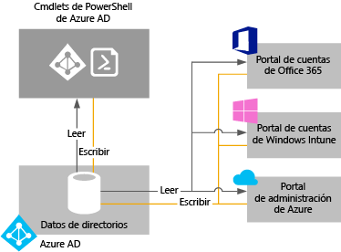

# Administración del directorio de Azure AD

## ¿Qué es un inquilino de Azure AD?
En Azure Active Directory (Azure AD), un inquilino es una instancia dedicada de un directorio de Azure AD que su organización recibe cuando se suscribe a un servicio en la nube de Microsoft, como Azure u Office 365. Cada directorio de Azure AD es distinto e independiente de otros directorios de Azure AD. Del mismo modo que un edificio de oficinas para empresas es un activo seguro dedicado específicamente a su organización, un directorio de Azure AD se ha diseñado también para ser un activo seguro para el uso exclusivo de su organización. La arquitectura de Azure AD aísla los datos del cliente y la información de identidad para que los usuarios y los administradores de un directorio de Azure AD no tengan acceso a los datos de otro directorio, ya sea de manera involuntaria o malintencionada.

## ¿Cómo puedo obtener un directorio de Azure AD?
Azure AD proporciona las principales capacidades de administración de identidades y directorios de la mayoría de los servicios en la nube de Microsoft, incluyendo:

* Azure
* Microsoft Office 365
* Microsoft Dynamics CRM Online
* Microsoft Intune

Al suscribirse en cualquiera de estos servicios en la nube de Microsoft, obtiene un directorio de Azure AD. Puede crear directorios adicionales según sea necesario. Por ejemplo, puede mantener el primer directorio como directorio de producción y, a continuación, crear otro directorio para pruebas o ensayos.

### Uso del directorio de Azure AD que viene con una nueva suscripción de Azure

Recomendamos que utilice la cuenta de administrador que usó para su primer servicio cuando se registró para otros servicios de Microsoft. La información que proporcione la primera vez que se registra para un servicio de Microsoft se utiliza para crear una nueva instancia de directorio de Azure AD para su organización. Si utiliza ese directorio para autenticar los intentos de inicio de sesión al suscribirse a otros servicios de Microsoft, puede usar las cuentas de usuario existentes, las directivas, las configuraciones o la integración con el directorio local que configure en el directorio predeterminado.

Por ejemplo, si se registra para una suscripción de Microsoft Intune y, después, sincroniza su Active Directory local con su directorio de Azure AD, puede suscribirse a otro servicio de Microsoft como Office 365 y lograr fácilmente las mismas ventajas de integración de directorio que tenga con Microsoft Intune.

Para más información acerca de cómo integrar su directorio local con Azure AD, consulte [Integración de directorios con Azure AD Connect](active-directory-aadconnect.md).

### Asociación de un directorio existente de Azure AD con una nueva suscripción de Azure
Puede asociar una nueva suscripción de Azure con el mismo directorio que autentica el inicio de sesión para una suscripción de Office 365 o Microsoft Intune existente. Para más información sobre ese escenario, consulte [Transferencia de la propiedad de una suscripción de Azure a otra cuenta](../billing/billing-subscription-transfer.md)

### Creación de un directorio de Azure AD mediante una suscripción a un servicio en la nube de Microsoft como una organización
Si aún no tiene una suscripción a un servicio en la nube de Microsoft, puede usar uno de los siguientes vínculos para suscribirse. Con la suscripción a su primer servicio se crea un directorio de Azure AD automáticamente.

* [Microsoft Azure](https://account.azure.com/organization)
* [Office 365](http://products.office.com/business/compare-office-365-for-business-plans/)
* [Microsoft Intune](https://portal.office.com/Signup/Signup.aspx?OfferId=40BE278A-DFD1-470a-9EF7-9F2596EA7FF9&dl=INTUNE_A&ali=1#0%20)

### Cómo cambiar el directorio predeterminado de una suscripción

1. Inicie sesión en el [Centro de cuentas de Azure](https://account.azure.com/Subscriptions) con una cuenta que sea administrador de cuenta de la suscripción para transferir la propiedad de suscripción.
2. Asegúrese de que el usuario que va a ser el propietario de la suscripción está en el directorio de destino.
3. Haga clic en **Transferir suscripción**.
4. Especifique el destinatario. El destinatario obtiene automáticamente un correo electrónico con un vínculo de aceptación.
5. El destinatario hace clic en el vínculo y sigue las instrucciones, incluyendo la especificación de su información de pago. Cuando el destinatario finaliza correctamente, se transfiere la suscripción. 
6. El directorio predeterminado de la suscripción se cambia al directorio donde está el usuario si la transferencia de la propiedad de suscripción se realiza correctamente.

Para más información, consulte [Transferencia de la propiedad de una suscripción de Azure a otra cuenta](../billing/billing-subscription-transfer.md)

### Administración del directorio predeterminado en Azure
Al suscribirse a Azure, se asocia un directorio de Azure AD predeterminado a su suscripción. No hay ningún costo por el uso de Azure AD y los directorios son un recurso gratuito. Hay servicios de Azure AD de pago que se conceden bajo licencia aparte y proporcionan funcionalidad adicional, como la personalización de marca de empresa en el inicio de sesión y el restablecimiento de contraseña en modo autoservicio. También puede crear un dominio personalizado mediante un nombre DNS de su propiedad en lugar del dominio predeterminado *.onmicrosoft.com.

## ¿Cómo puedo administrar datos de directorios?
Para administrar una o más suscripciones de servicios en la nube de Microsoft, puede usar el [centro de administración de Azure AD](https://aad.portal.azure.com), el portal de cuentas de Microsoft Intune o el [centro de administración de Office 365](https://portal.office.com/) para administrar datos de directorios de su organización. También puede utilizar [cmdlets de PowerShell de Azure Active Directory](https://docs.microsoft.com/powershell/azure/active-directory), que le ayudarán a administrar los datos almacenados en Azure AD.

Desde cualquiera de estos portales (o cmdlets), puede:

* Crear y administrar cuentas de usuario y grupo
* Administración de servicios en la nube relacionados para las suscripciones de su organización
* Configuración de la integración local con los servicios de autenticación e identidad de Azure AD

El centro de administración de Azure AD, el centro de administración de Office 365, el portal de cuentas de Microsoft Intune y los cmdlets de Azure AD leen y escriben en una instancia compartida única de Azure AD que está asociada con el directorio de su organización. Cada una de esas herramientas actúa como una interfaz front-end que extrae o cambia la información del directorio.
Cuando cambia los datos de su organización mediante cualquiera de los portales o cmdlets mientras está conectado en el contexto de uno de estos servicios, los cambios también se muestran en los demás portales la próxima vez que inicie sesión. Estos datos se comparten entre los servicios en la nube de Microsoft a los que esté suscrito.

Por ejemplo, si utiliza el centro de administración de Office 365 para bloquear el inicio de sesión de un usuario, dicha acción bloquea el inicio de sesión de ese usuario en cualquier otro servicio al que esté suscrita actualmente su organización. Si visualiza la misma cuenta de usuario en el portal de cuentas de Microsoft Intune, también verá que el usuario está bloqueado.

## ¿Cómo puedo agregar y administrar varios directorios?
Puede [agregar un directorio de Azure AD en Azure Portal](https://portal.azure.com/#create/Microsoft.AzureActiveDirectory). Rellene la información y seleccione **Crear**.

Puede administrar cada directorio como un recurso totalmente independiente: cada directorio es un recurso del mismo nivel con características completas y lógicamente independiente de otros directorios que administre; no hay ninguna relación principal-secundario entre los directorios. Esta independencia entre directorios incluye la independencia de recursos, la independencia administrativa y la independencia de sincronización.

* **Independencia de recursos**. Si crea o elimina un recurso en un directorio, esto no tiene efecto en ningún recurso de los demás directorios, con la excepción parcial de los usuarios externos. Si utiliza un dominio personalizado “contoso.com” con un directorio, este no se puede utilizar con ningún otro directorio. 
* **Independencia administrativa**.  Si un usuario no administrador del directorio "Contoso", crea un directorio de prueba denominado "Prueba":
  
  * Los administradores del directorio "Contoso" no tienen privilegios administrativos directos en el directorio "Prueba", a menos que el administrador de "Prueba" les otorgue específicamente estos privilegios. Los administradores de "Contoso" pueden controlar el acceso al directorio "Prueba" en virtud del control que tienen de la cuenta de usuario que creó "Prueba".
    
  * Y si asigna o elimina un rol de administrador para un usuario en un directorio, el cambio no afecta a ningún rol de administrador que ese usuario pueda tener en otro directorio.
* **Independencia de sincronización**. Puede configurar cada inquilino de Azure AD de manera independiente para que los datos se sincronicen desde una sola instancia con la herramienta de sicronización de directorios Azure AD Connect.

A diferencia de otros recursos de Azure, los directorios no son recursos secundarios de una suscripción a Azure. Así, si cancela su suscripción a Azure o deja que esta caduque, aún podrá tener acceso a los datos de su directorio mediante Azure AD PowerShell, la API Graph de Azure u otras interfaces, como el Centro de administración de Office 365. También puede asociar otra suscripción con el directorio.

## Cómo prepararse para eliminar un directorio de Azure AD
Un administrador global puede eliminar un directorio de Azure AD desde el portal. Cuando se elimina un directorio, también se eliminan todos los recursos que se encuentran en el directorio. Compruebe que no necesita el directorio antes de eliminarlo.

> [!NOTE]
> Si el usuario inicia sesión con una cuenta profesional o educativa, el usuario no debe intentar eliminar su directorio particular. Por ejemplo, si el usuario ha iniciado sesión como joe@contoso.onmicrosoft.com, no puede eliminar el directorio que tiene contoso.onmicrosoft.com como dominio predeterminado.

Azure AD requiere que se cumplan determinadas condiciones para eliminar un directorio. Esto reduce el riesgo de que la eliminación de un directorio afecte negativamente a usuarios o aplicaciones, como la capacidad de los usuarios de iniciar sesión en Office 365 o de tener acceso a los recursos de Azure. Por ejemplo, si se elimina de forma involuntaria un directorio de una suscripción, los usuarios no tienen acceso a los recursos de Azure de esa suscripción.

Se comprueban las condiciones siguientes:

* El único usuario en el directorio es el administrador global que eliminará el directorio. Se deben eliminar los otros usuarios antes de poder eliminar el directorio. Si los usuarios se sincronizan localmente, se deberá desactivar la sincronización y eliminar los usuarios del directorio en la nube mediante Azure Portal o cmdlets de Azure PowerShell. No existen requisitos para eliminar grupos o contactos, como los contactos agregados desde el centro de administración de Office 365.
* No puede haber aplicaciones en el directorio. Las aplicaciones se deben eliminar antes de poder eliminar el directorio.
* No se pueden vincular proveedores de Multi-Factor Authentication al directorio.
* No puede haber suscripciones a ningún servicio de Microsoft Online Services, como Microsoft Azure, Office 365 o Azure AD Premium, asociadas al directorio. Por ejemplo, si se ha creado un directorio predeterminado en Azure en su nombre, no puede eliminar este directorio si la suscripción a Azure aún se basa en este directorio para la autenticación. De igual forma, no puede eliminar un directorio si otro usuario le ha asociado una suscripción. 

## pasos siguientes
* [Foro de Azure AD](https://social.msdn.microsoft.com/forums/azure/en-US/home?forum=windowsazuread)
* [Foro de Multi-Factor Authentication de Azure](https://social.msdn.microsoft.com/Forums/azure/en-US/home?forum=windowsazureactiveauthentication)
* [Preguntas sobre StackOverflow para Azure](https://stackoverflow.com/questions/tagged/azure-active-directory)
* [Azure Active Directory PowerShell](https://docs.microsoft.com/powershell/azure/active-directory)
* [Asignación de roles de administrador en Azure AD](active-directory-assign-admin-roles-azure-portal.md)
