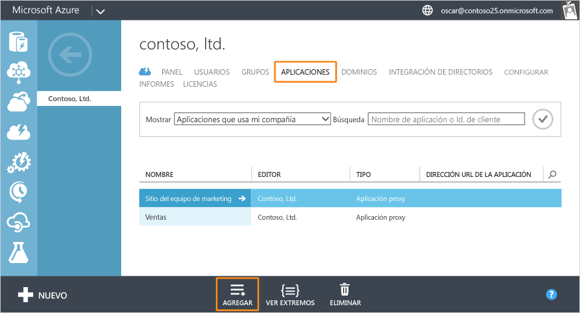
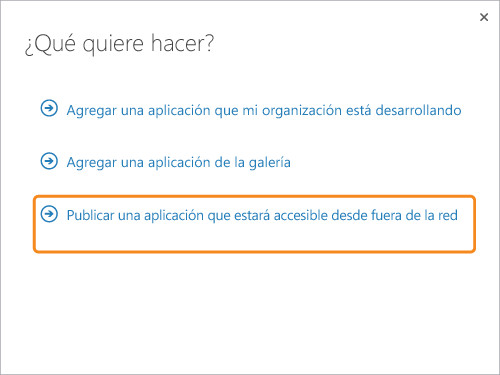
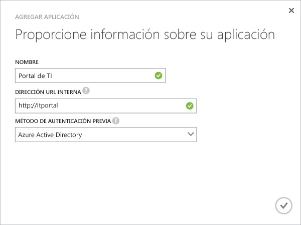
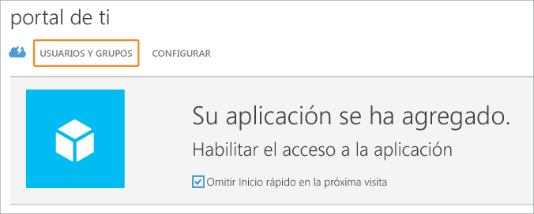
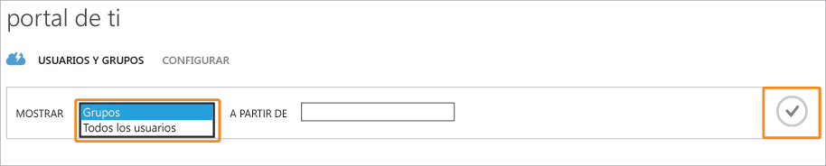
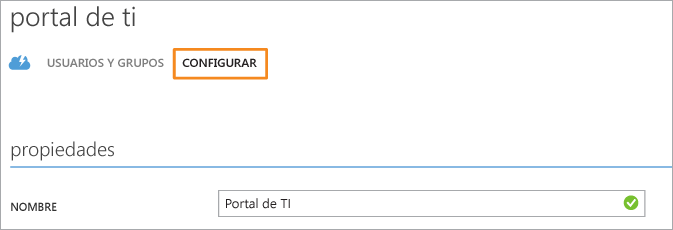

# Publicación de aplicaciones mediante el proxy de aplicación de Azure AD

> [!div class="op_single_selector"]
> * [Azure Portal](application-proxy-publish-azure-portal.md)
> * [Portal de Azure clásico](active-directory-application-proxy-publish.md)

Proxy de aplicación de Azure AD permite publicar aplicaciones locales para acceder a ellas a través de Internet y poder admitir trabajadores remotos. En este punto, ya debe tener [habilitado el Proxy de aplicación en el Portal de Azure clásico](active-directory-application-proxy-enable.md). Este artículo le guiará por los pasos necesarios para publicar las aplicaciones que se ejecutan en una red local y proporcionar acceso remoto seguro desde fuera de la red. Después de completar este artículo, estará listo para configurar la aplicación con los requisitos de seguridad o información personalizada.

> [!NOTE]
> Proxy de aplicación es una característica que solo está disponible si actualizó a la edición Premium o Basic de Azure Active Directory. Para obtener más información, consulte [Ediciones de Azure Active Directory](active-directory-editions.md). Si desea usar el proxy de aplicación, puede [publicar aplicaciones en Azure Portal](application-proxy-publish-azure-portal.md).

## Publicación de una aplicación mediante el Asistente
1. Inicie sesión como administrador en el [Portal de Azure clásico](https://manage.windowsazure.com/).
2. Vaya a Active Directory y seleccione el directorio en el que ha habilitado el proxy de la aplicación.
   
    
3. Haga clic en la pestaña **Aplicaciones** y después haga clic en el botón **Agregar** en la parte inferior de la pantalla.
   
    
4. Seleccione **Publicar una aplicación que estará accesible desde fuera de la red**.
   
    
5. Especifique la siguiente información acerca de la aplicación:
   
   * **Nombre**: nombre descriptivo de la aplicación. Debe ser único en el directorio.
   * **Dirección URL interna**: la dirección que usa el conector del proxy de aplicación para acceder a la aplicación desde la red privada. Puede especificar una ruta de acceso específica en el servidor back-end para publicar, mientras que el resto del servidor no se publica. De esta forma, puede publicar sitios diferentes en el mismo servidor y dar a cada uno un nombre y unas reglas de acceso propios.
     
     > [!TIP]
     > Si publica una ruta de acceso, asegúrese de que incluye todas las imágenes, los scripts y las hojas de estilos necesarias para la aplicación. Por ejemplo, si la aplicación está en https://yourapp/app y usa las imágenes que se encuentra en https://yourapp/media, debe publicar https://yourapp/ como la ruta de acceso.
     > 
     > 
   * **Método de autenticación previa**: forma en que el Proxy de aplicación comprueba los usuarios antes de concederles acceso a la aplicación. Elija una de las opciones del menú desplegable.
     
     * Azure Active Directory: el proxy de la aplicación redirige a los usuarios para que inicien sesión en Azure AD, que autentica sus permisos para el directorio y la aplicación.
     * Acceso directo: los usuarios no tienen que autenticarse para acceder a la aplicación.
     
       
6. Para finalizar al asistente, haga clic en la marca de verificación de la parte inferior de la pantalla. La aplicación ya está definida en Azure AD.

## Asignación de usuarios y grupos a la aplicación
Para que los usuarios accedan a su aplicación publicada, es preciso que los asigne individualmente o en grupos. (Acuérdese también de asignarse acceso). Cada usuario que asigna necesita una licencia para Azure básico o superior. Puede asignar licencias individualmente o a grupos. Consulte [Asignación de usuarios a una aplicación](active-directory-applications-guiding-developers-assigning-users.md) para más información. 

Para aplicaciones que requieren autenticación previa, la asignación de un usuario concede permiso para usar la aplicación. Para aplicaciones que no requieren la autenticación previa, la asignación de un usuario significa que el usuario puede acceder a la aplicación mediante el panel de acceso.

1. Tras finalizar al Asistente para agregar aplicación, verá la página de inicio rápido de la aplicación. Para administrar quién tiene acceso a la aplicación, seleccione **Usuarios y grupos**.
   
    
2. Busque grupos específicos en el directorio o muestre todos los usuarios. Para mostrar los resultados de la búsqueda, haga clic en la marca de verificación.
   
      
3. Seleccione cada usuario o grupo que desea asignar a esta aplicación y haga clic en **Asignar**. Se le pedirá que confirme la acción.

> [!NOTE]
> En el caso de las aplicaciones de autenticación integrada de Windows, solo puede asignar aquellos usuarios y grupos que se sincronizan desde la versión local de Active Directory. A los usuarios que inicien sesión con una cuenta de Microsoft y a los invitados no se les pueden asignar aplicaciones publicadas con el proxy de aplicación de Azure Active Directory. Asegúrese de que los usuarios inician sesión con credenciales que forman parte del mismo dominio que la aplicación que se publica.
> 
> 

## Prueba de la aplicación publicada
Una vez publicada la aplicación, puede probarla; para ello, vaya a la dirección URL que publicó. Asegúrese de que puede acceder a ella, que se representa correctamente y que todo funciona como cabría esperar. Si tiene problemas o recibe mensajes de error, pruebe la [Guía de solución de problemas](active-directory-application-proxy-troubleshoot.md).

## Configuración de la aplicación
En la página Configurar se pueden modificar las aplicaciones publicadas o configurar las opciones avanzadas. En esta página, puede personalizar su aplicación cambiando el nombre o cargando un logotipo. También puede administrar las reglas de acceso como el método de autenticación previa o Multi-Factor Authentication.

Después de publicar las aplicaciones mediante el Proxy de aplicación de Azure Active Directory, estas aparecen en la lista de aplicaciones en Azure AD y se pueden administrar desde ahí.

Si deshabilita los servicios del proxy de aplicaciones después de haber publicado aplicaciones, estas dejarán de estar accesibles desde fuera de la red privada. Los usuarios pueden seguir teniendo acceso a las aplicaciones locales como de costumbre.

Para ver una aplicación y asegurarse de que sea accesible, haga doble clic en su nombre. Si se deshabilita el servicio de Proxy de aplicación y la aplicación no está disponible, aparece un mensaje de advertencia en la parte superior de la pantalla.

Para eliminar una aplicación, seleccione una aplicación en la lista y después haga clic en **Eliminar**.

## Pasos siguientes
* [Publicar aplicaciones mediante su propio nombre de dominio](active-directory-application-proxy-custom-domains.md)
* [Habilitar el inicio de sesión único](active-directory-application-proxy-sso-using-kcd.md)
* [Habilitar el acceso condicional](active-directory-application-proxy-conditional-access.md)
* [Trabajar con las aplicaciones para notificaciones](active-directory-application-proxy-claims-aware-apps.md)

Para ver las últimas noticias y actualizaciones, consulte el [blog Application Proxy](http://blogs.technet.com/b/applicationproxyblog/)

