<properties
   pageTitle="Tutorial detallado sobre cómo usar la vista previa de colaboración B2B de Azure Active Directory | Microsoft Azure"
   description="La colaboración con Azure Active Directory B2B posibilita las relaciones entre empresas al permitir que los asociados empresariales accedan de forma selectiva a las aplicaciones corporativas."
   services="active-directory"
   documentationCenter=""
   authors="viv-liu"
   manager="cliffdi"
   editor=""
   tags=""/>

<tags
   ms.service="active-directory"
   ms.devlang="NA"
   ms.topic="get-started-article"
   ms.tgt_pltfrm="NA"
   ms.workload="identity"
   ms.date="05/09/2016"
   ms.author="viviali"/>

# Vista previa de la colaboración B2B de Azure AD: tutorial detallado

En este tutorial se describe cómo usar la colaboración B2B de Azure AD. Como administrador de TI de Contoso, queremos compartir aplicaciones con los empleados de tres compañías asociadas. Ninguna de las compañías asociadas necesita tener Azure AD.

- Alice, de Simple Partner Org
- Bob, de Medium Partner Org, necesita acceder a un conjunto de aplicaciones
- Carol, de Complex Partner Org, necesita acceder a un conjunto de aplicaciones y pertenecer a grupos de Contoso

Una vez enviadas las invitaciones a los usuarios de los asociados, se pueden configurar en Azure AD para concederles acceso a las aplicaciones y la pertenencia a grupos mediante el Portal de Azure. Comencemos por agregar a Alice.

## Incorporación de Alice al directorio de Contoso
1. Cree un archivo .csv con los encabezados como se muestran, y rellene solo los campos **Email**, **DisplayName** e **InviteContactUsUrl** de Alice. **DisplayName** es el nombre que aparece en la invitación y en el directorio de Azure AD de Contoso. **InviteContactUsUrl** es la manera que Alice tiene de ponerse en contacto con Contoso. En el siguiente ejemplo, InviteContactUsUrl especifica el perfil de LinkedIn de Contoso. Es importante escribir las etiquetas en la primera fila del archivo .csv exactamente como se especifica en la [referencia del formato de archivo CSV](active-directory-b2b-references-csv-file-format.md). 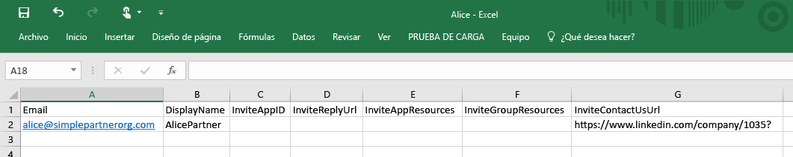

2. En el Portal de Azure, agregue un usuario al directorio de Contoso (Active Directory > Contoso > Usuarios > Agregar usuario). En la lista desplegable "Tipo de usuario", seleccione "Usuarios en compañías asociadas". Cargue el archivo .csv. Asegúrese de que el archivo .csv está cerrado antes de cargarlo. 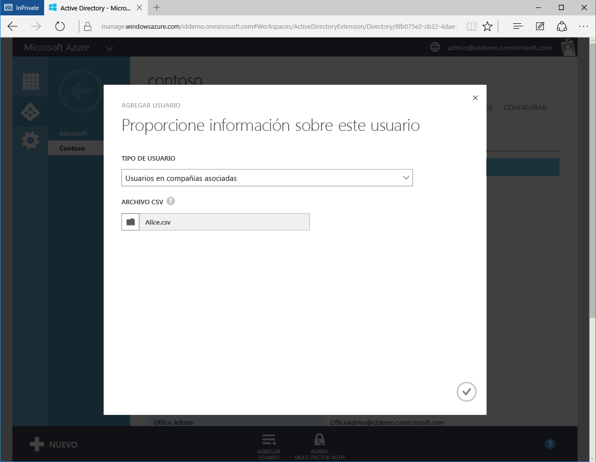

3. Alice es ahora un usuario externo en el directorio de Azure AD de Contoso. 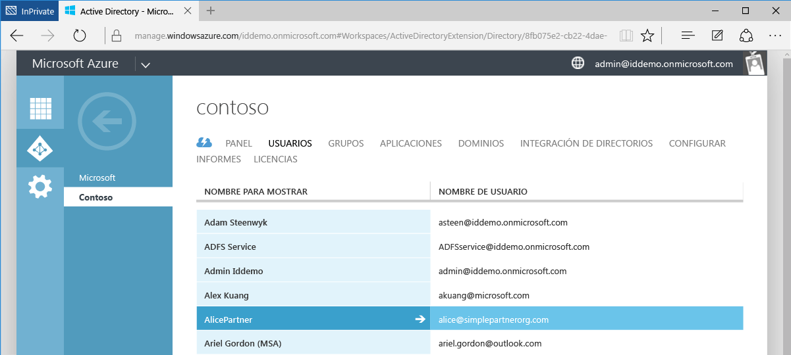

4. Alice recibe el siguiente correo electrónico. 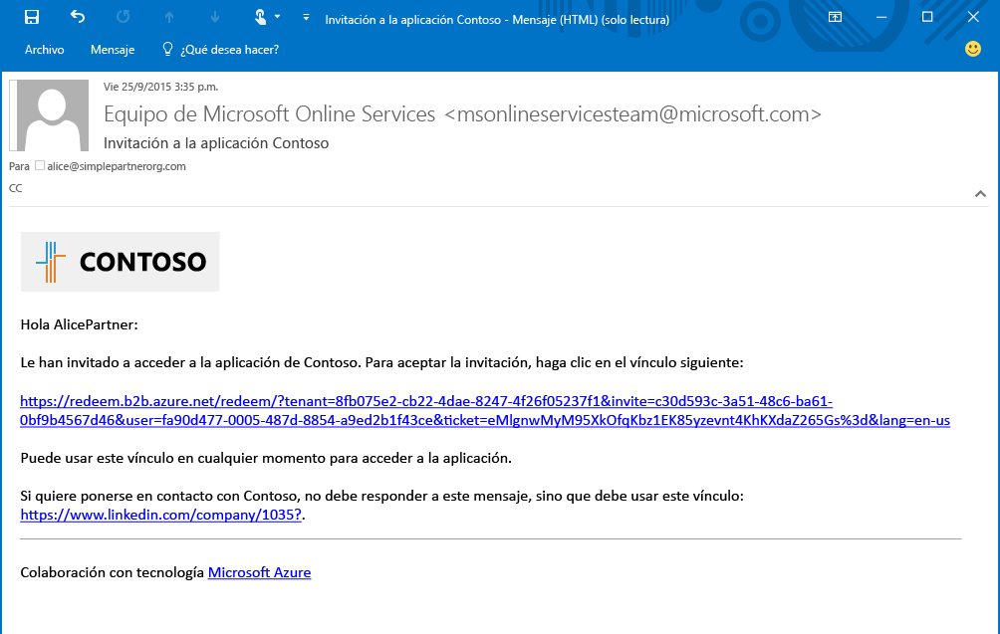

5. Alice hace clic en el vínculo y se le pide que acepte la invitación y que inicie sesión con sus credenciales de trabajo. Si Alice no está en el directorio de Azure AD, se le pedirá que inicie sesión. 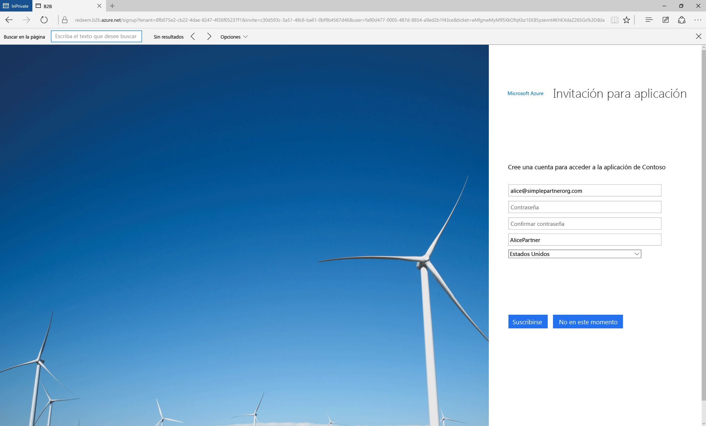

6. Se redirige a Alice el panel de acceso a aplicaciones, que estará vacío hasta que se le conceda acceso a las aplicaciones. 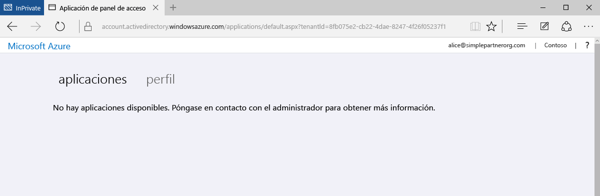

Este procedimiento es la forma más sencilla de colaboración B2B. Como usuario del directorio de Azure AD de Contoso, se puede conceder acceso a Alice a las aplicaciones y los grupos mediante el Portal de Azure. Ahora agreguemos a Bob, que necesita acceso a las aplicaciones Moodle y Salesforce.

## Incorporación de Bob al directorio de Contoso y concesión de acceso a las aplicaciones
1. Use Windows PowerShell con el módulo de Azure AD instalado para encontrar el identificador de las aplicaciones Moodle y Salesforce. Los identificadores se pueden recuperar con el cmdlet: `Get-MsolServicePrincipal | fl DisplayName, AppPrincipalId`, que muestra una lista de todas las aplicaciones disponibles en Contoso y sus AppPrincialIds. 

2. Cree un archivo .csv que contenga los datos de Bob para Email, DisplayName, **InviteAppID**, **InviteAppResources** e InviteContactUsUrl. Rellene **InviteAppResources** con los AppPrincipalIds de Moodle y Salesforce encontrados en PowerShell, separados por un espacio. Rellene **InviteAppId** con el mismo AppPrincipalId de Moodle para personalizar la marca de las páginas de correo electrónico e inicio de sesión. 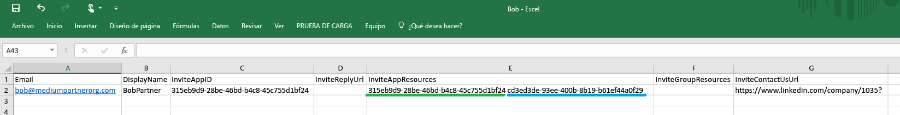

3. Cargue el archivo .csv mediante el Portal de Azure igual que hizo con Alice. Bob es ahora un usuario externo en el directorio de Azure AD de Contoso.

4. Bob recibe el siguiente correo electrónico. 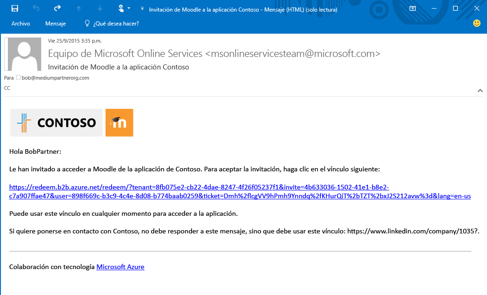

5. Bob hace clic en el vínculo y se le pide que acepte la invitación. Después de iniciar sesión, se le dirige al panel de acceso y ya puede usar Moodle y Salesforce. 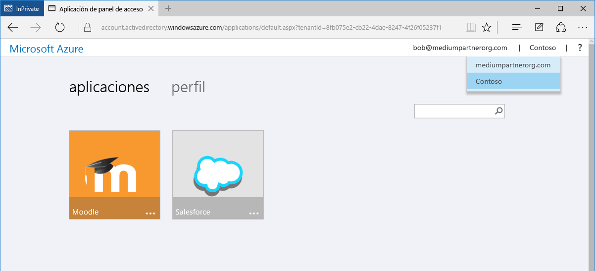

A continuación, agregue a Carol, que necesita acceso a las aplicaciones, así como pertenecer a grupos en el directorio de Contoso.

## Incorporación de Carol al directorio de Contoso, concesión de acceso a las aplicaciones y pertenencia a grupos

1. Use Windows PowerShell con el módulo de Azure AD instalado para encontrar el identificador de las aplicaciones y de los grupos en Contoso.
 - Recupere el valor de AppPrincipalId mediante el cmdlet `Get-MsolServicePrincipal | fl DisplayName, AppPrincipalId`, igual que para Bob.
 - Recupere el valor de ObjectId para grupos mediante el cmdlet `Get-MsolGroup | fl DisplayName, ObjectId`. Esto muestra una lista de todos los grupos de Contoso y sus valores de ObjectId. Los identificadores de grupo también se pueden recuperar como el Identificador de objeto en la pestaña Propiedades del grupo en el Portal de Azure. 

2. Cree el archivo .csv, rellene los campos Email, DisplayName, InviteAppID, InviteAppResources, **InviteGroupResources** e InviteContactUsUrl con los datos correspondientes a Carol. **InviteGroupResources** se rellena con los identificadores de objeto de los grupos MyGroup1 y Externals, separados por un espacio. 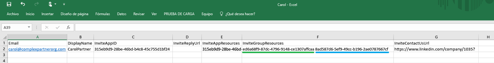

3. Cargue el archivo .csv mediante el Portal de Azure.

4. Carol es un usuario en el directorio de Contoso y también es miembro de los grupos MyGroup1 y Externals, como se muestra en el Portal de Azure. 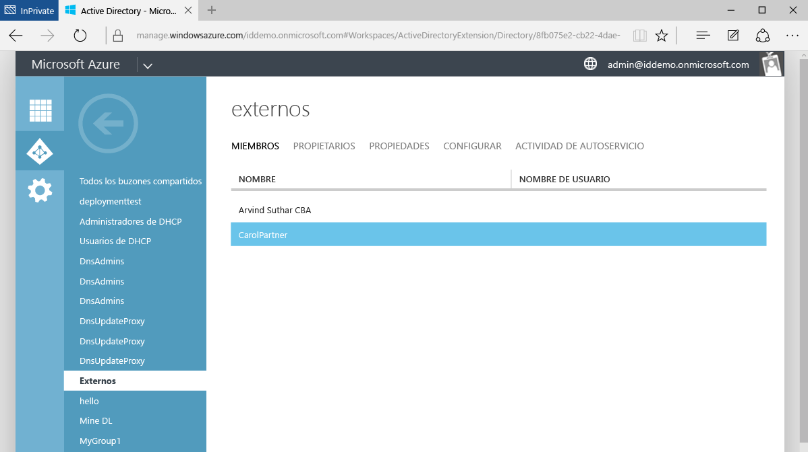

5. Carol recibe un correo electrónico con un vínculo para aceptar la invitación. Cuando inicia sesión, se le redirige al panel de acceso a aplicaciones para tener acceso a Moodle y Salesforce.

Eso es todo lo que hay que hacer para agregar usuarios de compañías asociadas en colaboración B2B de Azure AD. Este tutorial ha mostrado cómo agregar los usuarios Alice, Bob y Carol al directorio de Contoso mediante tres archivos .csv independientes. Este proceso puede ser más fácil si se condensan los archivos .csv independientes en un único archivo. 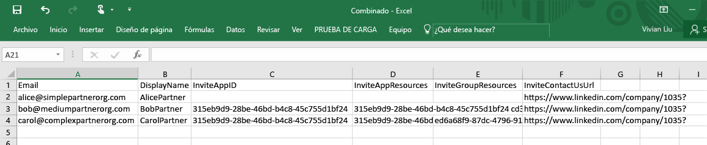

## Artículos relacionados
Examine nuestros otros artículos sobre la colaboración B2B de Azure AD:

- [¿Qué es la colaboración B2B de Azure AD?](active-directory-b2b-what-is-azure-ad-b2b.md)
- [Cómo funciona](active-directory-b2b-how-it-works.md)
- [Referencia de formato de archivo CSV](active-directory-b2b-references-csv-file-format.md)
- [Formato de token de usuario externo](active-directory-b2b-references-external-user-token-format.md)
- [Cambios de atributo de objeto de usuario externo](active-directory-b2b-references-external-user-object-attribute-changes.md)
- [Limitaciones de la vista previa actual](active-directory-b2b-current-preview-limitations.md)
- [Índice de artículos sobre la administración de aplicaciones en Azure Active Directory](active-directory-apps-index.md)

<!---HONumber=AcomDC_0511_2016-->