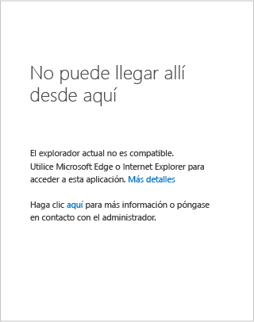
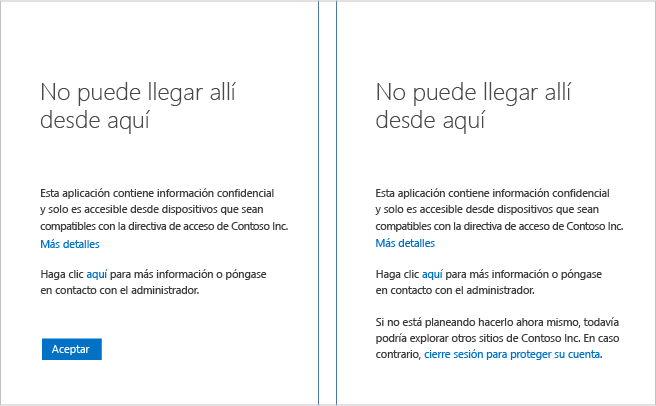

# No puede llegar ahí desde aquí en un dispositivo Windows

Durante un intento de, por ejemplo, acceder a la intranet de SharePoint Online de su organización puede llegar a una página que indique que *no se puede llegar a ese sitio desde este otro*. Ve esta página porque el administrador ha configurado una directiva de acceso condicional que impide el acceso a los recursos de su organización en determinadas condiciones. Aunque puede que sea necesario que se ponga en contacto con el departamento de soporte técnico o con el administrador para solucionar el problema, antes de hacerlo puede probar varias cosas.

Si usa un dispositivo con **Windows**, debe comprobar lo siguiente:

- ¿Usa un explorador compatible?

- ¿Ejecuta una versión compatible de Windows en el dispositivo?

- ¿Es compatible con el dispositivo?

## Explorador compatible

Si el administrador ha configurado una directiva de acceso condicional, solo puede acceder a los recursos de su organización mediante un explorador compatible. En los dispositivos con Windows, solo se admiten **Internet Explorer** y **Edge**.

Es fácil identificar si no se puede acceder a un recurso debido a que el explorador no es compatible, solo hay que examinar la sección de detalles de la página de error:

La única solución es utilizar un explorador compatible con la aplicación de la plataforma del dispositivo. Para obtener una lista completa de los exploradores compatibles, consulte la sección [Exploradores compatibles](active-directory-conditional-access-supported-apps.md).  

## Versiones compatibles de Windows

Las siguientes condiciones deben cumplirse en el dispositivo: 

- Si ejecuta un sistema operativo de equipo de escritorio Windows en el dispositivo, debe ser Windows 7, o cualquier versión posterior.
- Si ejecuta un sistema operativo Windows Server en el dispositivo, debe ser Windows Server 2008 R2, o cualquier versión posterior. 

## Dispositivos compatible

El administrador puede haber configurado una directiva de acceso condicional que permite el acceso a los recursos de la organización solo desde dispositivos compatibles. Para ser compatible, un dispositivo debe haberse unido a una versión local de Active Directory o a Azure Active Directory.

Es fácil identificar si no se puede acceder a un recurso debido a que el dispositivo no es compatible, solo hay que examinar la sección de detalles de la página de error:
 

### ¿Se ha unido el dispositivo a una versión local de Active Directory?

**Si el dispositivo se ha unido a una versión local de Active Directory de la organización:**

1. Asegúrese de que ha iniciado sesión en Windows con su cuenta de trabajo (su cuenta de Active Directory).
2. Conéctese a su red corporativa a través de una red privada virtual (VPN) o DirectAccess.
3. Una vez conectado, bloquee la sesión de Windows presionando a la vez la tecla Windows y la tecla L.
4. Desbloquee la sesión de Windows, para lo que debe especificar las credenciales de su cuenta profesional.
5. Espere un minuto e intente de nuevo acceder a la aplicación o servicio.
6. Si aparece la misma página, haga clic en **Más detalles** y póngase en contacto con el administrador para informarle de los detalles.

### ¿No se ha unido el dispositivo a una versión local de Active Directory?

Si el dispositivo no se ha unido a una versión local Active Directory y ejecuta Windows 10, tiene dos opciones:

* Ejecutar Azure AD Join
* Agregar su cuenta profesional o educativa a Windows

Para obtener información acerca de las diferencias entre estas opciones, consulte [Uso de dispositivos de Windows 10 en el área de trabajo](active-directory-azureadjoin-windows10-devices.md).  
Si el dispositivo:

- Pertenece a su organización, debe ejecutar Azure AD Join.
- Es un dispositivo personal o un teléfono Windows, debe agregar su cuenta profesional o educativa a Windows 

#### Azure AD Join en Windows 10

Los pasos para unir un dispositivo a Azure AD están vinculados a la versión de Windows 10 en que se ejecuta. Para determinar la versión del sistema operativo Windows 10, ejecute el comando **winver**: 

**Actualización de aniversario de Windows 10 (versión 1607):**

1. Abra la aplicación de **configuración** .
2. Haga clic en **Cuentas** > **Access work or school** (Acceder a la cuenta profesional o educativa).
3. Haga clic en **Conectar**.
4. Haga clic en **Join this device to Azure AD** (Conectar este dispositivo a Azure AD).
5. Autentique su organización, proporcione Multi-Factor Authentication, si fuera necesario, y siga los pasos que se muestran.
6. Cierre la sesión y vuelva a iniciarla con su cuenta profesional.
7. Intente volver a acceder a la aplicación.

**Actualización de Windows de 10 de noviembre de 2015 (versión 1511):**

1. Abra la aplicación de **configuración** .
2. Haga clic en **Sistema** > **About** (Acerca de).
3. Haga clic en **Unirse a Azure AD**.
4. Autentique su organización, proporcione Multi-Factor Authentication, si fuera necesario, y siga los pasos que se muestran.
5. Cierre la sesión y vuelva a iniciarla con su cuenta profesional (cuenta de Azure AD).
6. Intente volver a acceder a la aplicación.

#### Workplace Join en Windows 8.1

Si el dispositivo no está unido a un dominio y ejecuta Windows 8.1, para unirse al lugar de trabajo e inscribirse en Microsoft Intune, siga estos pasos:

1. Abra **Configuración de PC**.
2. Haga clic en **Red** > **Área de trabajo**.
3. Haga clic en **Unir**.
4. Autentique su organización, proporcione Multi-Factor Authentication, si fuera necesario, y siga los pasos que se muestran.
5. Haga clic en **Activar**.
6. Intente volver a acceder a la aplicación.

#### Agregar su cuenta profesional o educativa a Windows 

**Actualización de aniversario de Windows 10 (versión 1607):**

1. Abra la aplicación de **configuración** .
2. Haga clic en **Cuentas** > **Access work or school** (Acceder a la cuenta profesional o educativa).
3. Haga clic en **Conectar**.
4. Autentique su organización, proporcione Multi-Factor Authentication, si fuera necesario, y siga los pasos que se muestran.
5. Intente volver a acceder a la aplicación.

**Actualización de Windows de 10 de noviembre de 2015 (versión 1511):**

1. Abra la aplicación de **configuración** .
2. Haga clic en **Cuentas** > **Your accounts** (Sus cuentas).
3. Haga clic en **Add work or school account**(Agregar cuenta profesional o educativa).
4. Autentique su organización, proporcione Multi-Factor Authentication, si fuera necesario, y siga los pasos que se muestran.
5. Intente volver a acceder a la aplicación.

## pasos siguientes
[Acceso condicional de Azure Active Directory](active-directory-conditional-access-azure-portal.md)

