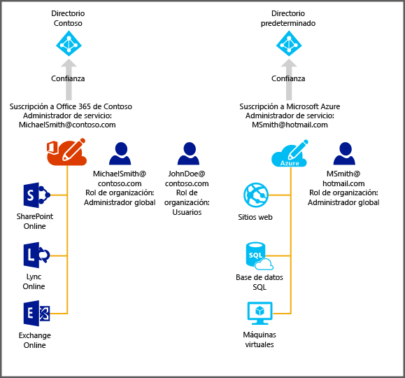

# Administración del directorio para la suscripción de Office 365 en Azure
En este artículo se describe cómo administrar un directorio que se creó para una suscripción de Office 365 mediante el Portal de Azure clásico. Para iniciar sesión en el Portal de Azure clásico, es preciso ser administrador de servicios o coadministrador de una suscripción de Azure. Si aún no dispone de una suscripción de Azure, desde este vínculo puede registrarse ahora mismo para disfrutar de una [evaluación gratuita durante 30 días](https://azure.microsoft.com/trial/get-started-active-directory/) e implementar su primera solución en la nube en menos de 5 minutos. Asegúrese de que utiliza la misma cuenta profesional o educativa que utilizó para iniciar sesión en Office 365.

> [!IMPORTANT]
> Microsoft recomienda administrar Azure AD con el [Centro de administración de Azure AD](https://aad.portal.azure.com) en Azure Portal en lugar de usar el portal de Azure clásico al que se hace referencia en este artículo.

Después de completar la suscripción a Azure, puede iniciar sesión en el Portal de Azure clásico y acceder a los servicios de Azure. Haga clic en la extensión de Active Directory para administrar el mismo directorio que autentica a los usuarios de Office 365.

Si ya tiene una suscripción a Azure, el proceso para administrar un directorio adicional también es sencillo y directo. Por ejemplo, suponga que Michael Smith tiene una suscripción a Office 365 para Contoso.com. También tiene una suscripción a Azure, que realizó con su cuenta Microsoft, msmith@hotmail.com. En este caso, administra dos directorios.

| Subscription | Office 365 | Las tablas de Azure |
| --- | --- | --- |
|   Nombre para mostrar | Contoso | Directorio de Azure Active Directory (Azure AD) predeterminado |
|   Nombre de dominio | contoso.com | msmithhotmail.onmicrosoft.com |

Michael Smith desea administrar las identidades de usuario en el directorio Contoso, ya que ha iniciado sesión en Azure con su cuenta de Microsoft. Quiere habilitar características de Azure AD, como la autenticación multifactor. El diagrama siguiente puede ayudarle a ilustrar el proceso.

En este caso, ambos directorios son independientes entre sí.

## Para administrar dos directorios independientes
Para que Michael Smith pueda administrar ambos directorios mientras tenga una sesión iniciada en Azure como msmith@hotmail.com, debe llevar a cabo los siguientes pasos:

> [!NOTE]
> Estos pasos solo se pueden realizar cuando un usuario ha iniciado sesión con una cuenta Microsoft. Si el usuario ha iniciado sesión con una cuenta profesional o educativa, la opción **Usar directorio existente** no está disponible. Las cuentas profesionales o educativas solo se pueden autenticar por su directorio particular (es decir, el directorio donde se almacena la cuenta profesional o educativa, y que posee el negocio o la escuela).
>
>

1. Inicie sesión en el [Portal de Azure clásico](https://manage.windowsazure.com) como msmith@hotmail.com.
2. Haga clic en **Nuevo** > **App Services** > **Active Directory** > **Directorio** > **Creación personalizada**.
3. Haga clic en Usar directorio existente y active la casilla **Estoy listo para cerrar la sesión ahora** .
4. Inicie sesión en el Portal de Azure clásico como administrador global de Contoso.onmicrosoft.com (por ejemplo, msmith@contoso.com).
5. Cuando se le pregunte **¿Usar el directorio Contoso con Azure?**, haga clic en **Continuar**.
6. Haga clic en **Cerrar sesión ahora**.
7. Inicie sesión en el Portal de Azure clásico como msmith@hotmail.com. El directorio Contoso y el directorio predeterminado aparecen en la extensión de Active Directory.

Después de realizar estos pasos, msmith@hotmail.com es un administrador global en el directorio Contoso.

## Para administrar recursos como administrador global
Ahora supongamos que Jane Doe necesita administrar sitios web y recursos de la base de datos asociados con la suscripción de Azure de msmith@hotmail.com. Antes de que pueda hacerlo, Michael Smith debe realizar estos pasos adicionales:

1. Inicie sesión en el [Portal de Azure clásico](https://manage.windowsazure.com) mediante la cuenta de administrador de servicios de la suscripción de Azure (en este ejemplo, msmith@hotmail.com).
2. Transfiera la suscripción al directorio Contoso: haga clic en **Configuración** > **Suscripciones** > seleccione la suscripción > **Editar directorio** > y seleccione **Contoso (Contoso.com)**. Como parte de la transferencia, se eliminan todas las cuentas profesionales o educativas que sean coadministradores de la suscripción.
3. Agregue a Jane Doe como coadministradora de la suscripción: haga clic en **Configuración** > **Administradores** > seleccione la suscripción > **Agregar**> y escriba **JohnDoe@Contoso.com**.

## Pasos siguientes
Para más información sobre la relación entre suscripciones y directorios, consulte [Asociación de una suscripción con un directorio](active-directory-how-subscriptions-associated-directory.md).
