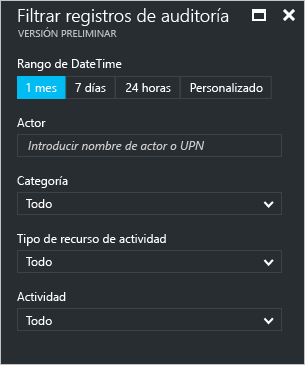
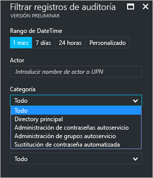
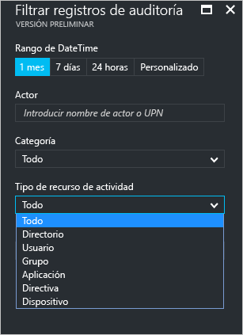
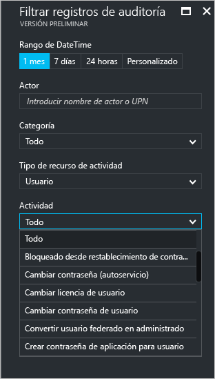
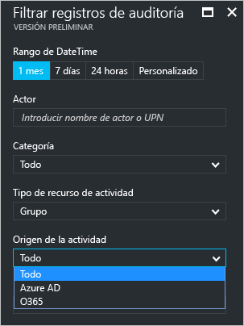

# Informes de actividad de auditoría en el portal de Azure Active Directory (versión preliminar)

Con los informes de la [versión preliminar](active-directory-preview-explainer.md) de Azure Active Directory, obtendrá toda la información que necesita para determinar cómo marcha el entorno.

La arquitectura de los informes de Azure Active Directory consta de los siguientes componentes:

- **Actividad** 
    - **Actividades de inicio de sesión** : información sobre el uso de las aplicaciones administradas y las actividades de inicio de sesión de usuario
    - **Registros de auditoría**: información de la actividad del sistema sobre los usuarios y la administración de grupos, sus aplicaciones administradas y actividades de directorio.
- **Seguridad** 
    - **Inicios de sesión peligrosos**: un inicio de sesión peligroso es un indicador de un intento de inicio de sesión que puede haber realizado alguien que no es el propietario legítimo de una cuenta de usuario. Para más información, consulte Inicios de no seguros.
    - **Usuarios marcados en riesgo**: un usuario en peligro es un indicador de una cuenta de usuario que puede haber estado en peligro. Para más información, consulte la sección Usuarios marcados en riesgo.

Este tema ofrece una visión general de las actividades de auditoría.
 
## Registros de auditoría

Los registros de auditoría de Azure Active Directory proporcionan registros de las actividades del sistema de cara al cumplimiento.

Hay tres categorías principales de actividades relacionadas con la auditoría en Azure Portal:

- Usuarios y grupos   

- aplicaciones

- Directorio   

Para obtener una lista completa de las actividades de informe de auditoría, consulte la [lista de eventos de informe de auditoría](active-directory-reporting-audit-events.md#list-of-audit-report-events).

El punto de entrada a todos los datos de auditoría es **Registros de auditoría** en la sección **Actividad** de **Azure Active Directory**.

Un registro de auditoría tiene una vista de lista que muestra los actores (*quién*), las actividades (*qué*) y los destinos.

Si hace clic en un elemento de la vista de lista, puede obtener más detalles acerca de él.

## Registros de auditoría de los usuarios y grupos

Con los informes de auditoría basadas en grupos y usuarios, puede obtener respuestas a preguntas como:

- ¿Qué tipos de actualizaciones se han aplicado a los usuarios?

- ¿Cuántos usuarios han cambiado?

- ¿Cuántas contraseñas han cambiado?

- ¿Qué ha hecho un administrador en un directorio?

- ¿Cuáles son los grupos que se han agregado?

- ¿Hay grupos con cambios de pertenencia?

- ¿Se han cambiado los propietarios del grupo?

- ¿Qué licencias se han asignado a un grupo o un usuario?

Si desea revisar los datos de auditoría relacionados con usuarios y grupos, puede buscar una vista filtrada en **Registros de auditoría** en la sección **Actividad** de **Usuarios y grupos**.

## Registros de auditoría de la aplicación
Con los informes de auditoría basadas en aplicaciones, puede obtener respuestas a preguntas tales como:

* ¿Cuáles son las aplicaciones que se han agregado o actualizado?
* ¿Cuáles son las aplicaciones que se han quitado?
* ¿Ha cambiado el principal de servicio para una aplicación?
* ¿Se han cambiado los nombres de las aplicaciones?
* ¿Quién dio el consentimiento a una aplicación?

Si desea revisar los datos de auditoría relacionados con las aplicaciones, puede buscar una vista filtrada en **Registros de auditoría** en la sección **Actividad** de **Aplicaciones empresariales**.

## Filtrado de registros de auditoría
Puede filtrar inicios de sesión para limitar la cantidad de datos que se muestran con los siguientes campos:

- Fecha y hora

- Nombre principal de usuario del actor

- Categoría

- Tipo de recurso de actividad

- Actividad

El filtro **Categoría** le permite restringir el ámbito de un informe de auditoría según las siguientes categorías:

- Core Directory (Directorio principal)

- Self-service Password Management (Administración de contraseñas de autorservicio)

- Self-service Group Management (Administración de grupos de autoservicio)

- Automated Password Rollover (Sustitución automática de contraseña) 

El contenido de la lista **Activity resource type** (Tipo de recurso de actividad) está enlazado a su punto de entrada a esta hoja.  
Si el punto de entrada es Azure Active Directory, esta lista contiene todos los tipos posibles de actividad:

- Directorio

- Usuario

- Grupo 

- Application 

- Directiva

- Dispositivo

Las actividades de la lista están clasificadas por tipo de actividad.
Por ejemplo, si tiene **Usuario** seleccionado como **Tipo de actividad**, la lista **Actividad** solo contiene las actividades relacionadas con grupos.   

Si selecciona **Grupo** como **Tipo de recurso de actividad**, obtendrá una opción de filtro adicional que también le permite filtrar por los siguientes **Orígenes de actividad**:

- Azure AD

- O365

Otro método para filtrar las entradas del registro de auditoría es buscar entradas específicas.

## Pasos siguientes
Consulte la [guía de informes de Azure Active Directory](active-directory-reporting-guide.md).

