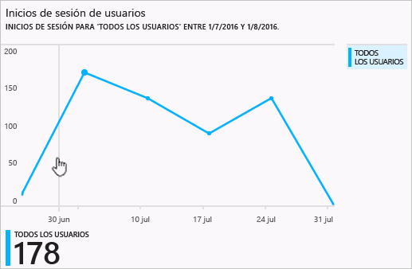
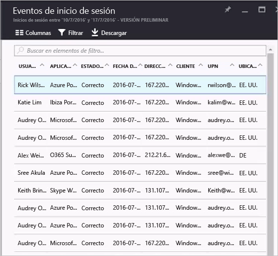

# Informes de actividad de inicio de sesión en el portal de Azure Active Directory (versión preliminar)

Con los informes de la [versión preliminar](active-directory-preview-explainer.md) de Azure Active Directory, obtendrá toda la información que necesita para determinar cómo marcha el entorno.

La arquitectura de los informes de Azure Active Directory consta de los siguientes componentes:

- **Actividad** 
    - **Actividades de inicio de sesión** : información sobre el uso de las aplicaciones administradas y las actividades de inicio de sesión de usuario
    - **Registros de auditoría**: información de la actividad del sistema sobre los usuarios y la administración de grupos, sus aplicaciones administradas y actividades de directorio.
- **Seguridad** 
    - **Inicios de sesión peligrosos**: un inicio de sesión peligroso es un indicador de un intento de inicio de sesión que puede haber realizado alguien que no es el propietario legítimo de una cuenta de usuario. Para más información, consulte Inicios de no seguros.
    - **Usuarios marcados en riesgo**: un usuario en peligro es un indicador de una cuenta de usuario que puede haber estado en peligro. Para más información, consulte la sección Usuarios marcados en riesgo.

Este tema ofrece una visión general de las actividades de inicio de sesión.

## Actividades de inicio de sesión

Con la información proporcionada por el informe de inicio de sesión del usuario, puede encontrar respuestas a preguntas tales como:

* ¿Cuál es el patrón de inicio de sesión de un usuario?
* ¿Cuántos usuarios tienen usuarios que han iniciado sesión durante una semana?
* ¿Cuál es el estado de estos inicios de sesión?

El punto de entrada a los datos es el gráfico de inicio de sesión del usuario en la sección **Introducción** de **Usuarios y grupos**.

 

El gráfico de inicio de sesión de usuario muestra agregaciones semanales de inicios de sesión para todos los usuarios en un período determinado. El valor predeterminado para el período es 30 días.

Al hacer clic en un día en el gráfico de inicio de sesión, obtendrá una lista detallada de las actividades de inicio de sesión.

Cada fila de la lista de actividades de inicio de sesión le ofrece la información detallada acerca del inicio de sesión seleccionado como:

* ¿Quién ha iniciado sesión?
* ¿Cuál era el UPN relacionado?
* ¿Qué aplicación era el destino del inicio de sesión?
* ¿Cuál es la dirección IP del inicio de sesión?
* ¿Cuál es el estado del inicio de sesión?

## Uso de las aplicaciones administradas

Con una vista centrada en la aplicación de los datos de inicio de sesión, puede responder a preguntas tales como:

* ¿Quién está usando mis aplicaciones?
* ¿Cuáles son las tres aplicaciones principales en su organización?
* Recientemente he implementado una aplicación. ¿Cómo sigue?

El punto de entrada a los datos son las tres aplicaciones principales de su organización en el informe de los últimos 30 días en la sección **Introducción** en **Aplicaciones empresariales**.

 

Agregaciones semanales del gráfico de uso de la aplicación de inicios de sesión para las tres aplicaciones principales en un período determinado. El valor predeterminado para el período es 30 días.

Si lo desea, puede establecer el foco en una aplicación específica.

Al hacer clic en un día del gráfico de uso de la aplicación, obtendrá una lista detallada de las actividades de inicio de sesión.

La opción **Inicios de sesión** ofrece una descripción completa de todos los eventos de inicio de sesión para sus aplicaciones.

Con el selector de columnas, puede seleccionar los campos de datos que quiere mostrar.

## Filtrado de inicios de sesión
Puede filtrar inicios de sesión para limitar la cantidad de datos que se muestran con los siguientes campos:

* Fecha y hora 
* Nombre principal de usuario (UPN)
* Nombre de la aplicación
* Nombre del cliente
* Estado de inicio de sesión

Otro método para filtrar las entradas de las actividades de inicio de sesión consiste en buscar entradas específicas.
El método de búsqueda le permite definir el ámbito de los inicios de sesión en torno a **usuarios**, **grupos** o **aplicaciones** específicos.

## Pasos siguientes
Consulte la [guía de informes de Azure Active Directory](active-directory-reporting-guide.md).

