---

title: Informes de Azure Active Directory | Microsoft Docs
description: Enumera los distintos informes disponibles para Azure Active Directory
services: active-directory
documentationcenter: 
author: MarkusVi
manager: femila
editor: 
ms.assetid: 6141a333-38db-478a-927e-526f1e7614f4
ms.service: active-directory
ms.devlang: na
ms.topic: get-started-article
ms.tgt_pltfrm: na
ms.workload: identity
ms.date: 04/06/2017
ms.author: markvi
ms.translationtype: Human Translation
ms.sourcegitcommit: 2db2ba16c06f49fd851581a1088df21f5a87a911
ms.openlocfilehash: c7fe995f097c72ab5275249538fe2bb65efac256
ms.contentlocale: es-es
ms.lasthandoff: 05/09/2017

---
# Informes de Azure Active Directory

*Esta documentación forma parte de la [guía de informes de Azure Active Directory](active-directory-reporting-guide.md).*

Con los informes de Azure Active Directory (Azure AD), puede obtener toda la información que necesita para determinar cómo marcha el entorno.

Hay dos áreas principales de informes:

* **Actividades de inicio de sesión** : información sobre el uso de las aplicaciones administradas y las actividades de inicio de sesión de usuario
* **Registros de auditoría** : información de la actividad del sistema acerca de los usuarios y administración de grupos, sus aplicaciones administradas y actividades de directorio

Según el ámbito de los datos que esté buscando, puede tener acceso a estos informes haciendo clic en **Usuarios y grupos** o **Aplicaciones empresariales** en la lista de servicios de [Azure Portal](https://portal.azure.com).

## Actividades de inicio de sesión
### Actividades de inicio de sesión del usuario
Con la información proporcionada por el informe de inicio de sesión del usuario, puede encontrar respuestas a preguntas tales como:

* ¿Cuál es el patrón de inicio de sesión de un usuario?
* ¿Cuántos usuarios tienen usuarios que han iniciado sesión durante una semana?
* ¿Cuál es el estado de estos inicios de sesión?

El punto de entrada a los datos es el gráfico de inicio de sesión del usuario en la sección **Introducción** de **Usuarios y grupos**.

 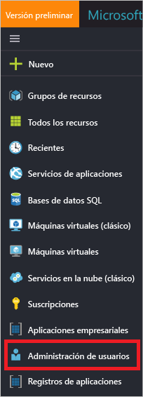

El gráfico de inicio de sesión de usuario muestra agregaciones semanales de inicios de sesión para todos los usuarios en un período determinado. El valor predeterminado para el período es 30 días.

Al hacer clic en un día en el gráfico de inicio de sesión, obtendrá una lista detallada de las actividades de inicio de sesión.

Cada fila de la lista de actividades de inicio de sesión le ofrece la información detallada acerca del inicio de sesión seleccionado como:

* ¿Quién ha iniciado sesión?
* ¿Cuál era el UPN relacionado?
* ¿Qué aplicación era el destino del inicio de sesión?
* ¿Cuál es la dirección IP del inicio de sesión?
* ¿Cuál es el estado del inicio de sesión?

### Uso de las aplicaciones administradas
Con una vista centrada en la aplicación de los datos de inicio de sesión, puede responder a preguntas tales como:

* ¿Quién está usando mis aplicaciones?
* ¿Cuáles son las tres aplicaciones principales en su organización?
* Recientemente he implementado una aplicación. ¿Cómo sigue?

El punto de entrada a los datos son las tres aplicaciones principales de su organización en el informe de los últimos 30 días en la sección **Introducción** en **Aplicaciones empresariales**.

 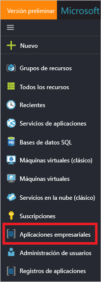

Agregaciones semanales del gráfico de uso de la aplicación de inicios de sesión para las tres aplicaciones principales en un período determinado. El valor predeterminado para el período es 30 días.

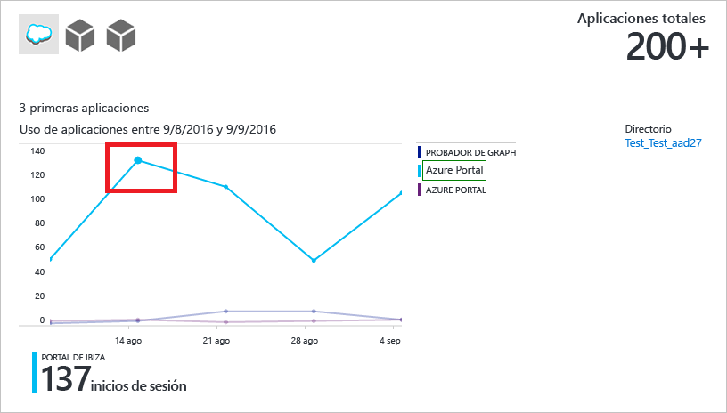

Si lo desea, puede establecer el foco en una aplicación específica.

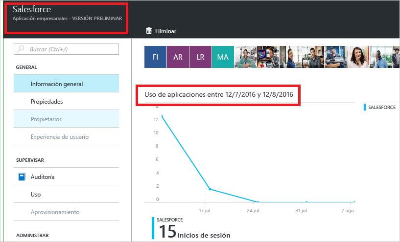

Al hacer clic en un día del gráfico de uso de la aplicación, obtendrá una lista detallada de las actividades de inicio de sesión.

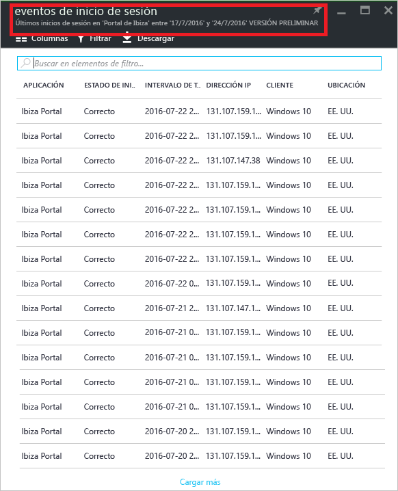

La opción **Inicios de sesión** ofrece una descripción completa de todos los eventos de inicio de sesión para sus aplicaciones.

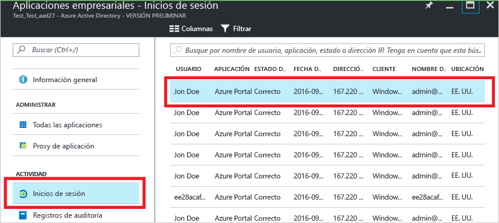

Con el selector de columnas, puede seleccionar los campos de datos que quiere mostrar.

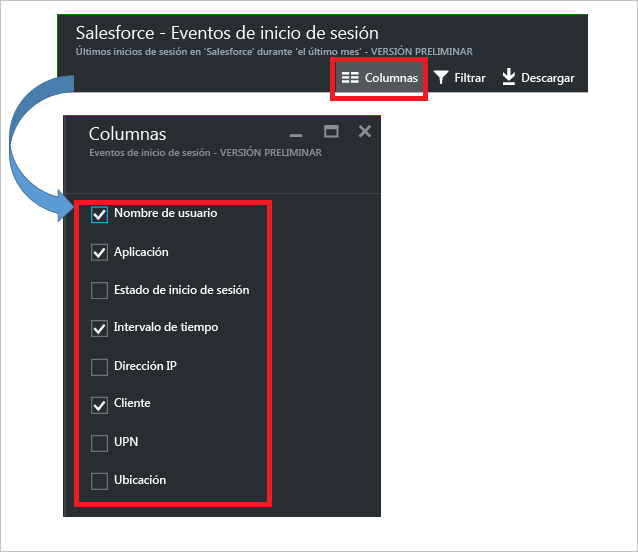

### Filtrado de inicios de sesión
Puede filtrar inicios de sesión para limitar la cantidad de datos que se muestran con los siguientes campos:

* Fecha y hora 
* Nombre principal de usuario (UPN)
* Nombre de la aplicación
* Nombre del cliente
* Estado de inicio de sesión

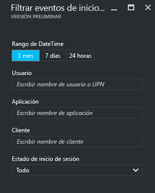

Otro método para filtrar las entradas de las actividades de inicio de sesión consiste en buscar entradas específicas.
El método de búsqueda le permite definir el ámbito de los inicios de sesión en torno a **usuarios**, **grupos** o **aplicaciones** específicos.

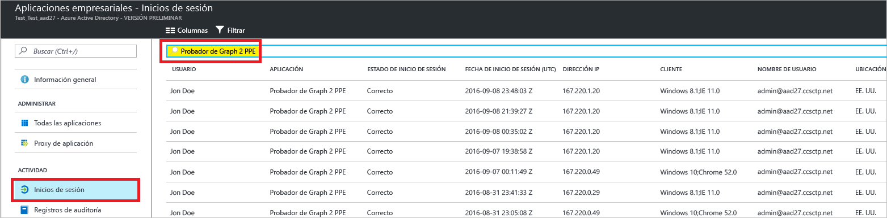

## Registros de auditoría
Los registros de auditoría de Azure Active Directory proporcionan registros de las actividades del sistema para cumplimiento.

Hay tres categorías principales de actividades relacionadas con la auditoría en Azure Portal:

* Usuarios y grupos   
* aplicaciones
* Directorio   

Para obtener una lista completa de las actividades de informe de auditoría, consulte la [lista de eventos de informe de auditoría](active-directory-reporting-audit-events.md#list-of-audit-report-events).

El punto de entrada a todos los datos de auditoría es **Registros de auditoría** en la sección **Actividad** de **Azure Active Directory**.

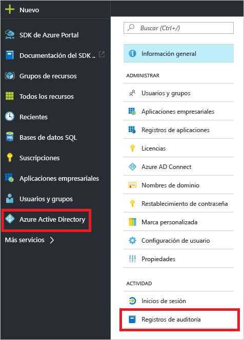

Un registro de auditoría tiene una vista de lista que muestra los actores (quién), las actividades (qué) y los destinos.

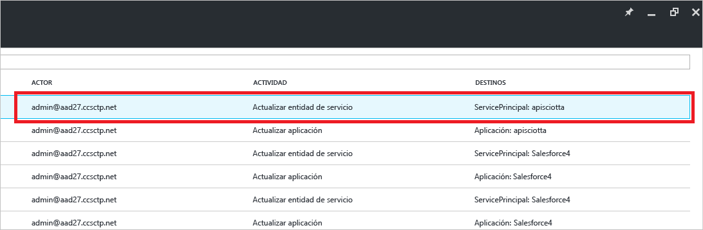

Si hace clic en un elemento de la vista de lista, puede obtener más detalles acerca de él.

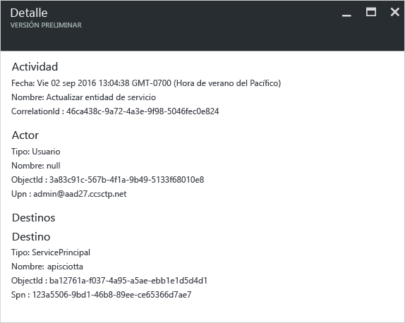

### Registros de auditoría de los usuarios y grupos
Con los informes de auditoría basadas en grupos y usuarios, puede obtener respuestas a preguntas como:

* ¿Qué tipos de actualizaciones se han aplicado a los usuarios?
* ¿Cuántos usuarios han cambiado?
* ¿Cuántas contraseñas han cambiado?
* ¿Qué ha hecho un administrador en un directorio?
* ¿Cuáles son los grupos que se han agregado?
* ¿Hay grupos con cambios de pertenencia?
* ¿Se han cambiado los propietarios del grupo?
* ¿Qué licencias se han asignado a un grupo o un usuario?

Si desea revisar los datos de auditoría relacionados con usuarios y grupos, puede buscar una vista filtrada en **Registros de auditoría** en la sección **Actividad** de **Usuarios y grupos**.

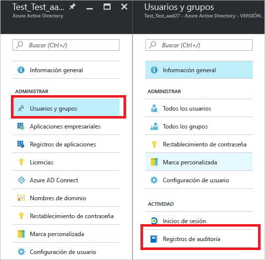

### Registros de auditoría de la aplicación
Con los informes de auditoría basadas en aplicaciones, puede obtener respuestas a preguntas tales como:

* ¿Cuáles son las aplicaciones que se han agregado o actualizado?
* ¿Cuáles son las aplicaciones que se han quitado?
* ¿Ha cambiado el principal de servicio para una aplicación?
* ¿Se han cambiado los nombres de las aplicaciones?
* ¿Quién dio el consentimiento a una aplicación?

Si desea revisar los datos de auditoría relacionados con las aplicaciones, puede buscar una vista filtrada en **Registros de auditoría** en la sección **Actividad** de **Aplicaciones empresariales**.

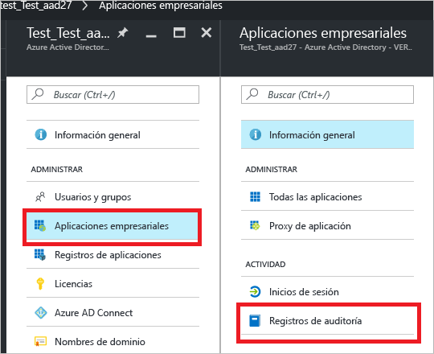

### Filtrado de registros de auditoría
Puede filtrar inicios de sesión para limitar la cantidad de datos que se muestran con los siguientes campos:

* Fecha y hora
* Nombre principal de usuario del actor
* Tipo de actividad
* Actividad

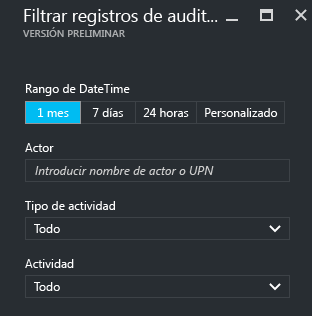

El contenido de la lista **Tipo de actividad** está asociado a su punto de entrada para esta hoja.  
Si el punto de entrada es Azure Active Directory, esta lista contiene todos los tipos posibles de actividad:

* Application 
* Grupo 
* Usuario
* Dispositivo
* Directorio
* Directiva
* Otros

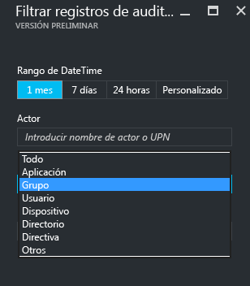

Las actividades de la lista están clasificadas por tipo de actividad.
Por ejemplo, si tiene **Grupo** seleccionado como **Tipo de actividad**, la lista **Actividad** solo contiene las actividades relacionadas con grupos.   

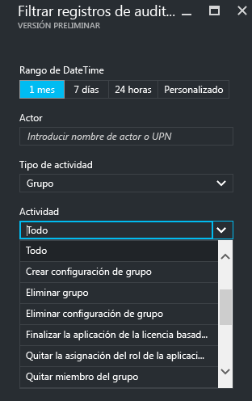

Otro método para filtrar las entradas del registro de auditoría es buscar entradas específicas.

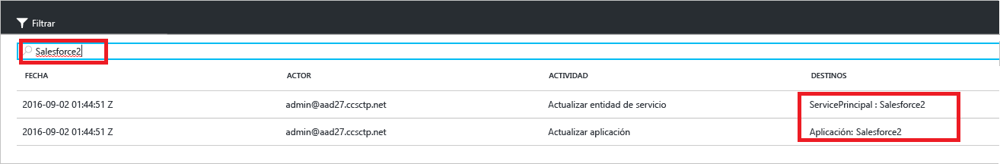

## Pasos siguientes
Consulte la [guía de informes de Azure Active Directory](active-directory-reporting-guide.md).

