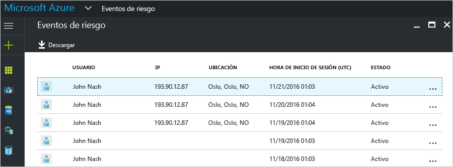
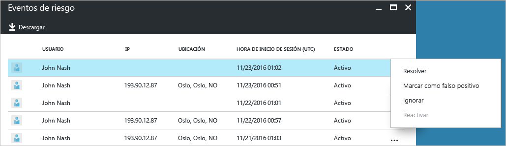
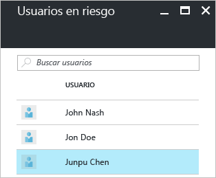
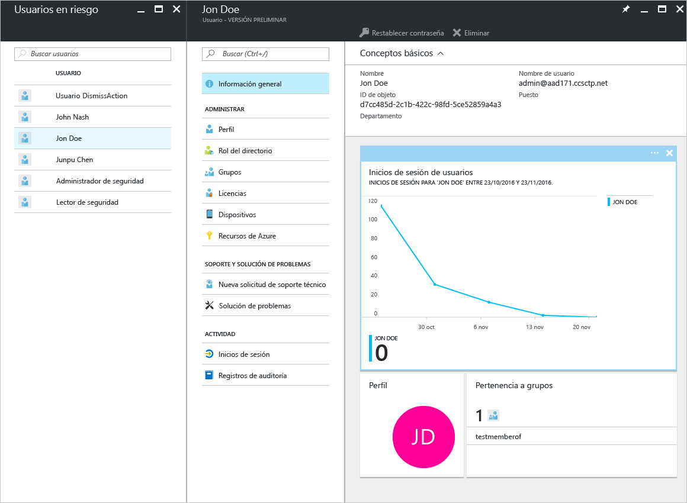

# Informes de seguridad en las ediciones gratuita y básica de Azure Active Directory: versión preliminar

Con los informes de seguridad de la [versión preliminar](active-directory-preview-explainer.md) de Azure Active Directory, puede conocer la probabilidad de que haya cuentas de usuario en peligro en su entorno. 

Azure Active Directory detecta acciones sospechosas relacionadas con las cuentas de usuario. Para cada acción detectada, se crea un registro denominado *evento de riesgo*. Para más información, consulte [Azure Active Directory risk events](active-directory-identity-protection-risk-events.md) (Eventos de riesgo de Azure Active Directory). 

Los eventos de riesgo detectados se utilizan para calcular:

- **Inicios de sesión peligrosos**: un inicio de sesión peligroso es un indicador de un intento de inicio de sesión que puede haber realizado alguien que no es el propietario legítimo de una cuenta de usuario. Para más información, consulte la sección sobre los [inicios de sesión peligrosos](active-directory-identityprotection.md#risky-sign-ins). 

- **Usuarios marcados en riesgo**: un usuario en peligro es un indicador de una cuenta de usuario que puede haber estado en peligro. Para más información, consulte la sección sobre los [usuarios marcados en riesgo](active-directory-identityprotection.md#users-flagged-for-risk).  

## Informe de inicios de sesión peligrosos

Las ediciones gratuita y básica de Azure Active Directory proporcionan una lista de inicios de sesión peligrosos que se han detectado y se notifican a los usuarios. En el informe de eventos de riesgo se especifican:

- **Usuario**: el nombre del usuario que se utilizó durante la operación de inicio de sesión
- **IP**: la dirección IP del dispositivo que se usó para conectarse a Azure Active Directory
- **Ubicación**: la ubicación utilizada para conectarse a Azure Active Directory
- **Hora de inicio de sesión**: la hora en que se realizó el inicio de sesión
- **Estado**: el estado del inicio de sesión

Este informe proporciona una opción para descargar los datos del informe.

Con los datos derivados de la investigación del inicio de sesión no seguro, puede proporcionar información a Azure Active Directory en forma de las siguientes acciones:

- Resolver
- Marcar como falso positivo
- Ignorar
- Reactivar

Para más información, consulte [Cierre manual de eventos de riesgo](active-directory-identityprotection.md#closing-risk-events-manually).

## Informe usuarios en riesgo

La edición gratuita de Azure Active Directory proporciona una lista de cuentas de usuario que pueden haber estado en peligro. 

Al hacer clic en un usuario en la lista, se abre la hoja de datos de dicho usuario.
En el caso de los usuarios que están en riesgo, consulte el historial de inicios de sesión del usuario y restablezca la contraseña, en caso de que sea necesario.

## Pasos siguientes

- Para más información acerca de los informes de Azure Active Directory, consulte [Guía de informes de Azure Active Directory](active-directory-reporting-guide.md).
- Para más información acerca de Azure Active Directory Identity Protection, consulte [Azure Active Directory Identity Protection](active-directory-identityprotection.md).

<!--HONumber=Jan17_HO3-->

