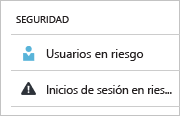
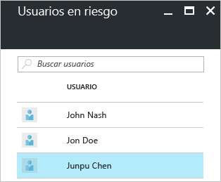
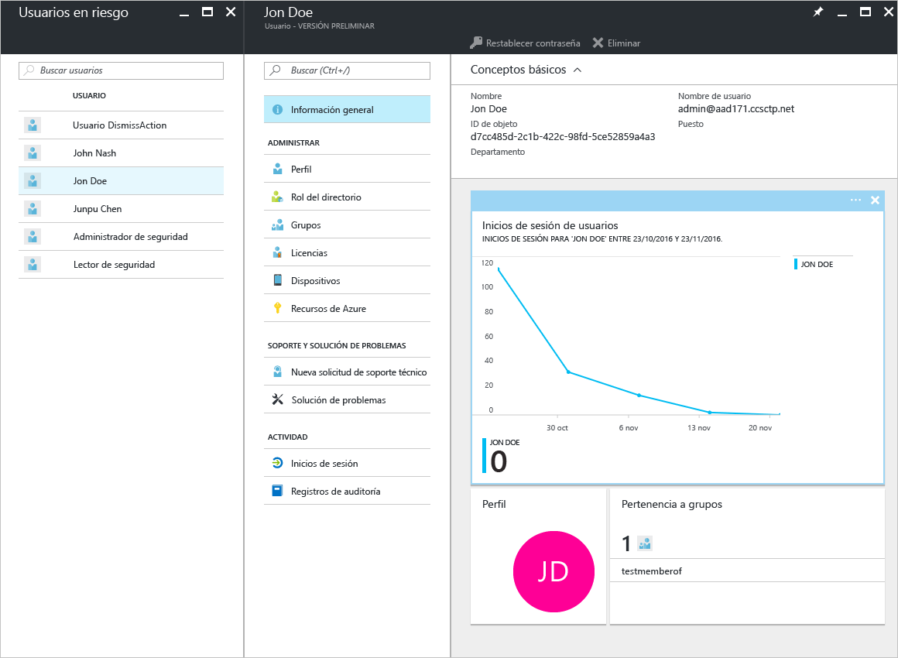
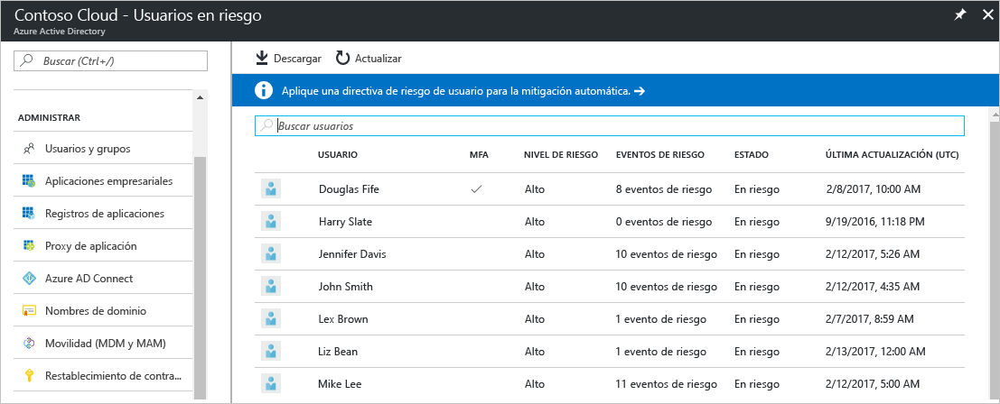
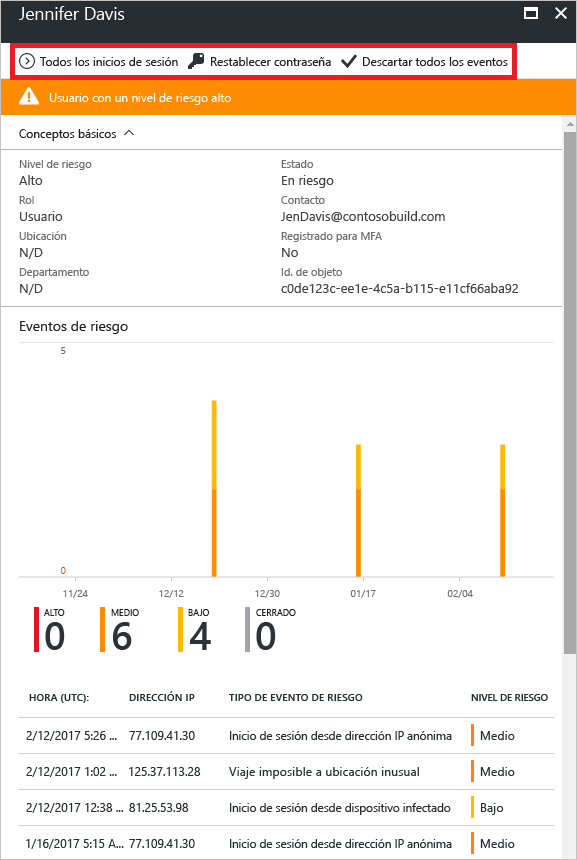
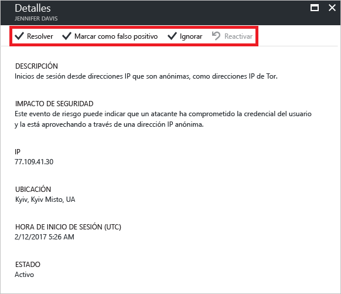

---

title: Informe de seguridad de usuarios en riesgo en el portal de Azure Active Directory | Microsoft Docs
description: "Más información acerca del informe de seguridad de usuarios en riesgo en el portal de Azure Active Directory"
services: active-directory
author: MarkusVi
manager: femila
ms.assetid: addd60fe-d5ac-4b8b-983c-0736c80ace02
ms.service: active-directory
ms.devlang: na
ms.topic: get-started-article
ms.tgt_pltfrm: na
ms.workload: identity
ms.date: 05/04/2017
ms.author: markvi
ms.translationtype: Human Translation
ms.sourcegitcommit: 2db2ba16c06f49fd851581a1088df21f5a87a911
ms.openlocfilehash: 01ecb98c02b2a01007c7f76805d4db4b7aeee1f0
ms.contentlocale: es-es
ms.lasthandoff: 05/09/2017

---
# Informe de seguridad de usuarios en riesgo en el portal de Azure Active Directory

Con los informes de seguridad de Azure Active Directory (Azure AD), puede obtener información acerca de la probabilidad de que haya cuentas de usuario en peligro en su entorno. 

Azure Active Directory detecta acciones sospechosas relacionadas con las cuentas de usuario. Para cada acción detectada, se crea un registro denominado *evento de riesgo*. Para más información, consulte [Azure Active Directory risk events](active-directory-identity-protection-risk-events.md) (Eventos de riesgo de Azure Active Directory). 

Los eventos de riesgo detectados se utilizan para calcular:

- **Inicios de sesión peligrosos**: un inicio de sesión peligroso es un indicador de un intento de inicio de sesión que puede haber realizado alguien que no es el propietario legítimo de una cuenta de usuario. Para más información, consulte la sección sobre los [inicios de sesión peligrosos](active-directory-identityprotection.md#risky-sign-ins). 

- **Usuarios marcados en riesgo**: un usuario en peligro es un indicador de una cuenta de usuario que puede haber estado en peligro. Para más información, consulte la sección sobre los [usuarios marcados en riesgo](active-directory-identityprotection.md#users-flagged-for-risk).  

En Azure Portal, puede encontrar los informes de seguridad en la hoja **Azure Active Directory** de la sección **Seguridad**.  

## Edición gratuita y básica de Azure Active Directory

El informe de usuarios en riesgo de las ediciones gratuita y básica de Azure Active Directory proporciona una lista de cuentas de usuario que podrían estar en peligro. 

Al seleccionar un usuario, se abre la hoja de datos del usuario relacionada.
En el caso de usuarios que están en riesgo, puede revisar el historial de inicios de sesión del usuario y restablecer la contraseña, en caso de que sea necesario.

## Ediciones Azure Active Directory Premium

El informe de usuarios en riesgo de las ediciones Azure Active Directory Premium proporciona lo siguiente:

- Una [lista de cuentas de usuario](active-directory-identityprotection.md#users-flagged-for-risk) que podrían estar en peligro 

- Información agregada sobre los [tipos de eventos de riesgo](active-directory-identity-protection-risk-events.md) que se han detectado

- Una opción para descargar el informe

- Una opción para configurar una [directiva de corrección de riesgos de usuario](active-directory-identityprotection.md#user-risk-security-policy)  

Cuando selecciona un usuario, obtiene una vista detallada del informe para este usuario que le permite:

- Abrir la vista de todos los inicios de sesión

- Restablezca la contraseña del usuario.

- Descartar todos los eventos

- Investigar los eventos de riesgo notificados para el usuario. 

Para investigar un evento de riesgo, seleccione uno de la lista.  
Se abre la hoja **Detalles** de este evento de riesgo. En la hoja **Detalles**, tiene la opción de [cerrar manualmente un evento de riesgo](active-directory-identityprotection.md#closing-risk-events-manually) o de volver a activar un evento de riesgo cerrado manualmente. 

## Pasos siguientes

- Para más información acerca de Azure Active Directory Identity Protection, consulte [Azure Active Directory Identity Protection](active-directory-identityprotection.md).

