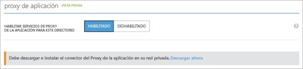

# Habilitación de un proxy de aplicación en el portal clásico y descarga de conectores
En este artículo se explican los pasos para habilitar el proxy de aplicación de Microsoft Azure AD en el directorio en la nube de Azure AD.

Si no sabe cómo puede ayudarle el proxy de aplicación, consulte [Provisión de acceso remoto seguro a aplicaciones locales](active-directory-application-proxy-get-started.md).

## Requisitos previos del proxy de la aplicación
Antes de poder habilitar y usar los servicios del proxy de la aplicación, debe tener lo siguiente:

* Una [suscripción Basic o Premium a Microsoft Azure AD](active-directory-editions.md) y un directorio de Azure AD del que sea administrador global.
* Un servidor en el que se ejecute Windows Server 2012 R2 o 2016 y en el que se pueda instalar el conector del proxy de aplicación. El servidor envía solicitudes a los servicios del proxy de aplicación en la nube y necesita una conexión HTTPS a las aplicaciones que va a publicar.
  * Para habilitar el inicio de sesión único en las aplicaciones publicadas, esta máquina debe estar unida al mismo dominio de AD que las aplicaciones que va a publicar. Para obtener información, consulte [Inicio de sesión único con el proxy de aplicación](active-directory-application-proxy-sso-using-kcd.md)
* Si su organización usa servidores proxy para conectarse a Internet, lea [Trabajo con servidores proxy locales existentes](application-proxy-working-with-proxy-servers.md) para más información sobre cómo configurarlos.

## Apertura de los puertos

Para preparar su entorno para el proxy de aplicación de Azure AD, primero debe habilitar la comunicación con los centros de datos de Azure. Si hay un firewall en la ruta de acceso, es preciso asegurarse de que está abierto con el fin de que el conector pueda realizar solicitudes HTTPS (TCP) al proxy de la aplicación.

1. Abra los siguientes puertos al tráfico **saliente**:

   | Número de puerto | Cómo se usa |
   | --- | --- |
   | 80 | Descarga de listas de revocación de certificados (CRL) al validar el certificado SSL |
   | 443 | Toda la comunicación saliente con el servicio del proxy de aplicación |

   Si el firewall fuerza el tráfico según los usuarios que se originan, abra estos puertos para el tráfico procedente de  los servicios de Windows que se ejecutan como un servicio de red.

   > [!IMPORTANT]
   > La tabla refleja los requisitos de puerto para la versión 1.5.132.0 y versiones más recientes del conector. Si todavía tiene una versión anterior del conector, también deberá habilitar los siguientes puertos: 5671, 8080, 9090, 9091, 9350, 9352 y 10100–10120.
   >
   >Para obtener información sobre cómo actualizar los conectores a la versión más reciente, vea [Descripción de los conectores del Proxy de aplicación de Azure AD](application-proxy-understand-connectors.md#automatic-updates).

2. Si el firewall o el proxy permiten la creación de listas blancas con DNS, puede incluir en una de ellas las conexiones en msappproxy.net y servicebus.windows.net. En caso contrario, tiene que permitir el acceso a los [intervalos de direcciones IP del centro de datos de Azure](https://www.microsoft.com/download/details.aspx?id=41653), que se actualizan cada semana.

3. Use la [herramienta de prueba Connector Ports del proxy de aplicación de Azure AD](https://aadap-portcheck.connectorporttest.msappproxy.net/) para comprobar que el conector puede comunicarse con el servicio Proxy de aplicación. Como mínimo, asegúrese de que la región de centro de EE. UU. y la región más cercana tienen todas las marcas de verificación en verde. Además, cuantas más marcas de verificación verde haya, mayor resistencia habrá.

## Habilitación del proxy de la aplicación en Azure AD
1. Inicie sesión como administrador en el [Portal de Azure clásico](https://manage.windowsazure.com/).
2. Vaya a Active Directory y seleccione el directorio en el que desea habilitar el proxy de la aplicación.

    
3. Seleccione **Configurar** en la página del directorio y desplácese hacia abajo hasta **Proxy de la aplicación**.
4. Cambie **Habilitar servicios de proxy de la aplicación para este directorio** a **Habilitado**.

    
5. Seleccione **Descargar ahora**. Se abrirá la **descarga del conector del proxy de aplicación de Azure AD**. Lea y acepte los términos de licencia y haga clic en **Descargar** para guardar el archivo de Windows Installer (.exe) del conector.

## Instalación y registro del conector
1. Ejecute **AADApplicationProxyConnectorInstaller.exe** en el servidor que preparó según los requisitos previos.
2. Siga las instrucciones del asistente para instalar.
3. Durante la instalación se le pedirá que registre el conector en el proxy de aplicación de su inquilino de Azure AD.

   * Proporcione sus credenciales de administrador global de Azure AD. Su inquilino de administrador global puede ser diferente de sus credenciales de Microsoft Azure.
   * Asegúrese de que el administrador que registra el conector está en el mismo directorio donde habilitó el servicio Proxy de aplicación. Por ejemplo, si el dominio del inquilino es contoso.com, el administrador debe ser admin@contoso.com o cualquier otro alias de ese dominio.
   * Si **Configuración de seguridad mejorada de IE** está establecido en **Activado** en el servidor, la pantalla de registro podría bloquearse. Siga las instrucciones del mensaje de error para permitir el acceso. Asegúrese de que Internet Explorer Enhanced Security está desactivado.
   * Si el registro del conector no funciona, consulte [Solucionar problemas de Proxy de aplicación](active-directory-application-proxy-troubleshoot.md).  
4. Cuando finalice la instalación, se agregan dos nuevos servicios a su servidor:

   * **Conector de Proxy de aplicación de Microsoft AAD** habilita la conectividad

     * **Actualizador del conector del proxy de aplicación de Microsoft AAD** es un servicio de actualización automática. Busca periódicamente nuevas versiones del conector y lo actualiza según sea necesario.

     
5. Haga clic en **Finalizar** en la ventana de instalación.

Para más información sobre los conectores, consulte [Understand Azure AD Application Proxy connectors](application-proxy-understand-connectors.md) (Descripción de los conectores del proxy de aplicación de Azure AD).

Si desea tener alta disponibilidad, debe implementar al menos dos conectores. Para implementar más conectores, repita los pasos 2 y 3. Cada conector debe estar registrado de manera independiente.

Si desea desinstalar el conector, desinstale el servicio de conector y el servicio de actualizador. Reinicie el equipo para quitar completamente el servicio.

## Pasos siguientes
Ya está listo para la [publicación de aplicaciones mediante el proxy de aplicación](active-directory-application-proxy-publish.md).

Si tiene aplicaciones que están en redes independientes o en diferentes ubicaciones, puede usar grupos de conectores para organizar los distintos conectores en unidades lógicas. Obtenga más información sobre cómo [trabajar con conectores de Proxy de aplicación](active-directory-application-proxy-connectors.md).
