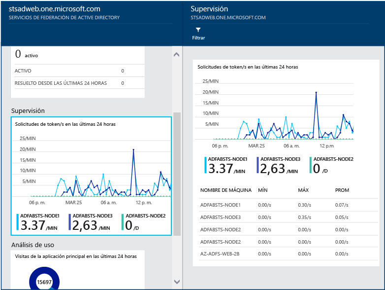

# Supervisión de AD FS mediante Azure AD Connect Health
La siguiente documentación es específica de la supervisión de la infraestructura de AD FS con Azure AD Connect Health. Para más información sobre la supervisión de Azure AD Connect (Sync) con Azure AD Connect Health, consulte [Uso de Azure AD Connect Health para sincronización](active-directory-aadconnect-health-sync.md). Para obtener información adicional sobre la supervisión de Active Directory Domain Services con Azure AD Connect Health, consulte [Using Azure AD Connect Health with AD DS](active-directory-aadconnect-health-adds.md)(Uso de Azure AD Connect Health con AD DS).

## Alertas de AD FS
La sección Alertas de Azure AD Connect Health proporciona la lista de alertas activas. Cada alerta incluye información pertinente, pasos de resolución y vínculos a documentación relacionada.

Puede hacer doble clic en una alerta activa o una alerta resuelta para que se abra una hoja nueva con información adicional, pasos que puede seguir para resolver la alerta y vínculos a documentación relevante. También puede ver datos históricos sobre las alertas resueltas en el pasado.

## Análisis de uso de AD FS
Análisis de uso de Azure AD Connect Health analiza el tráfico de autenticación de los servidores de federación. Puede hacer doble clic en la casilla de análisis de uso para que se abra la hoja de análisis de uso, que le mostrará las métricas y las agrupaciones.

> [!NOTE]
> Para poder utilizar el análisis de uso con AD FS, debe asegurarse de que esté habilitada la auditoría de AD FS. Para obtener más información, consulte [Habilitación de la auditoría para AD FS](active-directory-aadconnect-health-agent-install.md#enable-auditing-for-ad-fs).
>
>

Para seleccionar otras métricas, especifique un intervalo de tiempo. Para cambiar la agrupación, haga clic con el botón derecho en el gráfico de análisis de uso y seleccione Editar gráfico. A continuación, puede especificar el intervalo de tiempo, seleccionar una métrica diferente y cambiar la agrupación. Puede ver la distribución del tráfico de autenticación según diferentes "métricas" y agrupar cada métrica con los correspondientes parámetros "Agrupar por" que se describen en la sección siguiente:

**Métrica: número total de solicitudes**: el número total de solicitudes procesadas por los servidores de AD FS.

|Agrupar por | ¿Qué significa la agrupación y por qué es útil? |
| --- | --- |
| Todo | Muestra el recuento del número total de solicitudes procesadas por todos los servidores de AD FS.|
| Application | Agrupa el número total de solicitudes en función del usuario de confianza de destino. Esta agrupación es útil para comprender qué aplicación está recibiendo tráfico y qué porcentaje del tráfico total recibe. |
|  Server |Agrupa el número total de solicitudes según el servidor que procesó la solicitud. Esta agrupación es útil para comprender la distribución de la carga de tráfico total.
| Unión al área de trabajo |Agrupa el número total de solicitudes en función de si las solicitudes proceden o no de dispositivos que están unidos al área de trabajo (conocidos). Esta agrupación es útil para comprender si el acceso a sus recursos se realiza con dispositivos que son desconocidos para la infraestructura de identidades. |
|  Método de autenticación | Agrupa el número total de solicitudes en función del método de autenticación utilizado para la autenticación. Esta agrupación es útil para comprender el método de autenticación común que se utiliza para la autenticación. A continuación, se indican los métodos de autenticación posibles  <ol> <li>Autenticación integrada de Windows (Windows)</li> <li>Autenticación basada en formularios (formularios)</li> <li>SSO (inicio de sesión único)</li> <li>Autenticación de certificados X509 (certificado)</li>  Si los servidores de federación reciben la solicitud con una cookie de SSO, esa solicitud se considera como SSO (inicio de sesión único). En estos casos, si la cookie es válida, no se pide al usuario que proporcione credenciales y obtiene acceso a la aplicación sin problemas. Este comportamiento es habitual si tiene varios usuarios de confianza protegidos por los servidores de federación. |
| Ubicación de red | Agrupa el número total de solicitudes en función de la ubicación de red del usuario. Puede ser intranet o extranet. Esta agrupación es útil para saber qué porcentaje del tráfico es de intranet y cuál de extranet. |

**Métrica: número total de solicitudes con error**: número total de solicitudes procesadas por el servicio de federación. (Esta métrica solo está disponible en AD FS para Windows Server 2012 R2)

|Agrupar por | ¿Qué significa la agrupación y por qué es útil? |
| --- | --- |
| Tipo de error | Muestra el número de errores en función de los tipos de error predefinidos. La agrupación es útil para comprender cuáles son los tipos de errores comunes. <ul><li>Nombre de usuario o contraseña incorrectos: errores por nombre de usuario o contraseña incorrectos.</li> <li>"Bloqueo de extranet": errores producidos cuando se reciben solicitudes de un usuario cuyo acceso a la extranet está bloqueado. </li><li> "Contraseña caducada": errores producidos cuando un usuario inicia sesión con una contraseña caducada.</li><li>"Cuenta deshabilitada": errores producidos cuando un usuario inicia sesión con una cuenta deshabilitada.</li><li>"Autenticación de dispositivos": errores producidos cuando un usuario no se puede autenticar mediante la Autenticación de dispositivos.</li><li>"Autenticación de certificado de usuario": errores producidos cuando un usuario no se puede autenticar porque el certificado no es válido.</li><li>"MFA": errores producidos cuando un usuario no se puede autenticar mediante Multi-Factor Authentication.</li><li>"Otra credencial": "Autorización de emisión": problemas producidos por errores de autorización.</li><li>"Delegación de emisión": problemas producidos por errores de delegación de emisión.</li><li>"Aceptación de tokens": errores producidos cuando ADFS rechaza el token de un proveedor de identidades de terceros.</li><li>"Protocolo": error producido por errores de protocolo.</li><li>"Desconocido": detectar todas. Otros errores que no encajan en las categorías definidas.</li> |
| Server | Agrupa los errores en función del servidor. Esta agrupación es útil para comprender la distribución de errores entre servidores. Una distribución desigual podría indicar que un servidor presenta un estado defectuoso. |
| Ubicación de red | Agrupa los errores en función de la ubicación de red de las solicitudes (intranet frente a extranet). Esta agrupación es útil para comprender qué tipo de solicitud está fallando. |
|  Application | Agrupa los errores en función de la aplicación de destino (usuario de confianza). Esta agrupación es útil para comprender qué aplicación de destino está experimentando una mayor cantidad de errores. |

**Métrica: recuento de usuarios**: el número medio de usuarios únicos que se autentican activamente mediante AD FS.

|Agrupar por | ¿Qué significa la agrupación y por qué es útil? |
| --- | --- |
|Todo |Esta métrica proporciona un recuento del número medio de usuarios mediante el servicio de federación en el intervalo de tiempo seleccionado. Los usuarios no están agrupados.  El promedio depende del intervalo de tiempo seleccionado. |
| Application |Agrupa el número medio de usuarios en función de la aplicación de destino (usuario de confianza). Esta agrupación es útil para comprender cuántos usuarios utilizan una aplicación y determinar qué aplicación. |

## Supervisión del rendimiento de AD FS
Supervisión de rendimiento de Azure AD Connect Health proporciona información de supervisión sobre métricas. Si selecciona la casilla Supervisión, se abrirá una hoja nueva con información detallada sobre las métricas.

Al seleccionar la opción Filtro en la parte superior de la hoja, puede filtrar por servidor para ver las métricas de un servidor individual. Para cambiar las métricas, haga clic con el botón derecho en el diagrama de supervisión en la hoja de supervisión y seleccione Editar gráfico (o seleccione el botón del mismo nombre). En la nueva hoja que se abre, puede seleccionar métricas adicionales en la lista desplegable y especificar un intervalo de tiempo para la visualización de los datos de rendimiento.

## Primeros 50 usuarios con errores de inicio de sesión por nombre de usuario y contraseña no válidos
Una de las causas comunes de los errores de solicitud de autenticación en un servidor de AD FS es una solicitud con credenciales no válidas, es decir, un nombre de usuario o una contraseña incorrectos. Esto le suele pasar a los usuarios debido a contraseñas olvidadas o complejas, o a errores tipográficos.

Pero hay otros motivos que pueden provocar que los servidores de AD FS tengan que controlar un número inesperado de solicitudes como, por ejemplo: una aplicación que almacena en la memoria caché las credenciales de un usuario y estas expiran o un usuario malintencionado que intenta iniciar sesión en una cuenta con una serie de contraseñas conocidas. Estos dos ejemplos son motivos válidos que podrían dar lugar a un aumento repentino de las solicitudes.

Azure AD Connect Health para ADFS proporciona un informe con los primeros 50 usuarios con errores de intento de inicio de sesión por nombre de usuario o una contraseña no válidos. Este informe se logra mediante el procesamiento de los eventos de auditoría generados por todos los servidores de AD FS en las granjas.

En este informe, tiene un acceso sencillo a los elementos de información siguientes:

* Nº total de solicitudes con error por nombre de usuario o contraseña incorrectos en los últimos 30 días
* Número promedio de usuarios con error de inicio de sesión por nombre de usuario o contraseña incorrectos por día.

Al hacer clic en esta parte, se abre la hoja del informe principal que proporciona información adicional. Esta hoja incluye un gráfico con información de tendencias para ayudar a establecer una línea base sobre las solicitudes con contraseña o nombre de usuario incorrecto. Además, proporciona la lista de los 50 usuarios qué más intentos fallidos realizaron en la semana anterior. Observe que la lista de los 50 usuarios desde la última semana podría ayudar a identificar los picos de contraseñas incorrectas.  

El gráfico ofrece la siguiente información:

* El número total diario de inicios de sesión erróneos debido a un nombre de usuario o una contraseña incorrectos.
* El número total diario de usuarios únicos con errores de inicio de sesión.
* Dirección IP del cliente de la última solicitud

El informe ofrece la siguiente información:

| Elemento de informe | DESCRIPCIÓN |
| --- | --- |
| Id. de usuario |Muestra el identificador de usuario que se usó. Este valor es lo que el usuario escribió, que en algunos casos es el identificador de usuario equivocado que se va a utilizar. |
| Intentos con error |Muestra el número total de intentos con error para ese identificador de usuario específico. La tabla está ordenada por el mayor número de intentos con error en orden descendente. |
| Último error |Muestra la marca de tiempo del momento en que se produjo el último error. |
| Última IP con error |Muestra la dirección IP del cliente de la última solicitud incorrecta. |

> [!NOTE]
> Este informe se actualiza automáticamente cada 12 horas con la información recopilada durante este período. Como resultado, puede que el informe no incluya los intentos de inicio de sesión de las últimas 12 horas.
>
>

## Informe de direcciones IP de riesgo 
Los clientes de AD FS pueden exponer puntos de conexión de autenticación de contraseña en Internet para proporcionar servicios de autenticación para que los usuarios finales tengan acceso a aplicaciones de SaaS, como Office 365. En este caso, es posible que un actor no deseado intente inicios de sesión en el sistema de AD FS para adivinar una contraseña de usuario final y acceder a los recursos de la aplicación. AD FS proporciona la funcionalidad de bloqueo de cuenta de extranet para evitar estos tipos de ataques desde AD FS en Windows Server 2012 R2. Si se encuentra en una versión anterior, se recomienda que actualice el sistema de AD FS a Windows Server 2016.  
Además, es posible que una única dirección IP intente varios inicios de sesión en varios usuarios. En estos casos, puede que el número de intentos por usuario esté por debajo del umbral de la protección de bloqueo de cuenta de AD FS. Azure AD Connect Health ahora proporciona el "informe de direcciones IP de riesgo", que detecta esta condición y notifica a los administradores cuando esto ocurre. Estas son las ventajas principales de este informe: 
- Detección de direcciones IP que superan un umbral de inicios de sesión basada en contraseña erróneos
- Admite inicios de sesión con error debidos a una contraseña incorrecta o debidos a un estado de bloqueo de la extranet
- Notificación por correo electrónico a los administradores de la alerta en cuanto esto sucede con configuración de correo electrónico personalizable
- Configuración de umbrales personalizables ajustados a la directiva de seguridad de una organización
- Informes descargables para su análisis sin conexión e integración con otros sistemas mediante automatización

> [!NOTE]
> Para usar este informe, debe asegurarse de que está habilitada la auditoría de AD FS. Para obtener más información, consulte [Habilitación de la auditoría para AD FS](active-directory-aadconnect-health-agent-install.md#enable-auditing-for-ad-fs).
>
>

### Contenido del informe
Cada elemento del informe de direcciones IP de riesgo muestra información agregada sobre las actividades de inicio de sesión de AD FS con errores que sobrepasan el umbral designado. Proporciona la siguiente información: 

| Elemento de informe | DESCRIPCIÓN |
| ------- | ----------- |
| Marca de tiempo | Muestra la marca de tiempo según la hora local de Azure Portal cuando se inicia la ventana de tiempo de detección.  Todos los eventos diarios se generan a media noche hora UTC.  Los eventos por hora tienen la marca de tiempo redondeada al principio de la hora. Puede encontrar la primera hora de inicio de actividad en "firstAuditTimestamp" en el archivo exportado. |
| Tipo de desencadenador | Muestra el tipo de ventana de tiempo de detección. Los tipos de desencadenador de agregación son por hora o por día. Esto resulta útil para detecciones de ataques por fuerza bruta de alta frecuencia frente a un ataque lento en el que el número de intentos se distribuye a lo largo del día. |
| Dirección IP | La dirección IP de riesgo individual con actividades de inicio de sesión con contraseña incorrecta o de bloqueo de extranet. Podría tratarse de una dirección IPv4 o IPv6. |
| Número de errores de contraseña incorrecta | El número de errores de contraseña incorrecta producidos desde la dirección IP durante la ventana de tiempo de detección. Los errores de contraseña incorrecta pueden producirse varias veces con determinados usuarios. Tenga en cuenta que no se incluyen los intentos con error debidos a contraseñas que han expirado. |
| Número de errores de bloqueo de extranet | El número de errores de bloqueo de extranet que se han producido desde la dirección IP durante la ventana de tiempo de detección. Los errores de bloqueo de extranet pueden producirse varias veces con determinados usuarios. Esto solo es visible si se configura el bloqueo de extranet de AD FS (versiones 2012R2 o superior). <b>Nota:</b> Se recomienda activar esta característica si se permiten inicios de sesión de extranet mediante contraseñas. |
| Usuarios únicos con intentos | El número de cuentas de usuario únicas con intentos desde la dirección IP durante la ventana de tiempo de detección. Esto proporciona un mecanismo para diferenciar un patrón de ataque de un solo usuario en comparación con un patrón de ataque de varios usuarios.  |

Por ejemplo, el siguiente elemento del informe indica que en la ventana de las 6 p.m. a las 7 p.m. el 28/02/2018, la dirección IP <i>104.2XX.2XX.9</i> no tenía errores de contraseña incorrecta y tenía 284 errores de bloqueo de extranet. 14 usuarios únicos resultaron afectados dentro de los criterios. El evento de actividad había superado el umbral horario del informe designado. 

> [!NOTE]
> - En la lista del informe se mostrarán únicamente las actividades que superan el umbral designado. 
> - Este informe se puede seguir hacia atrás hasta 30 días como máximo.
> - Este informe de alertas no muestra las direcciones IP de Exchange ni las direcciones IP privadas. En cambio, se incluyen en la lista de exportación. 
>

### Descarga del informe de direcciones IP de riesgo
Mediante la funcionalidad **Descargar**, se puede exportar la lista de direcciones IP de riesgo completa de los últimos 30 días desde el portal de Connect Health. El resultado de la exportación incluirá todas las actividades de inicio de sesión de AD FS con error en cada ventana de tiempo de detección para que pueda personalizar el filtrado después de la exportación. Además de las agregaciones resaltadas en el portal, el resultado de la exportación también muestra más detalles sobre las actividades de inicio de sesión con error por dirección IP:

|  Elemento de informe  |  DESCRIPCIÓN  | 
| ------- | ----------- | 
| firstAuditTimestamp | Muestra la primera marca de tiempo en la que se iniciaron las actividades con errores durante la ventana de tiempo de detección.  | 
| lastAuditTimestamp | Muestra la última marca de tiempo en la que finalizaron las actividades con errores durante la ventana de tiempo de detección.  | 
| attemptCountThresholdIsExceeded | La marca indica si las actividades actuales superan el umbral de alerta.  | 
| isWhitelistedIpAddress | La marca indica si se filtra la dirección IP de las alertas e informes. Las direcciones IP privadas (<i>10.x.x.x, 172.x.x.x y 192.168.x.x</i>) y las direcciones IP de Exchange se filtran y se marcan como True. Si ve intervalos de direcciones IP privadas, es muy probable que el equilibrador de carga externo no esté enviando la dirección IP del cliente cuando pasa la solicitud al servidor proxy de la aplicación web.  | 

### Configuración de las opciones de notificación
Los contactos administrativos del informe se pueden actualizar en la **Configuración de notificaciones**. De forma predeterminada, la notificación por correo electrónico de alertas de IP de riesgo está desactivada. Puede habilitar las notificaciones mediante el botón conmutador "Obtener notificaciones por correo electrónico de las direcciones IP que superen el umbral del informe de actividades con error". Al igual que las opciones de notificación de alertas de Connect Health, le permite personalizar la lista de destinatarios de las notificaciones desde aquí. También puede notificar a todos los administradores globales al realizar el cambio. 

### Configuración de las opciones del umbral
El umbral de alerta se puede actualizar mediante las Opciones del umbral. De forma inicial, el sistema tiene un umbral establecido de forma predeterminada. Hay cuatro categorías en las opciones del umbral del informe de direcciones IP de riesgo:

| Elemento del umbral | DESCRIPCIÓN |
| --- | --- |
| Usuario y contraseña incorrectos y bloqueos de extranet por día  | Opción del umbral para informar de la actividad y desencadenar la notificación de alertas cuando el número de contraseñas erróneas más el número de bloqueos de extranet se ha superado por **día**. |
| Usuario y contraseña incorrectos y bloqueos de extranet por hora | Opción del umbral para informar de la actividad y desencadenar la notificación de alertas cuando el número de contraseñas erróneas más el número de bloqueos de extranet se ha superado por **hora**. |
| Bloqueos de extranet por día | Opción del umbral para informar de la actividad y desencadenar la notificación de alertas cuando el número de bloqueos de extranet se ha superado por **día**. |
| Bloqueos de extranet por hora| Opción del umbral para informar de la actividad y desencadenar la notificación de alertas cuando el número de bloqueos de extranet se ha superado por **hora**. |

> [!NOTE]
> - El cambio del umbral del informe se aplicará una hora después del cambio de la opción. 
> - El cambio del umbral no afectará a los elementos notificados existentes. 
> - Se recomienda que analice el número de eventos observados en su entorno y ajuste el umbral de forma adecuada. 
>
>

### Preguntas más frecuentes
1. ¿Por qué veo intervalos de direcciones IP privadas en el informe?   
Las direcciones IP privadas (<i>10.x.x.x, 172.x.x.x y 192.168.x.x</i>) y las direcciones IP de Exchange se filtran y se marcan como True en la lista de direcciones IP permitidas. Si ve intervalos de direcciones IP privadas, es muy probable que el equilibrador de carga externo no esté enviando la dirección IP del cliente cuando pasa la solicitud al servidor proxy de la aplicación web.

2. ¿Qué hacer para bloquear la dirección IP?   
Debe agregar la dirección IP identificada como malintencionada al firewall o bloquearla en Exchange.    
Para AD FS 2016, 1803.C y QFE, puede bloquear la dirección IP directamente en AD FS. 

3. ¿Por qué no veo ningún elemento de este informe?  
   - Las actividades de inicio de sesión con errores no superan los valores del umbral. 
   - Asegúrese de que no haya ninguna alerta del tipo "Health Service no está actualizado" en la lista de servidores de AD FS.  Más información sobre [cómo solucionar problemas de esta alerta](active-directory-aadconnect-health-data-freshness.md).
   - Las auditorías no están habilitadas en las granjas de servidores de AD FS.

## Vínculos relacionados
* [Azure AD Connect Health](active-directory-aadconnect-health.md)
* [Instalación del agente de Azure AD Connect Health](active-directory-aadconnect-health-agent-install.md)
* [Operaciones de Azure AD Connect Health](active-directory-aadconnect-health-operations.md)
* [Uso de Azure AD Connect Health para sincronización](active-directory-aadconnect-health-sync.md)
* [Uso de Azure AD Connect Health con AD DS](active-directory-aadconnect-health-adds.md)
* [Preguntas más frecuentes de Azure AD Connect Health](active-directory-aadconnect-health-faq.md)
* [Historial de versiones de Azure AD Connect Health](active-directory-aadconnect-health-version-history.md)
