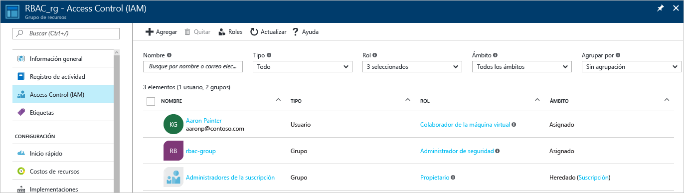
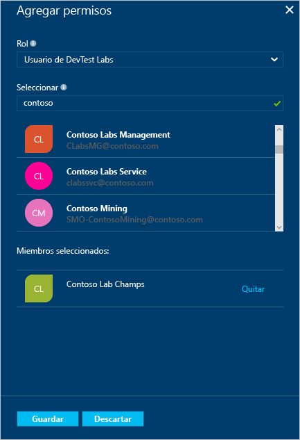
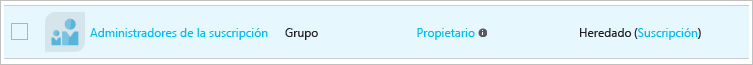

# Uso del control de acceso basado en rol para administrar el acceso a los recursos de la suscripción de Azure
> [!div class="op_single_selector"]
> * [Administrar el acceso por usuario o grupo](role-based-access-control-manage-assignments.md)
> * [Administrar el acceso por recurso](role-based-access-control-configure.md)

El control de acceso basado en roles (RBAC) de Azure permite realizar una administración detallada del acceso para Azure. Con RBAC, puede conceder únicamente el grado de acceso que los usuarios necesiten para realizar sus trabajos. Este artículo lo ayuda a ponerse en funcionamiento con RBAC en el Portal de Azure. Si desea más detalles sobre cómo RBAC ayuda a administrar el acceso, consulte [¿Qué es el control de acceso basado en rol?](role-based-access-control-what-is.md)

Dentro de cada suscripción, puede conceder hasta 2000 asignaciones de roles. 

## Vista de acceso
Puede ver quién tiene acceso a un recurso, a un grupo de recursos o a una suscripción desde la hoja principal del [Portal de Azure](https://portal.azure.com). Por ejemplo, queremos ver quién tiene acceso a uno de nuestros grupos de recursos:

1. Seleccione **Grupos de recursos** en la barra de navegación de la izquierda.  
    
2. Seleccione el nombre del grupo de recursos en la hoja **Grupos de recursos** .
3. Seleccione **Control de acceso (IAM)** en el menú izquierdo.  
4. La hoja Control de acceso muestra todos los usuarios, los grupos y las aplicaciones a los que se ha concedido acceso al grupo de recursos.  
   
    

Tenga en cuenta que algunos roles se limitan a **este recurso**, mientras que otras lo **heredan** de otro ámbito. El acceso se asigna específicamente en el grupo de recursos o se hereda de una asignación en la suscripción principal.

> [!NOTE]
> Los administradores y coadministradores de la suscripción clásica se consideran los propietarios de la suscripción en el nuevo modelo RBAC.

## Agregación de acceso
Puede conceder acceso desde el recurso, el grupo de recursos o la suscripción que constituya el ámbito de la asignación de roles.

1. Seleccione **Agregar** en la hoja Control de acceso.  
2. Seleccione el rol que desea asignar en la hoja **Seleccionar un rol** .
3. Seleccione el usuario, el grupo o la aplicación en el directorio al que desea conceder acceso. Puede buscar en el directorio con los nombres para mostrar, direcciones de correo electrónico e identificadores de objeto.  
   
    
4. Seleccione **Aceptar** para crear la asignación. En el mensaje emergente **Agregando usuario** , se muestra el progreso.  
    

Después de agregar correctamente una asignación de roles, aparecerá en la hoja **Usuarios** .

## Eliminación de acceso
1. Desplace el cursor sobre el nombre de la asignación que desea quitar. Aparece una casilla junto al nombre.
2. Use las casillas para seleccionar una o varias asignaciones de roles.
2. Seleccione **Quitar**.  
3. Seleccione **Sí** para confirmar la eliminación.

Las asignaciones heredadas no se pueden quitar. Si necesita quitar una asignación heredada, debe hacerlo en el ámbito donde se creó la asignación de roles. En la columna **Ámbito**, junto a **Heredado**, hay un vínculo que lo dirige a los recursos donde se asignó este rol. Vaya a los recursos indicados ahí para quitar la asignación de roles.

## Otras herramientas para administrar el acceso
Puede asignar roles y administrar el acceso con los comandos de RBAC de Azure en otras herramientas que no sean el Portal de Azure.  Siga los vínculos para obtener más información acerca de los requisitos previos y empezar a trabajar con los comandos de RBAC de Azure.

* [Azure PowerShell](role-based-access-control-manage-access-powershell.md)
* [Interfaz de la línea de comandos de Azure](role-based-access-control-manage-access-azure-cli.md)
* [API DE REST](role-based-access-control-manage-access-rest.md)

## Pasos siguientes
* [Creación de un informe del historial de cambios de acceso](role-based-access-control-access-change-history-report.md)
* Consulte los [roles integrados en RBAC](role-based-access-built-in-roles.md)
* Defina sus propios [Custom Roles in Azure RBAC](role-based-access-control-custom-roles.md)

