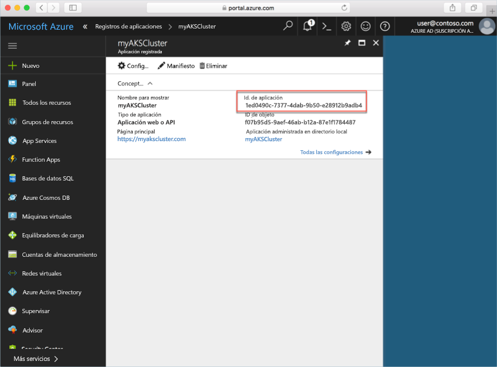
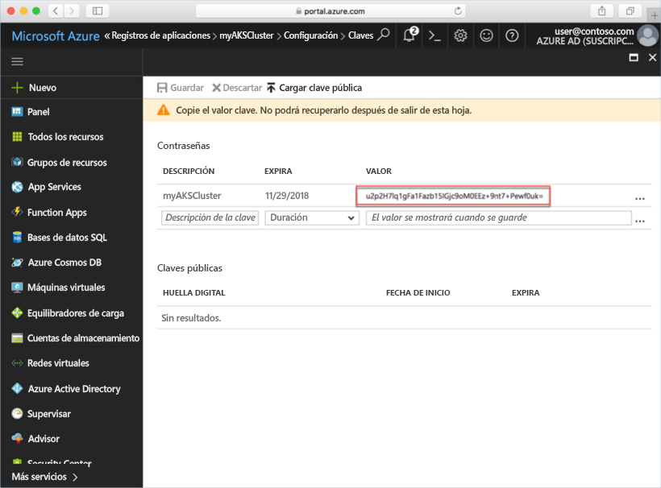

# <a name="deploy-an-azure-container-service-aks-cluster"></a>Implementación de un clúster de Azure Container Service (AKS)

En esta guía rápida, implementará un clúster de AKS mediante Azure Portal. A continuación, se ejecuta en el clúster una aplicación de varios contenedores que consta de un front-end web y una instancia de Redis. Una vez finalizado el proceso, la aplicación es accesible a través de Internet.


En esta guía rápida se presupone un conocimiento básico de los conceptos de Kubernetes. Para obtener información detallada sobre Kubernetes, consulte la [documentación correspondiente][kubernetes-documentation].

## <a name="sign-in-to-azure"></a>Inicio de sesión en Azure

Inicie sesión en Azure Portal en http://portal.azure.com.

## <a name="create-service-principal"></a>Creación de una entidad de servicio

Antes de crear el clúster de AKS en Azure Portal, debe crear una entidad de servicio. Azure usa esta entidad de servicio para administrar la infraestructura asociada con el clúster de AKS.

Seleccione **Azure Active Directory** > **Registros de aplicaciones** > **Nuevo registro de aplicaciones**.

Escriba un nombre para la aplicación (puede ser cualquiera). En Tipo de aplicación, seleccione **Aplicación web o API**. Escriba un valor para la **dirección URL de inicio de sesión**; puede ser cualquier valor con un formato de dirección URL válido, pero no es necesario que sea un punto de conexión real.

Cuando haya terminado, seleccione **Crear**.


Seleccione el registro de aplicación recién creado y anote el identificador de la aplicación. Este valor es necesario al crear el clúster de AKS.



A continuación, debe crear una contraseña para la entidad de servicio. Seleccione **Toda la configuración** > **Claves** y escriba cualquier valor para la descripción de la clave. Seleccione una duración, que es el tiempo durante el cual la entidad de servicio es válida.

Haga clic en **Guardar** y anote el valor de contraseña. La contraseña es necesaria al crear un clúster de AKS.



## <a name="create-aks-cluster"></a>Creación de un clúster de AKS

Seleccione **Nuevo** > **Contenedores** > **Azure Container Service - AKS (versión preliminar)**.

Proporcione un nombre de clúster, un prefijo de DNS, el nombre del grupo de recursos, la ubicación y la versión de Kubernetes del clúster. Anote el nombre del clúster y el nombre del grupo de recursos, los necesitará al conectarse al clúster.

Cuando haya terminado, seleccione **Aceptar**.


En el formulario de configuración, escriba lo siguiente:

- Nombre de usuario: el nombre asignado a las cuentas administrativas en los nodos del clúster.
- Clave pública SSH: asociada a la clave que se usará para acceder a los nodos del clúster.
- Identificador de cliente de la entidad de servicio: el identificador de aplicación de la entidad de servicio que creó anteriormente en este documento.
- Secreto de cliente de la entidad de servicio: la contraseña de la entidad de servicio que creó anteriormente en este documento.
- Número de nodos: el número de nodos AKS que se van a crear.
- Tamaño de máquina virtual de nodo: tamaño de máquina virtual de los nodos de AKS.
- Tamaño de disco de SO: tamaño del disco de sistema operativo de los nodos de AKS.

Cuando haya finalizado, seleccione **Aceptar** y de nuevo **Aceptar** tras completar la validación.


Tras una breve espera, el clúster de ASK es implementa y está listo para usarse.

## <a name="connect-to-the-cluster"></a>Conexión al clúster

Para administrar un clúster de Kubernetes, use [kubectl][kubectl], el cliente de línea de comandos de Kubernetes. El cliente kubectl viene preinstalado en Azure Cloud Shell.

Abra Cloud Shell mediante el botón de la esquina superior derecha de Azure Portal.


Use el comando [az aks get-credentials][az-aks-get-credentials] para configurar kubectl para conectarse a su clúster de Kubernetes.

Copie y pegue el siguiente comando en Cloud Shell. Si es necesario, modifique el nombre del clúster y del grupo de recursos.

```azurecli-interactive
az aks get-credentials --resource-group myAKSCluster --name myAKSCluster
```

Para comprobar la conexión con el clúster, use el comando [kubectl get][kubectl-get] para que devuelva una lista de los nodos del clúster.

```azurecli-interactive
kubectl get nodes
```

Salida:

```
NAME                       STATUS    ROLES     AGE       VERSION
aks-agentpool-14693408-0   Ready     agent     6m        v1.8.1
aks-agentpool-14693408-1   Ready     agent     6m        v1.8.1
aks-agentpool-14693408-2   Ready     agent     7m        v1.8.1
```

## <a name="run-the-application"></a>Ejecución de la aplicación

Un archivo de manifiesto de Kubernetes define un estado deseado del clúster, por ejemplo, qué imágenes de contenedor se deben ejecutar. En este ejemplo, se usará un manifiesto para crear todos los objetos necesarios para ejecutar la aplicación Azure Vote.

Cree un archivo denominado `azure-vote.yaml` y copie el siguiente código YAML. Si está trabajando en Azure Cloud Shell, puede crear el archivo mediante vi o Nano, como si trabajara en un sistema físico o virtual.

```yaml
apiVersion: apps/v1beta1
kind: Deployment
metadata:
  name: azure-vote-back
spec:
  replicas: 1
  template:
    metadata:
      labels:
        app: azure-vote-back
    spec:
      containers:
      - name: azure-vote-back
        image: redis
        ports:
        - containerPort: 6379
          name: redis
---
apiVersion: v1
kind: Service
metadata:
  name: azure-vote-back
spec:
  ports:
  - port: 6379
  selector:
    app: azure-vote-back
---
apiVersion: apps/v1beta1
kind: Deployment
metadata:
  name: azure-vote-front
spec:
  replicas: 1
  template:
    metadata:
      labels:
        app: azure-vote-front
    spec:
      containers:
      - name: azure-vote-front
        image: microsoft/azure-vote-front:redis-v1
        ports:
        - containerPort: 80
        env:
        - name: REDIS
          value: "azure-vote-back"
---
apiVersion: v1
kind: Service
metadata:
  name: azure-vote-front
spec:
  type: LoadBalancer
  ports:
  - port: 80
  selector:
    app: azure-vote-front
```

Use el comando [kubectl create][kubectl-create] para ejecutar la aplicación.

```azurecli-interactive
kubectl create -f azure-vote.yaml
```

Salida:

```
deployment "azure-vote-back" created
service "azure-vote-back" created
deployment "azure-vote-front" created
service "azure-vote-front" created
```

## <a name="test-the-application"></a>Prueba de la aplicación

Cuando se ejecuta la aplicación, se crea un [servicio de Kubernetes][kubernetes-service] que expone el front-end de la aplicación a Internet. Este proceso puede tardar unos minutos en completarse.

Para supervisar el progreso, utilice el comando [kubectl get service][kubectl-get] con el argumento `--watch`.

```azurecli-interactive
kubectl get service azure-vote-front --watch
```

En un primer momento, el parámetro *EXTERNAL-IP* del servicio *azure-vote-front* aparece como *pendiente*.

```
NAME               TYPE           CLUSTER-IP   EXTERNAL-IP   PORT(S)        AGE
azure-vote-front   LoadBalancer   10.0.37.27   <pending>     80:30572/TCP   6s
```

Una vez que la dirección *EXTERNAL-IP* haya cambiado de *pendiente* a una *dirección IP*, use `CTRL-C` para detener el proceso de inspección de kubectl.

```
azure-vote-front   LoadBalancer   10.0.37.27   52.179.23.131   80:30572/TCP   2m
```

Ahora ya puede navegar a la dirección IP externa para ver la aplicación Azure Vote.


## <a name="delete-cluster"></a>Eliminación de clúster

Cuando el clúster ya no es necesario, puede eliminar el grupo de recursos de clúster, que elimina todos los recursos asociados. Esta operación se puede realizar en Azure Portal; para ello, seleccione el grupo de recursos y haga clic en el botón Eliminar. Como alternativa, el comando [az group delete][az-group-delete] se puede usar en Cloud Shell.

```azurecli-interactive
az group delete --name myAKSCluster --no-wait
```

## <a name="get-the-code"></a>Obtención del código

En esta guía de inicio rápido, se han usado imágenes de un contenedor creado previamente para crear una implementación de Kubernetes. El código de la aplicación relacionada, Dockerfile, y el archivo de manifiesto de Kubernetes están disponibles en GitHub.

[https://github.com/Azure-Samples/azure-voting-app-redis][azure-vote-app]

## <a name="next-steps"></a>pasos siguientes

En esta guía de inicio rápido, ha implementado un clúster de Kubernetes y una aplicación de varios contenedores en él.

Para obtener más información sobre AKS y un ejemplo completo desde el código hasta la implementación, continúe con el tutorial del clúster de Kubernetes.

> [!div class="nextstepaction"]
> [Administración de un clúster de AKS][aks-tutorial]

<!-- LINKS - external -->
[azure-vote-app]: https://github.com/Azure-Samples/azure-voting-app-redis.git
[kubectl]: https://kubernetes.io/docs/user-guide/kubectl/
[kubectl-create]: https://kubernetes.io/docs/reference/generated/kubectl/kubectl-commands#create
[kubectl-get]: https://kubernetes.io/docs/reference/generated/kubectl/kubectl-commands#get
[kubernetes-documentation]: https://kubernetes.io/docs/home/
[kubernetes-service]: https://kubernetes.io/docs/concepts/services-networking/service/

<!-- LINKS - internal -->
[az-aks-get-credentials]: /cli/azure/aks?view=azure-cli-latest#az_aks_get_credentials
[az-group-delete]: /cli/azure/group#delete
[aks-tutorial]: ./tutorial-kubernetes-prepare-app.md


