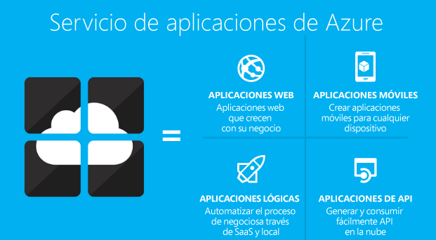
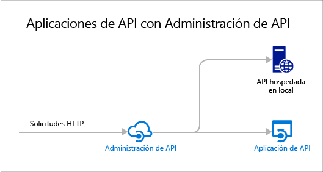

# Información general sobre Aplicaciones de API
Las aplicaciones de API del Servicio de aplicaciones de Azure ofrecen características que facilitan el desarrollo, el hospedaje y el consumo de API en soluciones en la nube y locales. Gracias a las aplicaciones de API, disfrutará de seguridad de categoría empresarial, control de acceso sencillo, conectividad híbrida, generación automática de SDK e integración completa con [Aplicaciones lógicas](../app-service-logic/app-service-logic-what-are-logic-apps.md).

[Servicio de aplicaciones de Azure](../app-service/app-service-value-prop-what-is.md) es una plataforma totalmente administrada para escenarios web, móviles y de integración. Aplicaciones de API son uno de los cuatro tipos que ofrece el [Servicio de aplicaciones de Azure](../app-service/app-service-value-prop-what-is.md).

## ¿Por qué usar Aplicaciones de API?
Estas son algunas características clave de las aplicaciones de API:

* **La API existente puede incorporarse tal cual** : no es necesario realizar ningún cambio en el código de las API existentes para aprovechar Aplicaciones de API, solo tiene que implementar el código en una aplicación de API. La API puede usar cualquier lenguaje o marco admitido por el Servicio de aplicaciones, como ASP.NET y C#, Java, PHP, Node.js y Python.
* **Fácil consumo** : la compatibilidad integrada con [los metadatos de API de Swagger](http://swagger.io/) permite que una gran variedad de clientes pueda consumir las API de forma sencilla.  Generan automáticamente código de cliente para las API en diversos lenguajes, como C#, Java y Javascript. Configuran fácilmente [CORS](app-service-api-cors-consume-javascript.md) sin cambiar el código. Para más información, consulte [Metadatos de App Service API Apps para la detección de API y la generación de código](app-service-api-metadata.md) y [Consumo de una aplicación de API desde JavaScript con CORS](app-service-api-cors-consume-javascript.md). 
* **Control de acceso sencillo** : proteja una aplicación de API frente al acceso no autenticado sin realizar ningún cambio en el código. Los servicios de autenticación integrados protegen las API frente al acceso de otros servicios o de clientes que representan a los usuarios. Los proveedores de identidad compatibles incluyen Azure Active Directory, Facebook, Twitter, Google y cuenta Microsoft. Los clientes pueden usar la biblioteca de autenticación de Active Directory (AAL) o el SDK de Aplicaciones móviles. Para más información, consulte [Autenticación y autorización para Aplicaciones de API en el Servicio de aplicaciones de Azure](app-service-api-authentication.md).
* **Integración con visual Studio** : existen herramientas dedicadas en Visual Studio que permiten optimizar las tareas de creación, implementación, consumo, depuración y administración de las aplicaciones de API. Para más información, consulte [Anuncio de la versión 2.8.1 del SDK de Azure para .NET](/blog/announcing-azure-sdk-2-8-1-for-net/).
* **Integración con aplicaciones lógicas** : las [aplicaciones lógicas del Servicio de aplicaciones](../app-service-logic/app-service-logic-what-are-logic-apps.md)pueden consumir las aplicaciones de API que cree.  Para más información, consulte [Uso de la API personalizada hospedada en App Service con Logic apps](../app-service-logic/app-service-logic-custom-hosted-api.md) y [Nueva versión de esquema 2015-08-01: versión preliminar](../app-service-logic/app-service-logic-schema-2015-08-01.md).

Además, una aplicación de API puede sacar partido de las características que ofrecen las [Web Apps](../app-service-web/app-service-web-overview.md) y [Mobile Apps](../app-service-mobile/app-service-mobile-value-prop.md). Lo mismo sucede al contrario: si utiliza una aplicación web o móvil para hospedar una API, podrá aprovechar las características de Aplicaciones de API, como metadatos de Swagger para la generación de código de cliente y CORS para el acceso entre dominios del explorador. La única diferencia entre los tres tipos de aplicaciones (API, web, móvil) radica en el nombre y el icono utilizados para ellas en el Portal de Azure.

## ¿Cuál es la diferencia entre Aplicaciones de API y Administración de API de Azure?
Aplicaciones de API y [Administración de API de Azure](../api-management/api-management-key-concepts.md) son servicios complementarios:

* Administración de API se dedica a la administración de API. El usuario coloca un front-end de Administración de API en una API para supervisar y limitar el uso, manipular la entrada y la salida, consolidar varias API en un punto de conexión, etc. Las API que se administran se pueden hospedar en cualquier lugar.
* Aplicaciones de API se dedica al hospedaje de API. El servicio incluye características que facilitan el desarrollo y consumo de API, pero no las variantes de supervisión, limitación, manipulación o consolidación que realiza Administración de API. Si no necesita las características de Administración de API, puede hospedar las API en Aplicaciones de API sin usar Administración de API.

A continuación hay un diagrama que ilustra Administración de API usada paras las API hospedadas en Aplicaciones de API y en cualquier otro lugar.

Algunas características de Administración de API y Aplicaciones de API tienen funciones similares.  Por ejemplo, ambos pueden automatizar la compatibilidad con CORS. Si utiliza conjuntamente los dos servicios, podría usar Administración de API para CORS, ya que funciona como front-end para sus Aplicaciones de API. 

## Introducción
Para empezar a trabajar con Aplicaciones de API mediante la implementación de código de ejemplo en una, consulte el tutorial para la plataforma que prefiera:

* [ASP.NET](app-service-api-dotnet-get-started.md) 
* [Node.js](app-service-api-nodejs-api-app.md) 
* [Java](app-service-api-java-api-app.md) 

Para plantear preguntas sobre Aplicaciones de API, cree una conversación en el [foro de Aplicaciones de API](https://social.msdn.microsoft.com/Forums/en-US/home?forum=AzureAPIApps). 

<!--HONumber=Nov16_HO2-->

