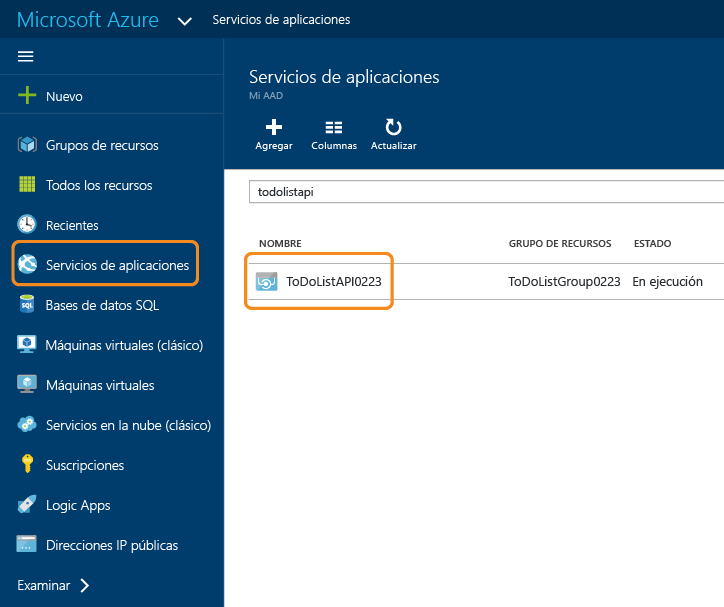
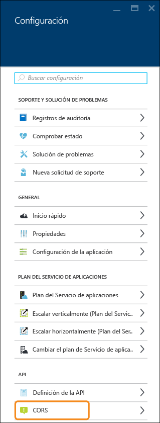
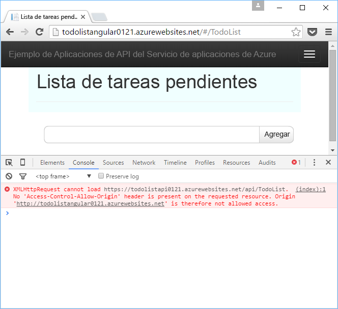
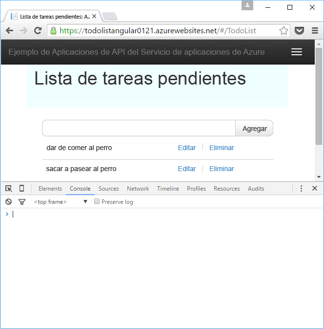

# Consumo de una aplicación de API desde JavaScript con CORS
El Servicio de aplicaciones ofrece compatibilidad integrada con [Uso compartido de recursos entre orígenes (CORS)](https://en.wikipedia.org/wiki/Cross-origin_resource_sharing), que permite a los clientes de JavaScript realizar llamadas entre dominios a API hospedadas en aplicaciones de API. El Servicio de aplicaciones permite configurar el acceso CORS a la API sin escribir ningún código en ella.

Este artículo contiene dos secciones:

* En la sección [Configuración de CORS](#corsconfig) , se explica de forma general cómo configurar CORS para cualquier aplicación de API, aplicación web o aplicación móvil. Es válida igualmente para todas las plataformas admitidas por el Servicio de aplicaciones, como .NET, Node.js y Java. 
* A partir de la sección [Continuación del tutorial de introducción de .NET](#tutorialstart), el artículo es un tutorial que demuestra la compatibilidad con CORS partiendo de lo que hizo en el [primer tutorial de introducción a aplicaciones de API](app-service-api-dotnet-get-started.md). 

##  Configuración de CORS en el Servicio de aplicaciones de Azure
Puede configurar CORS en Azure Portal o mediante las herramientas de [Azure Resource Manager](../azure-resource-manager/resource-group-overview.md).

#### Configuración de CORS en el Portal de Azure
1. En el explorador, vaya al [Portal de Azure](https://portal.azure.com/).
2. Haga clic en **Servicios de aplicaciones**y en el nombre de la aplicación de API.
   
    
3. En la hoja **Configuración** que se abre a la derecha de la hoja **Aplicación de API**, busque la sección **API** y haga clic en **CORS**.
   
   
4. En el cuadro de texto, escriba las direcciones URL desde las que desea permitir que procedan las llamadas de JavaScript.

    Por ejemplo, si ha implementado la aplicación de JavaScript en una aplicación web denominada todolistangular, escriba "https://todolistangular.azurewebsites.net". Como alternativa, puede escribir un asterisco (*) para especificar que se acepten todos los dominios de origen.

1. Haga clic en **Save**.
   
   
   
   Tras hacer clic en **Guardar**, la aplicación de API aceptará llamadas de JavaScript desde las direcciones URL especificadas.

#### Configuración de CORS mediante las herramientas del Administrador de recursos de Azure
También puede configurar CORS para una aplicación de API mediante las [plantillas de Azure Resource Manager](../resource-group-authoring-templates.md) de herramientas de línea de comandos como [Azure PowerShell](../powershell-install-configure.md) y la [CLI de Azure](../xplat-cli-install.md). 

Para ver un ejemplo de una plantilla de Azure Resource Manager que establece la propiedad de CORS, abra el archivo [azuredeploy.json del repositorio de la aplicación de ejemplo de este tutorial](https://github.com/azure-samples/app-service-api-dotnet-todo-list/blob/master/azuredeploy.json). Busque la sección de la plantilla similar a la del ejemplo siguiente:

        "cors": {
            "allowedOrigins": [
                "todolistangular.azurewebsites.net"
            ]
        }

##  Continuación del tutorial de introducción de .NET
Si está siguiendo las series de introducción de Node.js o de Java para aplicaciones de API, la ha completado. Vaya a la sección [Pasos siguientes](#next-steps) para ver sugerencias para aprender más acerca de las aplicaciones de API.

El resto de este artículo es una continuación de la serie de introducción de .NET y se supone que ha completado correctamente [el primer tutorial](app-service-api-dotnet-get-started.md).

## Implementación del proyecto ToDoListAngular en una nueva aplicación web
En [el primer tutorial](app-service-api-dotnet-get-started.md)creó una aplicación de API de nivel intermedio y una aplicación de API de capa de datos. En este tutorial creará una aplicación web de una página (SPA) que llame a la aplicación de API de nivel intermedio. Para que la SPA funcione, tendrá que habilitar CORS en la aplicación de API de nivel intermedio. 

En la [aplicación de ejemplo ToDoList](https://github.com/Azure-Samples/app-service-api-dotnet-todo-list), el proyecto ToDoListAngular es un cliente de AngularJS sencillo que llama al proyecto de API web ToDoListAPI de nivel intermedio. El código JavaScript del archivo *app/scripts/todoListSvc.js* llama a la API mediante el proveedor HTTP de AngularJS. 

        angular.module('todoApp')
        .factory('todoListSvc', ['$http', function ($http) {

            $http.defaults.useXDomain = true;
            delete $http.defaults.headers.common['X-Requested-With']; 

            return {
                getItems : function(){
                    return $http.get(apiEndpoint + '/api/TodoList');
                },

                /* Get by ID, Put, and Delete methods not shown */

                postItem : function(item){
                    return $http.post(apiEndpoint + '/api/TodoList', item);
                }
            };
        }]);

### Creación de una nueva aplicación web para el proyecto ToDoListAngular
El procedimiento para crear una aplicación web del Servicio de aplicaciones e implementar un proyecto en ella es similar al usado para [crear e implementar una aplicación de API en el primer tutorial de esta serie](app-service-api-dotnet-get-started.md#createapiapp). La única diferencia es que el tipo de aplicación es **Aplicación web**, en lugar de **Aplicación de API**.  Para ver capturas de pantalla de los cuadros de diálogo, consulte 

1. En el **Explorador de soluciones**, haga clic con el botón derecho en el proyecto ToDoListAngular y, después, en **Publicar**.
2. En la pestaña **Perfil** del Asistente para **publicación web**, haga clic en **Servicio de aplicaciones de Microsoft Azure**.
3. En el cuadro de diálogo **App Service**, haga clic en **Nuevo**.
4. En la pestaña **Hospedaje** del cuadro de diálogo **Crear servicio de aplicaciones**, escriba un **Nombre de la aplicación web** que sea único en el dominio *azurewebsites.net*. 
5. Elija la **suscripción** de Azure con la que desea trabajar.
6. En la lista desplegable **Grupo de recursos** , elija el grupo de recursos que creó anteriormente.
7. En la lista desplegable **Plan del servicio de aplicaciones** , elija el plan que creó anteriormente. 
8. Haga clic en **Crear**.
   
    Visual Studio crea la aplicación web, crea un perfil de publicación para ella y muestra el paso **Conexión** del Asistente para **publicación web**.
   
    No haga clic en **Publicar** todavía. En la siguiente sección, configurará la nueva aplicación web para llamar a la aplicación de API de nivel intermedio en ejecución en el Servicio de aplicaciones. 

### Establecimiento de la dirección URL de nivel intermedio en la configuración de la aplicación web
1. Vaya al [Portal de Azure](https://portal.azure.com/)y, después, vaya a la hoja **Aplicación web** de la aplicación web que creó para hospedar el proyecto TodoListAngular (front-end).
2. Haga clic en **Configuración > Configuración de la aplicación**.
3. En la sección **Configuración de la aplicación** , agregue la siguiente clave y valor:
   
   | Clave | Valor | Ejemplo |
   | --- | --- | --- |
   | toDoListAPIURL |https://{nombre de la aplicación de API de nivel intermedio}.azurewebsites.net |https://todolistapi0121.azurewebsites.net |
4. Haga clic en **Guardar**.
   
    Cuando el código se ejecuta en Azure, este valor anula ala dirección URL de host local que se encuentra en el archivo *Web.config* . 
   
    El código que obtiene el valor de configuración se encuentra en *index.cshtml*:
   
        
        
   
    El código de *todoListSvc.js* utiliza la configuración:
   
        return {
            getItems : function(){
                return $http.get(apiEndpoint + '/api/TodoList');
            },
            getItem : function(id){
                return $http.get(apiEndpoint + '/api/TodoList/' + id);
            },
            postItem : function(item){
                return $http.post(apiEndpoint + '/api/TodoList', item);
            },
            putItem : function(item){
                return $http.put(apiEndpoint + '/api/TodoList/', item);
            },
            deleteItem : function(id){
                return $http({
                    method: 'DELETE',
                    url: apiEndpoint + '/api/TodoList/' + id
                });
            }
        };

### Implementación del proyecto web ToDoListAngular en la nueva aplicación web
* En Visual Studio, en el paso **Conexión** del Asistente para **publicación web**, haga clic en **Publicar**.
  
   Visual Studio implementa el proyecto ToDoListAngular en la nueva aplicación web y abre un explorador en la dirección URL de la aplicación web. 

### Prueba de la aplicación sin CORS habilitado
1. En la instancia de Developer Tools del explorador, abra la ventana de la consola.
2. En la ventana del explorador que muestra la interfaz de usuario de AngularJS, haga clic en el vínculo **Lista de tareas pendientes** .
   
    El código de JavaScript intenta llamar a la aplicación de API de nivel intermedio, pero la llamada da error porque el front-end se está ejecutando en un dominio diferente al del back-end. La ventana de la consola de Developer Tools del explorador muestra un mensaje de error entre orígenes.
   
    

## Configuración de CORS para la aplicación de API de nivel intermedio
En esta sección, establecerá la configuración de CORS en Azure para la aplicación de API ToDoListAPI de nivel intermedio. Esta configuración permitirá que la aplicación de API de nivel intermedio reciba llamadas de JavaScript desde la aplicación web que creó para el proyecto ToDoListAngular.

1. En el explorador, vaya al [Portal de Azure](https://portal.azure.com/).
2. Haga clic en **Servicios de aplicaciones**y, después, en la aplicación de API ToDoListAPI (nivel intermedio).
   
    
3. En la hoja **Configuración** que se abre a la derecha de la hoja **Aplicación de API**, busque la sección **API** y haga clic en **CORS**.
   
   
4. En el cuadro de texto, escriba la dirección URL de la aplicación web ToDoListAngular (front-end). Por ejemplo, si implementó el proyecto ToDoListAngular en una aplicación web denominada todolistangular0121, permita llamadas desde la dirección URL `https://todolistangular0121.azurewebsites.net`.
   
   Como alternativa, puede escribir un asterisco (*) para especificar que se acepten todos los dominios de origen.
5. Haga clic en **Save**.
   
   
   
   Tras hacer clic en **Guardar**, la aplicación de API aceptará llamadas de JavaScript desde la dirección URL especificada. En esta captura de pantalla, la aplicación de API ToDoListAPI0223 aceptará llamadas de cliente de JavaScript de la aplicación web ToDoListAngular.

### Prueba de la aplicación con CORS habilitado
* Abra un explorador en la dirección URL HTTPS de la aplicación web. 
  
    Esta vez la aplicación le permite ver, agregar, editar y eliminar elementos de tareas pendientes. 
  
    

## CORS de Servicio de aplicaciones frente a CORS de API web 
En un proyecto Web API puede instalar el paquete de NuGet [Microsoft.AspNet.WebApi.Cors](https://www.nuget.org/packages/Microsoft.AspNet.WebApi.Cors/) para especificar en el código de qué dominios aceptará la API llamadas de JavaScript.

La compatibilidad con Web API CORS es más flexible que la compatibilidad con CORS de Servicio de aplicaciones. Por ejemplo, en el código puede especificar diferentes orígenes aceptados para diferentes métodos de acción, mientras que para CORS del servicio de aplicaciones especifica un conjunto de orígenes aceptados para todos los métodos de una aplicación de API.

> [!NOTE]
> No intente usar Web API CORS y CORS del Servicio de aplicaciones en una aplicación de API. CORS de Servicio de aplicaciones tendrá prioridad y Web API CORS no tendrá ningún efecto. Por ejemplo, si habilita un dominio de origen en Servicio de aplicaciones y habilita todos los dominios de origen en el código de la API web, la aplicación de API de Azure solo aceptará llamadas del dominio especificado en Azure.
> 
> 

### Habilitación de CORS en el código de la API web.
Los pasos siguientes resumen el proceso para habilitar la compatibilidad con Web API CORS. Para más información, consulte [Enabling Cross-Origin Requests in ASP.NET Web API 2 (Habilitación de solicitudes entre orígenes en API web de ASP.NET)](http://www.asp.net/web-api/overview/security/enabling-cross-origin-requests-in-web-api).

1. En un proyecto Web API, instale el paquete de NuGet [Microsoft.AspNet.WebApi.Cors](https://www.nuget.org/packages/Microsoft.AspNet.WebApi.Cors/) .
2. Incluya una línea de código `config.EnableCors()` en el método **Register** de la clase **WebApiConfig**, como en el ejemplo siguiente. 
   
        public static class WebApiConfig
        {
            public static void Register(HttpConfiguration config)
            {
                // Web API configuration and services
   
                // The following line enables you to control CORS by using Web API code
                config.EnableCors();
   
                // Web API routes
                config.MapHttpAttributeRoutes();
   
                config.Routes.MapHttpRoute(
                    name: "DefaultApi",
                    routeTemplate: "api/{controller}/{id}",
                    defaults: new { id = RouteParameter.Optional }
                );
            }
        }
3. En el controlador de Web API, agregue una instrucción `using` para el espacio de nombres `System.Web.Http.Cors` y agregue el atributo `EnableCors` a la clase de controlador o a métodos de acción individuales. En el ejemplo siguiente, la compatibilidad con CORS se aplica a todo el controlador.
   
        namespace ToDoListAPI.Controllers 
        {
            [HttpOperationExceptionFilterAttribute]
            [EnableCors(origins:"https://todolistangular0121.azurewebsites.net", headers:"accept,content-type,origin,x-my-header", methods: "get,post")]
            public class ToDoListController : ApiController

## Uso de Administración de API de Azure con aplicaciones de API
Si usa Administración de API de Azure con una aplicación de API, configure CORS en Administración de API en lugar de en la aplicación de API. Para obtener más información, consulte los siguientes recursos:

* [Azure API Management Overview (vídeo: CORS empieza en 12:10)](https://azure.microsoft.com/documentation/videos/azure-api-management-overview/)
* [Directivas entre dominios de Administración de API](https://msdn.microsoft.com/library/azure/dn894084.aspx#CORS)

## Solución de problemas
Si experimenta algún problema mientras lleva a cabo este tutorial, aquí se ofrecen ideas para solucionarlo.

* Asegúrese de que está usando la versión más reciente de [Azure SDK para .NET para Visual Studio 2015](http://go.microsoft.com/fwlink/?linkid=518003).
* Asegúrese de que ha escrito `https` en la configuración de CORS y de que está usando `https` para ejecutar la aplicación web front-end.
* Asegúrese de haber especificado la configuración de CORS en la aplicación de API de nivel intermedio, no en la aplicación web front-end.
* Si va a configurar CORS en el código de la aplicación y el Servicio de aplicaciones de Azure, tenga en cuenta que la configuración de CORS del Servicio de aplicaciones anulará todo lo que está haciendo en código de la aplicación. 

Para más información acerca de las características de Visual Studio que simplifican la solución de problemas, consulte [Solución de problemas de una aplicación web en el Servicio de aplicaciones de Azure con Visual Studio](../app-service-web/web-sites-dotnet-troubleshoot-visual-studio.md).

## Pasos siguientes
En este artículo, se ha explicado cómo habilitar la compatibilidad con CORS del Servicio de aplicaciones para que el código JavaScript del cliente pueda llamar a una API de un dominio diferente. Para aprender más sobre las aplicaciones de API, consulte la [introducción a la autenticación en App Service](../app-service/app-service-authentication-overview.md) y, después, vaya al tutorial sobre [autenticación de usuario para aplicaciones de API](app-service-api-dotnet-user-principal-auth.md).

<!--HONumber=Nov16_HO2-->

