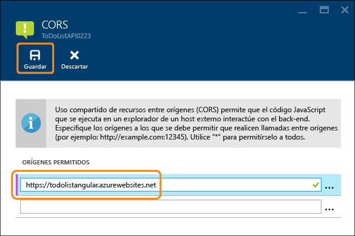

<properties
	pageTitle="Consumo de una aplicación de API de JavaScript con CORS | Microsoft Azure"
	description="Aprenda a usar una aplicación de API del Servicio de aplicaciones de Azure, desde un cliente de JavaScript y mediante CORS."
	services="app-service\api"
	documentationCenter=".net"
	authors="tdykstra"
	manager="wpickett"
	editor=""/>

<tags
	ms.service="app-service-api"
	ms.workload="na"
	ms.tgt_pltfrm="dotnet"
	ms.devlang="na"
	ms.topic="get-started-article"
	ms.date="12/04/2015"
	ms.author="tdykstra"/>

# Consumo de una aplicación de API desde JavaScript con CORS

[AZURE.INCLUDE [app-service-api-get-started-selector](../../includes/app-service-api-get-started-selector.md)]

## Información general

En este tutorial se muestra cómo usar una aplicación de API desde el código JavaScript de un sitio web que se transmite desde un dominio diferente que la aplicación de API. El cliente de ejemplo usa AngularJS.

 
Este es el segundo de una serie de tutoriales que muestran cómo trabajar con aplicaciones de API en el Servicio de aplicaciones de Azure. Para ir al primero, elija el primer tema de la lista desplegable **Tema** de la parte superior de la página.

## Compatibilidad con CORS del Servicio de aplicaciones de Azure

Por motivos de seguridad, el comportamiento predeterminado de los exploradores impide que JavaScript realice llamadas de API a otro dominio distinto del que procede el código JavaScript. Por ejemplo, puede realizar una llamada desde una página web de contoso.com a un punto de conexión de la API de contoso.com, pero no a un punto de conexión de fabrikam.com. Uso compartido de recursos de origen cruzado (CORS) es un protocolo de Internet diseñado para habilitar escenarios donde es necesario realizar llamadas API entre dominios. En el Servicio de aplicaciones de Azure, un ejemplo de este escenario es donde se ejecuta el cliente de JavaScript en una aplicación web mientras se ejecuta la API en una aplicación de API.

El Servicio de aplicaciones de Azure ofrece una manera fácil de configurar los dominios que tienen permiso para llamar a una aplicación de API y la característica CORS funciona igual en todos los idiomas que admite el servicio Aplicaciones de API, como Java y Node.js.

## Seguimiento de este tutorial

En este tutorial se usa una aplicación de ejemplo que se puede descargar en el primer tutorial: [Introducción a Aplicaciones de API y ASP.NET en el Servicio de aplicaciones de Azure](app-service-api-dotnet-get-started.md). Si desea trabajar con Java o Node.js, consulte la [sección de configuración de CORS](#corsconfig) a continuación, donde obtendrá instrucciones generales que se aplican a todas las aplicaciones de API.

## El proyecto de ejemplo ContactsList.Angular

En la [aplicación de ejemplo ContactsList](https://github.com/Azure-Samples/app-service-api-dotnet-contact-list), el proyecto ContactsList.Angular es un cliente AngularJS básico para el proyecto de la API web ContactsList.API.

El código JavaScript de AngularJS que llama a la API se encuentra en el archivo *index.html* del proyecto ContactsList.Angular. El código define las funciones y las agrega al objeto `$scope`, como se muestra aquí donde el método Get de la API se define como `$scope.refresh()`.

		angular.module('myApp', []).controller('contactListCtrl', function ($scope, $http) {
		    $scope.baseurl = 'http://localhost:51864';
		
		    $scope.refresh = function () {
		        $scope.status = "Refreshing Contacts...";
		        $http({
		            method: 'GET',
		            url: $scope.baseUrl + '/api/contacts',
		            headers: {
		                'Content-Type': 'application/json'
		            }
		        }).then(function (results) {
		            $scope.contacts = results.data;
		            $scope.status = "Contacts loaded";
		        }, function (err) {
		            $scope.status = "Error loading contacts";
		        });
		    };
		
		    // POST and DELETE not shown
		
		    $scope.refresh();
		});

El código llama al método $scope.refresh() cuando se carga la página (al final del fragmento de código mostrado anteriormente) y se vincula al botón **Actualizar** botón de la interfaz de usuario.

		<th><button class="btn btn-sm btn-info" ng-click="refresh()">Refresh</button></th>

## Ejecución de manera local del proyecto AngularJS

En esta sección compruebe que puede ejecutar localmente el cliente y que puede llamar a la API mientras se ejecuta también de manera local.

1. Establezca los proyectos ContactsList.API y ContactsList.Angular como proyectos de inicio, con ContactsList.API que se inicie antes de ContactsList.Angular. 

2. Presione F5 para iniciar los proyectos.

	La interfaz de usuario de AngularJS muestra los contactos que se almacenan localmente, y puede usar la interfaz de usuario para agregar y eliminar contactos.

	

3. Cierre las ventanas del explorador.

## Cambio del proyecto AngularJS para que apunte a la aplicación de API de Azure 

A continuación, va a ejecutar el front-end de AngularJS en la nube y llamar al back-end de API que se ejecuta en la nube. Antes de implementar el front-end en Azure, tiene que cambiar el punto de conexión de la API en el proyecto de AngularJS para que el código llame a la aplicación de API de Azure que creó anteriormente.

1. En el proyecto ContactsList.Angular, abra *index.html*.

2. Convierta en comentario la línea que establece `baseUrl` en la dirección URL de localhost, elimine el comentario de la línea que establece `baseUrl` en la dirección URL azurewebsites.net y sustituya el marcador de posición por el nombre real de la aplicación de API que creó anteriormente. Si asignó el nombre de ContactsListAPI a la aplicación de API, el código es ahora similar al ejemplo siguiente.

		$scope.baseUrl = 'https://ContactsListAPI.azurewebsites.net';
		//$scope.baseUrl = 'http://localhost:51864';

### Implementación del proyecto ContactsList.Angular en la aplicación web

Puede crear una aplicación web nueva en la que implementar el proyecto AngularJS, pero para este tutorial la implementará en la misma aplicación web que creó en el tutorial anterior. El nombre de la aplicación web puede reflejar el hecho de que originalmente implementó un proyecto de ASP.NET MVC en ella, pero después de esta implementación, se ejecutará el código de AngularJS.

8. En el **Explorador de soluciones**, haga clic con el botón derecho en el proyecto ContactsList.Angular y, a continuación, haga clic en **Publicar**.

9. Haga clic en la pestaña **Perfil**.

3.  En el paso **Perfil** del Asistente para **publicación web**, haga clic en **Servicio de aplicaciones de Microsoft Azure**.

4. En el cuadro de diálogo **Servicio de aplicaciones**, elija una suscripción.

5. Con el valor de **Vista** establecido en el valor predeterminado de **Grupo de recursos**, expanda el grupo de recursos que creó para esta serie de tutoriales.

7. Seleccione la aplicación web que creó en el primer tutorial (asegúrese de que no selecciona la aplicación de API) y, a continuación, haga clic en **Aceptar**.

8. Haga clic en la pestaña **Configuración**.

9. Expanda **Opciones de publicación de archivo**, y, a continuación, seleccione **Quitar archivos adicionales en el destino**.

	

	Normalmente al implementar un proyecto web en una aplicación web del Servicio de aplicaciones, no se desea la opción "quitar archivos adicionales" porque los cambios suelen ser actualizaciones o nuevos archivos. En este caso va a implementar un proyecto diferente en la misma aplicación web, por lo que probablemente haya muchos archivos de la implementación anterior que no sean necesarios en la nueva.

10. Haga clic en **Publicar**.

	Visual Studio implementa el proyecto ContactsList.Angular en la aplicación web y abre un explorador en la dirección URL de la aplicación web. El explorador muestra la misma interfaz de usuario de AngularJS que vio ejecutándose localmente, excepto que ahora produce un error porque el front-end se ejecuta en un dominio diferente (la URL de la aplicación web) que el back-end (la URL de aplicación de API).

	

##  Configuración de CORS para la aplicación de API de destino en Azure

8. En otra ventana del explorador, vaya al [Portal de Azure](https://portal.azure.com/).

9. Haga clic en **Examinar > Aplicaciones de API**, y, a continuación, seleccione la aplicación de API de destino. En este tutorial, que es la aplicación de API que creó en el primer tutorial para el proyecto ContactsList.API.

10. En la hoja **Aplicación de API**, haga clic en **Configuración**.

11. Busque la sección **API** y, después, haga clic en **CORS**.

12. En el cuadro de texto escriba la dirección URL desde la que desea permitir que procedan las llamadas. Por ejemplo, si implementó una aplicación de JavaScript en una aplicación web denominada ContactsListMVC, escriba "http://contactslistmvc.azurewebsites.net".

	Tenga en cuenta que como alternativa a escribir una dirección URL, puede indicar un asterisco (*) para especificar que se aceptan todos los dominios de origen.

13. Haga clic en **Guardar**.

	

14. Vaya a la ventana del explorador que muestra el cliente AngularJS y actualice la página o haga clic en el botón **Actualizar**.

	La página muestra ahora los contactos almacenados en el sistema de archivos de la aplicación de API de Azure.

	

### CORS en las herramientas del Administrador de recursos de Azure

CORS también se puede configurar para una aplicación de API mediante las herramientas del Administrador de recursos de Azure como Azure PowerShell, CLI o el [Explorador de recursos](https://resources.azure.com/).

Establezca la propiedad `cors` en el tipo de recurso Microsoft.Web/sites/config para el recurso <site name>/web. Por ejemplo, en el **Explorador de recursos**, vaya a **suscripciones > {su suscripción} > resourceGroups > {su grupo de recursos} > proveedores > Microsoft.Web > sitios > {su sitio} > configuración > web** y verá la propiedad cors:

		"cors": {
		    "allowedOrigins": [
		        "contactslistmvc.azurewebsites.net"
		    ]
		}

### CORS de Servicio de aplicaciones frente a CORS de API web

En los proyectos de ASP.NET Web API, también es fácil de configurar CORS en el código, como verá en la siguiente sección. Sin embargo, si utiliza CORS de Servicio de aplicaciones y CORS de API web juntos, el primero tendrá prioridad y el segundo no tendrá ningún efecto. Por ejemplo, si habilita un dominio de origen en Servicio de aplicaciones y habilita todos los dominios de origen en el código de la API web, la aplicación de API de Azure solo aceptará llamadas del dominio especificado en Azure.

## Configuración de CORS en el código de la API web

En un proyecto de API web puede instalar el paquete NuGet [Microsoft.AspNet.WebApi.Cors](https://www.nuget.org/packages/Microsoft.AspNet.WebApi.Cors/) que permite especificar en el código de qué dominios aceptará la API llamadas de JavaScript. Este proceso se documenta en profundidad en [Enabling Cross-Origin Requests in ASP.NET Web API 2](http://www.asp.net/web-api/overview/security/enabling-cross-origin-requests-in-web-api). Para las aplicaciones de API compiladas con ASP.NET Web API, el proceso es exactamente el mismo, aunque se resume aquí.

1. En un proyecto de API web, incluya una línea de código `config.EnableCors()` en el método **Register** de **WebApiConfig**, como en el ejemplo siguiente. 

		public static class WebApiConfig
	    {
	        public static void Register(HttpConfiguration config)
	        {
	            // Web API configuration and services
	            
		        // The following line enables you to control CORS by using Web API code
				config.EnableCors();
	
	            // Web API routes
	            config.MapHttpAttributeRoutes();
	
	            config.Routes.MapHttpRoute(
	                name: "DefaultApi",
	                routeTemplate: "api/{controller}/{id}",
	                defaults: new { id = RouteParameter.Optional }
	            );
	        }
	    }

1. En el controlador de la API web, agregue el atributo `EnableCors` a la clase `ContactsController` o a métodos de acción individuales. En el ejemplo siguiente, la compatibilidad con CORS se aplica a todo el controlador.

		namespace ContactList.Controllers
		{
		    [HttpOperationExceptionFilterAttribute]
		    [EnableCors(origins:"*", headers:"*", methods: "*")]
		    public class ContactsController : ApiController
 
	> **Nota**: el uso de caracteres comodín para todos los parámetros con el atributo `EnableCors` está previsto solo para demostración y abrirá la API a todos los orígenes y a todas las solicitudes HTTP. Use este atributo con precaución.

## Pasos siguientes 

En este tutorial se ha explicado cómo habilitar la compatibilidad con CORS de Servicio de aplicaciones para que el código JavaScript de cliente pueda llamar a una API de un dominio diferente. En el siguiente artículo de la serie de introducción a Aplicaciones de API, obtendrá información sobre [la autenticación de aplicaciones de API del Servicio de aplicaciones](app-service-api-authentication.md).

<!---HONumber=AcomDC_1210_2015-->