# Introducción a Aplicaciones de API, ASP.NET y Swagger en el Servicio de aplicaciones de Azure
[!INCLUDE [selector](../../includes/app-service-api-get-started-selector.md)]

Este es el primero de una serie de tutoriales que muestran cómo utilizar las características del Servicio de aplicaciones de Azure que resultan útiles para el desarrollo y el hospedaje de API de RESTful:  En este tutorial se explica la compatibilidad con los metadatos de la API en formato Swagger.

Aprenderá a realizar los siguientes procedimientos:

* Crear e implementar [aplicaciones de API](app-service-api-apps-why-best-platform.md) en el Servicio de aplicaciones de Azure mediante las herramientas integradas en Visual Studio 2015.
* Automatizar la detección de la API mediante el paquete NuGet Swashbuckle para generar dinámicamente metadatos de la API de Swagger.
* Usar los metadatos de la API de Swagger para generar automáticamente el código de cliente para una aplicación de API.

## Información general de la aplicación de ejemplo
En este tutorial, se trabaja con una aplicación de ejemplo de lista de tareas pendientes sencilla. La aplicación tiene un front-end de aplicación de una sola página (SPA), un nivel intermedio de ASP.NET Web API y una capa de datos de ASP.NET Web API.

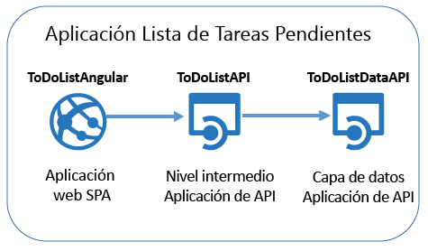

Esta es una captura de pantalla del front-end de [AngularJS](https://angularjs.org/) .

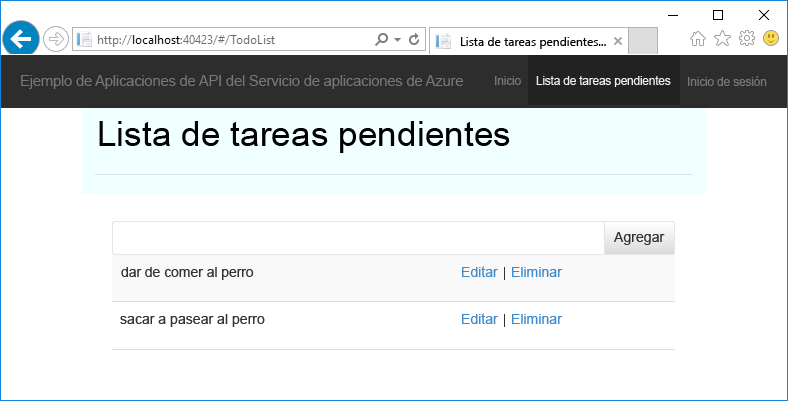

La solución de Visual Studio incluye tres proyectos:

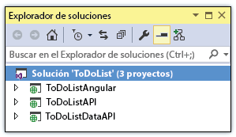

* **ToDoListAngular** : el front-end, una SPA de AngularJS que llama al nivel intermedio.
* **ToDoListAPI** : el nivel intermedio, un proyecto de ASP.NET Web API que llama a la capa de datos para realizar operaciones CRUD en tareas pendientes.
* **ToDoListDataAPI**: la capa de datos, un proyecto de ASP.NET Web API que realiza operaciones CRUD en tareas pendientes.

La arquitectura de tres niveles es una de las muchas que puede implementar mediante Aplicaciones de API y se utiliza aquí únicamente como demostración. El código de cada nivel es lo más simple posible para mostrar las características de Aplicaciones de API. Por ejemplo, la capa de datos utiliza memoria del servidor en lugar de una base de datos como mecanismo de persistencia.

Al finalizar este tutorial, tendrá los dos proyectos de Web API funcionando en la nube en Aplicaciones de API del Servicio de aplicaciones.

En el siguiente tutorial de la serie, se implementa el front-end de SPA en la nube.

## Requisitos previos
* ASP.NET Web API: en las instrucciones del tutorial se da por sentado que tiene conocimientos básicos sobre cómo trabajar con ASP.NET [Web API 2](http://www.asp.net/web-api/overview/getting-started-with-aspnet-web-api/tutorial-your-first-web-api) en Visual Studio.
* Cuenta de Azure: puede [abrir una cuenta gratuita de Azure](https://azure.microsoft.com/free/?WT.mc_id=A261C142F) o [activar las ventajas de las que disfrutan los suscriptores de Visual Studio](https://azure.microsoft.com/pricing/member-offers/msdn-benefits-details/?WT.mc_id=A261C142F).
  
    Si desea empezar a usar el Servicio de aplicaciones de Azure antes de suscribirse para obtener una cuenta de Azure, vaya a la [prueba gratuita del Servicio de aplicaciones](https://azure.microsoft.com/try/app-service/). Ahí puede crear de forma inmediata una aplicación de inicio de corta duración en App Service ( **no se requiere tarjeta de crédito**ni se establece ningún compromiso).
* Visual Studio 2015 con [Azure SDK para .NET](https://azure.microsoft.com/downloads/archive-net-downloads/): el SDK instala automáticamente Visual Studio 2015 si aún no lo tiene.
  
  * En Visual Studio, haga clic en Ayuda -> Acerca de Microsoft Visual Studio y asegúrese de que tiene instalado "Azure App Service Tools v2.9.1", o una versión superior.
    
    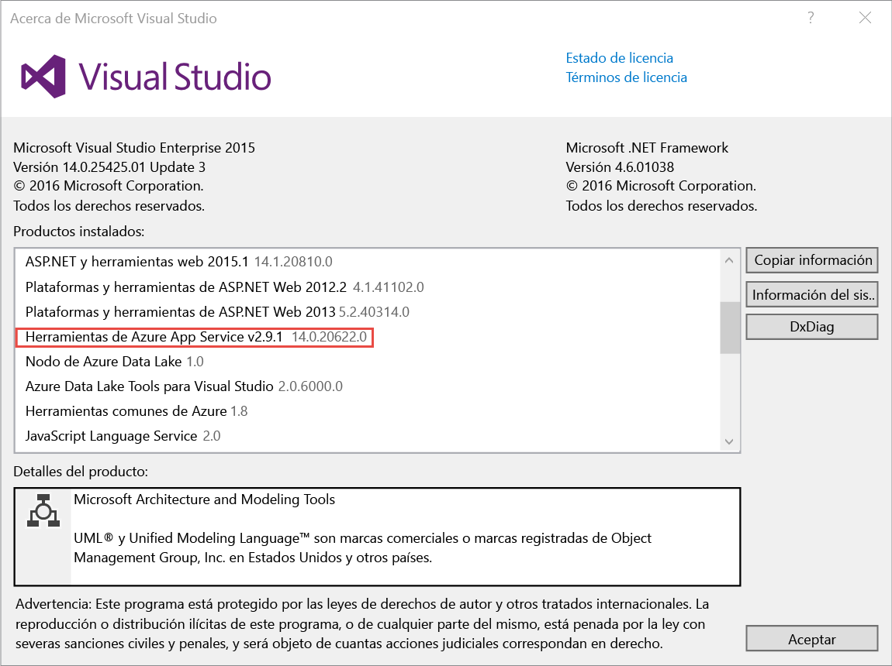
    
    > [!NOTE]
    > Según la cantidad de dependencias de SDK que tenga ya en la máquina, la instalación del SDK puede tardar un período largo, desde unos minutos a media hora o más.
    > 
    > 

## Descarga de la aplicación de ejemplo
1. Descargue el repositorio [Azure-Samples/app-service-api-dotnet-to-do-list](https://github.com/Azure-Samples/app-service-api-dotnet-todo-list) .
   
    Puede hacer clic en el botón **Descargar zip** o clonar el repositorio en la máquina local.
2. Abra la solución ToDoList en Visual Studio 2015 o 2013.
   
   1. Tendrá que confiar en todas las soluciones.
         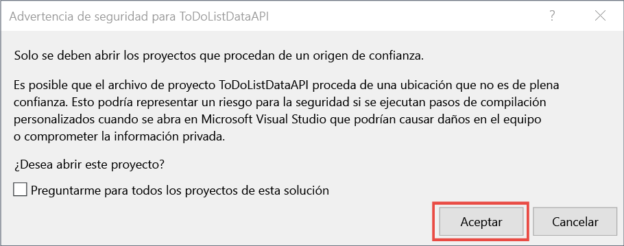
3. Compile la solución (CTRL + MAYÚS + B) para restaurar los paquetes NuGet.
   
    Si desea ver la aplicación en funcionamiento antes de implementarla, puede ejecutarla localmente. Asegúrese de que ToDoListDataAPI es el proyecto de inicio y ejecute la solución. Debería ver un error HTTP 403 en el explorador.

## Uso de la interfaz de usuario y los metadatos de la API de Swagger
La compatibilidad con los metadatos de la API de [Swagger 2.0](http://swagger.io/) está integrada en el Servicio de aplicaciones de Azure. Cada aplicación de API puede especificar un punto de conexión de URL que devuelve los metadatos de la API en formato JSON de Swagger. Los metadatos que devuelve dicho punto de conexión pueden utilizarse para generar código de cliente.

Un proyecto de ASP.NET Web API puede generar de forma dinámica los metadatos de Swagger mediante el paquete NuGet [Swashbuckle](https://www.nuget.org/packages/Swashbuckle) . El paquete NuGet Swashbuckle ya está instalado en los proyectos ToDoListDataAPI y ToDoListAPI que descargó.

En esta sección del tutorial verá los metadatos de Swagger 2.0 generados y, después, probará una interfaz de usuario que se basa en dichos metadatos.

1. Establezca el proyecto ToDoListDataAPI (**no** ToDoListAP) como proyecto de inicio.
   
    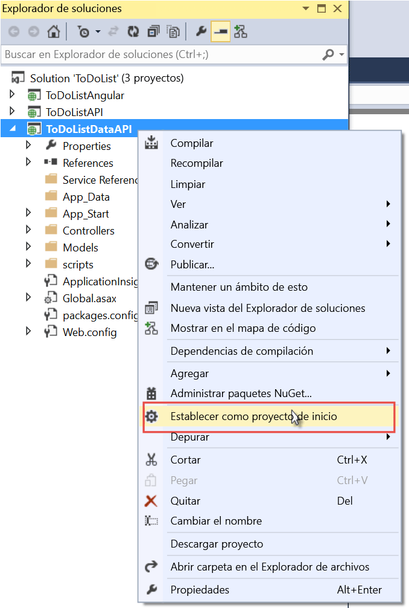
2. Presione F5 o haga clic en **Depurar > Iniciar depuración** para ejecutar el proyecto en modo de depuración.
   
    El explorador se abre y muestra la página de error HTTP 403.
3. En la barra de direcciones del explorador, agregue `swagger/docs/v1` al final de la línea y presione Entrar. (La dirección URL es `http://localhost:45914/swagger/docs/v1`).
   
    Esta es la dirección URL predeterminada que Swashbuckle usa para devolver los metadatos JSON de Swagger 2.0 para la API.
   
    Si usa Internet Explorer, se le pide que descargue un archivo *v1.json* .
   
    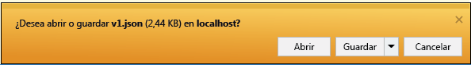
   
    Si usa Chrome, Firefox o Edge, el explorador muestra el archivo JSON en la ventana del explorador. Los distintos exploradores controlan JSON de forma diferente y la ventana del explorador puede no ser exactamente igual que en el ejemplo.
   
    
   
    El ejemplo siguiente muestra la primera sección de los metadatos de Swagger para la API, con la definición del método Get. Estos metadatos son el motor de la interfaz de usuario de Swagger que usará en los pasos siguientes, y los utilizará en una sección posterior del tutorial para generar automáticamente el código de cliente.
   
        {
          "swagger": "2.0",
          "info": {
            "version": "v1",
            "title": "ToDoListDataAPI"
          },
          "host": "localhost:45914",
          "schemes": [ "http" ],
          "paths": {
            "/api/ToDoList": {
              "get": {
                "tags": [ "ToDoList" ],
                "operationId": "ToDoList_GetByOwner",
                "consumes": [ ],
                "produces": [ "application/json", "text/json", "application/xml", "text/xml" ],
                "parameters": [
                  {
                    "name": "owner",
                    "in": "query",
                    "required": true,
                    "type": "string"
                  }
                ],
                "responses": {
                  "200": {
                    "description": "OK",
                    "schema": {
                      "type": "array",
                      "items": { "$ref": "#/definitions/ToDoItem" }
                    }
                  }
                },
                "deprecated": false
              },
4. Cierre el explorador y detenga la depuración de Visual Studio.
5. En el proyecto ToDoListDataAPI, en el **Explorador de soluciones**, abra el archivo *App_Start\SwaggerConfig.cs*, desplácese hacia abajo hasta la línea 174 y quite las marcas de comentarios del siguiente código.
   
        /*
            })
        .EnableSwaggerUi(c =>
            {
        */
   
    El archivo *SwaggerConfig.cs* se crea cuando se instala el paquete Swashbuckle en un proyecto. El archivo ofrece varias maneras de configurar Swashbuckle.
   
    El código cuyas marcas de comentarios ha quitado habilita la interfaz de usuario de Swagger que usará en los pasos siguientes. Al crear un proyecto de Web API con la plantilla de proyecto de aplicación de API, este código aparece como comentarios de forma predeterminada como medida de seguridad.
6. Vuelva a ejecutar el proyecto.
7. En la barra de direcciones del explorador, agregue `swagger` al final de la línea y presione Entrar. (La dirección URL es `http://localhost:45914/swagger`).
8. Cuando aparezca la página de la interfaz de usuario de Swagger, haga clic en **ToDoList** para ver los métodos disponibles.
   
    
9. Haga clic en el primer botón **Get** (Obtener) en la lista.
10. En la sección **Parameters** (Parámetros), escriba un asterisco como valor del parámetro `owner` y haga clic en **Try it out** (Probar).
    
    Cuando agregue autenticación en tutoriales posteriores, el nivel intermedio proporcionará el id. de usuario real a la capa de datos. Por ahora, todas las tareas tendrán asterisco como identificador de propietario mientras la aplicación se ejecuta sin la autenticación habilitada.
    
    
    
    La interfaz de usuario de Swagger llama al método Get de ToDoList y muestra la respuesta del código y los resultados de JSON.
    
    
11. Haga clic en **Post** (Publicar) y, a continuación, haga clic en el cuadro situado debajo de **Model Schema** (Esquema de modelo).
    
    Al hacer clic en el esquema del modelo se rellena el cuadro de entrada donde puede especificar el valor del parámetro para el método Post. (Si esto no funciona en Internet Explorer, use un explorador diferente o escriba el valor del parámetro en el paso siguiente de forma manual).  
    
    
12. Cambie el código JSON en el cuadro de entrada del parámetro `todo` para que se parezca al ejemplo siguiente o sustitúyalo por el texto descriptivo que desee:
    
        {
          "ID": 2,
          "Description": "buy the dog a toy",
          "Owner": "*"
        }
13. Haga clic en **Try it out**(Probar).
    
    La API de ToDoList devuelve un código de respuesta HTTP 204 que indica que todo es correcto.
14. Haga clic en el primer botón **Get** (Obtener) y, en esa sección de la página, haga clic en el botón **Try it out** (Probar).
    
    La respuesta del método Get ahora incluye el nuevo elemento de tareas pendientes.
15. Opcional: pruebe también los métodos Put, Delete y Get by ID.
16. Cierre el explorador y detenga la depuración de Visual Studio.

Swashbuckle funciona con cualquier proyecto de ASP.NET Web API. Si desea agregar generación de metadatos de Swagger a un proyecto existente, simplemente instale el paquete de Swashbuckle.

> [!NOTE]
> Los metadatos de Swagger incluyen un identificador único para cada operación de la API. De manera predeterminada, Swashbuckle puede generar identificadores de operación de Swagger duplicados para los métodos del controlador de la API web. Esto sucede si el controlador tiene métodos HTTP sobrecargados, tales como `Get()` y `Get(id)`. Para obtener información sobre cómo controlar las sobrecargas, consulte [Personalización de definiciones de API generadas por Swashbuckle](app-service-api-dotnet-swashbuckle-customize.md). Si crea un proyecto de API web en Visual Studio con la plantilla Aplicación de API de Azure, el código que genera identificadores de operaciones únicos se agrega automáticamente al archivo *SwaggerConfig.cs* .  
> 
> 

##  Creación de una aplicación de API en Azure e implementación de código en ella
En esta sección, se usan las herramientas de Azure integradas en el Asistente para **publicación web** de Visual Studio para crear una aplicación de API en Azure. A continuación, se implementa el proyecto ToDoListDataAPI en la nueva aplicación de API y se llama a la API, para lo que se ejecuta la interfaz de usuario de Swagger.

1. En el **Explorador de soluciones**, haga clic con el botón derecho en el proyecto ToDoListDataAPI y haga clic en **Publicar**.
   
    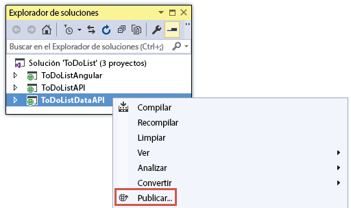
2. En el paso **Perfil** del Asistente para **publicación web**, haga clic en **Servicio de aplicaciones de Microsoft Azure**.
   
   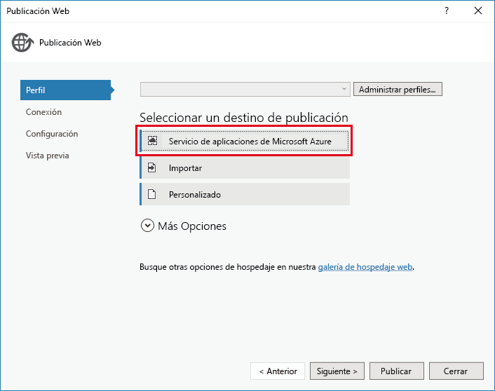
3. Inicie sesión en su cuenta de Azure si aún no lo hizo o actualice sus credenciales si expiraron.
4. En el cuadro de diálogo Servicio de aplicaciones, elija la **suscripción** de Azure que desee usar y haga clic en **Nuevo**.
   
    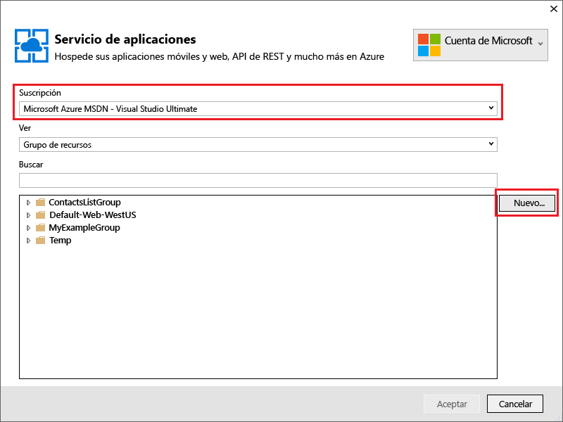
   
    Se muestra la pestaña **Hospedaje** del cuadro de diálogo **Crear servicio de aplicaciones**.
   
    Dado que va a implementar un proyecto de Web API que tiene instalado Swashbuckle, Visual Studio asume que quiere crear una aplicación de API. Esto se indica con el título **API App Name** (Nombre de aplicación de API) y con el hecho de que la lista desplegable **Cambiar tipo** está establecida en **Aplicación de API**.
   
    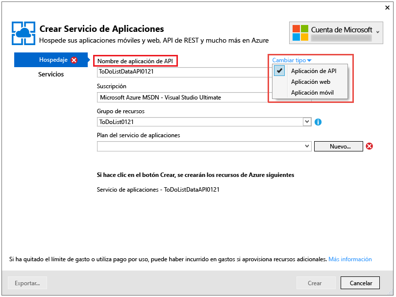
5. En **Nombre de aplicación de API** , escriba un nombre que sea único en el dominio *azurewebsites.net* . Puede aceptar el nombre predeterminado que Visual Studio proporciona.
   
    Si escribe un nombre que alguien haya usado, aparecerá un signo de exclamación rojo a la derecha.
   
    La dirección URL de la aplicación de API será `{API app name}.azurewebsites.net`.
6. En la lista desplegable **Grupo de recursos**, haga clic en **Nuevo** y escriba "ToDoListGroup" u otro nombre que prefiera.
   
    Un grupo de recursos es una colección de recursos de Azure tales como aplicaciones de API, bases de datos, máquinas virtuales, etc.    Para este tutorial, se recomienda crear un nuevo grupo de recursos, ya que así podrá eliminar fácilmente y en un solo paso todos los recursos de Azure que cree para el tutorial.
   
    Este cuadro permite seleccionar un [grupo de recursos](../azure-resource-manager/resource-group-overview.md) existente o crear uno nuevo, para lo que se debe escribir un nombre de grupo recursos que no exista en la suscripción.
7. Haga clic en el botón **Nuevo** situado junto a la lista desplegable **Plan de App Service**.
   
    La captura de pantalla muestra los valores de ejemplo de **API App Name** (Nombre de aplicación de API), **Suscripción** y **Grupo de recursos**, pero sus valores serán diferentes.
   
    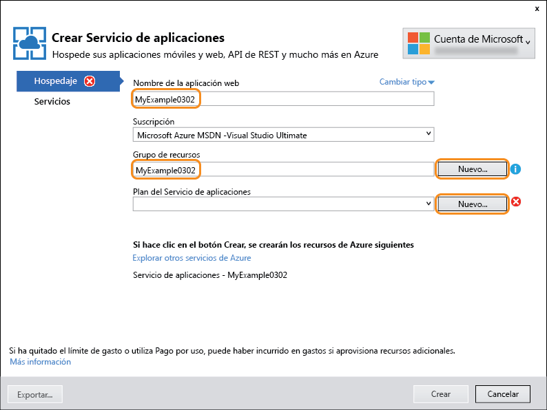
   
    En los siguientes pasos se crea un plan del Servicio de aplicaciones para el nuevo grupo de recursos. Un plan del Servicio de aplicaciones especifica los recursos de proceso en los que se ejecuta la aplicación de API. Por ejemplo, si elige el nivel Gratis, la aplicación de API se ejecuta en máquinas virtuales compartidas, mientras que para algunos niveles de pago, se ejecuta en máquinas virtuales dedicadas. Para más información sobre los planes del Servicio de aplicaciones, consulte [Introducción detallada sobre los planes del Servicio de aplicaciones de Azure](../app-service/azure-web-sites-web-hosting-plans-in-depth-overview.md).
8. En el cuadro de diálogo **Configurar el plan de servicio de aplicaciones** , escriba "ToDoListPlan" u otro nombre que prefiera.
9. En la lista desplegable **Ubicación** , elija la ubicación más cercana.
   
    Esta opción especifica en qué centro de datos de Azure se ejecutará su aplicación. Elija una ubicación cercana para minimizar la [latencia](http://www.bing.com/search?q=web%20latency%20introduction&qs=n&form=QBRE&pq=web%20latency%20introduction&sc=1-24&sp=-1&sk=&cvid=eefff99dfc864d25a75a83740f1e0090).
10. En la lista desplegable **Tamaño**, haga clic en **Gratis**.
    
    Para este tutorial, el plan de tarifa gratis proporcionará un rendimiento suficiente.
11. En el cuadro de diálogo **Configurar el plan de servicio de aplicaciones**, haga clic en **Aceptar**.
    
    
12. En el cuadro de diálogo **Crear servicio de aplicaciones**, haga clic en **Crear**.
    
    
    
    Visual Studio crea la aplicación de API y un perfil de publicación que tiene toda la configuración necesaria para la aplicación de API. Después, se abre el Asistente para **publicación web** , que se usará para implementar el proyecto.
    
    Se abre el Asistente para **publicación web** en la pestaña **Conexión**, tal como se muestra a continuación.
    
    En la pestaña **Conexión**, los valores de **Servidor** y **Nombre del sitio** apuntan a la aplicación de API. **Nombre de usuario** y **Contraseña** son credenciales de implementación que Azure crea automáticamente. Después de la implementación, Visual Studio abre un explorador en la **Dirección URL de destino** (esta es la única finalidad de la **Dirección URL de destino**).  
13. Haga clic en **Siguiente**.
    
    
    
    La pestaña siguiente es la de **Configuración** (como se muestra a continuación). Aquí puede cambiar la pestaña de configuración de compilación para implementar una compilación de depuración para la [depuración remota](../app-service-web/web-sites-dotnet-troubleshoot-visual-studio.md#remotedebug). En la pestaña también se encuentran varias **Opciones de publicación de archivos**:
    
    * Quitar archivos adicionales en el destino.
    * Precompilar durante la publicación.
    * Excluir archivos de la carpeta App_Data.
    
    Para este tutorial no necesita ninguna de ellas. Para información más detallada de lo que hacen, consulte [How to: Deploy a Web Project Using One-Click Publish in Visual Studio](https://msdn.microsoft.com/library/dd465337.aspx)(Implementación de un proyecto web mediante publicación con un solo clic en Visual Studio).
14. Haga clic en **Siguiente**.
    
    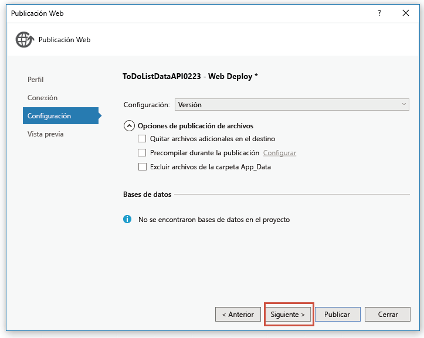
    
    A continuación, la pestaña **Vista previa** (que se muestra aquí) ofrece la posibilidad de ver qué archivos se van a copiar desde el proyecto a la aplicación de API. Al implementar un proyecto en una aplicación de API para la que ya implementó anteriormente, solo se copian los archivos modificados. Si desea ver una lista de lo que se va a copiar, haga clic en el botón **Comenzar previsualización** .
15. Haga clic en **Publicar**.
    
    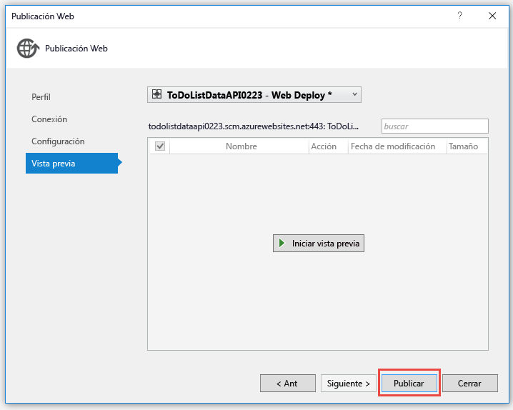
    
    Visual Studio implementa el proyecto ToDoListDataAPI en la nueva aplicación de API. La ventana **Salida** registra la implementación correcta y aparece una página "se creó correctamente" en una ventana del explorador que se abre con la dirección URL de la aplicación de API.
    
    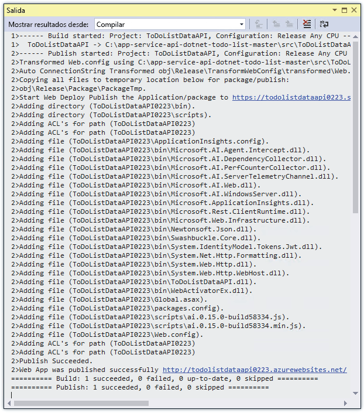
    
    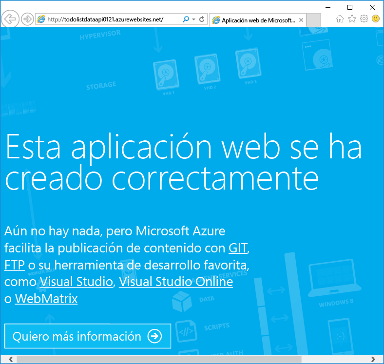
16. En la barra de direcciones del explorador, agregue "swagger" a la URL y presione Entrar. (La dirección URL es `http://{apiappname}.azurewebsites.net/swagger`).
    
    El explorador muestra la misma interfaz de usuario de Swagger que vio anteriormente, pero ahora se ejecuta en la nube. Pruebe el método Get y verá que vuelve a las dos tareas predeterminadas. Los cambios realizados anteriormente se guardaron en la memoria del equipo local.
17. Abra el [Portal de Azure](https://portal.azure.com/).
    
    El Portal de Azure es una interfaz web para administrar recursos de Azure tales como aplicaciones de API.
18. Haga clic en **Más servicios > App Services**.
    
    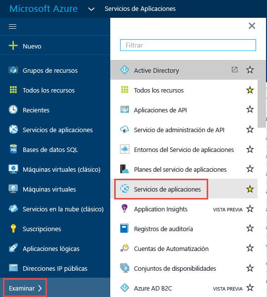
19. En la hoja **Servicios de aplicaciones** , busque la nueva aplicación de API y haga clic en ella. (En el Portal de Azure, las ventanas que se abren a la derecha se llaman *hojas*).
    
    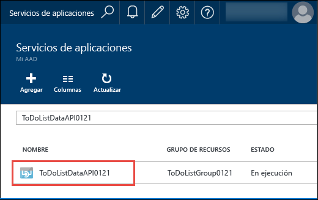
    
    Se abren dos hojas: una con información general sobre la aplicación de API y otra con una larga lista de valores que puede ver y cambiar.
20. En la hoja **Configuración**, busque la sección **API** y haga clic en **Definición de API**.
    
    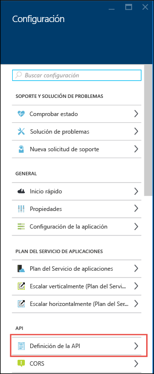
    
    La hoja **Definición de la API** le permite especificar la dirección URL que devuelve los metadatos de Swagger 2.0 en formato JSON. Cuando Visual Studio crea la aplicación de API, establece la dirección URL de la definición de API en el valor predeterminado de los metadatos generados por Swashbuckle que vio antes, que es la URL base de la aplicación de API más `/swagger/docs/v1`.
    
    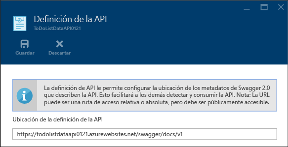
    
    Cuando se selecciona una aplicación de API para la que se va a generar código de cliente, Visual Studio recupera los metadatos de esta dirección URL.

##  Generación de código de cliente para la capa de datos
Una de las ventajas de integrar Swagger en aplicaciones de API de Azure es la generación automática de código. Las clases de cliente generadas hacen que sea más fácil escribir código que llame a una aplicación de API.

El proyecto ToDoListAPI ya tiene el código de cliente generado, pero en los siguientes pasos lo eliminará y lo volverá a crear para ver cómo se genera código.

1. En el **Explorador de soluciones**de Visual Studio, en el proyecto ToDoListAPI, elimine la carpeta *ToDoListDataAPI* . **Precaución: Elimine solamente la carpeta, no el proyecto ToDoListDataAPI.**
   
    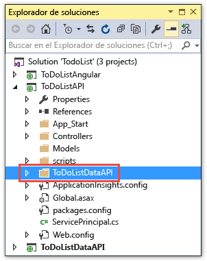
   
    Esta carpeta se creó mediante el proceso de generación de código que está punto de recorrer.
2. Haga clic con el botón derecho en el proyecto ToDoListAPI y, después, en **Agregar > Cliente de API de REST**.
   
    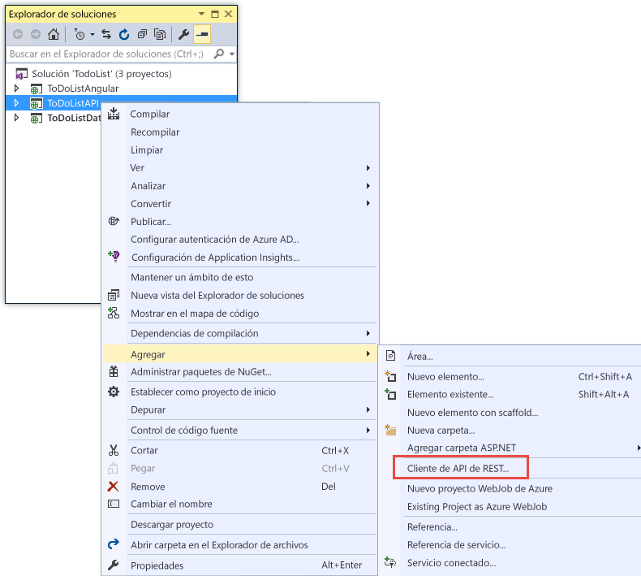
3. En el cuadro de diálogo **Agregar cliente de API de REST**, haga clic en **URL de Swagger** y en **Seleccionar recurso de Azure**.
   
    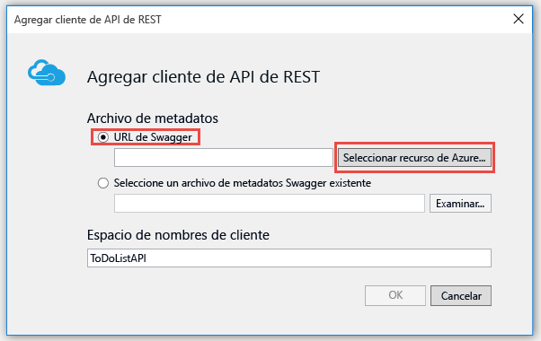
4. En el cuadro de diálogo **App Service**, expanda el grupo de recursos que usa en este tutorial, seleccione la aplicación de API y haga clic en **Aceptar**.
   
    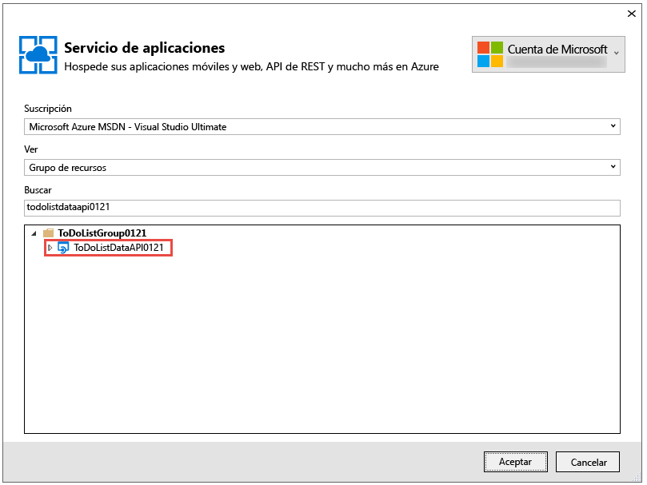
   
    Observe que al volver al cuadro de diálogo **Agregar cliente de API de REST** , el cuadro de texto se rellenó con la dirección URL de la definición de API que vio anteriormente en el portal.
   
    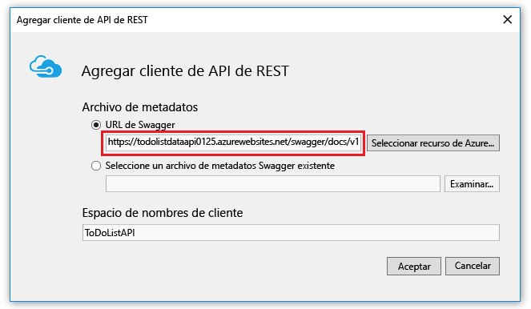
   
   > [!TIP]
   > Como alternativa para obtener los metadatos para la generación del código, puede escribir la dirección URL directamente en lugar de utilizar el cuadro de diálogo Examinar. Por otra parte, si desea generar el código de cliente antes de implementarlo en Azure, puede ejecutar el proyecto de Web API localmente, ir a la dirección URL que proporciona el archivo JSON de Swagger, guardar el archivo y usar la opción **Seleccionar un archivo de metadatos de Swagger existente** .
   > 
   > 
5. En el cuadro de diálogo **Agregar cliente de API de REST**, haga clic en **Aceptar**.
   
    Visual Studio crea una carpeta con el nombre de la aplicación de API y genera clases cliente.
   
    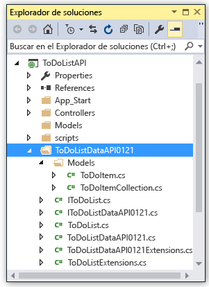
6. En el proyecto ToDoListAPI, abra *Controllers\ToDoListController.cs* para ver el código de la línea 40 que llama a la API mediante el cliente generado.
   
    El siguiente fragmento de código muestra cómo el código crea instancias del objeto de cliente y llama al método Get.
   
        private static ToDoListDataAPI NewDataAPIClient()
        {
            var client = new ToDoListDataAPI(new Uri(ConfigurationManager.AppSettings["toDoListDataAPIURL"]));
            return client;
        }
   
        public async Task<IEnumerable<ToDoItem>> Get()
        {
            using (var client = NewDataAPIClient())
            {
                var results = await client.ToDoList.GetByOwnerAsync(owner);
                return results.Select(m => new ToDoItem
                {
                    Description = m.Description,
                    ID = (int)m.ID,
                    Owner = m.Owner
                });
            }
        }
   
    El parámetro de constructor obtiene la dirección URL del punto de conexión en la configuración de la aplicación `toDoListDataAPIURL`. En el archivo Web.config, dicho valor se establece en la dirección URL local de IIS Express del proyecto de la API para que pueda ejecutar la aplicación localmente. Si se omite el parámetro del constructor, el punto de conexión predeterminado es la dirección URL a partir de la cual se genera el código.
7. La clase de cliente se generará con un nombre diferente según el nombre de la aplicación de API; cambie el código en *Controllers\ToDoListController.cs* para que el nombre del tipo coincida con el que se generó en el proyecto. Por ejemplo, si el nombre de la aplicación de API es ToDoListDataAPI071316, cambiaría este código:
   
        private static ToDoListDataAPI NewDataAPIClient()
        {
            var client = new ToDoListDataAPI(new Uri(ConfigurationManager.AppSettings["toDoListDataAPIURL"]));

a este:

        private static ToDoListDataAPI071316 NewDataAPIClient()
        {
            var client = new ToDoListDataAPI071316(new Uri(ConfigurationManager.AppSettings["toDoListDataAPIURL"]));

## Creación de una aplicación de API para hospedar el nivel intermedio
Antes [creó la aplicación de API de la capa de datos e implementó código en ella](#createapiapp).  Siga ahora el mismo procedimiento para la aplicación de API de nivel intermedio.

1. En el **Explorador de soluciones**, haga clic con el botón derecho en el proyecto ToDoListAPI de nivel intermedio (no en ToDoListDataAPI de la capa de datos) y haga clic en **Publicar**.
   
    
2. En la pestaña **Perfil** del Asistente para **publicación web**, haga clic en **Servicio de aplicaciones de Microsoft Azure**.
3. En el cuadro de diálogo **App Service**, haga clic en **Nuevo**.
4. En la pestaña **Hospedaje** del cuadro de diálogo **Crear servicio de aplicaciones**, acepte el nombre predeterminado en **Nombre de la aplicación de API** o escriba uno único en el dominio *azurewebsites.net*.
5. Elija la **suscripción** de Azure que ha usado.
6. En la lista desplegable **Grupo de recursos** , elija el grupo de recursos que creó anteriormente.
7. En la lista desplegable **Plan del Servicio de aplicaciones** , elija el plan que creó anteriormente. Usará ese valor de forma predeterminada.
8. Haga clic en **Crear**.
   
    Visual Studio crea la aplicación de API, crea un perfil de publicación para ella y muestra el paso **Conexión** del Asistente para **publicación web**.
9. En el paso **Conexión** del Asistente para **publicación web**, haga clic en **Publicar**.
   
   Visual Studio implementa el proyecto ToDoListAPI en la nueva aplicación de API y abre un explorador en la dirección URL de la aplicación de API. Aparece una página "creado correctamente".

## Configuración del nivel intermedio para llamar a la capa de datos
Si llamara ahora a la aplicación de API de nivel intermedio, intentaría llamar a la capa de datos usando la dirección URL localhost que todavía está en el archivo Web.config. En esta sección agregará la dirección URL de la aplicación de API de nivel de datos a una configuración del entorno de la aplicación de API de nivel intermedio. Cuando el código de la aplicación de API de nivel medio recupera la configuración de URL del nivel de datos, la configuración del entorno invalida lo que hay en el archivo Web.config.

1. Vaya al [Portal de Azure](https://portal.azure.com/)y después a la hoja **Aplicación de API** de la aplicación de API que creó para hospedar el proyecto TodoListAPI (nivel intermedio).
2. En la hoja **Configuración** de la aplicación de API, haga clic en **Configuración de la aplicación**.
3. En la hoja **Configuración de la aplicación** de la aplicación de API, desplácese hacia abajo hasta la sección **Configuración de aplicación** y agregue la clave y el valor siguientes. El valor será la dirección URL de la primera aplicación de API que publicó en este tutorial.
   
   | **Clave** | toDoListDataAPIURL |
   | --- | --- |
   | **Valor** |https://{nombre de la aplicación de API de capa de datos}.azurewebsites.net |
   | **Ejemplo** |https://todolistdataapi.azurewebsites.net |
4. Haga clic en **Guardar**.
   
    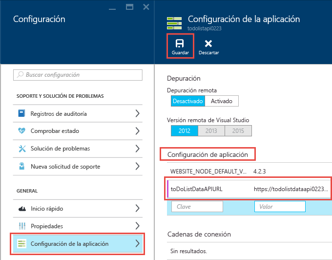
   
    Cuando el código se ejecuta en Azure, este valor anulará ahora la dirección URL de host local que se encuentra en el archivo Web.config.

## Prueba
1. En una ventana del explorador, vaya a la dirección URL de la aplicación de API de nivel intermedio que acaba de crear para ToDoListAPI. Para ello, haga clic en la dirección URL en la hoja principal de la aplicación de API en el portal.
2. En la barra de direcciones del explorador, agregue "swagger" a la URL y presione Entrar. (La dirección URL es `http://{apiappname}.azurewebsites.net/swagger`).
   
    El explorador muestra la misma interfaz de usuario de Swagger que vio antes para ToDoListDataAPI, pero ahora `owner` no es un campo obligatorio para la operación Get. Esto se debe a que la aplicación de API de nivel intermedio envía dicho valor a la aplicación de API de capa de datos automáticamente. (Al realizar los tutoriales de autenticación, el nivel intermedio enviará identificadores de usuario reales para el parámetro `owner`; por ahora, se incluye un asterisco en el código).
3. Pruebe el método Get y los otros métodos para validar que la aplicación de API de nivel intermedio llama correctamente a la aplicación de API de capa de datos.
   
    

## Solución de problemas
Si experimenta algún problema mientras lleva a cabo este tutorial, aquí se ofrecen ideas para solucionarlo:

* Asegúrese de que usa la versión más reciente de [Azure SDK para .NET](http://go.microsoft.com/fwlink/?linkid=518003).
* Dos de los nombres de proyecto son similares (ToDoListAPI, ToDoListDataAPI). Si lo que ve no se parece a lo que se describe en las instrucciones cuando trabaje con un proyecto, asegúrese de que ha abierto el proyecto correcto.
* Si está en una red corporativa y está intentando realizar la implementación en el Servicio de aplicaciones de Azure mediante un firewall, asegúrese de que los puertos 443 y 8172 estén abiertos para Web Deploy. Si no puede abrir estos puertos, puede usar otros métodos de implementación.  Consulte [Documentación de implementación del Servicio de aplicaciones de Azure](../app-service-web/web-sites-deploy.md).
* Errores "Los nombres de ruta deben ser únicos": pueden aparecer si implementa accidentalmente el proyecto incorrecto en una aplicación de API y después implementa el correcto. Para corregir este problema, vuelva a implementar el proyecto correcto en la aplicación de API y, en la pestaña **Configuración** del Asistente para **publicación web**, seleccione **Quitar archivos adicionales en el destino**.

Una vez que la aplicación de API de ASP.NET se esté ejecutando en el Servicio de aplicaciones de Azure, podrá obtener más información acerca de las características de Visual Studio que simplifican la solución de problemas. Para más información sobre el registro o la depuración remota, entre otros temas, consulte [Solución de problemas de una aplicación web en Azure App Service con Visual Studio](../app-service-web/web-sites-dotnet-troubleshoot-visual-studio.md).

## Pasos siguientes
Ha visto cómo implementar proyectos de Web API existentes en aplicaciones de API, cómo generar código de cliente para aplicaciones de API y cómo consumir aplicaciones de API desde clientes .NET. El siguiente tutorial de esta serie muestra cómo [usar CORS para consumir aplicaciones de API desde clientes de JavaScript](app-service-api-cors-consume-javascript.md).

Para más información acerca de la generación de código de cliente, consulte el repositorio [Azure/AutoRest](https://github.com/azure/autorest) en GitHub.com. Si necesita ayuda con los problemas de uso del cliente generado, abra un [incidente en el repositorio de AutoRest](https://github.com/azure/autorest/issues).

Si desea crear proyectos de aplicación de API desde cero, use la plantilla **Aplicación de API de Azure** .

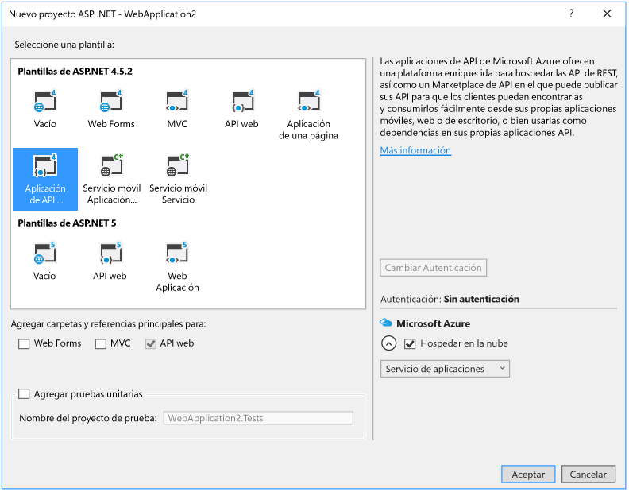

La elección de la plantilla de proyecto **Azure API App** equivale a elegir la plantilla **vacía** de ASP.NET 4.5.2, hacer clic en la casilla para agregar compatibilidad con Web API e instalar el paquete NuGet Swashbuckle. Además, la plantilla agrega algún código de configuración de Swashbuckle diseñado para evitar la creación de identificadores de operación de Swagger duplicados. Una vez que haya creado un proyecto de aplicación de API, puede implementarlo en una aplicación de API del mismo modo que el mostrado en este tutorial.

<!--HONumber=Feb17_HO3-->

