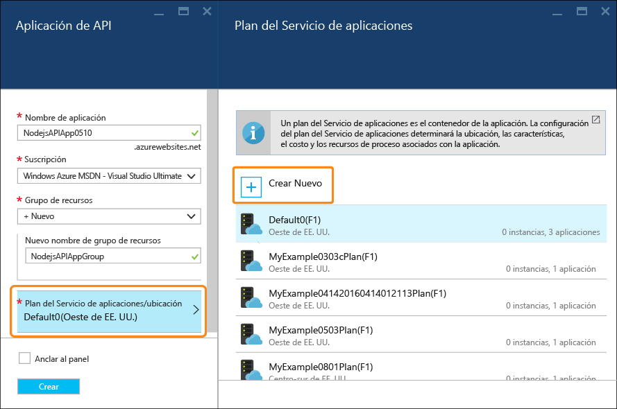
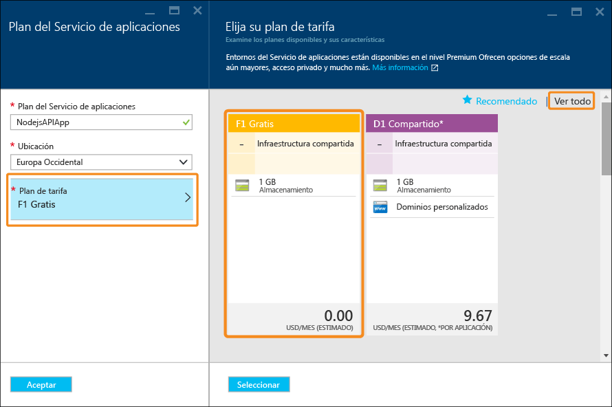

# Creación de una API de RESTful de Node.js e implementación en una aplicación de API de Azure
[!INCLUDE [app-service-api-get-started-selector](../../includes/app-service-api-get-started-selector.md)]

En este tutorial se muestra cómo crear una API de [Node.js](http://nodejs.org) sencilla e implementarla en una [Aplicación de API](app-service-api-apps-why-best-platform.md) en [Azure App Service](../app-service/app-service-value-prop-what-is.md) mediante [Git](http://git-scm.com). Puede usar cualquier sistema operativo que ejecute Node.js; realizará todo el trabajo mediante herramientas de línea de comandos como cmd.exe o bash.

## Requisitos previos
1. Cuenta de Microsoft Azure ([abra aquí una cuenta gratuita](https://azure.microsoft.com/pricing/free-trial/))
2. [Node.js](http://nodejs.org) instalado (en este ejemplo se considera que tiene Node.js versión 4.2.2)
3. [Git](https://git-scm.com/) instalado
4. [GitHub](https://github.com/) 

Aunque el Servicio de aplicaciones admite muchas maneras de implementar el código en una aplicación de API, en este tutorial se muestra el método Git y se da por hecho que tiene conocimientos básicos de cómo trabajar con Git. Para más información sobre otras opciones de implementación, consulte [Documentación de implementación del Servicio de aplicaciones de Azure](../app-service-web/web-sites-deploy.md).

## Obtención del código de ejemplo
1. Abra una interfaz de la línea de comandos que puede ejecutar comandos de Node.js y Git.
2. Vaya a una carpeta que pueda usar para un repositorio de Git local y clone el [repositorio de GitHub que contiene el código de ejemplo](https://github.com/Azure-Samples/app-service-api-node-contact-list).
   
        git clone https://github.com/Azure-Samples/app-service-api-node-contact-list.git
   
    La API de ejemplo proporciona dos puntos de conexión: una solicitud Get a `/contacts` devuelve una lista de nombres y direcciones de correo electrónico en formato JSON, mientras que `/contacts/{id}` solo devuelve el contacto seleccionado.

## Código de Node.js scaffold (generación automática) basado en los metadatos de Swagger
[Swagger](http://swagger.io/) es un formato de archivo para metadatos que describe una API de RESTful. El Servicio de aplicaciones de Azure tiene [compatibilidad integrada para los metadatos de Swagger](app-service-api-metadata.md). En esta sección del tutorial se modela un flujo de trabajo de desarrollo de API en el que primero crea los metadatos de Swagger y los usa para aplicar la técnica scaffolding (generación automática) al código del servidor para la API. 

> [!NOTE]
> Puede omitir esta sección si no desea aprender cómo aplicar la técnica scaffolding a código Node.js desde un archivo de metadatos de Swagger. Si únicamente desea implementar código de ejemplo en una nueva aplicación de API, vaya directamente a la sección [Creación de una aplicación de API en Azure](#createapiapp) .
> 
> 

### Instalación y ejecución de Swaggerize
1. Ejecute los comandos siguientes para instalar los módulos de NPM **yo** y**generator-swaggerize** globalmente.
   
        npm install -g yo
        npm install -g generator-swaggerize
   
    Swaggerize es una herramienta que genera código del servidor para una API descrita por un archivo de metadatos de Swagger. El archivo de Swagger que va a utilizar se denomina *api.json* y se encuentra en la carpeta *start* del repositorio que clonó.
2. Vaya a la carpeta *start* y ejecute el comando `yo swaggerize`. Swaggerize realiza una serie de preguntas.  En **what to call this project** (Nombre del proyecto), escriba "contactlist", en **path to swagger document** (Ruta de acceso del documento de Swagger), escriba "api.json" y en **Express, Hapi, or Restify**(Express, Hapi o Restify), escriba "express".
   
        yo swaggerize
   
    
   
    **Nota**: Si se produce un error en este paso, el paso siguiente explica cómo corregirlo.
   
    Swaggerize crea una carpeta de aplicaciones, controladores de scaffolding y archivos de configuración, y genera un archivo **package.json** . El motor de vista rápida se utiliza para generar la página de Ayuda de Swagger.  
3. Si el comando `swaggerize` genera un error de "unexpected token" (token inesperado) o "invalid escape sequence" (secuencia de escape no válida), corrija la causa del error editando el archivo *package.json* generado. En la línea `regenerate` bajo `scripts`, cambie la barra diagonal inversa que precede a *api.json* por una barra diagonal, de forma que la línea sea similar al ejemplo siguiente:
   
         "regenerate": "yo swaggerize --only=handlers,models,tests --framework express --apiPath config/api.json"
4. Vaya a la carpeta que contiene el código con scaffold (en este caso, la subcarpeta */start/ContactList*).
5. Ejecute `npm install`.
   
        npm install
6. Instale el módulo de NPM **jsonpath** . 
   
        npm install --save jsonpath
   
    
7. Instale el módulo de NPM **swaggerize-ui** . 
   
        npm install --save swaggerize-ui
   
    

### Personalización del código con scaffold
1. Copie la carpeta **lib** de la carpeta **start** en la carpeta **ContactList** creada por el procesador de scaffolding. 
2. Reemplace el código del archivo **handlers/contacts.js** por el siguiente. 
   
    Este código usa los datos JSON almacenados en el archivo **lib/contacts.json** proporcionado por **lib/contactRepository.js**. El nuevo código contacts.js responderá a las solicitudes HTTP para obtener todos los contactos y los devolverá como una carga JSON. 
   
        'use strict';
   
        var repository = require('../lib/contactRepository');
   
        module.exports = {
            get: function contacts_get(req, res) {
                res.json(repository.all())
            }
        };
3. Reemplace el código del archivo **handlers/contacts/{id}.js** por el siguiente. 
   
        'use strict';
   
        var repository = require('../../lib/contactRepository');
   
        module.exports = {
            get: function contacts_get(req, res) {
                res.json(repository.get(req.params['id']));
            }    
        };
4. Reemplace el código de **server.js** por el siguiente. 
   
    Los cambios realizados en el archivo server.js se indican con comentarios para que pueda ver los cambios realizados. 
   
        'use strict';
   
        var port = process.env.PORT || 8000; // first change
   
        var http = require('http');
        var express = require('express');
        var bodyParser = require('body-parser');
        var swaggerize = require('swaggerize-express');
        var swaggerUi = require('swaggerize-ui'); // second change
        var path = require('path');
   
        var app = express();
   
        var server = http.createServer(app);
   
        app.use(bodyParser.json());
   
        app.use(swaggerize({
            api: path.resolve('./config/api.json'), // third change
            handlers: path.resolve('./handlers'),
            docspath: '/swagger' // fourth change
        }));
   
        // change four
        app.use('/docs', swaggerUi({
          docs: '/swagger'  
        }));
   
        server.listen(port, function () { // fifth and final change
        });

### Prueba con la API ejecutada localmente
1. Active el servidor mediante el archivo ejecutable de línea de comandos de Node.js. 
   
        node server.js
2. Cuando vaya a **http://localhost:8000/contacts**, aparecerá el resultado JSON de la lista de contactos (o se le solicita que lo descargue, según el explorador). 
   
    
3. Cuando vaya a **http://localhost:8000/contacts/2**, verá el contacto representado por ese valor de identificador.
   
    
4. Los datos JSON de Swagger se envían a través del punto de conexión **/swagger** :
   
    
5. La interfaz de usuario de Swagger se envían a través del punto de conexión **/docs** . En la interfaz de usuario de Swagger, puede usar las características de cliente HTML enriquecidas para probar la API.
   
    

##  Creación de una nueva aplicación de API
En esta sección, use el Portal de Azure para crear una nueva aplicación de API en Azure. Esta aplicación de API representa los recursos de procesos que proporcionará Azure para ejecutar su código. En secciones posteriores, implementará su código en la nueva aplicación de API.

1. Vaya al [Portal de Azure](https://portal.azure.com/). 
2. Haga clic en **Nuevo > Web y móvil > Aplicación de API**. 
   
    
3. Escriba en **Nombre de aplicación** un nombre único en el dominio *azurewebsites.net* ; por ejemplo, NodejsAPIApp más un número para hacerlo único. 
   
    Por ejemplo, si el nombre es `NodejsAPIApp`, la dirección URL será `nodejsapiapp.azurewebsites.net`.
   
    Si escribe un nombre que alguien haya usado, aparecerá un signo de exclamación rojo a la derecha.
4. En la lista desplegable **Grupo de recursos**, haga clic en **Nuevo** y luego en **Nuevo nombre de grupo de recursos**, y escriba "NodejsAPIAppGroup" u otro nombre que prefiera. 
   
    Un [grupo de recursos](../azure-resource-manager/resource-group-overview.md) es una colección de recursos de Azure tales como aplicaciones de API, bases de datos y máquinas virtuales. Para este tutorial, se recomienda crear un nuevo grupo de recursos, ya que así podrá eliminar fácilmente y en un solo paso todos los recursos de Azure que cree para el tutorial.
5. Haga clic en **Plan de App Service/Ubicación** y, después, en **Crear nuevo**.
   
    
   
    En los siguientes pasos se creará un plan del Servicio de aplicaciones para el nuevo grupo de recursos. Un plan del Servicio de aplicaciones especifica los recursos de proceso en los que se ejecuta la aplicación de API. Por ejemplo, si elige el nivel Gratis, la aplicación de API se ejecuta en máquinas virtuales compartidas, mientras que para algunos niveles de pago, se ejecuta en máquinas virtuales dedicadas. Para más información sobre los planes del Servicio de aplicaciones, consulte [Introducción detallada sobre los planes del Servicio de aplicaciones de Azure](../app-service/azure-web-sites-web-hosting-plans-in-depth-overview.md).
6. En la hoja **Plan del servicio de aplicaciones** , escriba "NodejsAPIAppPlan" u otro nombre si lo prefiere.
7. En la lista desplegable **Ubicación** , elija la ubicación más cercana.
   
    Esta opción especifica en qué centro de datos de Azure se ejecutará su aplicación. Para este tutorial, puede seleccionar cualquier región y no habrá una diferencia notable, No obstante, para una aplicación de producción, es aconsejable que el servidor esté lo más próximo posible a los clientes que vayan a acceder a él, con el fin de minimizar la [latencia](http://www.bing.com/search?q=web%20latency%20introduction&qs=n&form=QBRE&pq=web%20latency%20introduction&sc=1-24&sp=-1&sk=&cvid=eefff99dfc864d25a75a83740f1e0090).
8. Haga clic en **Plan de tarifa > Ver todo > F1 Free** (F1 gratis).
   
    Para este tutorial, el plan de tarifa gratis proporcionará un rendimiento suficiente.
   
    
9. En la hoja **Plan de App Service**, haga clic en **Aceptar**.
10. En la hoja **Aplicación de API**, haga clic en **Crear**.

## Configuración de la nueva aplicación de API para la implementación de Git
Implementará el código en la aplicación de API insertando confirmaciones en un repositorio de Git en el Servicio de aplicaciones de Azure. En esta sección del tutorial, creará las credenciales y el repositorio de Git en Azure que va a usar para la implementación.  

1. Una vez creada la aplicación de API, haga clic en **App Services > {su aplicación de API}** en la página principal del portal. 
   
    El portal muestra las hojas **Aplicación de API** y **Configuración**.
   
    
2. En la hoja **Configuración**, baje hasta la sección **Publicación** y haga clic en **Credenciales de implementación**.
3. En la hoja **Configurar credenciales de implementación**, escriba un nombre de usuario y una contraseña, y haga clic en **Guardar**.
   
    Usará estas credenciales para publicar el código de Node.js en su aplicación de API. 
   
    
4. En la hoja **Configuración**, haga clic en **Origen de implementación > Elegir origen > Repositorio de Git local** y en **Aceptar**.
   
    
5. Una vez creado el repositorio de Git, la hoja cambiará para mostrar las implementaciones activas. Como el repositorio es nuevo, no tiene implementaciones activas en la lista. 
   
    
6. Copie la dirección URL del repositorio de Git. Para ello, vaya a la hoja de la nueva aplicación de API y consulte la sección **Essentials** de la hoja. Verá la **URL de clonación de Git** en la sección **Essentials**. Cuando se mantiene el mouse sobre esta dirección URL, se ve un icono a la derecha que copiará la dirección URL en el Portapapeles. Haga clic en este icono para copiar la dirección URL.
   
    
   
    **Nota**: Necesitará la dirección URL de clonación de Git en la sección siguiente, por tanto asegúrese de guardarla de momento.

Ahora que dispone de una aplicación de API con el repositorio de Git correspondiente, puede insertar código en el repositorio para implementarlo en la aplicación de API. 

## Implementación del código de API en Azure
En esta sección, creará un repositorio de Git local que contiene su código de servidor de la API y luego insertará su código desde ese repositorio al repositorio de Azure que ha creado anteriormente.

1. Copie la carpeta `ContactList` en una ubicación que pueda usar para un nuevo repositorio de Git local. Si ha realizado la primera parte del tutorial, copie `ContactList` desde la carpeta `start`; de lo contrario, copie `ContactList` desde la carpeta `end`.
2. En la herramienta de la línea de comandos, vaya a la nueva carpeta y ejecute el siguiente comando para crear un nuevo repositorio de Git local. 
   
        git init
   
     
3. Ejecute el siguiente comando para agregar un Git remoto para el repositorio de la aplicación de API. 
   
        git remote add azure YOUR_GIT_CLONE_URL_HERE
   
    **Nota**: Reemplace la cadena "YOUR_GIT_CLONE_URL_HERE" por su propia dirección URL de clonación de Git que copió antes. 
4. Ejecute los comandos siguientes para crear una confirmación que contiene todo el código. 
   
        git add .
        git commit -m "initial revision"
   
    
5. Ejecute el comando para insertar el código en Azure. Cuando se le pide una contraseña, escriba la que creó antes en el portal de Azure.
   
        git push azure master
   
    Esto desencadenará una implementación de la aplicación de API.  
6. En el explorador, vuelva a la hoja **Implementaciones** para la aplicación de API y verá la implementación que se está produciendo. 
   
    
   
    Simultáneamente, la interfaz de la línea de comandos refleja el estado de la implementación mientras está ocurriendo. 
   
    
   
    Cuando se haya completado la implementación, la hoja **Implementaciones** refleja la implementación correcta de los cambios del código en la aplicación de API. 

## Prueba con la API ejecutada en Azure
1. Copie la **URL** en la sección **Essentials** de la hoja Aplicación de API. 
   
    
2. Con un cliente de la API de REST, como Postman o Fiddler (o el explorador web), proporcione la dirección URL de la llamada API de los contactos, que está en el punto de conexión `/contacts` de la aplicación de API. La dirección URL será `https://{your API app name}.azurewebsites.net/contacts`
   
    Cuando se envía una solicitud GET a este punto de conexión, se obtiene el resultado JSON de la aplicación de API.
   
    
3. En un explorador, vaya al punto de conexión `/docs` para probar la interfaz de usuario de Swagger cuando se ejecuta en Azure.

Ahora que tiene conectada la entrega continua, puede realizar cambios en el código e implementarlos en Azure enviando confirmaciones al repositorio de Git de Azure.

## Pasos siguientes
Ya ha creado una aplicación de API e implementado código de API Node.js en ella correctamente. El siguiente tutorial muestra cómo [consumir aplicaciones de API desde clientes de JavaScript con CORS](app-service-api-cors-consume-javascript.md).

<!--HONumber=Nov16_HO2-->

