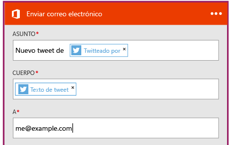

<properties
	pageTitle="Crear una aplicación lógica | Microsoft Azure"
	description="Aprenda a crear una aplicación lógica mediante la conexión de servicios de SaaS"
	authors="jeffhollan"
	manager="dwrede"
	editor=""
	services="app-service\logic"
	documentationCenter=""/>

<tags
	ms.service="logic-apps"
	ms.workload="na"
	ms.tgt_pltfrm="na"
	ms.devlang="na"
	ms.topic="get-started-article"
	ms.date="07/16/2016"
	ms.author="jehollan"/>

# Creación de una nueva aplicación lógica mediante la conexión de servicios de SaaS

En este tema se muestra cómo, en solo unos minutos, puede comenzar a trabajar con [Azure Logic Apps](app-service-logic-what-are-logic-apps.md). Le guiaremos a través de un flujo de trabajo simple que le permite enviar tweets interesantes a su correo electrónico.

Para utilizar este escenario necesitará:

- Una suscripción de Azure
- Una cuenta de Twitter
- Un buzón Outlook.com o uno alojado de Office 365

## Creación de una nueva aplicación lógica para enviarle tweets por correo electrónico

1. En el [panel del Portal de Azure](https://portal.azure.com), seleccione **Nuevo**.
2. En la barra de búsqueda, indique 'aplicación lógica' y seleccione **Aplicación lógica**. También puede seleccionar **Nuevo**, **Web y móvil** y, después, **Aplicación lógica**.
3. Escriba un nombre para la aplicación lógica y seleccione una ubicación, un grupo de recursos y, después, **Crear**. Si selecciona **Anclar al panel**, la aplicación lógica se abrirá automáticamente una vez implementada.
4. Después de abrir la aplicación lógica por primera vez puede seleccionar una plantilla inicial. Por ahora, haga clic en **Blank Logic App** (aplicación lógica en blanco) para generarla desde cero.
1. El primer elemento que debe crear es el desencadenador. Este es el evento que iniciará la aplicación lógica. Busque **twitter** en el cuadro de búsqueda del desencadenador y selecciónelo.
7. Ahora tendrá que escribir un término de búsqueda de desencadenamiento. La **Frecuencia** y el **Intervalo** determinarán con qué frecuencia la aplicación lógica buscará nuevos tweets (y devolverá todos los tweets de ese intervalo de tiempo). 

5. Seleccione el botón **Nuevo paso** y elija **Agregar una opción** o **Agregar una condición**
6. Al seleccionar **Agregar una acción**, para elegir una acción, puede buscar en los [conectores disponibles](../connectors/apis-list.md). Por ejemplo, puede seleccionar **Outlook.com - Enviar correo electrónico** para enviar correo desde una dirección de outlook.com: 

7. Ahora tiene que rellenar los parámetros de su correo electrónico preferido: 

8. Por último, puede seleccionar **Guardar** para activar la aplicación lógica.

## Administrar la aplicación lógica tras la creación

Ahora la aplicación lógica está en funcionamiento. Buscará periódicamente los tweets con el término de búsqueda especificado. Cuando encuentre un tweet coincidente, le enviará un correo electrónico. Por último, verá cómo deshabilitar la aplicación o ver cómo marcha.

1. Vaya al [Portal de Azure](https://portal.azure.com).

1. Haga clic en **Examinar** en el lado izquierdo de la pantalla y seleccione **Aplicaciones lógicas**.

2. Haga clic en la nueva aplicación lógica que acaba de crear para ver información general y el estado actual.

3. Para editar la nueva aplicación lógica, haga clic en **Editar**.

5. Para desactivar la aplicación, haga clic en **Deshabilitar** en la barra de comandos.

1. Vea, ejecute y desencadene historias que supervisar cuando se ejecute la aplicación lógica. Puede hacer clic en **Actualizar** para ver los datos más recientes.

En menos de 5 minutos ha sido capaz de configurar una aplicación lógica sencilla que se ejecuta en la nube. Para obtener más información acerca del uso de las características de las aplicaciones lógicas, consulte [Uso de las características de aplicaciones lógicas]. Para obtener más información acerca de las definiciones de aplicación lógica, consulte [Creación de definiciones de aplicación lógica](app-service-logic-author-definitions.md).

<!-- Shared links -->
[Azure portal]: https://portal.azure.com
[Uso de las características de aplicaciones lógicas]: app-service-logic-create-a-logic-app.md

<!---HONumber=AcomDC_0727_2016-->