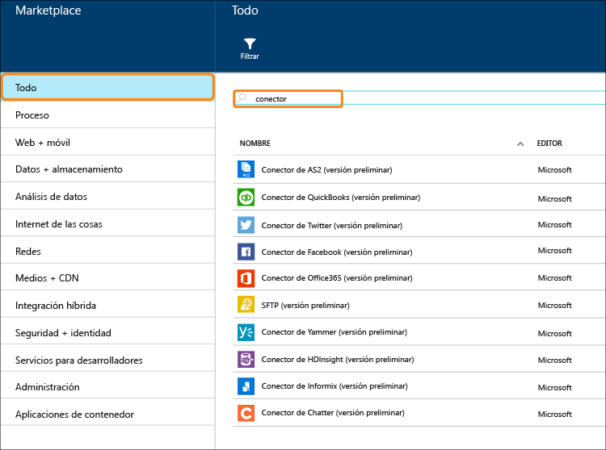

# Qué son los conectores y las aplicaciones de API de BizTalk
[!INCLUDE [app-service-logic-version-message](../../includes/app-service-logic-version-message.md)]

Un *conector* es un tipo de aplicación de API que se centra en la conectividad. Los conectores, al igual que cualquier otra aplicación de API, se utilizan desde aplicaciones web, aplicaciones móviles y aplicaciones lógicas. Los conectores hacen que sea fácil conectarse a servicios existentes y ayuda a administrar la autenticación, ofrece supervisión, proporciona análisis, etc.

Cualquier desarrollador puede crear sus propias aplicaciones de API e implementarlas de forma privada. En el futuro, los desarrolladores pueden compartir y rentabilizar sus aplicaciones de API creadas de forma personalizada a través del mercado. 

Para que los desarrolladores aceleren la creación de soluciones, el equipo de Azure agregó una serie de conectores al marketplace para satisfacer muchos escenarios comunes. Además, para ampliar el alcance de los escenarios de integración complejos y avanzados, también hay disponibles varias funcionalidades Premium y BizTalk.

Hay diferentes "niveles" de servicio disponibles. Todos los niveles incluyen todos los conectores y aplicaciones de la API, incluida su funcionalidad completa.  

[Tarifas de servicio de aplicación](https://azure.microsoft.com/pricing/details/app-service/) describe estos niveles de servicio y también muestra qué se incluye en estos niveles. Las secciones siguientes describen las distintas categorías de conectores y aplicaciones de la API de BizTalk.

## Conectores híbridos
Los conectores híbridos amplían aún más su alcance en la empresa gracias a su conectividad con [DB2](app-service-logic-connector-db2.md), [Informix](app-service-logic-connector-informix.md) y WebSphere MQ. 

Recursos adicionales: [conectores negocio a negocio y aplicaciones de API](app-service-logic-b2b-connectors.md)  
[Creación de un proceso B2B](app-service-logic-create-a-b2b-process.md)  
[Creación de un acuerdo entre socios comerciales](app-service-logic-create-a-trading-partner-agreement.md)  
[Seguimiento de mensajes B2B](app-service-logic-track-b2b-messages.md)  

## Reglas
Las reglas de negocio encapsulan las directivas y decisiones que controlan los procesos de negocio. Normalmente, las reglas son dinámicas y cambian con el tiempo por diferentes motivos, incluidos los planes de negocios, normas y muchas otras razones. [Reglas de BizTalk](app-service-logic-use-biztalk-rules.md) permite desacoplar estas directivas del código de aplicación y facilitar y agilizar el proceso de cambio.

## Lista de conectores y aplicaciones de API
Consulte [Lista de conectores y aplicaciones de API](app-service-logic-connectors-list.md) para obtener una lista completa de conectores y aplicaciones de API incluidas en cada categoría, incluidos los conectores estándar, EAI de BizTalk, conectores de Premium, etc.

<!--HONumber=Nov16_HO2-->

