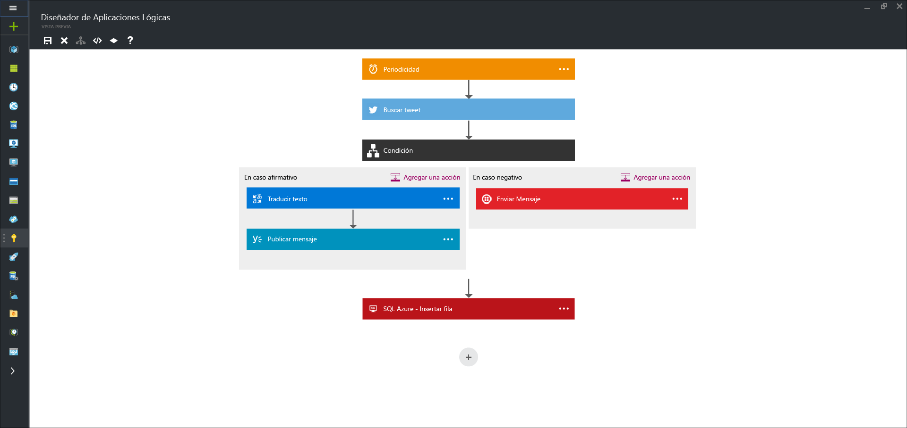

<properties 
	pageTitle="¿Qué son las aplicaciones lógicas?" 
	description="Obtenga más información acerca de las Aplicaciones lógicas del Servicio de aplicaciones" 
	authors="kevinlam1" 
	manager="dwrede" 
	editor="" 
	services="app-service\logic" 
	documentationCenter=""/>

<tags
	ms.service="app-service-logic"
	ms.workload="na"
	ms.tgt_pltfrm="na"
	ms.devlang="na"
	ms.topic="hero-article" 
	ms.date="07/12/2016"
	ms.author="klam"/>

#¿Qué son las aplicaciones lógicas?

| Referencia rápida |
| --------------- |
| [Lenguaje de definición de aplicaciones lógicas](https://msdn.microsoft.com/library/azure/mt643789.aspx) |
| [Documentación del conector de aplicaciones lógicas](../connectors/apis-list.md) |
| [Foro de aplicaciones lógicas](https://social.msdn.microsoft.com/Forums/es-ES/home?forum=azurelogicapps) |

Logic Apps proporciona una manera de simplificar e implementar procesos empresariales complejos. Proporciona un diseñador visual para modelar y automatizar el proceso empresarial como una serie de pasos conocida como flujo de trabajo. Puede diseñar flujos de trabajo para que se inicien desde un desencadenador y se ejecuten todos los pasos. Cada paso invoca una API mientras se ocupa de forma segura de la autenticación y los procedimientos recomendados, como punto de comprobación y ejecución duradera.

Algunas ventajas de Logic Apps:

- Ahorro de tiempo al diseñar procesos complejos gracias a las herramientas de diseño que se entienden fácilmente
- Implementación sencilla de tareas, que de lo contrario, serían difíciles de implementar en el código
- Introducción rápida desde plantillas
- Personalización de la aplicación lógica con las API
- Conexión de sistemas dispares
- Monetización de la aplicación lógica en Marketplace
- Comienzo sencillo y crecimiento a medida

Logic Apps es una iPaaS (plataforma de integración como servicio) totalmente administrada que permite a los desarrolladores despreocuparse de las horas extra para controlar el hospedaje, la escalabilidad, la disponibilidad y la administración.

Y lo mejor de todo, Logic Apps se combina con los [conectores administrados][managedapis] integrados para ayudar a resolver incluso escenarios de integración complicados de forma sencilla:

Como se ha mencionado, con Logic Apps puede automatizar procesos empresariales. Estos son algunos ejemplos:
 
* Puede replicar automáticamente nuevos registros en la Base de datos SQL y enviar correos a la primera línea de atención al cliente.
* Puede encontrar automáticamente tweets negativos y enviarlos a un canal de demora.
* Cuando se cree un archivo en un servidor FTP, analice el archivo, agregue nuevos registros a Dynamics CRM y cree un elemento en una lista de SharePoint.

Todos estos tipos de escenarios se pueden configurar desde el diseñador visual y sin escribir ni una sola línea de código. Comience a [crear su aplicación lógica ahora][create].

## ¿Por qué aplicaciones lógicas?

Si desea automatizar cualquier proceso empresarial (por ejemplo, encontrar tweets negativos y publicar en el canal Slack interno o replicar nuevos registros de clientes de SQL, según llegan, en el sistema CRM), Logic Apps realiza la integración de orígenes de datos dispares desde la nube al entorno local de forma sencilla. Consulte nuestros [conectores administrados][managedapis] para obtener más ideas y una [introducción][create] inmediata para ver qué puede hacer.

Además, con nuestra [cuenta de Enterprise Integration][biztalk], puede realizar el escalado a escenarios de integración consolidados con la eficacia de la [mensajería XML][xml], la [administración de asociados comerciales][tpm] y mucho más.

- **Herramientas de diseño fáciles de usar**: las aplicaciones lógicas pueden diseñarse de principio a fin en el explorador. Inicio con un desencadenador: desde una simple programación hasta siempre vez que aparezcas un tweet acerca de su compañía. A continuación, se coordina cualquier número de acciones mediante la sofisticada galería de conectores.

- **Crear fácilmente SaaS**: incluso las tareas de composición que son fáciles de describir son difíciles de implementar en el código. Logic Apps facilita la conexión de sistemas dispares. ¿Desea crear una tarea en el software CRM que se basa en la actividad de las cuentas de Facebook o Twitter? ¿Desea conectar su solución de marketing en la nube a su sistema de facturación local? Las aplicaciones lógicas son la forma más rápida y más confiable para ofrecer soluciones a estos problemas.

- **Introducción rápida desde plantillas**: para ayudarle a empezar, hemos dispuesto una [galería de plantillas][templates] que permiten crear rápidamente algunas soluciones comunes. Desde soluciones avanzadas de BizTalk a la conectividad de SaaS simple e incluso algunos que sean solo por diversión: la galería es la forma más rápida de comprender la eficacia de las aplicaciones lógicas.

- **Extensibilidad incorporada**: ¿no ve el conector que necesita? Las Aplicaciones lógicas están diseñadas para trabajar con Aplicaciones de API; puede crear fácilmente su propia aplicación de API para utilizarla como API personalizada. Cree una nueva aplicación solo para usted, o bien compártala y rentabilícela en el marketplace.

- **Eficacia de integración real**: empiece por algo sencillo y crezca a medida que sea necesario. Las aplicaciones lógicas pueden aprovechar con facilidad la eficacia de BizTalk, la solución de integración líder del sector de Microsoft para permitir a los profesionales de integración crear las soluciones que necesitan. Más información sobre [Enterprise Integration Pack](./app-service-logic-enterprise-integration-overview.md).

## Conceptos de aplicaciones lógicas

Las siguientes son algunas de las principales partes que componen la experiencia de aplicaciones lógicas.

- **Flujo de trabajo**: las aplicaciones lógicas ofrecen una forma gráfica para modelar los procesos de negocio como una serie de pasos o un flujo de trabajo.
- **Conectores administrados**: las aplicaciones lógicas necesitan acceder a datos y servicios. Los conectores administrados se crean específicamente para ayudarle cuando se conecte y trabaje con datos. Vea la lista de conectores disponibles ahora en [conectores administrados][managedapis].
- **Desencadenadores**: algunos conectores administrados también pueden hacen de desencadenador. Un desencadenador inicia una nueva instancia de un flujo de trabajo de acuerdo con un evento específico, como la llegada de un correo electrónico o un cambio en la cuenta de almacenamiento de Azure.
-  **Acciones**: cada paso después de la llamada a la acción de un desencadenador en un flujo de trabajo. Cada acción normalmente se asigna a una operación en el conector administrado o en las aplicaciones de API personalizadas.
- **Enterprise Integration Pack**: para escenarios más avanzados de integración, Logic Apps incluye funcionalidades de BizTalk. BizTalk es la plataforma de integración líder del sector de Microsoft. Los conectores de Enterprise Integration Pack permiten incluir fácilmente la validación, la transformación y mucho más en sus flujos de trabajo de aplicaciones lógicas.

## Introducción  

 - Para comenzar con las aplicaciones lógicas, siga el tutorial [Creación de una aplicación lógica][create].
 - [Ejemplos de aplicaciones lógicas y escenarios comunes](app-service-logic-examples-and-scenarios.md)
 - [Con las aplicaciones lógicas puede automatizar procesos empresariales.](http://channel9.msdn.com/Events/Build/2016/T694)
 - [Obtenga información acerca de cómo integrar sus sistemas con Aplicaciones lógicas](http://channel9.msdn.com/Events/Build/2016/P462)
- Para obtener más información sobre la plataforma de Servicio de aplicaciones de Azure, consulte [Servicio de aplicaciones de Azure][appservice].

[biztalk]: app-service-logic-enterprise-integration-accounts.md
[appservice]: ../app-service/app-service-value-prop-what-is.md
[create]: app-service-logic-create-a-logic-app.md
[managedapis]: ../connectors/apis-list.md
[tpm]: app-service-logic-enterprise-integration-accounts.md
[xml]: app-service-logic-enterprise-integration-b2b.md
[templates]: app-service-logic-use-logic-app-templates.md

<!---HONumber=AcomDC_0713_2016-->