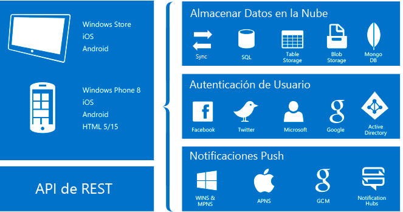

# Acerca de Mobile Apps en Azure App Service
Azure App Service es una [plataforma como servicio](https://azure.microsoft.com/overview/what-is-paas/) (PaaS) completamente administrada para desarrolladores profesionales. El servicio ofrece un amplio conjunto de funcionalidades para escenarios web, móviles y de integración. 

La característica Mobile Apps de Azure App Service ofrece a los desarrolladores e integradores de sistemas empresariales una plataforma de desarrollo de aplicaciones móviles que es muy escalable y disponible globalmente.

## ¿Por qué Mobile Apps?
Con la característica Mobile Apps, puede hacer lo siguiente:

* **Crear aplicaciones nativas y multiplataforma**: si va a crear aplicaciones iOS, Android y Windows nativas o aplicaciones Xamarin o Cordova (PhoneGap) multiplataforma, puede aprovechar App Service usando SDK nativos.
* **Conectarse a sus sistemas empresariales**: con la característica Mobile Apps, puede agregar el inicio de sesión corporativo en cuestión de minutos y conectarse a sus recursos locales o en la nube empresariales.
* **Crear aplicaciones de uso sin conexión con sincronización de datos**: consiga que sus recursos móviles sean más productivos creando aplicaciones que funcionen sin conexión y utilice Mobile Apps para sincronizar los datos en segundo plano cuando exista conectividad con cualquiera de los orígenes de datos empresariales o las API de software como servicio (SaaS).
* **Notificaciones push a millones de personas en cuestión de segundos**: atraiga a los clientes con notificaciones push instantáneas en cualquier dispositivo, que se personalizan según sus necesidades y que se envían en el momento oportuno.

## Características de Mobile Apps
Las siguientes características son importantes para el desarrollo móvil habilitado para la nube:

* **Autenticación y autorización**: seleccione de entre una lista creciente de proveedores de identidades, como Azure Active Directory para la autenticación empresarial, y proveedores de redes sociales, como Facebook, Google, Twitter y cuentas de Microsoft. Mobile Apps ofrece un servicio OAuth 2.0 para cada proveedor. También puede integrar el SDK para el proveedor de identidades para la funcionalidad específica del proveedor.

    Descubra más acerca de nuestras [características de autenticación].

* **Acceso a datos**: Mobile Apps cuenta con un origen de datos OData v3 adecuado para dispositivos móviles que está vinculado a Azure SQL Database o a un servidor SQL Server local. Como este servicio puede basarse en Entity Framework, puede integrarlo fácilmente con otros proveedores de datos NoSQL y SQL, incluidos los proveedores de [Azure Table Storage], MongoDB, [Azure Cosmos DB] y las API de SaaS, como Office 365 y Salesforce.com.

* **Sincronización sin conexión**: nuestros SDK de cliente facilitan la creación de aplicaciones móviles sensibles y sólidas que funcionan con un conjunto de datos sin conexión. Puede sincronizar este conjunto de datos automáticamente con los datos de back-end, incluida la compatibilidad con la resolución de conflictos.

  Descubra más acerca de nuestras [características de datos].

* **Notificaciones push**: nuestros SDK de cliente se integran perfectamente con las funcionalidades de registro de Azure Notification Hubs, lo que le permite enviar notificaciones push a millones de usuarios simultáneamente.

  Más información acerca de las [características de notificaciones push].

* **SDK de cliente**: proporcionamos un completo conjunto de SDK de cliente que cubren el desarrollo nativo ([iOS], [Android] y [Windows]), el desarrollo multiplataforma ([Xamarin.iOS y Xamarin.Android], [Xamarin.Forms]) y el desarrollo de aplicaciones híbridas ([Apache Cordova]). Cada SDK de cliente está disponible con una licencia MIT y es de código abierto.

## Características de Azure App Service
Las siguientes características de plataforma son útiles para los sitios de producción móvil:

* **Escalado automático**: con App Service, puede escalar vertical u horizontalmente de forma rápida para administrar cualquier carga entrante del cliente. Seleccione manualmente el número y tamaño de las máquinas virtuales o configure el escalado automático para escalar el back-end de la aplicación móvil basado en la carga o en la programación.

  Descubra más acerca del [escalado automático].

* **Entornos de ensayo**: App Service puede ejecutar varias versiones del sitio, para que pueda realizar pruebas A/B, pruebas en producción como parte de un plan DevOps más amplio y ensayos in situ de un nuevo back-end.

  Descubra más acerca de los [Entornos de ensayo].

* **Implementación continua**: App Service puede integrarse con sistemas de administración de control de código fuente (SCM) comunes, para poder implementar automáticamente una nueva versión del back-end mediante la inserción de una rama del sistema SCM.

  Descubra más acerca de las [opciones de implementación](../app-service/app-service-deploy-local-git.md).

* **Red virtual**: App Service puede conectarse a recursos locales mediante redes virtuales, Azure ExpressRoute o conexiones híbridas.

  Obtenga más información sobre las [conexiones híbridas], las [redes virtuales] y [ExpressRoute].

* **Entornos aislados y dedicados**: puede ejecutar App Service en un entorno plenamente aislado y dedicado para ejecutar aplicaciones de Azure App Service de forma segura a gran escala. Este entorno es perfecto para cargas de trabajo de aplicaciones que requieren acceso de red a gran escala, con aislamiento o seguro.

  Descubra más acerca de [los entornos de App Service].

## pasos siguientes

Para empezar a trabajar con Mobile Apps en Azure App Service, complete el tutorial de [introducción]. En el tutorial se tratan los conceptos básicos de producir un back-end móvil y cliente de su elección. También cubre la integración de la autenticación, de la sincronización sin conexión y de las notificaciones push. Puede completar el tutorial varias veces, una para cada aplicación cliente.

Para más información sobre Mobile Apps, revise nuestro [mapa de aprendizaje].
Para obtener más información sobre la plataforma Azure App Service, consulte [Azure App Service].

<!-- URLs. -->
[Migrate your mobile service to App Service]: app-service-mobile-migrating-from-mobile-services.md
[introducción]: app-service-mobile-ios-get-started.md
[Azure Table Storage]:../cosmos-db/table-storage-how-to-use-dotnet.md
[Azure Cosmos DB]: ../cosmos-db/sql-api-get-started.md
[características de autenticación]: ./app-service-mobile-auth.md
[características de datos]: ./app-service-mobile-offline-data-sync.md
[características de notificaciones push]: ../notification-hubs/notification-hubs-push-notification-overview.md
[iOS]: ./app-service-mobile-ios-how-to-use-client-library.md
[Android]: ./app-service-mobile-android-how-to-use-client-library.md
[Windows]: ./app-service-mobile-dotnet-how-to-use-client-library.md
[Xamarin.iOS y Xamarin.Android]: ./app-service-mobile-dotnet-how-to-use-client-library.md
[Xamarin.Forms]: ./app-service-mobile-xamarin-forms-get-started.md
[Apache Cordova]: ./app-service-mobile-cordova-how-to-use-client-library.md
[escalado automático]: ../app-service/web-sites-scale.md
[Entornos de ensayo]: ../app-service/web-sites-staged-publishing.md
[conexiones híbridas]: ../biztalk-services/integration-hybrid-connection-overview.md
[redes virtuales]: ../app-service/web-sites-integrate-with-vnet.md
[ExpressRoute]: ../app-service/environment/app-service-app-service-environment-network-configuration-expressroute.md
[los entornos de App Service]: ../app-service/environment/intro.md
[mapa de aprendizaje]: https://azure.microsoft.com/en-us/documentation/learning-paths/appservice-mobileapps/
