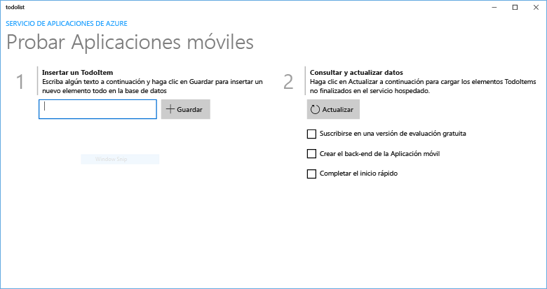
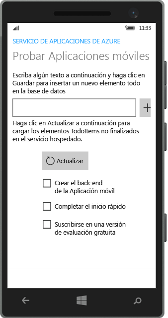

# Creación de una aplicación para Windows
[!INCLUDE [app-service-mobile-selector-get-started](../../includes/app-service-mobile-selector-get-started.md)]

## Información general
En este tutorial se muestra cómo agregar un servicio back-end basado en la nube a una aplicación para Plataforma universal de Windows (UWP). Para obtener más información, consulte [¿Qué son las aplicaciones móviles?](app-service-mobile-value-prop.md) A continuación se muestran las capturas de pantalla de la aplicación completada:

   
Ejecutándose en un equipo de escritorio

  
Ejecutándose en un teléfono

Completar este tutorial es un requisito previo para todos los tutoriales de aplicaciones móviles para aplicaciones para UWP.

## Requisitos previos
Para completar este tutorial, necesitará lo siguiente:

* Una cuenta de Azure activa. Si no dispone de ninguna cuenta, puede registrarse para obtener una versión de evaluación de Azure y conseguir hasta 10 aplicaciones móviles gratuitas que podrá seguir usando incluso después de que finalice la evaluación. Para obtener más información, consulte [Evaluación gratuita de Azure](https://azure.microsoft.com/pricing/free-trial/).
* [Visual Studio Community 2015] o versión posterior.

## Creación de un nuevo back-end de Aplicaciones móviles de Azure
Siga estos pasos para crear un nuevo back-end de aplicación móvil.

[!INCLUDE [app-service-mobile-dotnet-backend-create-new-service](../../includes/app-service-mobile-dotnet-backend-create-new-service.md)]

Ahora ha aprovisionado un back-end de aplicación móvil de Azure que puede usarse por las aplicaciones del cliente móvil. Después, descargará un proyecto de servidor para un back-end de "lista de tareas" sencillo y lo publicará en Azure.

## Configuración del proyecto de servidor
[!INCLUDE [app-service-mobile-configure-new-backend.md](../../includes/app-service-mobile-configure-new-backend.md)]

## Descarga y ejecución del proyecto de cliente
Una vez configurado el back-end de aplicación móvil, puede crear una nueva aplicación cliente o modificar una aplicación existente para conectarse a Azure. En esta sección, descargará un proyecto de plantilla de aplicación para UWP que se personaliza para conectarse al back-end de aplicación móvil.

1. De nuevo en la hoja **Inicio rápido** para el back-end de aplicación móvil, haga clic en **Crear una nueva aplicación** > **Descargar** y extraiga los archivos de proyecto comprimidos en el equipo local.

    
2. (Opcional) Agregue el proyecto de aplicación para UWP a la misma solución que el proyecto de servidor. Esto hace que sea más fácil depurar y probar la aplicación y el back-end en la misma solución de Visual Studio, si decide hacer esto. Para agregar un proyecto de aplicación para UWP a la solución, debe usar Visual Studio 2015 o una versión posterior.
3. Con la aplicación para UWP como proyecto de inicio, presione la tecla F5 para implementar y ejecutar la aplicación.
4. En la aplicación, escriba texto significativo, como *Realice el tutorial*, en el cuadro de texto **Insertar un TodoItem** y, a continuación, haga clic en **Guardar**.

    

    Esta acción envía una solicitud POST al nuevo back-end de aplicación móvil hospedado en Azure.
5. (Opcional) Detenga la aplicación y reiníciela en un dispositivo diferente o un emulador de dispositivos móviles.

    

    Tenga en cuenta que los datos guardados en el paso anterior se cargan desde Azure después de que se inicie la aplicación para UWP.

## Pasos siguientes
* [Incorporación de autenticación a la aplicación](app-service-mobile-windows-store-dotnet-get-started-users.md)  
  Aprenda a autenticar a los usuarios de su aplicación con un proveedor de identidades.
* [Incorporación de notificaciones push a su aplicación](app-service-mobile-windows-store-dotnet-get-started-push.md)  
  : aprenda a agregar a la aplicación compatibilidad con notificaciones push y a configurar su back-end de aplicación móvil para usar Azure Notification Hubs para enviar notificaciones push.
* [Habilitación de la sincronización sin conexión para su aplicación](app-service-mobile-windows-store-dotnet-get-started-offline-data.md)  
  : aprenda a agregar compatibilidad sin conexión a su aplicación con un back-end de aplicación móvil. La sincronización sin conexión permite a los usuarios finales interactuar con una aplicación móvil (ver, agregar o modificar datos) aun cuando no haya conexión de red.

<!-- Anchors. -->
<!-- Images. -->
<!-- URLs. -->
[Mobile App SDK]: http://go.microsoft.com/fwlink/?LinkId=257545
[Azure portal]: https://portal.azure.com/
[Visual Studio Community 2015]: https://go.microsoft.com/fwLink/p/?LinkID=534203
