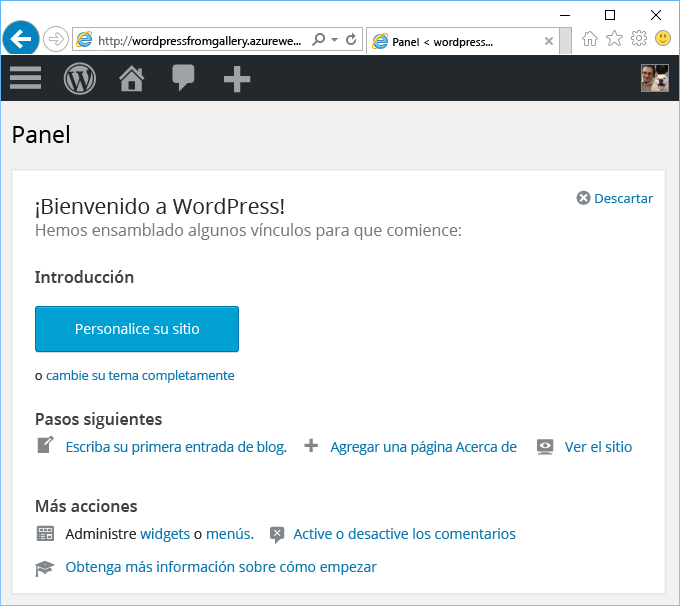

# Creación de una aplicación web desde Azure Marketplace
<!-- Note: This article replaces web-sites-php-web-site-gallery.md -->

[!INCLUDE [tabs](../../includes/app-service-web-get-started-nav-tabs.md)]

Azure Marketplace ofrece una gran cantidad de aplicaciones web populares desarrolladas por comunidades de software de código abierto como WordPress y Umbraco CMS. En este tutorial, aprenderá a crear aplicaciones de WordPress desde Azure Marketplace.
con lo que se crean una aplicación web de Azure y una base de datos MySQL. 

## Antes de empezar 

Si no tiene una suscripción a Azure, cree una [cuenta gratuita](https://azure.microsoft.com/free/?WT.mc_id=A261C142F) antes de empezar.

## Implementación desde Azure Marketplace
Siga los siguientes pasos para realizar implementaciones de WordPress desde Azure Marketplace.

### Inicio de sesión en Azure
Inicie sesión en el [Portal de Azure](https://portal.azure.com).

### Plantilla de implementación de WordPress
Azure Marketplace ofrece plantillas para configurar recursos. Empiece por configurar la plantilla de [WordPress](https://portal.azure.com/#create/WordPress.WordPress).
   
Escriba la siguiente información para implementar la aplicación de WordPress y los recursos correspondientes.

  

| Campo         | Valor sugerido           | Descripción  |
| ------------- |-------------------------|-------------|
| Nombre de la aplicación      | miAplicaciónDeWordPress          | Escriba **un nombre único para la aplicación web**. Este nombre se usa como parte del nombre DNS predeterminado para la aplicación `<app_name>.azurewebsites.net`, por lo que debe ser único entre todas las aplicaciones de Azure. Más adelante, puede asignar un nombre de dominio personalizado a la aplicación antes de exponerlo a los usuarios. |
| La suscripción  | Pay-As-You-Go             | Seleccione una opción en **Suscripción**. Si tiene varias suscripciones, elija la correspondiente. |
| Grupo de recursos| miGrupoDeRecursosDeWordPress                 |    Escriba un **grupo de recursos**. Un grupo de recursos es un contenedor lógico en el que se implementan recursos de Azure y se administran, como aplicaciones web y bases de datos. Puede crear un grupo de recursos o usar uno existente. |
| Plan de servicio de aplicación | miPlanDeAplicaciones          | Los planes de App Service representan la colección de recursos físicos usados para hospedar sus aplicaciones. Seleccione la **ubicación** y el **plan de tarifa**. Para obtener más información sobre tarifas, consulte [Planes de tarifa de App Service](https://azure.microsoft.com/pricing/details/app-service/). |
| Base de datos      | miAplicaciónDeWordPress          | Seleccione el proveedor correspondiente para la base de datos MySQL. Web Apps admite **ClearDB**, **Azure Database for MySQL** y **MySQL en aplicación**. Para obtener más información, consulte la sección [Configuración de bases de datos](#database-config) más adelante. |
| Application Insights | ON (Activado) u OFF (Desactivado)          | Esto es opcional. [Application Insights](https://azure.microsoft.com/en-us/services/application-insights/) proporciona servicios de supervisión para aplicaciones web al hacer clic en **ON** (Activado).|

### Configuración de bases de datos
Siga los siguientes pasos en función del proveedor elegido para la base de datos MySQL.  Se recomienda que tanto la aplicación web como la base de datos MySQL estén en la misma ubicación.

#### ClearDB 
[ClearDB](https://azuremarketplace.microsoft.com/en-us/marketplace/apps/SuccessBricksInc.ClearDBMySQLDatabase?tab=Overview) es una solución desarrollada por terceros que proporciona un servicio de MySQL totalmente integrado en Azure. Para poder usar las bases de datos ClearDB, debe vincular una tarjeta de crédito a su [cuenta de Azure](http://account.windowsazure.com/subscriptions). Si ha seleccionado ClearDB como proveedor de bases de datos, puede ver una lista de las bases de datos disponibles para elegir, o bien hacer clic en el botón **Create new** (Crear nueva) para crear una base de datos.

#### Azure Database for MySQL (versión preliminar)
[Azure Database for MySQL](https://azure.microsoft.com/en-us/services/mysql) es un servicio de bases de datos administradas para el desarrollo y la implementación de aplicaciones que permite configurar una base de datos MySQL en unos minutos y escalarla sobre la marcha en el almacenamiento de la nube que más confiable le resulte. Ofrece modelos de precios inclusivos que incluyen todas las funcionalidades que necesita (alta disponibilidad, gran seguridad y elevado grado de recuperación) sin costo adicional alguno. Haga clic en **Plan de tarifa** para elegir un [plan de tarifa](https://azure.microsoft.com/pricing/details/mysql) diferente. Para usar una base de datos o un servidor MySQL existentes, use uno de los grupos de recursos actuales en los que resida el servidor. 

> [!NOTE]
>  Azure Database for MySQL (versión preliminar) y Web App on Linux de Azure (versión preliminar) no están disponibles en todas las regiones. Visite los siguientes vínculos para obtener más información sobre las limitaciones de [Azure Database for MySQL (versión preliminar)](https://docs.microsoft.com/en-us/azure/mysql) y [Web App on Linux de Azure](./app-service-linux-intro.md). 

#### MySQL en aplicación
[MySQL en aplicación](https://blogs.msdn.microsoft.com/appserviceteam/2017/03/06/announcing-general-availability-for-mysql-in-app) es una función de App Service que permite ejecutar MySQL de forma nativa en la plataforma. La funcionalidad principal para la que se ha añadido compatibilidad con la versión de la función:

- Ejecución de servidor MySQL en la misma instancia y en paralelo con el servidor web que hospeda el sitio. De este modo, se incrementa el rendimiento de la aplicación.
- El almacenamiento se comparte entre los archivos de MySQL y los de la aplicación web. Tenga en cuenta que, con los planes Gratis y Compartido, puede alcanzar los límites de la cuota al usar el sitio (en función de las acciones que realice). Consulte [las limitaciones de las cuotas](https://azure.microsoft.com/en-us/pricing/details/app-service/plans/) de los planes Gratis y Compartido.
- Puede activar el registro de consultas lentas y el registro general para MySQL. Tenga en cuenta que estas acciones pueden afectar al rendimiento del sitio y NO debería mantenerlas siempre activas. La función de registro ayuda a investigar cualquier problema con la aplicación. 

Para obtener más información, consulte este [artículo](https://blogs.msdn.microsoft.com/appserviceteam/2016/08/18/announcing-mysql-in-app-preview-for-web-apps/ ).

Para ver el progreso, haga clic en el icono de campana de la parte superior de la página del portal mientras se implementa la aplicación de WordPress.    

## Administración de la nueva aplicación web de Azure

Vaya a Azure Portal para echar un vistazo a la aplicación web que acaba de crear.

Para ello, inicie sesión en [https://portal.azure.com/](https://portal.azure.com).

En el menú izquierdo, haga clic en **App Services**, a continuación, haga clic en el nombre de la aplicación web de Azure.

Ha llegado a la _hoja_ de su aplicación web (una página del portal que se abre horizontalmente).

De forma predeterminada, la hoja de la aplicación web muestra la página de **introducción**. Esta página proporciona una visión del funcionamiento de la aplicación. En este caso, también puede realizar tareas de administración básicas como examinar, detener, iniciar, reiniciar y eliminar. Las pestañas del lado izquierdo de la hoja muestran las diferentes páginas de configuración que puede abrir.

Estas pestañas de la hoja muestran las muchas y excepcionales características que puede agregar a la aplicación web. La lista siguiente proporciona solo algunas de las posibilidades:

* Asignación de un nombre DNS personalizado
* Enlace de un certificado SSL personalizado
* Configuración de la implementación continua
* Escalado vertical y horizontal
* Adición de la autenticación de usuarios

Complete el Asistente para instalación de WordPress de 5 minutos para activar la aplicación de WordPress. Consulte la [documentación de Wordpress](https://codex.WordPress.org/) para desarrollar una aplicación web.

## Configuración de la aplicación 
Es necesario llevar a cabo varias tareas de administración en la aplicación de WordPress antes de poder usarla para producir. Siga estos pasos para configurar la aplicación de WordPress y administrarla:

| Para hacer esto... | Use esto... |
| --- | --- |
| **Cargar o almacenar archivos grandes** |[Complemento de WordPress para usar Blob Storage](https://wordpress.org/plugins/windows-azure-storage/)|
| **Enviar correo electrónico** |Adquiera el servicio de correo electrónico [SendGrid](https://azuremarketplace.microsoft.com/en-us/marketplace/apps/SendGrid.SendGrid?tab=Overview) y use el [complemento de WordPress para usar SendGrid](https://wordpress.org/plugins/sendgrid-email-delivery-simplified/) para configurarlo|
| **Nombres de dominio personalizados** |[Configuración de un nombre de dominio personalizado en el Servicio de aplicaciones de Azure](app-service-web-tutorial-custom-domain.md) |
| **HTTPS** |[Habilitación de HTTPS para una aplicación web en Azure App Service](app-service-web-tutorial-custom-ssl.md) |
| **Validación previa de la producción** |[Configuración de entornos de ensayo y desarrollo para aplicaciones web en Azure App Service](web-sites-staged-publishing.md)|
| **Supervisión y solución de problemas** |[Habilitación del registro de diagnóstico para aplicaciones web en Azure App Service](web-sites-enable-diagnostic-log.md) y [Supervisión de aplicaciones web en Azure App Service](app-service-web-tutorial-monitoring.md) |
| **Implementación de su sitio** |[Implementación de una aplicación web en Azure App Service](app-service-deploy-local-git.md) |

## Protección de la aplicación 
Es necesario llevar a cabo varias tareas de administración en la aplicación de WordPress antes de poder usarla para producir. Siga estos pasos para configurar la aplicación de WordPress y administrarla:

| Para hacer esto... | Use esto... |
| --- | --- |
| **Un nombre de usuario y una contraseña seguros**|  Cambie de contraseña con frecuencia. Evite usar nombres de usuario comunes, como *admin* o *wordpress*. Obligue a todos los usuarios de WordPress a usar un nombre de usuario único y contraseñas seguras. |
| **Manténgase al día** | Mantenga actualizados el núcleo, los temas y los complementos de WordPress. Use el último tiempo de ejecución de PHP disponible en Azure App Service. |
| **Actualice las claves de seguridad de WordPress** | Actualice [la clave de seguridad de WordPress](https://codex.wordpress.org/Editing_wp-config.php#Security_Keys) para mejorar el cifrado almacenado en las cookies.|

## Mejora del rendimiento
El rendimiento en la nube se consigue principalmente mediante el almacenamiento en caché y el escalado horizontal. Sin embargo, deben tenerse en cuenta la memoria, el ancho de banda y otros atributos de hospedaje de aplicaciones web.

| Para hacer esto... | Use esto... |
| --- | --- |
| **Conocer las capacidades de las instancias del Servicio de aplicaciones** |[Información sobre tarifas, incluidas las funcionalidades de los planes de App Service](https://azure.microsoft.com/en-us/pricing/details/app-service/)|
| **Almacenar recursos en caché** |Use [Azure Redis Cache](https://azure.microsoft.com/en-us/services/cache/) o alguna de las otras opciones de almacenamiento en caché disponibles en [Azure Store](https://azuremarketplace.microsoft.com) |
| **Escalar su aplicación** |Es necesario escalar [la aplicación web en Azure App Service](web-sites-scale.md) o la base de datos MySQL. MySQL en aplicación no admite el escalado horizontal, por lo que debe elegir ClearDB o Azure Database for MySQL (versión preliminar). [Escale Azure Database for MySQL (versión preliminar)](https://azure.microsoft.com/en-us/pricing/details/mysql/) o visite el siguiente enlace si está usando [la redirección de alta disponibilidad de ClearDB](http://w2.cleardb.net/faqs/) para escalar verticalmente la base de datos |

## Disponibilidad y recuperación ante desastres
La alta disponibilidad incluye el aspecto de recuperación ante desastres para mantener la continuidad del negocio. Para elaborar planes ante errores y desastres en la nube, es necesario reconocer los errores con rapidez. Estas soluciones ayudan a implementar una estrategia de alta disponibilidad.

| Para hacer esto... | Use esto... |
| --- | --- |
| **Sitios de equilibrio de carga** o **sitios distribuidos geográficamente** |[Redirección del tráfico con Azure Traffic Manager](https://azure.microsoft.com/en-us/services/traffic-manager/) |
| **Copia de seguridad y restauración** |[Copia de seguridad de una aplicación web en Azure App Service](web-sites-backup.md) y [Restauración de una aplicación web en Azure App Service](web-sites-restore.md) |

## Pasos siguientes
Obtenga información sobre diversas funciones de [App Service para desarrollar y escalar](/app-service-web/).
