<properties 
	pageTitle="Introducción a las aplicaciones web en el Servicio de aplicaciones de Azure: parte 2" 
	description="Agregue funcionalidades operativas fundamentales a su aplicación web en el Servicio de aplicaciones con unos cuantos clics." 
	services="app-service\web"
	documentationCenter=""
	authors="cephalin" 
	manager="wpickett" 
	editor="" 
/>

<tags 
	ms.service="app-service-web" 
	ms.workload="web" 
	ms.tgt_pltfrm="na" 
	ms.devlang="na" 
	ms.topic="hero-article"
	ms.date="03/14/2016" 
	ms.author="cephalin"
/>

# Introducción al Servicio de aplicaciones de Azure: parte 2

En [Introducción al Servicio de aplicaciones de Azure](app-service-web-get-started.md), implementó una aplicación web en el Servicio de aplicaciones de Azure y todo está configurado para realizar actualizaciones rápidas y sencillas. En este artículo, agregará rápidamente funcionalidad fundamental a su aplicación implementada para que funcione perfectamente y resulte más atractiva. De esta manera, descubrirá por sí mismo que el Servicio de aplicaciones es mucho más que un proveedor de hospedaje de sitios web. Aporta funcionalidades de nivel empresarial a su fantástica aplicación para que pueda centrar su energía creativa en satisfacer a los usuarios con su aplicación y no en satisfacer las demandas del mundo real de seguridad, escalabilidad, rendimiento, administración, etc.

En unos pocos clics, aprenderá cómo:

- aplicar autenticación para los usuarios
- escalar automáticamente la aplicación
- recibir alertas sobre el rendimiento de su aplicación

Independientemente de qué aplicación de ejemplo implementó en el artículo anterior, puede seguir leyendo a continuación.

## Autenticación de los usuarios

Ahora, veamos lo fácil que es agregar autenticación a su aplicación.

1. En la hoja de su aplicación que acaba de abrir, haga clic en **Configuración** > **Autenticación/autorización**. 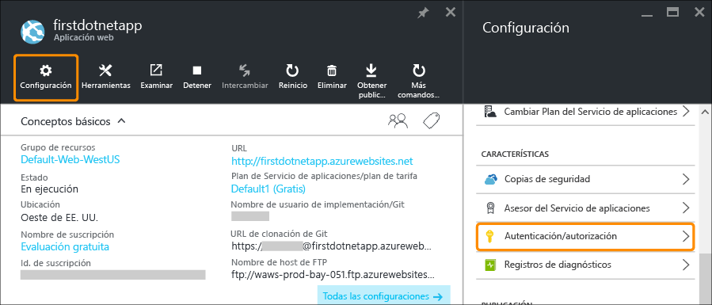
    
2. Haga clic en **Activado** para activar la autenticación. 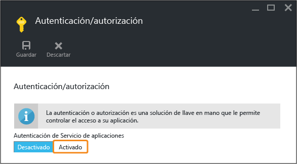
    
4. En **Proveedores de autenticación**, haga clic en **Azure Active Directory**. 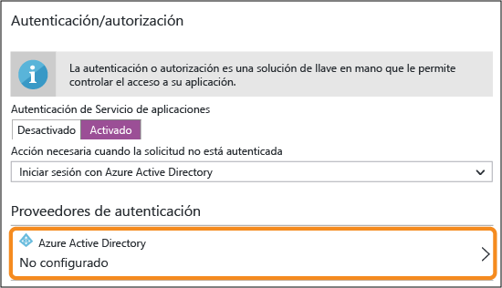

5. En la hoja **Configuración de Azure Active Directory**, haga clic en **Rápida** y haga clic en **Aceptar**. La configuración predeterminada creará una nueva aplicación de Azure AD en el directorio predeterminado. 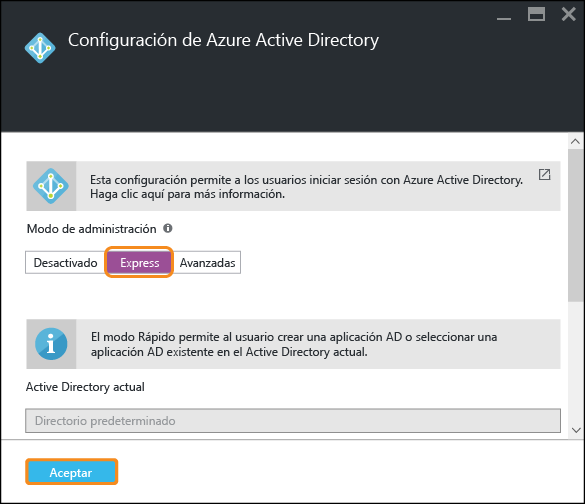

6. Haga clic en **Guardar**. 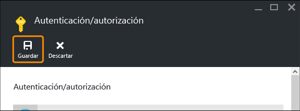

    Una vez realizado el cambio correctamente, verá que el indicador de notificación cambia a verde y aparece un mensaje descriptivo.

7. De nuevo en la hoja principal de su aplicación, haga clic en el vínculo **Dirección URL** (o **Examinar** en la barra de menús). Tenga en cuenta que el vínculo es una dirección HTTP. 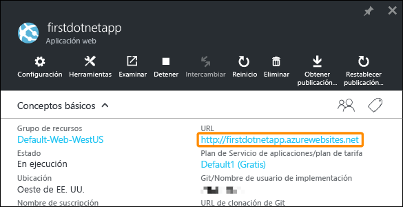 Pero, una vez que la aplicación se abre en una nueva pestaña, el cuadro de Dirección URL redirecciona varias veces y termina en la aplicación con una dirección HTTPS. Lo que está viendo es que ya está conectado en la cuenta Microsoft con su suscripción de Azure, e iniciará sesión automáticamente en la aplicación con esa cuenta. 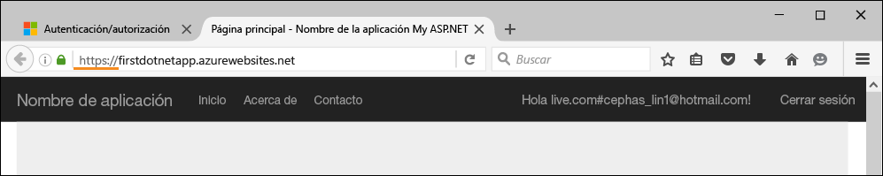 Si ahora abre otro explorador (para asegurarse de que ya no está conectado), verá una pantalla de inicio de sesión cuando vaya a la dirección URL de la misma aplicación: 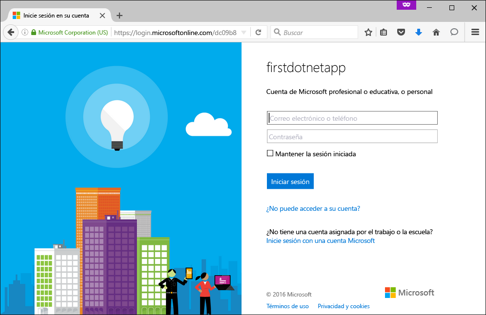 Si nunca ha hecho nada con Azure Active Directory, puede que el directorio predeterminado no tenga usuarios de Azure AD. En ese caso, probablemente la única cuenta que haya es la cuenta Microsoft con la suscripción de Azure, razón por la cual antes pudo iniciar sesión automáticamente en la aplicación en el mismo explorador. Puede usar la misma cuenta Microsoft para iniciar sesión también en esta página de inicio de sesión.

Enhorabuena, se está autenticando todo el tráfico a su sitio.

Quizás haya observado en la hoja **Autenticación/autorización** que se puede hacer mucho más, por ejemplo:

- Habilitar el inicio de sesión social
- Habilitar varias opciones de inicio de sesión
- Cambiar el comportamiento predeterminado cuando los usuarios navegan a su aplicación por primera vez

El Servicio de aplicaciones proporciona una solución completa para algunas de las necesidades de autenticación más comunes por lo que no es necesario proporcionar la lógica de autenticación personalmente. Para más información, consulte [...](/services/app-service/).

## Escalado horizontal y vertical de la aplicación

A continuación, vamos a escalar la aplicación. La aplicación del Servicio de aplicaciones se escala de dos maneras:

- [Escalado vertical](https://en.wikipedia.org/wiki/Scalability#Horizontal_and_vertical_scaling): cuando una aplicación del Servicio de aplicaciones se escala verticalmente, se cambia el plan de tarifa del plan del Servicio de aplicaciones al que pertenece la aplicación. Además de más CPU, memoria y espacio en disco, el escalado proporciona características adicionales, como instancias de máquina virtual dedicadas, escalado automático, SLA del 99,95 %, dominios personalizados, certificados SSL personalizados, ranuras de implementación, copia de seguridad y restauración, y mucho más. Los niveles más altos proporcionan más características a la aplicación del Servicio de aplicaciones.  
- [Escalado horizontal](https://en.wikipedia.org/wiki/Scalability#Horizontal_and_vertical_scaling): al escalar horizontalmente una aplicación del Servicio de aplicaciones, cambia el número de instancias de máquina virtual en las que se ejecuta su aplicación (o aplicaciones en el mismo plan del Servicio de aplicaciones). Con el nivel Estándar o superior, puede habilitar el escalado automático de instancias de máquina virtual en función de las métricas de rendimiento. 

Sin más rodeos, vamos a configurar el escalado automático de la aplicación.

1. En primer lugar, vamos realizar el escalado vertical para habilitar el escalado automático. En la hoja de su aplicación, haga clic en **Configuración** > **Escalado vertical (plan del Servicio de aplicaciones)**. 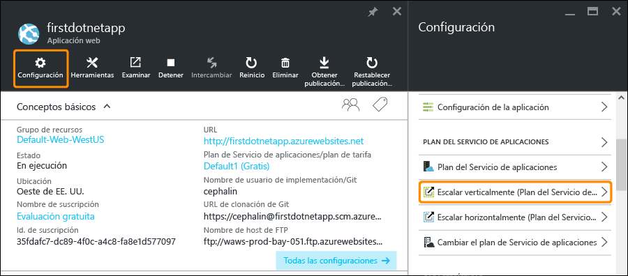

2. Desplácese y seleccione el plan **S1 estándar**, el nivel más bajo que admite el escalado automático (rodeado más abajo), y haga clic en **Seleccionar**. Tenga en cuenta que este nivel agotará sus créditos de la evaluación gratuita. 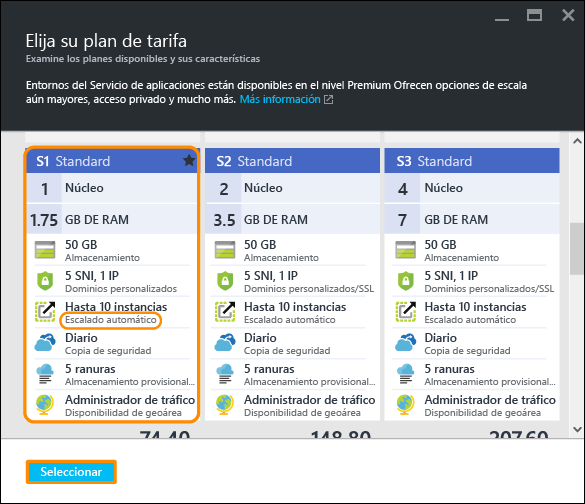

    Ya ha terminado con el escalado vertical.
    
3. A continuación, vamos a configurar el escalado automático. En la hoja de su aplicación, haga clic en **Configuración** > **Escalado horizontal (plan del Servicio de aplicaciones)**. 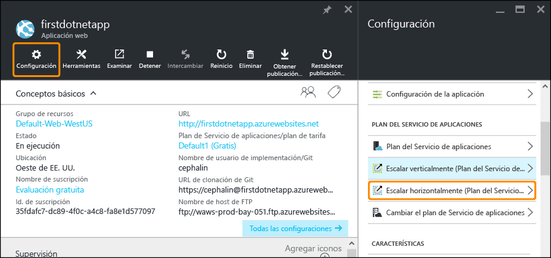

4. Cambie **Escalar por** a **Porcentaje de CPU**. Los controles deslizantes debajo de la lista desplegable cambiarán. Después, defina un intervalo **Instancias** entre **1** y **2** y un **Rango objetivo** entre **40** y **80**; escriba esos valores en los cuadros o mueva los controles deslizantes. 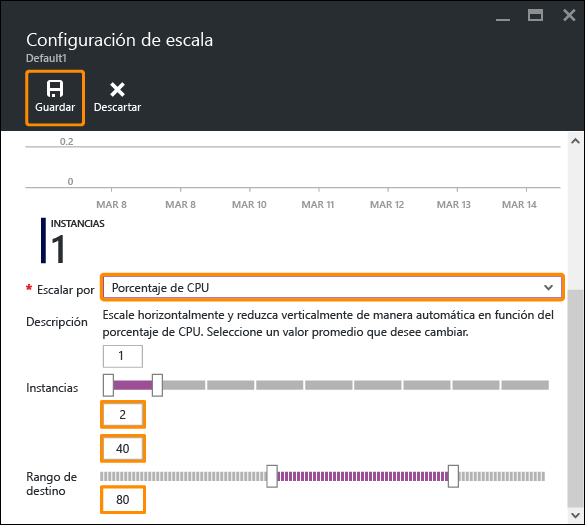
    
    Según esta configuración, la aplicación escalará horizontalmente de forma automática (hasta un máximo de 2 instancias) cuando el uso de CPU sea superior al 80 % y la escala se reducirá horizontalmente (al mínimo de 1 instancia) cuando el uso de CPU sea inferior al 40 %.
    
5. Haga clic en **Guardar** en la barra de menús.

Enhorabuena, su aplicación ya escala automáticamente.

Quizás haya observado en la hoja **Configuración de escala** que se puede hacer mucho más, por ejemplo:

- Escalar manualmente a un número específico de instancias
- Escalar por métricas de rendimiento adicionales, como la cola de disco o el porcentaje de memoria
- Personalizar el comportamiento de escalado cuando se desencadena una regla de rendimiento
- Escalado automático según una programación
- Establecer el comportamiento del escalado automático para un evento futuro

Para más información sobre el escalado vertical de su aplicación, consulte [Escala de nivel de precios de Servicio de aplicaciones de Azure](../app-service/app-service-scale.md). Para más información sobre el escalado horizontal, consulte [Escalado del número de instancias de forma manual o automática](../azure-portal/insights-how-to-scale.md).

## Recepción de alertas para su aplicación

Ahora que la aplicación escalará horizontalmente de forma automática, ¿qué sucede cuando alcanza el número máximo de instancias (10 instancias para el nivel **Estándar**) y el uso de CPU supera el porcentaje deseado (80 %)? Puede configurar una alerta para informarle de esta situación para que pueda seguir escalando verticalmente la aplicación, por ejemplo. Vamos a configurar rápidamente una alerta para esto.

1. En la hoja de su aplicación, haga clic en **Herramientas** > **Alertas**. 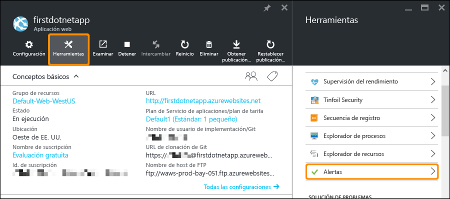

2. Haga clic en **Agregar alerta**. Después, en el cuadro **Recursos** el recurso que termina con **(serverfarms)**. Es el plan del Servicio de aplicaciones. 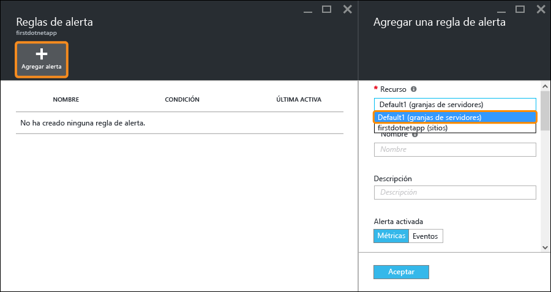

3. Especifique **Nombre** como `CPU Maxed`, **Métrica** como **Porcentaje de CPU** y **Umbral** como `90`; después, seleccione **Lectores, colaboradores y propietarios de correo electrónico** y haga clic en **Aceptar**. 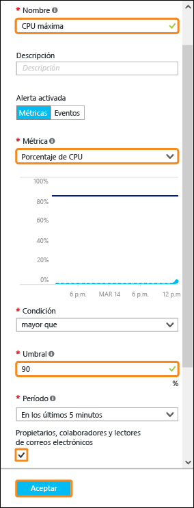
    
    Cuando Azure termine de crear la alerta, la verá en la hoja **Alertas**. 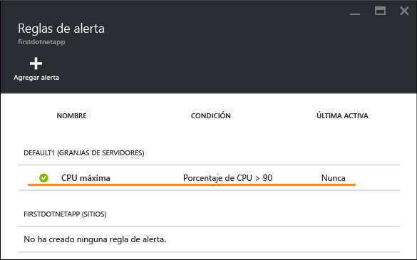

Enhorabuena, ya recibe alertas.

Ahora, esta configuración de alertas comprobará el uso de la CPU cada 5 minutos. Si esa cifra supera el 90 %, se le enviará una alerta por correo electrónico, además a otras personas que estén autorizadas. Para ver todos los usuarios que están autorizados para recibir las alertas, vuelva a la hoja de la aplicación y haga clic en el botón **Acceso**. 

Verá que en **Administradores de suscripciones** ya está el **Propietario** de la aplicación. Usted estaría incluido si fuera el administrador de cuentas de su suscripción de Azure (por ejemplo, su suscripción de evaluación). Para más información sobre el control de acceso basado en roles de Azure, vea [Control de acceso basado en roles de Azure](../active-directory/role-based-access-control-configure.md).

## Pasos siguientes

En el proceso para configurar la alerta, puede que haya observado un amplio conjunto de herramientas en la hoja **Herramientas**, lo que le permite solucionar problemas, supervisar el rendimiento, probar puntos vulnerables, administrar recursos, interactuar con la consola de máquina virtual y agregar extensiones útiles. Le invitamos a que haga clic en cada una de ellas para descubrir las herramientas sencillas pero eficaces que tiene a su alcance.

Vea también qué más puede hacer con su aplicación implementada. Esta es una lista parcial:

- [Comprar y configurar un nombre de dominio personalizado](custom-dns-web-site-buydomains-web-app.md)
- [Configurar entornos de ensayo](web-sites-staged-publishing.md)
- [Configurar la implementación continua](web-sites-publish-source-control.md)
- [Realizar copias de seguridad de la aplicación](web-sites-backup.md)
- [Habilitar registros de diagnóstico](web-sites-enable-diagnostic-log.md)
- [Acceso a recursos locales](web-sites-hybrid-connection-get-started.md)
- [Obtener información acerca de cómo funciona el Servicio de aplicaciones](../app-service/app-service-how-works-readme.md) 

<!---HONumber=AcomDC_0316_2016-->