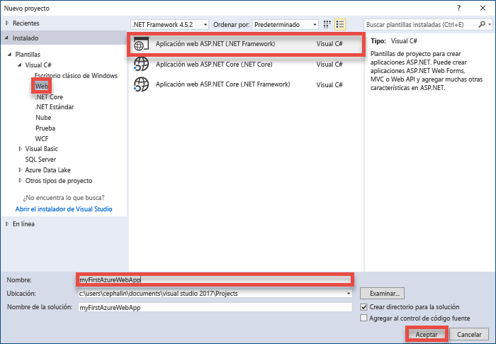
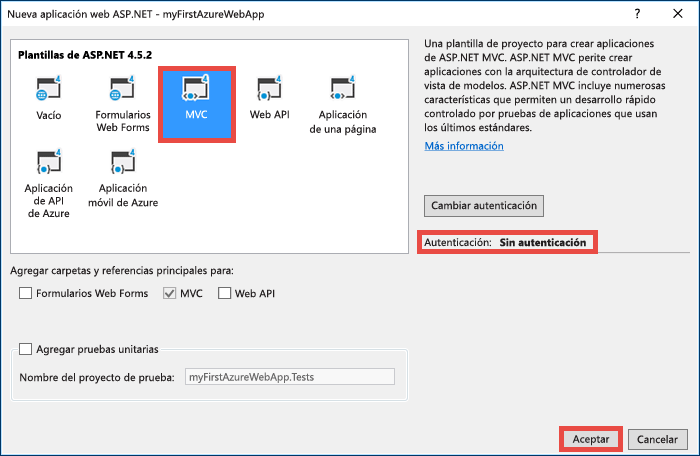
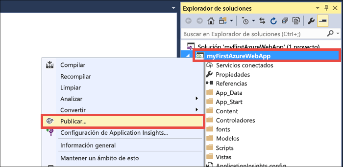
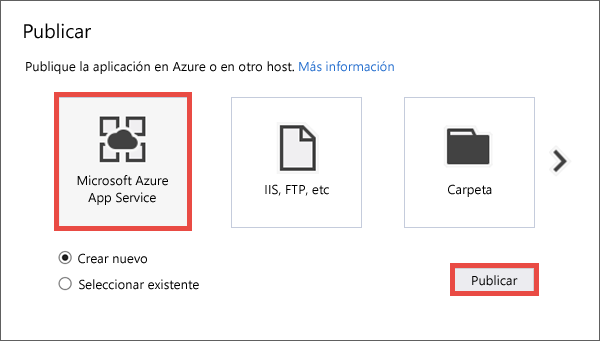
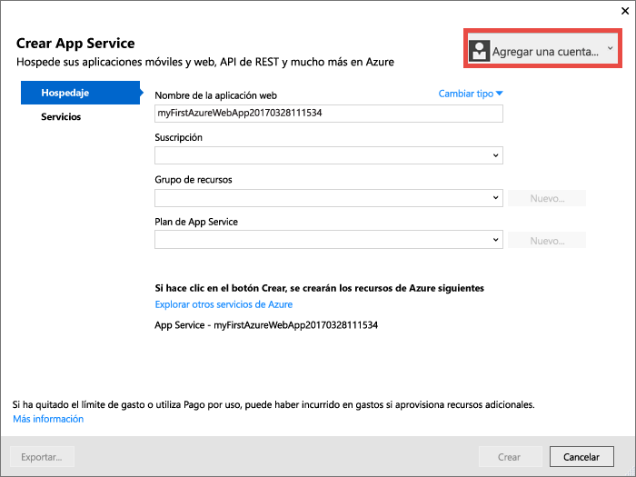
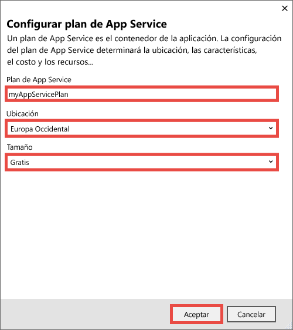
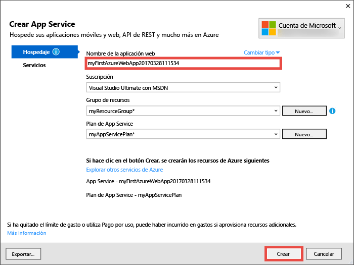
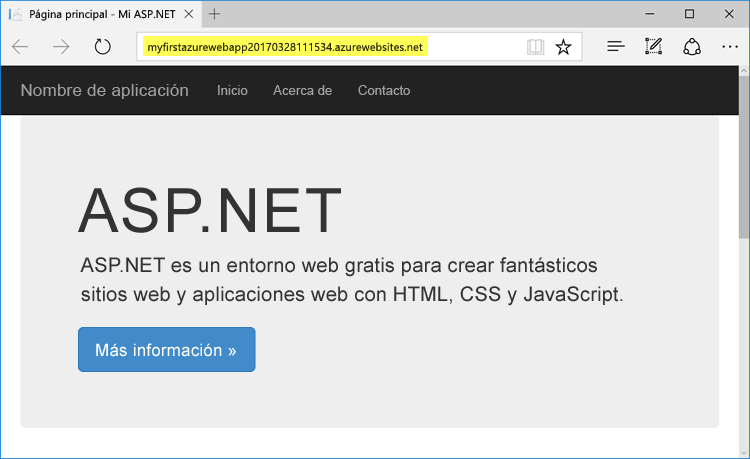
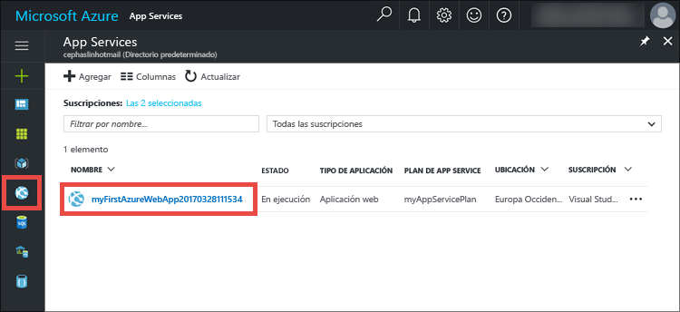
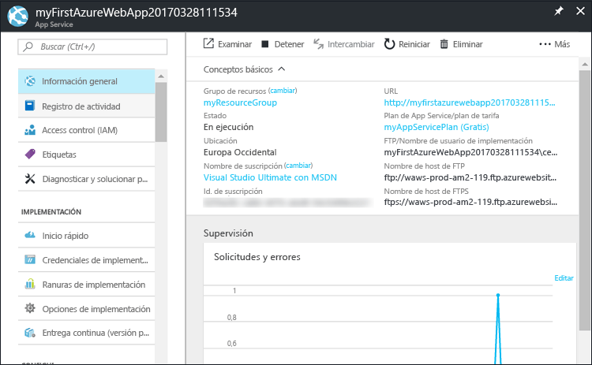

# <a name="create-your-first-aspnet-web-app-in-azure-in-five-minutes"></a>Creación de su primera aplicación web de ASP.NET en Azure en cinco minutos

[!INCLUDE [app-service-web-selector-get-started](../../includes/app-service-web-selector-get-started.md)] 

Este tutorial de inicio rápido le ayuda a implementar su primera aplicación web ASP.NET en [Azure App Service](../app-service/app-service-value-prop-what-is.md) en tan solo unos minutos. Cuando acabe, tendrá una sencilla aplicación web en funcionamiento en la nube.


## <a name="before-you-begin"></a>Antes de empezar

Este tutorial muestra cómo utilizar Visual Studio 2017 para compilar e implementar una aplicación web de ASP.NET en Azure. Si aún no tiene Visual Studio de 2017 instalado, puede descargar y usar la versión **gratis** de [Visual Studio 2017 Community Edition](https://www.visualstudio.com/downloads/). Asegúrese de que habilita **Desarrollo de Azure** durante la instalación de Visual Studio.

[!INCLUDE [quickstarts-free-trial-note](../../includes/quickstarts-free-trial-note.md)]

## <a name="create-an-aspnet-web-app"></a>Creación de una aplicación web de ASP.NET

Cree un nuevo proyecto en Visual Studio con `Ctrl`+`Shift`+`N`.

En el cuadro de diálogo **Nuevo proyecto**, haga clic en **Visual C# > Web > Aplicación web ASP.NET (.NET Framework)**.

Asigne a la aplicación el nombre **myFirstAzureWebApp** y haga clic en **Aceptar**.
   


Puede implementar cualquier tipo de aplicación web de ASP.NET en Azure. Para este tutorial, seleccione la plantilla **MVC** y asegúrese de que la autenticación se establece en **Sin autenticación**.
      
Haga clic en **Aceptar**.



## <a name="publish-to-azure"></a>Publicación en Azure

En el **Explorador de soluciones**, haga clic con el botón derecho en el proyecto **myFirstAzureWebApp** y seleccione **Publicar**.



Asegúrese de que **Microsoft Azure App Service** está seleccionado y haga clic en **Publicar**.



Con ello se abrirá el cuadro de diálogo **Crear App Service** que le ayudará a crear todos los recursos de Azure necesarios para ejecutar la aplicación web de ASP.NET en Azure.

## <a name="sign-in-to-azure"></a>Inicio de sesión en Azure

En el cuadro de diálogo **Crear App Service**, haga clic en **Agregar una cuenta** y, a continuación, inicie sesión en su suscripción de Azure. Si ya ha iniciado sesión en una cuenta de Microsoft, asegúrese de que esa cuenta contiene la suscripción de Azure. Si la cuenta de Microsoft con la que inició sesión no contiene su suscripción de Azure, haga clic en ella para agregar la cuenta correcta.
   


Una vez que haya iniciado sesión, estará listo para crear todos los recursos que necesita para la aplicación web de Azure en este cuadro de diálogo.

## <a name="create-a-resource-group"></a>Crear un grupo de recursos

En primer lugar, necesita un _grupo de recursos_. 

> [!NOTE] 
> Un grupo de recursos es un contenedor lógico en el que se implementan y se administran recursos de Azure como aplicaciones web, bases de datos y cuentas de almacenamiento.
>
>

Junto a **Grupo de recursos**, haga clic en **Nuevo**.

Asigne el nombre **myResourceGroup** al grupo de recursos y haga clic en **Aceptar**.

## <a name="create-an-app-service-plan"></a>Creación de un plan del Servicio de aplicaciones

La aplicación web de Azure también necesita un _plan de App Service_. 

> [!NOTE]
> Un plan de App Service representa la colección de recursos físicos que se utiliza para hospedar las aplicaciones. Todas las aplicaciones asignadas a un plan de App Service comparten los recursos definidos por él, lo que permite ahorrar costos al hospedar varias aplicaciones. 
>
> Los planes de App Service definen lo siguiente:
>
> - Región (Europa del Norte, este de EE. UU., Sudeste Asiático)
> - Tamaño de la instancia (pequeño, mediano, grande)
> - Recuento de escala (una, dos, tres instancias, etc.) 
> - SKU (Gratis, Compartido, Básico, Estándar y Premium)
>
>

Junto a **Plan de App Service**, haga clic en **Nuevo**. 

En el cuadro de diálogo **Configurar el plan de App Service**, configure el nuevo plan de App Service con los valores siguientes:

- **Plan de App Service**: escriba **myAppServicePlan**. 
- **Ubicación**: elija **Europa occidental**, o cualquier otra región que desee.
- **Tamaño**: elija **Gratis**, o cualquier otro [plan de tarifa](https://azure.microsoft.com/pricing/details/app-service/) que desee.

Haga clic en **Aceptar**.



## <a name="create-and-publish-the-web-app"></a>Creación y publicación de la aplicación web

Lo único que queda por hacer ahora es asignar un nombre a la aplicación web. En **Nombre de la aplicación web**, escriba un nombre único de aplicación web. Este nombre se utilizará como parte del nombre DNS predeterminado para la aplicación (`<app_name>.azurewebsites.net`), por lo que debe ser único entre todas las aplicaciones de Azure. Más adelante puede asignar un nombre de dominio personalizado a la aplicación antes de exponerlo a los usuarios.

También puede aceptar el nombre generado automáticamente, que ya es único.

Haga clic en **Crear** para comenzar a crear los recursos de Azure.



Una vez que el asistente finaliza la creación de los recursos de Azure, se publica automáticamente la aplicación web de ASP.NET en Azure por primera vez y, a continuación, inicia la aplicación web de Azure publicada en el explorador predeterminado.



La dirección URL utiliza el nombre de la aplicación web que especificó anteriormente, con el formato `http://<app_name>.azurewebsites.net`. 

Su primera aplicación web ASP.NET se está ejecutando en vivo en Azure App Service.

## <a name="update-the-app-and-redeploy"></a>Actualización de la aplicación y nueva implementación

Es muy fácil volver a implementar y realizar una actualización en Azure. Vamos a hacer una actualización en la página principal.

Desde el **Explorador de soluciones**, abra **Views\Home\Index.cshtml**.

Busque la etiqueta HTML `<div class="jumbotron">` en la parte superior y reemplace toda la etiqueta por el código siguiente:

```HTML
<div class="jumbotron">
    <h1>ASP.NET in Azure!</h1>
    <p class="lead">This is a simple app that we’ve built that demonstrates how to deploy a .NET app to Azure App Service.</p>
</div>
```

Para volver a implementar en Azure, haga clic con el botón derecho en el proyecto **myFirstAzureWebApp** del **Explorador de soluciones** y seleccione **Publicar**.

En la página de publicación, haga clic en **Publicar**.

Cuando Visual Studio finaliza, inicia la aplicación web actualizada de Azure en el explorador.


## <a name="manage-your-new-azure-web-app"></a>Administración de la nueva aplicación web de Azure

Vaya a Azure Portal para echar un vistazo a la aplicación web que acaba de crear. 

Para ello, inicie sesión en [https://portal.azure.com/](https://portal.azure.com).

En el menú izquierdo, haga clic en **App Services**, a continuación, haga clic en el nombre de la aplicación web de Azure.



Ha llegado a la _hoja_ de su aplicación web (una página del portal que se abre horizontalmente). 

De forma predeterminada, la hoja de la aplicación web muestra la página de **introducción**. Esta página proporciona una visión del funcionamiento de la aplicación. En este caso, también puede realizar tareas de administración básicas como examinar, detener, iniciar, reiniciar y eliminar. Las pestañas del lado izquierdo de la hoja muestran las diferentes páginas de configuración que puede abrir. 



Estas pestañas de la hoja muestran las muchas y excepcionales características que puede agregar a la aplicación web. La lista siguiente proporciona solo algunas de las posibilidades:

- Asignación de un nombre DNS personalizado
- Enlace de un certificado SSL personalizado
- Configuración de la implementación continua
- Escalado vertical y horizontal
- Adición de la autenticación de usuarios

## <a name="clean-up-resources"></a>Limpieza de recursos

Para eliminar la primera aplicación web de Azure, puede hacer clic en **Eliminar** en la página **Introducción**. No obstante, hay una manera mejor de eliminar todo lo que haya creado en este inicio rápido. Desde la página **Introducción** de la aplicación web, haga clic en el grupo de recursos para abrir su hoja. 


En la hoja del grupo de recursos, puede ver el plan de App Service y la aplicación de App Service que Visual Studio creó automáticamente. 

En la parte superior de la hoja, haga clic en **Eliminar**. 

<!---->

En la hoja de confirmación, confirme escribiendo el nombre del grupo de recursos **myResourceGroup** en el cuadro de texto y haga clic en **Eliminar**.

## <a name="next-steps"></a>Pasos siguientes

Explore los [scripts de PowerShell de las aplicaciones web](app-service-powershell-samples.md) previamente creados.

