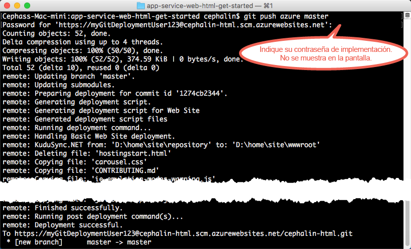

# Implementación de su primera aplicación web en Azure en 5 minutos
Este tutorial le ayudará a implementar su primera aplicación web de HTML+CSS en [Azure App Service](../app-service/app-service-value-prop-what-is.md).
App Service se puede usar para crear aplicaciones web, [back-ends de aplicaciones móviles](/documentation/learning-paths/appservice-mobileapps/) y [aplicaciones de API](../app-service-api/app-service-api-apps-why-best-platform.md).

Podrá: 

* Crear una aplicación web en Azure App Service.
* Implementar HTML y CSS en él.
* Ver la ejecución de las páginas en directo en producción.
* Actualizar el contenido del mismo modo que [insertaría confirmaciones de Git](https://git-scm.com/docs/git-push).

## Requisitos previos
* [Git](http://www.git-scm.com/downloads).
* [Azure CLI](../xplat-cli-install.md).
* Una cuenta de Microsoft Azure. Si aún no tiene ninguna, puede [registrarse para una evaluación gratuita](/pricing/free-trial/?WT.mc_id=A261C142F) o [activar las ventajas de suscriptor de Visual Studio](/pricing/member-offers/msdn-benefits-details/?WT.mc_id=A261C142F).

> [!NOTE]
> También puede [probar App Service](http://go.microsoft.com/fwlink/?LinkId=523751) sin una cuenta de Azure. Cree una aplicación de inicio y juegue con ella durante una hora como máximo; no se requiere ninguna tarjeta de crédito ni ningún compromiso.
> 
> 

## Implementación de un sitio HTML sencillo
1. Abra un símbolo del sistema de Windows, una ventana de PowerShell, un shell de Linux o un terminal de OS X. Ejecute `git --version` y `azure --version` para comprobar que Git y la CLI de Azure estén instalados en el equipo.
   
    
   
    Si no ha instalado las herramientas, consulte [Requisitos previos](#Prerequisites) para obtener vínculos de descarga.
2. Inicie sesión en Azure como se indica a continuación:
   
        azure login
   
    Siga el mensaje de ayuda para continuar con el proceso de inicio de sesión.
   
    
3. Cambie la CLI de Azure al modo ASM y establezca el usuario de implementación para App Service. Va a implementar código mediante las credenciales posteriormente.
   
        azure config mode asm
        azure site deployment user set --username <username> --pass <password>
4. Cambie a un directorio de trabajo (`CD`) y clone la aplicación de ejemplo como se indica a continuación:
   
        git clone https://github.com/Azure-Samples/app-service-web-html-get-started.git
5. Cambie al repositorio de la aplicación de ejemplo. 
   
        cd app-service-web-html-get-started
6. Cree el recurso de la aplicación de App Service en Azure con un nombre de aplicación único y el usuario de implementación que configuró anteriormente. Cuando se le solicite, especifique el número de la región deseada.
   
        azure site create <app_name> --git --gitusername <username>
   
    
   
    La aplicación se crea en Azure ahora. El directorio actual también se inicializa con Git y se conecta a la nueva aplicación del Servicio de aplicaciones como un Git remoto.
    Puede dirigirse a la dirección URL de la aplicación (http://&lt;nombre_aplicación>.azurewebsites.net) para ver la bonita página HTML predeterminada, pero usemos ahora su código.
7. Implemente su código de ejemplo en la nueva aplicación de Azure igual que insertaría cualquier código con Git. Cuando se le pida, use la contraseña que configuró anteriormente.
   
        git push azure master
   
    
   
    Si usó uno de los marcos de lenguaje, verá un resultado diferente. Esto se debe a que `git push` no solo inserta código en Azure, sino que también desencadena tareas de implementación en el motor de implementación. Si tiene algún archivo package.json (Node.js) o requirements.txt (Python) en la raíz del proyecto (repositorio) o tiene un archivo packages.config en el proyecto ASP.NET, el script de implementación restaura automáticamente los paquetes necesarios. También puede [habilitar la extensión Composer](web-sites-php-mysql-deploy-use-git.md#composer) para procesar automáticamente los archivos composer.json en la aplicación PHP.

Enhorabuena, ha implementado la aplicación en el Servicio de aplicaciones de Azure.

## Visualización de la aplicación en ejecución
Para ver cómo la aplicación se ejecuta en Azure, ejecute este comando desde cualquier directorio del repositorio:

    azure site browse

## Realización de actualizaciones en la aplicación
Ahora puede usar Git para efectuar inserciones desde la raíz del proyecto (repositorio) con el fin de realizar una actualización en el sitio activo. Hágalo igual que cuando implementó el código por primera vez. Por ejemplo, cada vez que quiera insertar un nuevo cambio que ha probado localmente, solo tiene que ejecutar los siguientes comandos desde la raíz del proyecto (repositorio):

    git add .
    git commit -m "<your_message>"
    git push azure master

## Pasos siguientes
Busque los pasos de desarrollo e implementación preferidos para su plataforma de lenguaje:

> [!div class="op_single_selector"]
> * [.NET](web-sites-dotnet-get-started.md)
> * [PHP](app-service-web-php-get-started.md)
> * [Node.js](app-service-web-nodejs-get-started.md)
> * [Python](web-sites-python-ptvs-django-mysql.md)
> * [Java](web-sites-java-get-started.md)
> 
> 

También puede hacer más cosas con su primera aplicación web. Por ejemplo:

* Pruebe [otras formas de implementar el código en Azure](web-sites-deploy.md). Por ejemplo, para implementar desde uno de los repositorios de GitHub, simplemente seleccione **GitHub** en lugar de **Repositorio de Git local** en **Opciones de implementación**.
* Lleve su aplicación de Azure aún más lejos. Autentique los usuarios. Escálela según la demanda. Configure algunas alertas de rendimiento. Todo ello con unos cuantos clics. Consulte [Incorporación de funcionalidad a su primera aplicación web](app-service-web-get-started-2.md).

<!---HONumber=Nov16_HO2-->

