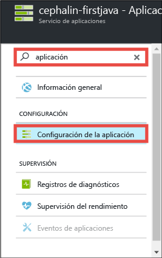
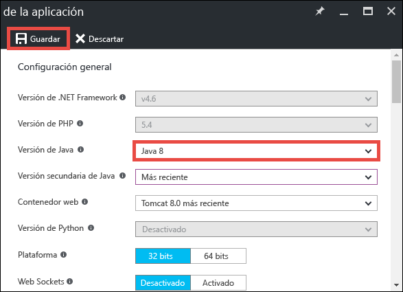
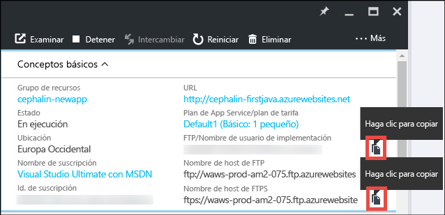
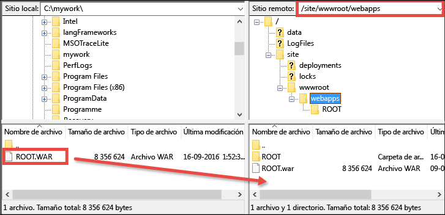

# Implementación de la primera aplicación web Java en Azure en 5 minutos (versión preliminar de CLI 2.0)

> [!div class="op_single_selector"]
> * [Primer sitio HTML](app-service-web-get-started-html-cli-nodejs.md)
> * [Primera aplicación .NET](app-service-web-get-started-dotnet-cli-nodejs.md)
> * [Primera aplicación PHP](app-service-web-get-started-php-cli-nodejs.md)
> * [Primera aplicación Node.js](app-service-web-get-started-nodejs-cli-nodejs.md)
> * [Primera aplicación Python](app-service-web-get-started-python-cli-nodejs.md)
> * [Primera aplicación Java](app-service-web-get-started-java.md)
> 
> 

Este tutorial le ayudará a implementar su primera aplicación web de Java en [Azure App Service](../app-service/app-service-value-prop-what-is.md).
App Service se puede usar para crear aplicaciones web, [back-ends de aplicaciones móviles](/documentation/learning-paths/appservice-mobileapps/) y [aplicaciones de API](../app-service-api/app-service-api-apps-why-best-platform.md).

Podrá: 

* Crear una aplicación web en Azure App Service.
* Implementar una aplicación de Java de ejemplo.
* Ver la ejecución del código en directo en producción.

## Requisitos previos
* Obtenga un cliente FTP o FTPS, como [FileZilla](https://filezilla-project.org/).
* Obtenga una cuenta de Microsoft Azure. Si aún no tiene ninguna, puede [registrarse para una evaluación gratuita](https://azure.microsoft.com/pricing/free-trial/?WT.mc_id=A261C142F) o [activar las ventajas de suscriptor de Visual Studio](https://azure.microsoft.com/pricing/member-offers/msdn-benefits-details/?WT.mc_id=A261C142F).

> [!NOTE]
> También puede [probar App Service](https://azure.microsoft.com/try/app-service/) sin una cuenta de Azure. Cree una aplicación de inicio y juegue con ella durante una hora como máximo; no se requiere ninguna tarjeta de crédito ni ningún compromiso.
> 
> 

## Creación de una aplicación web
1. Inicie sesión en [Azure Portal](https://portal.azure.com) con su cuenta de Azure.
2. En el menú izquierdo, haga clic en **Nuevo** > **Web y móvil** > **Aplicación web**.
   
    
3. En la hoja de creación de la aplicación, utilice la siguiente configuración para su nueva aplicación:
   
   * **Nombre de la aplicación**: escriba un nombre único.
   * **Grupo de recursos**: seleccione **Crear nuevo** y asígnele un nombre.
   * **Plan de App Service/Ubicación**: haga clic en esta opción para configurarla y, después, en **Crear nuevo** para establecer el nombre, la ubicación y el plan de tarifa del plan de App Service. Puede usar el plan de tarifa **Gratis** .
     
     Cuando haya terminado, la hoja de creación de la aplicación debe tener este aspecto:
     
     
4. Haga clic en **Crear** en la parte inferior. Puede hacer clic en el icono de **notificación** , situado en la parte superior, para ver el progreso.
   
    
5. Cuando la implementación haya finalizado, verá este mensaje de notificación. Haga clic en el mensaje para abrir la hoja de implementación.
   
    
6. En la hoja **Implementación correcta**, haga clic en el vínculo **Recurso** para abrir la hoja de su nueva aplicación web.
   
    

## Implementación de una aplicación de Java en la aplicación web
Ahora, vamos a implementar una aplicación de Java en Azure mediante FTPS.

1. En la hoja de la aplicación web, desplácese hacia abajo hasta **Configuración de la aplicación** o búsquela, y haga clic en ella. 
   
    
2. En **Versión de Java**, seleccione **Java 8** y haga clic en **Guardar**.
   
    
   
    Cuando reciba la notificación **La configuración de la aplicación web se actualizó correctamente**, vaya a http://*&lt;nombre_aplicación>*.azurewebsites.net para ver el servlet JSP predeterminado en acción.
3. Una vez de vuelta en la hoja de la aplicación web, desplácese hacia abajo hasta la opción **Credenciales de implementación** o búsquela, y haga clic en ella.
4. Configure las credenciales de implementación y haga clic en **Guardar**.
5. De vuelta en la hoja de la aplicación web, haga clic en **Información general**. Junto a **FTP/Nombre de usuario de implementación** y **Nombre de host de FTPS**, haga clic en el botón **Copiar** para copiar estos valores.
   
    
   
    Ya está listo para implementar la aplicación de Java con FTPS.
6. En el cliente FTP o FTPS, inicie sesión en el servidor FTP de la aplicación web de Azure con los valores que copió en el paso anterior. Utilice la contraseña de implementación que creó anteriormente.
   
    La siguiente captura de pantalla muestra el inicio de sesión mediante FileZilla.
   
    
   
    Puede que aparezcan las advertencias de seguridad para el certificado SSL no reconocido de Azure. Continúe.
7. Haga clic en [este vínculo](https://github.com/Azure-Samples/app-service-web-java-get-started/raw/master/webapps/ROOT.war) para descargar el archivo WAR en el equipo local.
8. En el cliente FTP o FTPS, vaya a **/site/wwwroot/webapps** en el sitio remoto y arrastre el archivo WAR descargado en el equipo local al directorio remoto.
   
    
   
    Haga clic en **Aceptar** para reemplazar el archivo en Azure.
   
   > [!NOTE]
   > Según el comportamiento predeterminado de Tomcat, el nombre del archivo **ROOT.war** en /site/wwwroot/webapps le proporciona la aplicación web raíz (http://*&lt;nombre_aplicación>*.azurewebsites.net) y el nombre de archivo ***&lt;cualquier_nombre>*.war** le ofrece una aplicación web con nombre (http://*&lt;nombre_aplicación>*.azurewebsites.net/*&lt;cualquier_nombre>*).
   > 
   > 

Eso es todo. La aplicación de Java se ejecuta ahora en directo en Azure. En el explorador, vaya a http://*&lt;nombre de aplicación>*.azurewebsites.net para verlo en acción. 

## Realización de actualizaciones en la aplicación
Cada vez que necesite realizar una actualización, bastará con cargar el nuevo archivo WAR en el mismo directorio remoto con el cliente FTP o FTPS.

## Pasos siguientes
[Creación de una aplicación web de Java a partir de una plantilla en Azure Marketplace](web-sites-java-get-started.md#marketplace). Puede obtener su propio contenedor de Tomcat totalmente personalizable y obtener la conocida IU del administrador. 

Depure la aplicación web de Azure directamente en [IntelliJ](app-service-web-debug-java-web-app-in-intellij.md) o [Eclipse](app-service-web-debug-java-web-app-in-eclipse.md).

También puede hacer más cosas con su primera aplicación web. Por ejemplo:

* Pruebe [otras formas de implementar el código en Azure](web-sites-deploy.md). 
* Lleve su aplicación de Azure aún más lejos. Autentique los usuarios. Escálela según la demanda. Configure algunas alertas de rendimiento. Todo ello con unos cuantos clics. Consulte [Incorporación de funcionalidad a su primera aplicación web](app-service-web-get-started-2.md).

<!--HONumber=Feb17_HO1-->

