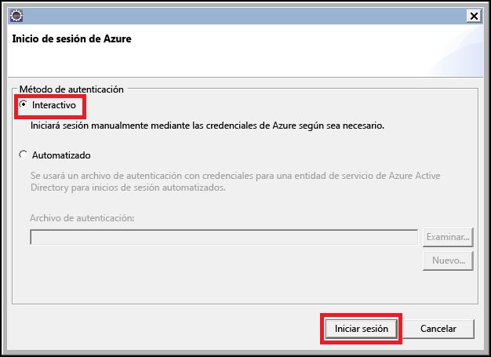
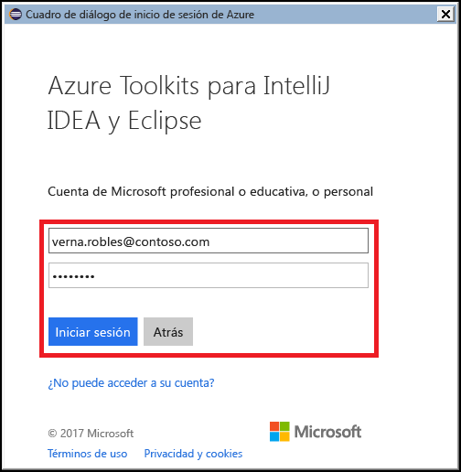
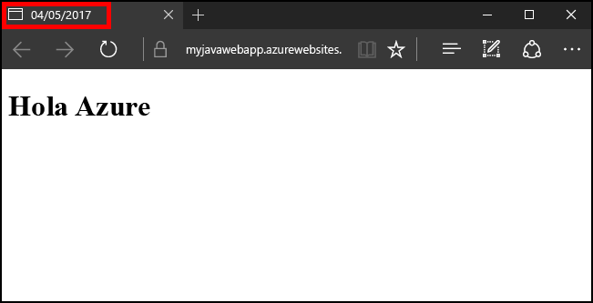

# <a name="create-your-first-java-web-app-in-azure-in-five-minutes"></a>Creación de su primera aplicación web de Java en Azure en cinco minutos

[!INCLUDE [app-service-web-selector-get-started](../../includes/app-service-web-selector-get-started.md)] 

Este tutorial de inicio rápido le ayuda a implementar su primera aplicación web de Java en [Azure App Service](../app-service/app-service-value-prop-what-is.md) en tan solo unos minutos. Cuando acabe el tutorial, tendrá una sencilla aplicación web basada en Java en funcionamiento en la nube.


## <a name="before-you-begin"></a>Antes de empezar

Este tutorial muestra cómo utilizar el IDE de Eclipse para desarrolladores de Java EE para compilar e implementar una aplicación web de Java en Azure. Si aún no se ha instalado Eclipse, puede descargarlo gratuitamente desde http://www.eclipse.org/.

Con el fin de simplificar el proceso de publicación de aplicaciones web de Java en Azure, los pasos descritos en este tutorial usarán el [kit de herramientas de Azure para Eclipse](/azure/azure-toolkit-for-eclipse). Para obtener instrucciones sobre cómo instalar este kit de herramientas, consulte [Instalación del kit de herramientas de Azure para Eclipse](/azure/azure-toolkit-for-eclipse-installation).

> [!NOTE]
>
> También puede usar [IntelliJ IDEA](https://www.jetbrains.com/idea/) de JetBrains para completar los pasos de este tutorial. Algunos de los pasos podrían ser ligeramente diferentes para ese entorno de desarrollo, aunque hay también un [kit de herramientas de Azure para IntelliJ](/azure/azure-toolkit-for-intellij) que sirve para simplificar el proceso de publicación para ese IDE.
>

Para completar los pasos descritos en este tutorial, deberá tener una suscripción de Azure. Si todavía no la tiene, puede activar sus [ventajas como suscriptor de MSDN](https://azure.microsoft.com/pricing/member-offers/msdn-benefits-details/) o registrarse para obtener una [cuenta de Azure gratuita](https://azure.microsoft.com/pricing/free-trial/).

## <a name="create-a-dynamic-web-project-in-eclipse"></a>Creación de un proyecto web dinámico en Eclipse

En Eclipse, en el menú **Archivo**, seleccione **Nuevo** y **Proyecto web dinámico**.

En el cuadro de diálogo **Nuevo proyecto web dinámico**, asigne al proyecto el nombre **MyFirstJavaOnAzureWebApp** y seleccione **Finalizar**.
   


> [!NOTE]
>
> Si tiene instalado un entorno local en tiempo de ejecución como [Apache Tomcat](https://tomcat.apache.org/), puede especificar eso en el campo **Target runtime** (Tiempo de ejecución de destino).
>

Después de crear el proyecto web dinámico, agregue una nueva página JSP expandiendo el proyecto en el Explorador de proyectos. Después, haga clic con el botón derecho en la carpeta **WebContent**, haga clic en **New** (Nuevo) y, finalmente, haga clic en **JSP File** (Archivo JSP).


Cuando aparezca el cuadro de diálogo New JSP File (Nuevo archivo JSP), asigne el nombre **index.jsp** al archivo, conserve la carpeta primara como **MyFirstJavaOnAzureWebApp/WebContent** y haga clic en **Next** (Siguiente).


En la segunda página del cuadro de diálogo New JSP File (Nuevo archivo JSP), asigne el nombre **index.jsp** al archivo, conserve la carpeta primaria como **MyFirstJavaOnAzureWebApp/WebContent** y haga clic en **Finish** (Finalizar).


Cuando se abra la nueva página en Eclipse, reemplace la sección `<body></body>` existente por el código siguiente:

```jsp
<body>
<h1><% out.println("Hello Azure!"); %></h1>
</body>
```

Guarde los cambios en la página.

## <a name="publish-your-web-app-to-azure"></a>Publicación de la aplicación web en Azure

Para implementar la aplicación web en Azure, puede aprovecharse de las ventajas proporcionadas por el kit de herramientas de Azure para Eclipse.

Para empezar el proceso de publicación, use alguno de los métodos siguientes:

* Haga clic con el botón derecho en el proyecto en el **Explorador de proyectos** de Eclipse, luego, haga clic en **Azure**y, finalmente, haga clic en **Publicar en Azure Web App**.

   

* Haga clic en el icono **Publicar** en la barra de herramientas de Eclipse y, finalmente, haga clic en **Publicar en Azure Web App**.

   

Si aún no ha iniciado sesión en su cuenta de Azure, se le pedirá que lo haga. Para ello, siga estos pasos:

1. Hay dos opciones diferentes para iniciar sesión en la cuenta de Azure; para este tutorial, elija **Interactivo**.

   

1. Escriba sus credenciales de Azure y, a continuación, haga clic en **Iniciar sesión**.

   

1. Elija las suscripciones de Azure y, a continuación, haga clic en **Seleccionar**.

   

> [!NOTE]
>
> Puede encontrar instrucciones detalladas sobre los inicios de sesión **Interactivo** y **Automatizado** en el artículo [Instrucciones de inicio de sesión de Azure del kit de herramientas de Azure para Eclipse](https://go.microsoft.com/fwlink/?linkid=846174).
>

Una vez que haya iniciado sesión en su cuenta de Azure, aparecerá el cuadro de diálogo **Implementar una aplicación web**. No debería ver ninguna instancia de App Services en la lista si esta es la primera vez que publica una aplicación web en Azure. Si ese es el caso, o si desea crear una instancia nueva de App Service, el paso siguiente será crearla. Para ello, haga clic en **Crear**.


Cuando aparezca el cuadro de diálogo **Crear servicio de aplicaciones** se le pedirán los siguientes datos iniciales:

* Un nombre único para la aplicación web, que se convertirá en la dirección DNS de la aplicación web. Por ejemplo: **MyJavaWebApp** será *myjavawebapp.azurewebsites.net*.

* El contenedor web que va a utilizar la aplicación web. Por ejemplo: **Newest Tomcat 8.5**.

* Su suscripción de Azure.

   

Si no dispone de ningún plan de App Service existente, o si desea crear uno nuevo, debe proporcionar la siguiente información:

* Un nombre único para el nuevo plan de servicio. Este nombre se mostrará al publicar aplicaciones web en el futuro mediante el kit de herramientas de Azure y aparecerá en [Azure Portal](https://portal.azure.com) cuando administre su cuenta.

* La ubicación geográfica en la que se va a crear el plan de servicio.

* El plan de tarifa para el plan de servicio.

   

A continuación, haga clic en la pestaña **Grupo de recursos**. Si no tiene ningún grupo de recursos existente, o si desea crear uno nuevo, debe proporcionar un nombre único para el nuevo grupo de recursos. En caso contrario, elija un grupo de recursos existente en el menú desplegable.


Por último, haga clic en la pestaña **JDK**. Hay varias opciones que permiten a los desarrolladores especificar otros kits para desarrolladores de Java (JDK) personalizados o de terceros, pero para este tutorial debe elegir el **predeterminado**y, después, hacer clic en **Crear**.


El kit de herramientas de Azure empezará a crear una nueva instancia de App Service y mostrará un cuadro de diálogo de progreso mientras se está procesando.


Por último, una vez creado la nueva instancia de App Service, debe elegir si va a implementar la aplicación web en la raíz del sitio web nuevo. Por ejemplo, si tiene un servicio de aplicaciones en *wingtiptoys.azurewebsites.net* y no lo implementa en la raíz, la aplicación web denominada **MyFirstJavaOnAzureWebApp** se implementará en *wingtiptoys.azurewebsites.net/MyFirstJavaOnAzureWebApp*.


Cuando haya terminado con todos los pasos anteriores, haga clic en **Implementar** para publicar la aplicación web en Azure.


¡Enhorabuena! Ha implementado correctamente la aplicación web en Azure. Ahora ya puede obtener una vista previa de la aplicación web en el sitio web de Azure:


## <a name="updating-your-web-app"></a>Actualización de la aplicación web

Una vez que se ha publicado correctamente la aplicación web en Azure, la actualización de la aplicación web es un proceso mucho más sencillo y los pasos siguientes le guiarán a través del proceso de publicación de los cambios en la aplicación web.

En primer lugar, cambie el código JSP del ejemplo anterior para que el título se sustituya por la fecha de hoy:

```jsp
<%@ page
    language="java"
    contentType="text/html; charset=ISO-8859-1"
    pageEncoding="ISO-8859-1"
    import="java.text.SimpleDateFormat"
    import="java.util.Date" %>
<!DOCTYPE html PUBLIC "-//W3C//DTD HTML 4.01 Transitional//EN" "http://www.w3.org/TR/html4/loose.dtd">
<html>
<head>
<meta http-equiv="Content-Type" content="text/html; charset=ISO-8859-1">
<% SimpleDateFormat date = new SimpleDateFormat("yyyy/MM/dd"); %>
<title><% out.println(date.format(new Date())); %></title>
</head>
<body>
<h1><% out.println("Hello Azure!"); %></h1>
</body>
</html>
```

Una vez que haya guardado los cambios, haga clic con el botón derecho en el proyecto en el **Explorador de proyectos** de Eclipse, haga clic en **Azure** y, finalmente, haga clic en **Publicar como aplicación web de Azure**.


Cuando aparezca el cuadro de diálogo **Implementar una aplicación web**, se mostrará el servicio de aplicaciones de antes. Para actualizar la aplicación web, solo tiene que resaltar el servicio de aplicaciones y hacer clic en **Implementar** para publicar los cambios.


> [!NOTE]
>
> Si va a implementar la aplicación web en la raíz del servicio de aplicaciones, tendrá que volver a comprobar la opción **Deploy to root** (Implementar en raíz) cada vez que publique los cambios.
>

Después de publicar los cambios, observará que el título de la página ha cambiado a la fecha de hoy en el explorador.



## <a name="clean-up-resources"></a>Limpieza de recursos

Para eliminar la aplicación web, use el **explorador de Azure** incluido con el Kit de herramientas de Azure. Si la vista del **Explorador de Azure** ya no está visible en Eclipse, siga estos pasos para que aparezca:

1. Haga clic en **Window** (Ventana), después, en **Show View** (Mostrar vista) y, a continuación, haga clic en **Other** (Otro).

   

2. Cuando aparezca el cuadro de diálogo **Show View** (Mostrar vista), seleccione **Explorador Azure** y haga clic en **Aceptar**.

   

Para eliminar la aplicación web del Explorador de Azure, debe expandir el nodo **Web Apps** y, a continuación, hacer clic con el botón derecho en la aplicación web y seleccionar **Eliminar**.


Cuando se le pida que confirme la eliminación de la aplicación web, haga clic en **Aceptar**.

## <a name="next-steps"></a>Pasos siguientes

Para más información acerca de los kits de herramientas de Azure para los IDE de Java, vea los siguientes vínculos:

* [Kit de herramientas de Azure para Eclipse (este artículo)](../azure-toolkit-for-eclipse.md)
  * [Novedades del kit de herramientas de Azure para Eclipse](../azure-toolkit-for-eclipse-whats-new.md)
  * [Instalación del Kit de herramientas de Azure para Eclipse](../azure-toolkit-for-eclipse-installation.md)
  * [Instrucciones de inicio de sesión del kit de herramientas de Azure para Eclipse](https://go.microsoft.com/fwlink/?linkid=846174)
* [Kit de herramientas de Azure para IntelliJ](../azure-toolkit-for-intellij.md)
  * [Novedades del kit de herramientas de Azure para IntelliJ](../azure-toolkit-for-intellij-whats-new.md)
  * [Instalación del kit de herramientas de Azure para IntelliJ](../azure-toolkit-for-intellij-installation.md)
  * [Instrucciones de inicio de sesión del kit de herramientas de Azure para IntelliJ](https://go.microsoft.com/fwlink/?linkid=846179)

Para obtener más información sobre el uso de Azure con Java, vea el [Centro para desarrolladores de Java de Azure](https://azure.microsoft.com/develop/java/) y [Java Tools for Visual Studio Team Services](https://java.visualstudio.com/) (Herramientas de Java para Visual Studio Team Services).

