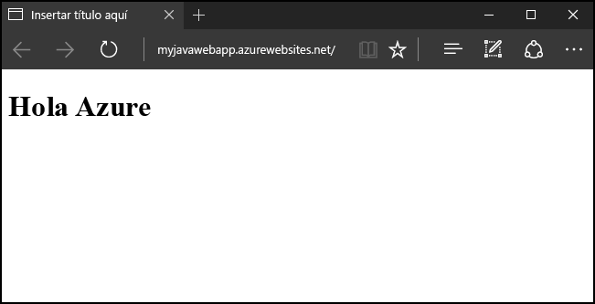

# <a name="create-your-first-java-web-app-in-azure"></a>Creación de su primera aplicación web de Java en Azure

La característica [Web Apps](https://docs.microsoft.com/azure/app-service-web/app-service-web-overview) de [Azure App Service](../app-service/app-service-value-prop-what-is.md) proporciona un servicio de hospedaje web muy escalable y con aplicación de revisiones de un modo automático. Esta guía de inicio rápido muestra cómo implementar una aplicación web de Java en App Service mediante [Eclipse IDE for Java EE Developers](http://www.eclipse.org/).



## <a name="prerequisites"></a>Requisitos previos

Para completar esta guía de inicio rápido necesita instalar:

* El entorno gratuito [Eclipse IDE for Java EE Developers](http://www.eclipse.org/downloads/). Este guía de inicio rápido utiliza Eclipse Neon.
* El [kit de herramientas de Azure para Eclipse](/azure/azure-toolkit-for-eclipse-installation).

[!INCLUDE [quickstarts-free-trial-note](../../includes/quickstarts-free-trial-note.md)]

## <a name="create-a-dynamic-web-project-in-eclipse"></a>Creación de un proyecto web dinámico en Eclipse

En Eclipse, seleccione **File (Archivo)** > **New (Nuevo)** > **Dynamic Web Project (Proyecto web dinámico)**.

En el cuadro de diálogo **New Dynamic Web Project** (Nuevo proyecto web dinámico), asigne al proyecto el nombre **MyFirstJavaOnAzureWebApp** y seleccione **Finish** (Finalizar).
   


### <a name="add-a-jsp-page"></a>Agregar una página JSP

Si no se muestra el Explorador de proyectos, restáurelo.


En el Explorador de proyectos, expanda el proyecto **MyFirstJavaOnAzureWebApp**.
Haga clic con el botón derecho en **WebContent** (Contenido web) y, a continuación, seleccione **New** (Nuevo) > **JSP File** (Archivo JSP).


En el cuadro de diálogo **New JSP File** (Nuevo archivo JSP):

* Asigne al archivo el nombre **index.jsp**.
* Seleccione **Finalizar**.

  

En el archivo index.jsp, reemplace el elemento `<body></body>` por el siguiente marcado:

```jsp
<body>
<h1><% out.println("Hello Azure!"); %></h1>
</body>
```

Guarde los cambios.

## <a name="publish-the-web-app-to-azure"></a>Publicación de la aplicación web en Azure

En el Explorador de proyectos, haga clic con el botón derecho en el proyecto y, a continuación, seleccione **Azure** > **Publish as Azure Web App** (Publicar como aplicación web de Azure).


En el cuadro de diálogo **Inicio de sesión en Azure**, mantenga la opción **Interactivo** y, a continuación, seleccione **Iniciar sesión**.

Siga las instrucciones de inicio de sesión.

### <a name="deploy-web-app-dialog-box"></a>Cuadro de diálogo Implementar una aplicación web

Una vez que haya iniciado sesión en su cuenta de Azure, aparecerá el cuadro de diálogo **Implementar una aplicación web**.

Seleccione **Crear**.


### <a name="create-app-service-dialog-box"></a>Cuadro de diálogo Crear servicio de aplicaciones

Aparece el cuadro de diálogo **Crear App Service** con los valores predeterminados. El número **170602185241** que se muestra en la siguiente imagen será diferente en su cuadro de diálogo.


En el cuadro de diálogo **Crear App Service**:

* Mantenga el nombre generado para la aplicación web. Este nombre debe ser único en Azure. El nombre forma parte de la dirección URL de la aplicación web. Por ejemplo: si el nombre de la aplicación web es **MyJavaWebApp**, la dirección URL será *myjavawebapp.azurewebsites.net*.
* Mantenga el contenedor de web predeterminado.
* Seleccione una suscripción de Azure.
* En la pestaña **Plan de App Service**:

  * **Crear nuevo**: mantenga el valor predeterminado, que es el nombre del plan de App Service.
  * **Ubicación**: seleccione **Europa occidental** o una ubicación cerca de usted.
  * **Plan de tarifa**: seleccione la opción gratuita. Para ver las características, consulte [Precios de App Service](https://azure.microsoft.com/pricing/details/app-service/).

   

[!INCLUDE [app-service-plan](../../includes/app-service-plan.md)]

### <a name="resource-group-tab"></a>Pestaña Grupo de recursos

Seleccione la pestaña **Grupo de recursos**. Mantenga el valor generado de forma predeterminada para el grupo de recursos.


[!INCLUDE [resource-group](../../includes/resource-group.md)]

Seleccione **Crear**.

<!--
### The JDK tab

Select the **JDK** tab. Keep the default, and then select **Create**.


-->

El kit de herramientas de Azure crea la aplicación web y muestra un cuadro de diálogo de progreso.


### <a name="deploy-web-app-dialog-box"></a>Cuadro de diálogo Implementar una aplicación web

En el cuadro de diálogo **Implementar aplicación web**, seleccione **Implementar en el nodo raíz**. Si tiene un servicio de aplicaciones en *wingtiptoys.azurewebsites.net* y no lo implementa en la raíz, la aplicación web denominada **MyFirstJavaOnAzureWebApp** se implementará en *wingtiptoys.azurewebsites.net/MyFirstJavaOnAzureWebApp*.


El cuadro de diálogo muestra las selecciones de Azure, JDK y contenedor web.

Seleccione **Implementar** para publicar la aplicación web en Azure.

Cuando finalice la publicación, seleccione el enlace **Publicado** en el cuadro de diálogo **Registro de actividad de Azure**.


¡Enhorabuena! Ha implementado correctamente la aplicación web en Azure. 


## <a name="update-the-web-app"></a>Actualización de la aplicación web

Cambie el código de ejemplo JSP a un mensaje diferente.

```jsp
<body>
<h1><% out.println("Hello again Azure!"); %></h1>
</body>
```

Guarde los cambios.

En el Explorador de proyectos, haga clic con el botón derecho en el proyecto y, a continuación, seleccione **Azure** > **Publish as Azure Web App** (Publicar como aplicación web de Azure).

Aparece el cuadro de diálogo **Implementar aplicación web** y muestra el App Service que creó anteriormente. 

> [!NOTE]
> Seleccione **Implementar en el nodo raíz** cada vez que publique.
>

Seleccione la aplicación web y seleccione **Implementar**, que publica los cambios.

Cuando aparezca el enlace **Publicando**, selecciónelo para ir a la aplicación web y ver los cambios.

## <a name="manage-the-web-app"></a>Administrar la aplicación web

Vaya a <a href="https://portal.azure.com" target="_blank">Azure Portal</a> para ver la aplicación web que ha creado.

Seleccione **Grupos de recursos** en el menú izquierdo.


Seleccione el grupo de recursos. La página muestra los recursos que ha creado en esta guía de inicio rápido.


Seleccione la aplicación web (**webapp-170602193915** en la imagen anterior).

Aparece la página **Información general**. Esta página proporciona una visión del funcionamiento de la aplicación. En ella, puede realizar tareas de administración básicas como examinar, detener, iniciar, reiniciar y eliminar. Las pestañas del lado izquierdo de la página muestran las diferentes configuraciones que puede abrir. 


[!INCLUDE [clean-up-section-portal-web-app](../../includes/clean-up-section-portal-web-app.md)]

## <a name="next-steps"></a>Pasos siguientes

> [!div class="nextstepaction"]
> [Asignación de un dominio personalizado](app-service-web-tutorial-custom-domain.md)

