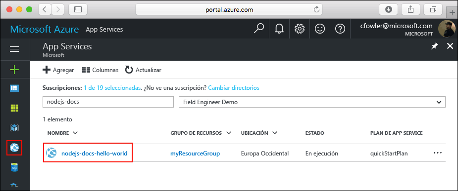

# <a name="create-a-nodejs-web-app-in-azure"></a>Creación de una aplicación web de Node.js en Azure

[Azure Web Apps](https://docs.microsoft.com/azure/app-service-web/app-service-web-overview) proporciona un servicio de hospedaje web muy escalable y con aplicación de revisiones de un modo automático.  En esta guía de inicio rápido se explica cómo se implementa una aplicación de Node.js en Azure Web Apps. Se crea la aplicación web con la [CLI de Azure](https://docs.microsoft.com/cli/azure/get-started-with-azure-cli) y se usa Git para implementar el código Node.js de ejemplo en la aplicación web.


Estos pasos se pueden realizar con un equipo Mac, Windows o Linux. Una vez instalados los requisitos previos, tardará aproximadamente cinco minutos en completar los pasos.   

> [!VIDEO https://channel9.msdn.com/Shows/Azure-for-Node-Developers/Create-a-Nodejs-app-in-Azure-Quickstart/player]   


## <a name="prerequisites"></a>Requisitos previos

Para completar esta guía de inicio rápido:

* [Instalación de Git](https://git-scm.com/)
* [Instalación de Node.js y NPM](https://nodejs.org/)

[!INCLUDE [quickstarts-free-trial-note](../../includes/quickstarts-free-trial-note.md)]

[!INCLUDE [cloud-shell-try-it.md](../../includes/cloud-shell-try-it.md)]

Si decide instalar y usar la CLI localmente, para este tema es preciso que ejecute la CLI de Azure versión 2.0 o posterior. Ejecute `az --version` para encontrar la versión. Si necesita instalarla o actualizarla, consulte [Instalación de la CLI de Azure 2.0]( /cli/azure/install-azure-cli). 

## <a name="download-the-sample"></a>Descarga del ejemplo

En una ventana de terminal, ejecute el siguiente comando para clonar el repositorio de la aplicación de ejemplo en el equipo local.

```bash
git clone https://github.com/Azure-Samples/nodejs-docs-hello-world
```

Utilice esta ventana de terminal para ejecutar todos los comandos de esta guía de inicio rápido.

Cambie al directorio que contiene el código de ejemplo.

```bash
cd nodejs-docs-hello-world
```

## <a name="run-the-app-locally"></a>Ejecución de la aplicación de forma local

Ejecute la aplicación localmente abriendo una ventana de terminal y utilizando el script `npm start` para iniciar el servidor HTTP de Node.js integrado.

```bash
npm start
```

Abra un explorador web y navegue a la aplicación de ejemplo en http://localhost:1337.

Verá el mensaje **Hola mundo** de la aplicación de ejemplo que aparece en la página.


En la ventana de terminal, presione **Ctrl + C** para salir del servidor web.

[!INCLUDE [Log in to Azure](../../includes/login-to-azure.md)] 

[!INCLUDE [Configure deployment user](../../includes/configure-deployment-user.md)] 

[!INCLUDE [Create resource group](../../includes/app-service-web-create-resource-group.md)] 

[!INCLUDE [Create app service plan](../../includes/app-service-web-create-app-service-plan.md)] 

[!INCLUDE [Create web app](../../includes/app-service-web-create-web-app.md)] 


Ha creado una nueva aplicación web vacía en Azure.

[!INCLUDE [Configure local git](../../includes/app-service-web-configure-local-git.md)] 

[!INCLUDE [Push to Azure](../../includes/app-service-web-git-push-to-azure.md)] 

```bash
Counting objects: 23, done.
Delta compression using up to 4 threads.
Compressing objects: 100% (21/21), done.
Writing objects: 100% (23/23), 3.71 KiB | 0 bytes/s, done.
Total 23 (delta 8), reused 7 (delta 1)
remote: Updating branch 'master'.
remote: Updating submodules.
remote: Preparing deployment for commit id 'bf114df591'.
remote: Generating deployment script.
remote: Generating deployment script for node.js Web Site
remote: Generated deployment script files
remote: Running deployment command...
remote: Handling node.js deployment.
remote: Kudu sync from: '/home/site/repository' to: '/home/site/wwwroot'
remote: Copying file: '.gitignore'
remote: Copying file: 'LICENSE'
remote: Copying file: 'README.md'
remote: Copying file: 'index.js'
remote: Copying file: 'package.json'
remote: Copying file: 'process.json'
remote: Deleting file: 'hostingstart.html'
remote: Ignoring: .git
remote: Using start-up script index.js from package.json.
remote: Node.js versions available on the platform are: 4.4.7, 4.5.0, 6.2.2, 6.6.0, 6.9.1.
remote: Selected node.js version 6.9.1. Use package.json file to choose a different version.
remote: Selected npm version 3.10.8
remote: Finished successfully.
remote: Running post deployment command(s)...
remote: Deployment successful.
To https://<app_name>.scm.azurewebsites.net:443/<app_name>.git
 * [new branch]      master -> master
```

## <a name="browse-to-the-app"></a>Navegación hasta la aplicación

Vaya a la aplicación implementada mediante el explorador web.

```bash
http://<app_name>.azurewebsites.net
```

El código de ejemplo de Node.js se está ejecutando en una aplicación web de Azure App Service.


**¡Enhorabuena!** Ha implementado la primera aplicación de Node.js en App Service.

## <a name="update-and-redeploy-the-code"></a>Actualización del código y nueva implementación

Con un editor de texto, abra el archivo `index.js` en la aplicación de Node.js y realice un pequeño cambio en el texto en la llamada a `response.end`:

```nodejs
response.end("Hello Azure!");
```

Confirme los cambios en Git y, después, inserte los cambios de código en Azure.

```bash
git commit -am "updated output"
git push azure master
```

Una vez que la implementación haya finalizado, vuelva a cambiar la ventana del explorador que se abrió en el paso **Navegación hasta la aplicación** y actualice la vista.


## <a name="manage-your-new-azure-web-app"></a>Administración de la nueva aplicación web de Azure

Vaya a <a href="https://portal.azure.com" target="_blank">Azure Portal</a> para administrar la aplicación web que ha creado.

En el menú izquierdo, haga clic en **App Services** y, a continuación, haga clic en el nombre de la aplicación web de Azure.



Podrá ver la página de información general de la aplicación web. En este caso, puede realizar tareas de administración básicas como examinar, detener, iniciar, reiniciar y eliminar. 


El menú izquierdo proporciona distintas páginas para configurar la aplicación. 

[!INCLUDE [cli-samples-clean-up](../../includes/cli-samples-clean-up.md)]

## <a name="next-steps"></a>Pasos siguientes

> [!div class="nextstepaction"]
> [Node.js con MongoDB](app-service-web-tutorial-nodejs-mongodb-app.md)

